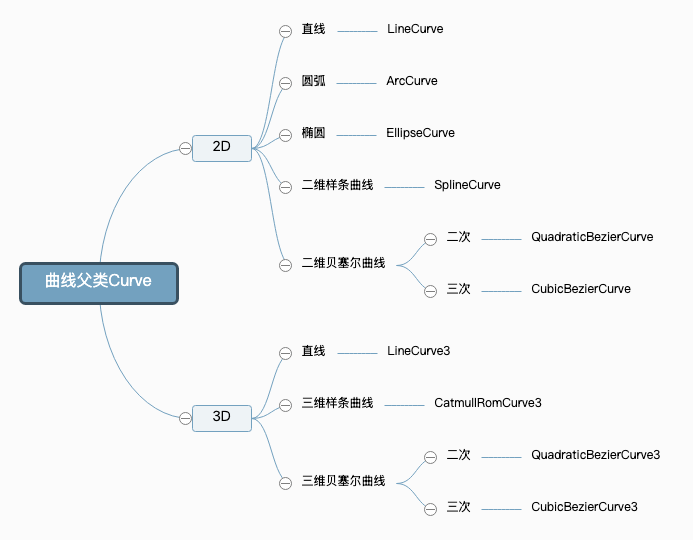

# 九、生成曲线、几何体

### 生成圆弧
通过代码算法生成圆弧线上的顶点坐标，并最后绘制一个圆弧效果。

实现方式参考第二章的“定义一个几何体”

1. 通过缓冲类型几何体`BufferGeometry`创建空几何体对象
2. 批量生成圆弧上的顶点数据
3. 通过javascript[类型化数组](https://developer.mozilla.org/zh-CN/docs/Web/JavaScript/Typed_arrays)`Float32Array`创建顶点数据用来表示几何体的顶点坐标
4. 通过`BufferAttribute`定义几何体顶点数据
5. 设置几何体顶点`.attributes.position`
6. 创建线材质
7. 创建线模型对象

```javascript
const geometry = new THREE.BufferGeometry(); //创建一个几何体对象
const R = 100; //圆弧半径
const N = 50; //分段数量
const sp = 2 * Math.PI / N;//两个相邻点间隔弧度
// 批量生成圆弧上的顶点数据
const arr = [];
for (let i = 0; i < N; i++) {
  const angle =  sp * i;//当前点弧度
  // 以坐标原点为中心，在XOY平面上生成圆弧上的顶点数据
  const x = R * Math.cos(angle);
  const y = R * Math.sin(angle);
  arr.push(x, y, 0);
}
//类型数组创建顶点数据
const vertices = new Float32Array(arr);
// 创建属性缓冲区对象
//3个为一组，表示一个顶点的xyz坐标
const attribue = new THREE.BufferAttribute(vertices, 3); 
// 设置几何体attributes属性的位置属性
geometry.attributes.position = attribue;

// 线材质
const material = new THREE.LineBasicMaterial({
  color: 0xff0000 //线条颜色
});
// 创建线模型对象   构造函数：Line、LineLoop、LineSegments
// const line = new THREE.Line(geometry, material); 
const line = new THREE.LineLoop(geometry, material);//线条模型对象
```

注意：

+ 使用`Line`渲染圆弧线会有一个缺口，不完全闭合，使用`LineLoop`可以封闭最后缺口。
+ 使用Line渲染，也可以修改for循环条件多增加一个点绘制圆弧。`for (let i = 0; i < N + 1; i++)`

**圆弧设置圆心坐标**

```javascript
const R = 100; //圆弧半径
const N = 50; //分段数量
const sp = 2 * Math.PI / N;//两个相邻点间隔弧度
// 设置圆心坐标
const cx = 200;
const cy = 100;
for (let i = 0; i < N+1; i++) {
    const angle = sp * i;//当前点弧度
    const x = cx + R * Math.cos(angle);
    const y = cy + R * Math.sin(angle);
    arr.push(x, y, 0);
}
```

### 使用几何体方法.setFromPoints()设置坐标数据
`.setFromPoints()`是几何体`BufferGeometry`的一个方法，通过该方法可以把数组`pointsArr`中坐标数据提取出来赋值给几何体。

具体说就是把pointsArr里面坐标数据提取出来，赋值给`geometry.attributes.position`属性

以生成矩形为例：

1. 用三维向量`Vector3`表示顶点的x、y、z坐标，作为数组元素创建一组顶点坐标
2. 通过缓冲类型几何体`BufferGeometry`创建空几何体对象
3. 使用几何体方法`.setFromPoints()`把数组`pointsArr`中坐标数据提取出来赋值给几何体
4. 创建线材质
5. 创建线模型对象

```javascript
const pointsArr = [
    // 三维向量Vector3表示的坐标值
    new THREE.Vector3(0,0,0),
    new THREE.Vector3(0,100,0),
    new THREE.Vector3(0,100,100),
    new THREE.Vector3(0,0,100),
];

// 也可以使用二维向量
// const pointsArr = [
//     // 二维向量Vector2表示的坐标值
//     new THREE.Vector2(0,0),
//     new THREE.Vector2(100,0),
//     new THREE.Vector2(100,100),
//     new THREE.Vector2(0,100),
// ];

const geometry = new THREE.BufferGeometry();
// 把数组pointsArr里面的坐标数据提取出来，赋值给`geometry.attributes.position`属性
geometry.setFromPoints(pointsArr);

// 线材质
const material = new THREE.LineBasicMaterial({
    color: 0xff0000 //线条颜色
});
// 创建线模型对象   构造函数：Line、LineLoop、LineSegments
// const line = new THREE.Line(geometry, material); 
const line = new THREE.LineLoop(geometry, material);//线条模型对象
```

### 曲线Curve
生成圆弧除了通过代码算法生成之外，也可以直接通过threejs的api实现

threejs提供了很多常用的曲线或直线API，这些API曲线都有一个共同的父类`Curve`。



**曲线`Curve`方法[.getPoints()](http://www.yanhuangxueyuan.com/threejs/docs/index.html#api/zh/extras/core/Curve.getPoints)**

+ `.getPoints( divisions :Integer) :Array`

divisions -- 要将曲线划分为的分段数。默认是**5**.

+ 通过方法`.getPoints()`可以从曲线上按照一定的细分精度返回沿着曲线分布的顶点坐标。
+ 细分数越高返回的顶点数量越多，自然轮廓越接近于曲线形状。
+ 方法`.getPoints()`的返回值是一个由二维向量`Vector2`或三维向量`Vector3`构成的数组，`Vector2`表示位于同一平面内的点，`Vector3`表示三维空间中一点。


**曲线`Curve`方法`.getSpacedPoints()`**

通过`.getSpacedPoints()`和`.getPoints()`一样也可以从曲线Curve上返回一系列曲线上的顶点坐标。

通过`.getSpacedPoints()`是按照曲线长度**等间距**返回顶点数据，`.getPoints()`获取点的方式并不是按照曲线等间距的方式，而是会考虑曲线斜率变化，**斜率变化快的位置返回的顶点更密集**。

#### 椭圆弧线`EllipseCurve`
1. 创建一个形状为椭圆的曲线
2. 通过曲线`Curve`方法`.getPoints()`从曲线上获取顶点数据
3. 通过缓冲类型几何体`BufferGeometry`创建空几何体对象
4. 使用几何体方法`.setFromPoints()`提取曲线坐标数据
5. 创建线材质
6. 创建线模型对象

```javascript
// 参数1和2表示椭圆中心坐标  参数3和4表示x和y方向半径
const arc = new THREE.EllipseCurve(0, 0, 120, 50);

//getPoints是基类Curve的方法，平面曲线会返回一个vector2对象作为元素组成的数组
const pointsArr = arc.getPoints(50); //分段数50，返回51个顶点
console.log('曲线上获取坐标',pointsArr);

const geometry = new THREE.BufferGeometry();
geometry.setFromPoints(pointsArr);

// 线材质
const material = new THREE.LineBasicMaterial({
    color: 0xff0000 //线条颜色
});
// 创建线模型对象
const line = new THREE.Line(geometry, material);
```

#### 圆弧线`ArcCurve`
`ArcCurve( aX, aY, aRadius, aStartAngle, aEndAngle, aClockwise )`

语法和椭圆弧线`EllipseCurve`相似，区别是参数3和参数4不同，椭圆需要定义xRadius和yRadius两个半径，圆只需要通过参数3定义半径aRadius即可

aClockwise：是否顺时针绘制，默认值为false

```javascript
// 逆时针绘制四分之一圆弧，参数5默认false，就是逆时针
const arc = new THREE.ArcCurve(0, 0, 100, 0, Math.PI/2, false);

// 顺时针绘制圆弧 这时候绘制出来是四分之三圆弧
// const arc = new THREE.ArcCurve(0, 0, 100, 0, Math.PI/2,true);

//getPoints是基类Curve的方法，平面曲线会返回一个vector2对象作为元素组成的数组
const pointsArr = arc.getPoints(50); //分段数50，返回51个顶点
console.log('曲线上获取坐标',pointsArr);

const geometry = new THREE.BufferGeometry();
geometry.setFromPoints(pointsArr);

// 线材质
const material = new THREE.LineBasicMaterial({
    color: 0xff0000 //线条颜色
});
// 创建线模型对象
const line = new THREE.Line(geometry, material);
```

#### 样条曲线
用于绘制不规则曲线


****

##### 生成三维样条曲线`CatmullRomCurve3`
+ 在三维空间中随意设置几个顶点坐标，然后作为三维样条曲线`CatmullRomCurve3`的参数，你就可以生成一条穿过这几个点的光滑曲线。
+ `CatmullRomCurve3`的参数是三维向量对象`Vector3`构成的数组。

```javascript
// 三维向量Vector3创建一组顶点坐标
const arr = [
    new THREE.Vector3(-50, 20, 90),
    new THREE.Vector3(-10, 40, 40),
    new THREE.Vector3(0, 0, 0),
    new THREE.Vector3(60, -60, 0),
    new THREE.Vector3(70, 0, 80)
]
// 三维样条曲线
const curve = new THREE.CatmullRomCurve3(arr);

//曲线上获取点
const pointsArr = curve.getPoints(100); 
const geometry = new THREE.BufferGeometry();
//读取坐标数据赋值给几何体顶点
geometry.setFromPoints(pointsArr); 
// 线材质
const material = new THREE.LineBasicMaterial({
    color: 0x00fffff
});
// 线模型
const line = new THREE.Line(geometry, material);
```

****

##### 生成二维样条曲线`SplineCurve`
+ 二维样条曲线`SplineCurve`默认情况下就是在XOY平面生成一个平面的样条曲线。
+ `SplineCurve`的参数是二维向量对象`Vector2`构成的数组。

```javascript
// 二维向量Vector2创建一组顶点坐标
const arr = [
    new THREE.Vector2(-100, 0),
    new THREE.Vector2(0, 30),
    new THREE.Vector2(100, 0),
];
// 二维样条曲线
const curve = new THREE.SplineCurve(arr);
```

#### 贝塞尔曲线
和样条曲线一样，也用于绘制不规则曲线


##### 二维二次贝塞尔曲线`QuadraticBezierCurve`
创建一条平滑的二维[二次贝塞尔曲线](http://en.wikipedia.org/wiki/B%C3%A9zier_curve#mediaviewer/File:B%C3%A9zier_2_big.gif)， 由起点、终点和一个控制点所定义

观察贝塞尔曲线规则：贝塞尔曲线经过p1、p3两个点，但是不经过p2点，贝塞尔曲线与直线p12和p23相切。

```javascript
// p1、p2、p3表示三个点坐标
// p1、p3是曲线起始点，p2是曲线的控制点
const p1 = new THREE.Vector2(-80, 0);
const p2 = new THREE.Vector2(20, 100);
const p3 = new THREE.Vector2(80, 0);

// 二维二次贝赛尔曲线
const curve = new THREE.QuadraticBezierCurve(p1, p2, p3);

const pointsArr = curve.getPoints(100); //曲线上获取点
const geometry = new THREE.BufferGeometry();
geometry.setFromPoints(pointsArr); //读取坐标数据赋值给几何体顶点
const material = new THREE.LineBasicMaterial({color: 0x00fffff});
const line = new THREE.Line(geometry, material);
```

****

##### 三维二次贝赛尔曲线`QuadraticBezierCurve3`
三维二次贝赛尔曲线`QuadraticBezierCurve3`与二维二次贝赛尔曲线`QuadraticBezierCurve`区别就是多了一个维度，参数是三维向量对象Vector3。

****

##### 二维三次贝塞尔曲线CubicBezierCurve
二维三次贝塞尔曲线`CubicBezierCurve`与二维二次贝赛尔曲线`QuadraticBezierCurve`区别就是多了一个控制点。

```javascript
// p1、p2、p3、p4表示4个点坐标
// p1、p4是曲线起始点，p2、p3是曲线的控制点
const p1 = new THREE.Vector2(-80, 0);
const p2 = new THREE.Vector2(-40, 50);
const p3 = new THREE.Vector2(50, 50);
const p4 = new THREE.Vector2(80, 0);

// 二维三次贝赛尔曲线
const curve = new THREE.CubicBezierCurve(p1, p2, p3, p4);
```

****

##### 三维三次贝赛尔曲线`CubicBezierCurve3`
三维三次贝赛尔曲线`CubicBezierCurve3`与二维三次贝塞尔曲线`CubicBezierCurve`区别就是多了一个维度，参数是三维向量对象Vector3。


#### 样条、贝塞尔曲线应用：实现飞线轨迹
已知平面上两个点坐标`(-100,-100)`、`(100,100)`，需要生成一条飞线轨迹线，要求轨迹线把这两个点作为起始点,曲线有一定的高度。

##### 三维样条曲线CatmullRomCurve3实现飞线轨迹
下面曲线的起始点设置在XOZ平面上，y方向为曲线高度方向。

```javascript
// p1、p3轨迹线起始点坐标
const p1 = new THREE.Vector3(-100, 0, -100);
const p3 = new THREE.Vector3(100, 0, 100);
// 计算p1和p3的中点坐标
const x2 = (p1.x + p3.x)/2;
const z2 = (p1.z + p3.z)/2;
const h = 50;
const p2 = new THREE.Vector3(x2, h, z2);

const arr = [p1, p2, p3];
// 三维样条曲线
const curve = new THREE.CatmullRomCurve3(arr);
```

##### 三维二次贝赛尔曲线`QuadraticBezierCurve3`实现飞线轨迹
```javascript
// p1、p3轨迹线起始点坐标
const p1 = new THREE.Vector3(-100, 0, -100);
const p3 = new THREE.Vector3(100, 0, 100);
// 计算p1和p3的中点坐标
const x2 = (p1.x + p3.x)/2;
const z2 = (p1.z + p3.z)/2;
const h = 100;
const p2 = new THREE.Vector3(x2, h, z2);
// 三维二次贝赛尔曲线
const curve = new THREE.QuadraticBezierCurve3(p1, p2, p3);
```


### 组合曲线`CurvePath`拼接曲线
通过threejs组合曲线`CurvePath`对象，你可以把直线、圆弧、贝塞尔等线条拼接为一条曲线。


```javascript
const R = 50;//圆弧半径
const H = 200;//直线部分高度
// 直线1
const line1 = new THREE.LineCurve(new THREE.Vector2(R, H), new THREE.Vector2(R, 0));
// 圆弧
const arc = new THREE.ArcCurve(0, 0, R, 0, Math.PI, true);
// 直线2
const line2 = new THREE.LineCurve(new THREE.Vector2(-R, 0), new THREE.Vector2(-R, H));

// CurvePath创建一个组合曲线对象
const CurvePath = new THREE.CurvePath();
//line1, arc, line2拼接出来一个U型轮廓曲线，注意顺序
CurvePath.curves.push(line1, arc, line2);

// 执行.getPoints()，直线部分不会像曲线返回中间多余点，只需要起始点即可。
const pointsArr = CurvePath.getPoints(16); //曲线上获取点
// 执行.getSpacedPoints()，会发现直线部分会按照等间距方式返回顶点数据
// .getSpacedPoints()的精度参数提升，圆弧部分才会更加圆滑
// const pointsArr = CurvePath.getSpacedPoints(16); //圆弧不够光滑

const geometry = new THREE.BufferGeometry();
geometry.setFromPoints(pointsArr); //读取坐标数据赋值给几何体顶点

const material = new THREE.LineBasicMaterial({
    color: 0x00fffff
});
// 线模型
const line = new THREE.Line(geometry, material);
```

### 通过曲线路径生成管道`TubeGeometry`
管道`TubeGeometry`几何体的功能就是基于一个3D曲线路径，生成一个管道几何体。

`TubeGeometry(path, tubularSegments, radius, radiusSegments, closed)`

| 参数 | 值 |
| --- | --- |
| path | 扫描路径，路径要用三维曲线 |
| tubularSegments | 路径方向细分数，默认64 |
| radius | 管道半径，默认1 |
| radiusSegments | 管道圆弧细分数，默认8 |
| closed | Boolean值，管道是否闭合 |


```javascript
// 三维样条曲线
const path = new THREE.CatmullRomCurve3([
    new THREE.Vector3(-50, 20, 90),
    new THREE.Vector3(-10, 40, 40),
    new THREE.Vector3(0, 0, 0),
    new THREE.Vector3(60, -60, 0),
    new THREE.Vector3(70, 0, 80)
]);

// path:路径   40：沿着轨迹细分数  2：管道半径   25：管道截面圆细分数
const geometry = new THREE.TubeGeometry(path, 40, 2, 25);
const material = new THREE.MeshLambertMaterial({
    color: 0x00ffff,
    side: THREE.DoubleSide, //双面显示看到管道内壁
    // wireframe: true,
});
const mesh = new THREE.Mesh(geometry, material);
```

### [旋转成型](http://www.webgl3d.cn/pages/4f1012/)[LatheGeometry](http://www.webgl3d.cn/pages/4f1012/)
### 轮廓填充`ShapeGeometry`
已知一个多边形的外轮廓坐标，可以通过这些外轮廓坐标生成一个多边形几何体平面

```javascript
// 一组二维向量表示一个多边形轮廓坐标
const pointsArr = [
    new THREE.Vector2(-50, -50),
    new THREE.Vector2(-60, 0),
    new THREE.Vector2(0, 50),
    new THREE.Vector2(60, 0),
    new THREE.Vector2(50, -50),
]

// Shape表示一个平面多边形轮廓,参数是二维向量构成的数组pointsArr
const shape = new THREE.Shape(pointsArr);
// 多边形shape轮廓作为ShapeGeometry参数，生成一个多边形平面几何体
const geometry = new THREE.ShapeGeometry(shape);

const material = new THREE.MeshLambertMaterial({
    color: 0x00ffff,
    side:THREE.DoubleSide
});
const mesh = new THREE.Mesh(geometry, material);
```

### [拉伸](http://www.webgl3d.cn/pages/4ac668/)[ExtrudeGeometry](http://www.webgl3d.cn/pages/4ac668/)
### [扫描](http://www.webgl3d.cn/pages/a06aed/)[ExtrudeGeometry](http://www.webgl3d.cn/pages/a06aed/)
### 多边形轮廓`Shape`
多边形轮廓`Shape`,是直接通过一组二维向量`Vector2`表示的xy点坐标创建。

`Shape`的父类是`Path`,`Path`提供了直线、圆弧、贝塞尔、样条等绘制方法，`Shape`也会从父类是`Path`继承这些图形绘制方法。

#### 通过绘制直线`.lineTo()`方法创建轮廓
`Shape`的父类是`Path`,`Path`提供了直线、圆弧、贝塞尔、样条等绘制方法，`Shape`也会从父类是`Path`继承这些图形绘制方法。


+ `.currentPoint`属性字面意思是当前点，默认值`Vector2(0,0)`。
+ 执行和`.moveTo()`、`.lineTo()`方法后，`currentPoint`会发生变化

```javascript
const shape = new THREE.Shape();

shape.moveTo(10, 0); //.currentPoint变为(10,0)
// 绘制直线线段，起点(10,0)，结束点(100,0)
shape.lineTo(100, 0);//.currentPoint变为(100, 0)
shape.lineTo(100, 100);//.currentPoint变为(100, 100)
shape.lineTo(10, 100);//.currentPoint变为(10, 100)

// ShapeGeometry填充Shape获得一个平面几何体
// const geometry = new THREE.ShapeGeometry(shape);
// ExtrudeGeometry拉伸Shape获得一个长方体几何体
const geometry = new THREE.ExtrudeGeometry(shape, {
    depth:20,//拉伸长度
    bevelEnabled:false,//禁止倒角
});
```

#### 圆弧[.arc().absarc()](http://www.yanhuangxueyuan.com/threejs/docs/index.html#api/zh/extras/core/Path.arc)
圆弧方法`.arc()`使用方式和原来学习过的圆弧曲线`ArcCurve`整体相似，区别在于圆心定位方式有差异。

圆弧`.arc()`参数的圆心坐标是相对当前`.currentPoint`而言,而不是坐标原点。

`.arc( x :Float, y :Float, radius :Float, startAngle :Float, endAngle :Float, clockwise :Boolean) :this`

+ x, y -- 弧线的中心来自上次调用后的偏移量。
+ radius -- 弧线的半径。
+ startAngle -- 起始角，以弧度来表示。
+ endAngle -- 终止角，以弧度来表示。
+ clockwise -- 以顺时针方向创建（扫过）弧线。默认值为**false**。

如下面示例代码中，圆心位置在100,0 ，而当前位置在150,0，画圆弧时需要将相对坐标设置为-50,0

```javascript
// 下面代码绘制了一个矩形+扇形的轮廓，圆心在(100, 0),半径50。
const shape = new THREE.Shape();
shape.lineTo(100+50, 0); //.currentPoint变为(100+50,0)
// 圆弧.arc参数的圆心0,0坐标是相对当前.currentPoint而言，而不是坐标原点
shape.arc(-50,0,50,0,Math.PI/2); //.currentPoint变为圆弧线结束点坐标
// 绘制直线，直线起点：圆弧绘制结束的点  直线结束点：(0, 0)
shape.lineTo(0, 50);
```

`.absarc()`圆心坐标不受到`.currentPoint`影响，以坐标原点作为参考

```javascript
const shape = new THREE.Shape();
shape.lineTo(100, 0); //.currentPoint变为(100,0)
// absarc圆心坐标不受到.currentPoint影响，以坐标原点作为参考
shape.absarc(100,0,50,0,Math.PI/2); //.currentPoint变为圆弧线结束点坐标
shape.lineTo(0, 50);
```

#### 内孔`.holes`
借助多边形`Shape`的内孔`.holes`属性和`Path`对象可以实现多边形内部孔洞效果

```javascript
// Shape外轮廓：矩形
const shape = new THREE.Shape();
// 绘制直线线段，线段起点：.currentPoint，线段结束点：(100,0)
shape.lineTo(100, 0);//.currentPoint变为(100, 0)
shape.lineTo(100, 100);//.currentPoint变为(100, 100)
shape.lineTo(0, 100);//.currentPoint变为(0, 100)

//Shape内孔轮廓
const path1 = new THREE.Path();// 圆孔1
path1.absarc(20, 20, 10);
const path2 = new THREE.Path();// 圆孔2
path2.absarc(80, 20, 10);
const path3 = new THREE.Path();// 方形孔
path3.moveTo(50, 50);
path3.lineTo(80, 50);
path3.lineTo(80, 80);
path3.lineTo(50, 80);
//三个内孔轮廓分别插入到holes属性中
shape.holes.push(path1, path2,path3);

const geometry = new THREE.ShapeGeometry(shape);
```

### 模型边界线`EdgesGeometry`
借助`EdgesGeometry`可以给模型设置一个模型边界线

**长方体边线**

先用`EdgesGeometry`重新计算长方体几何体，返回一个新的几何体，然后用线模型`LineSegments`模型渲染新的几何体即可。

```javascript
const geometry = new THREE.BoxGeometry(50, 50, 50);
const material = new THREE.MeshLambertMaterial({
    color: 0x004444,
    transparent:true,
    opacity:0.5,
});
const mesh = new THREE.Mesh(geometry, material);

// 长方体作为EdgesGeometry参数创建一个新的几何体
const edges = new THREE.EdgesGeometry(geometry);
const edgesMaterial = new THREE.LineBasicMaterial({
  color: 0x00ffff,
})
const line = new THREE.LineSegments(edges, edgesMaterial);
mesh.add(line);
```

[**圆柱边线**](http://www.webgl3d.cn/pages/5fe984/#%E5%9C%86%E6%9F%B1%E8%BE%B9%E7%BA%BF)

`EdgesGeometry`的第二个参数是thresholdAngle，仅当相邻面的法线之间的角度（单位为角度）超过这个值时，才会渲染边缘。默认值为1。

**外部gltf模型设置材质和边线**

```javascript
loader.load("../建筑模型.gltf", function (gltf) {
    // 递归遍历设置每个模型的材质，同时设置每个模型的边线
    gltf.scene.traverse(function (obj) {
        if (obj.isMesh) {
            // 模型材质重新设置
            obj.material = new THREE.MeshLambertMaterial({
                color: 0x004444,
                transparent: true,
                opacity: 0.5,
            });
            // 模型边线设置
            const edges = new THREE.EdgesGeometry(obj.geometry);
            const edgesMaterial = new THREE.LineBasicMaterial({
                color: 0x00ffff,
            })
            const line = new THREE.LineSegments(edges, edgesMaterial);
            obj.add(line);
        }
    });
    model.add(gltf.scene);
})
```

**实例：通过边线绘制五角星的轮廓**

```javascript
// 定义五角星的形状
const starShape = new THREE.Shape();
const innerRadius = 1;
const outerRadius = 2;
const x = 0;
const y = 0;
const points = 5;

for (let i = 0; i < points * 2; i++) {
    const angle = (Math.PI / points) * i;
    const radius = (i % 2 === 0) ? outerRadius : innerRadius;
    const px = x + radius * Math.cos(angle);
    const py = y + radius * Math.sin(angle);

    if (i === 0) {
        starShape.moveTo(px, py);
    } else {
        starShape.lineTo(px, py);
    }
}


// 创建几何体
const geometry = new THREE.ShapeGeometry(starShape);
// 五角星轮廓填充
// const material = new THREE.MeshBasicMaterial({ color: 0xffff00 });
// const mesh = new THREE.Mesh(geometry, material);

// 五角星边框轮廓
const edges = new THREE.EdgesGeometry(geometry);
// 创建材质
const material = new THREE.LineBasicMaterial({ color: 0xffff00 });
// 创建线条
const mesh = new THREE.LineSegments(edges, material);
```

### 几何体顶点颜色数据
**设置几何体顶点颜色**`.attributes.color`

+ 每个点对应一个位置数据，同时对应一个颜色数据。
+ 通过点、线、网格模型渲染几何体`Geometry`，如果希望顶点颜色`.attributes.color`起作用，需要设置材质属性`vertexColors:true`

```javascript
const geometry = new THREE.BufferGeometry(); //创建一个几何体对象
const vertices = new Float32Array([
    0, 0, 0, //顶点1坐标
    50, 0, 0, //顶点2坐标
    0, 25, 0, //顶点3坐标
]);
// 顶点位置
geometry.attributes.position = new THREE.BufferAttribute(vertices, 3);

const colors = new Float32Array([
    1, 0, 0, //顶点1颜色
    0, 0, 1, //顶点2颜色
    0, 1, 0, //顶点3颜色
]);
// 设置几何体attributes属性的颜色color属性
//3个为一组,表示一个顶点的颜色数据RGB
geometry.attributes.color = new THREE.BufferAttribute(colors, 3); 

// 点渲染模式
const material = new THREE.PointsMaterial({
    // color: 0x333333,//使用顶点颜色数据，color属性可以不用设置
    vertexColors:true,//默认false，设置为true表示使用顶点颜色渲染
    size: 20.0, //点对象像素尺寸
});
const points = new THREE.Points(geometry, material); //点模型对象
```

**渐变直线**

自定几何体顶点颜色数据，然后用线模型Line渲染，就能得到渐变的直线效果

```javascript
const colors = new Float32Array([
    1, 0, 0, //顶点1颜色 
    0, 0, 1, //顶点2颜色
    0, 1, 0, //顶点3颜色
]);
geometry.attributes.color = new THREE.BufferAttribute(colors, 3); 

const material = new THREE.LineBasicMaterial({
    vertexColors:true,//使用顶点颜色渲染
});
const line = new THREE.Line(geometry, material);
```

**网格模型颜色渐变**

和渐变直线类似，用网格模型Mesh渲染

```javascript
const material = new THREE.MeshBasicMaterial({
    // color: 0x333333,//使用顶点颜色数据，color属性可以不用设置
    vertexColors:true,//默认false，设置为true表示使用顶点颜色渲染
    side: THREE.DoubleSide,
});
const mesh = new THREE.Mesh(geometry, material);
```

### 一段曲线颜色渐变
1. 通过样条曲线`CatmullRomCurve3`生成一段曲线
2. 获取曲线的顶点数量
3. 通过顶点数量遍历，按照点在曲线上索引值顺序来计算每个点对应的颜色数据
4. 设置几何体顶点颜色
5. 线模型渲染渐变曲线

```javascript
const geometry = new THREE.BufferGeometry(); //创建一个几何体对象
// 三维样条曲线
const curve = new THREE.CatmullRomCurve3([
    new THREE.Vector3(-50, 20, 90),
    new THREE.Vector3(-10, 40, 40),
    new THREE.Vector3(0, 0, 0),
    new THREE.Vector3(60, -60, 0),
    new THREE.Vector3(70, 0, 80)
]);
const pointsArr = curve.getSpacedPoints(100); //曲线取点      
geometry.setFromPoints(pointsArr); //pointsArr赋值给顶点位置属性     

const pos = geometry.attributes.position;
const count = pos.count; //顶点数量
// 计算每个顶点的颜色值
const colorsArr = [];
for (let i = 0; i < count; i++) {
    const percent = i / count; //点索引值相对所有点数量的百分比
    //根据顶点位置顺序大小设置颜色渐变
    // 红色分量从0到1变化，蓝色分量从1到0变化
    colorsArr.push(percent, 0, 1 - percent); //蓝色到红色渐变色
}

//类型数组创建顶点颜色color数据
const colors = new Float32Array(colorsArr);
// 设置几何体attributes属性的颜色color属性
geometry.attributes.color = new THREE.BufferAttribute(colors, 3);

const material = new THREE.LineBasicMaterial({
    vertexColors: true, //使用顶点颜色渲染
});
const line = new THREE.Line(geometry, material);
```

### Color颜色渐变插值方法`.lerpColors()`和`.lerp()`
通过方法`.lerpColors()`和`.lerp()`可以进行颜色混合

**`lerpColors`**

执行`.lerpColors(Color1,Color2, percent)`通过一个百分比参数`percent`，可以控制Color1和Color2两种颜色混合的百分比，Color1对应`1-percent`，Color2对应`percent`。

```javascript
const c1 = new THREE.Color(0xff0000); //红色
const c2 = new THREE.Color(0x0000ff); //蓝色
const c = new THREE.Color();

// 颜色插值结果rgb(0.5,0,0.5)，c1和c2各取50%：
c.lerpColors(c1,c2, 0.5);
console.log('颜色插值结果',c);
```

**`lerp`**

`.lerp()`和`.lerpColors()`功能一样，只是具体语法细节不同。

c1与c2颜色混合，混合后的rgb值，赋值给c1的`.r`、`.g`、`.b`属性

通过颜色对象克隆方法`.clone()`可以返回一个新的颜色对象。

执行`c1.clone().lerp()`，c1和c2颜色混合后，不会改变c1的颜色值，改变的是`c1.clone()`返回的新颜色对象。

```javascript
const c1 = new THREE.Color(0xff0000); //红色
const c2 = new THREE.Color(0x0000ff); //蓝色
const c = c1.clone().lerp(c2, percent);//颜色插值计算
```

### [查看或设置gltf几何体顶点](http://www.webgl3d.cn/pages/fde9a0/)
### 山脉地形高度可视化（渐变色应用）
1. 山脉几何体y坐标范围
2. 根据山脉顶点高度设置渐变颜色
3. Mesh渲染山脉顶点颜色

```javascript
const loader = new GLTFLoader(); //创建一个GLTF加载器

const model = new THREE.Group(); //声明一个组对象，用来添加加载成功的三维场景

loader.load("../地形.glb", function (gltf) { //gltf加载成功后返回一个对象

    model.add(gltf.scene); //三维场景添加到model组对象中
    //mesh表示地形网格模型
    const mesh = gltf.scene.children[0];
    // 1. 山脉顶点数据
    const pos = mesh.geometry.attributes.position;
    const count = pos.count;//几何体顶点数量

    // 2. 计算模型y坐标高度差
    const yArr = [];//顶点所有y坐标，也就是地形高度
    for (let i = 0; i < count; i++) {
        yArr.push(pos.getY(i));//获取顶点y坐标，也就是地形高度
    }
    yArr.sort();//y坐标排序，以便于计算地形高度差
    const miny = yArr[0];
    const maxy = yArr[yArr.length - 1];
    const height = maxy - miny; //山脉整体高度  

    // 3. 计算每个顶点的颜色值
    const colorsArr = [];
    const c1 = new THREE.Color(0x0000ff);//山谷颜色
    const c2 = new THREE.Color(0xff0000);//山顶颜色
    for (let i = 0; i < count; i++) {
        //当前高度和整体高度比值
        const percent = (pos.getY(i) - miny) / height;
        const c = c1.clone().lerp(c2, percent);//颜色插值计算
        colorsArr.push(c.r, c.g, c.b); 
    }
    const colors = new Float32Array(colorsArr);
    // 设置几何体attributes属性的颜色color属性
    mesh.geometry.attributes.color = new THREE.BufferAttribute(colors, 3);
    // 4. 设置材质，使用顶点颜色渲染
    mesh.material = new THREE.MeshLambertMaterial({
        vertexColors:true,
    });
})
```

