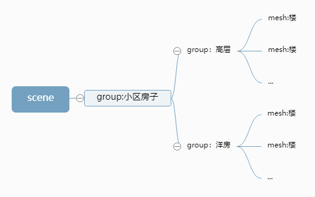

# 四、层级模型

+ 创建了两个网格模型mesh1、mesh2
+ 通过`THREE.Group`类创建一个组对象group，通过`add`方法把网格模型mesh1、mesh2作为设置为组对象group的子对象
+ 通过执行`scene.add(group)`把组对象group作为场景对象的scene的子对象

这样就构成了一个三层的层级结构

```javascript
//创建两个网格模型mesh1、mesh2
const geometry = new THREE.BoxGeometry(20, 20, 20);
const material = new THREE.MeshLambertMaterial({color: 0x00ffff});
const group = new THREE.Group();
const mesh1 = new THREE.Mesh(geometry, material);
const mesh2 = new THREE.Mesh(geometry, material);
mesh2.translateX(25);
//把mesh1型插入到组group中，mesh1作为group的子对象
group.add(mesh1);
//把mesh2型插入到组group中，mesh2作为group的子对象
group.add(mesh2);
//把group插入到场景中作为场景子对象
scene.add(group);
```

### 遍历模型树结构


通过`.traverse()`递归遍历一个模型对象包含的所有后代

```javascript
// 递归遍历model包含所有的模型节点
model.traverse(function(obj) {
    console.log('所有模型节点的名称',obj.name);
    // obj.isMesh：if判断模型对象obj是不是网格模型'Mesh'
    if (obj.isMesh) {//判断条件也可以是obj.type === 'Mesh'
        obj.material.color.set(0xffff00);
    }
});
```

### 查询模型节点
查找某个具体的模型`.getObjectByName()`

```javascript
// 返回名.name为"4号楼"对应的对象
const nameNode = scene.getObjectByName ("4号楼");
nameNode.material.color.set(0xff0000);
```

### 本地坐标和世界坐标
任何一个模型的**本地坐标**(**局部坐标**)就是模型的`.position`属性。

一个模型的**世界坐标**，说的是，模型自身`.position`和所有父对象`.position`累加的坐标。

```javascript
// mesh的世界坐标就是mesh.position与group.position的累加
const mesh = new THREE.Mesh(geometry, material); 
mesh.position.set(50, 0, 0);
const group = new THREE.Group();
group.add(mesh);
group.position.set(50, 0, 0);
```

`.getWorldPosition()`：**获取世界坐标**

`mesh.getWorldPosition(Vector3)`读取一个模型的世界坐标，并把读取结果存储到参数`Vector3`中。

```javascript
// 声明一个三维向量用来表示某个坐标
const worldPosition = new THREE.Vector3();
// 获取mesh的世界坐标，你会发现mesh的世界坐标受到父对象group的.position影响
mesh.getWorldPosition(worldPosition);
console.log('世界坐标',worldPosition);
console.log('本地坐标',mesh.position);
```

`.add`**给子对象添加一个局部坐标系**

```javascript
//可视化mesh的局部坐标系
const meshAxesHelper = new THREE.AxesHelper(50);
mesh.add(meshAxesHelper);
```

**改变模型相对局部坐标原点位置**

通过改变几何体顶点坐标，可以改变模型自身相对坐标原点的位置

```javascript
//长方体的几何中心默认与本地坐标原点重合
const geometry = new THREE.BoxGeometry(50, 50, 50);
// 平移几何体的顶点坐标,改变几何体自身相对局部坐标原点的位置
geometry.translate(50/2,0,0);
```

### [移除对象](http://www.webgl3d.cn/pages/e66ea7/)[.remove()](http://www.webgl3d.cn/pages/e66ea7/)
### [模型隐藏或显示](http://www.webgl3d.cn/pages/eeb05a/)[visible](http://www.webgl3d.cn/pages/eeb05a/)
