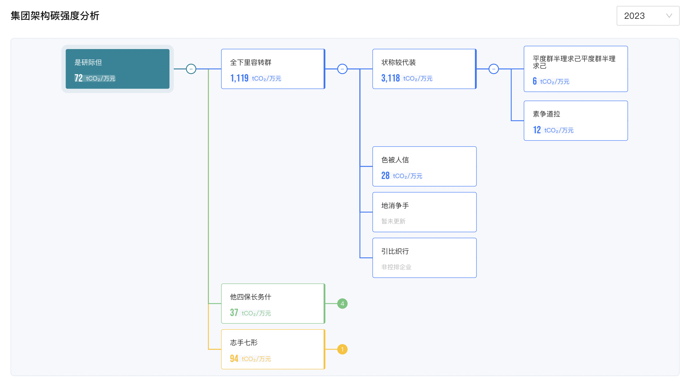

# antv G6的基础入门及树图的实际应用

官网：https://g6.antv.antgroup.com/

详细api：https://g6.antv.antgroup.com/api/Graph

## 简介

[G6](https://github.com/antvis/g6) 是一个简单、易用、完备的图可视化引擎。它提供了图的绘制、布局、分析、交互、动画等图可视化的基础能力。旨在让关系变得透明，简单。让用户获得关系数据的 Insight。基于 G6，用户可以快速搭建自己的 **图分析** 或 **图编辑** 应用。


**特性**

G6 作为一款专业的图可视化引擎，具有以下特性：

- 丰富的元素：内置丰富的节点与边元素，自由配置，支持自定义；
- 可控的交互：内置 10+ 交互行为，支持自定义交互；
- 强大的布局：内置了 10+ 常用的图布局，支持自定义布局；
- 便捷的组件：优化内置组件功能及性能；
- 友好的体验：根据用户需求分层梳理文档，支持 TypeScript 类型推断。

除了默认好用、配置自由的内置功能，元素、交互、布局均具有高可扩展的自定义机制。


**安装 & 引用**

1、在项目中使用 NPM 包引入

Step 1: 使用命令行在项目目录下执行以下命令：

```bash
npm install --save @antv/g6
```

Step 2: 在需要用的 G6 的 JS 文件中导入：

```javascript
import G6 from '@antv/g6';
```


2、在 HTML 中使用  CDN 引入

```html
// version <= 3.2
<script src="https://gw.alipayobjects.com/os/antv/pkg/_antv.g6-{$version}/build/g6.js"></script>
// version >= 3.3
<script src="https://gw.alipayobjects.com/os/lib/antv/g6/{$version}/dist/g6.min.js"></script>
// version >= 4.0
<script src="https://gw.alipayobjects.com/os/lib/antv/g6/4.3.11/dist/g6.min.js"></script>
```


## 快速上手

### **步骤一：创建关系图的 HTML 容器**

需要在 HTML 中创建一个用于容纳 G6 绘制的图的容器，通常为 `div` 标签。G6 在绘制时会在该容器下追加 `canvas` 标签，然后将图绘制在其中。

```html
<div id="mountNode"></div>
```

### **步骤二：数据准备**

引入 G6 的数据源为 JSON 格式的对象。该对象中需要有节点（`nodes`）和边（`edges`）字段，分别用数组表示：

```javascript
const data = {
  // 点集
  nodes: [
    {
      id: 'node1', // String，该节点存在则必须，节点的唯一标识
      x: 100, // Number，可选，节点位置的 x 值
      y: 200, // Number，可选，节点位置的 y 值
    },
    {
      id: 'node2', // String，该节点存在则必须，节点的唯一标识
      x: 300, // Number，可选，节点位置的 x 值
      y: 200, // Number，可选，节点位置的 y 值
    },
  ],
  // 边集
  edges: [
    {
      source: 'node1', // String，必须，起始点 id
      target: 'node2', // String，必须，目标点 id
    },
  ],
};
```

注意

- `nodes` 数组中包含节点对象。每个节点对象中唯一的、必要的 `id` 以标识不同的节点，`x`、 `y` 指定该节点的位置；
- `edges` 数组中包含边对象。`source` 和 `target` 是每条边的必要属性，分别代表了该边的起始点 `id` 与 目标点 `id`。
- 点和边的其他属性参见链接：[内置节点](https://g6.antv.antgroup.com/zh/docs/manual/middle/elements/nodes/default-node) 和 [内置边](https://g6.antv.antgroup.com/en/docs/manual/middle/elements/edges/defaultEdge)。


### **步骤三：创建关系图**

创建关系图（实例化）时，至少需要为图设置容器、宽和高。

```javascript
const graph = new G6.Graph({
  container: 'mountNode', // String | HTMLElement，必须，在 步骤一 中创建的容器 id 或容器本身
  width: 800, // Number，必须，图的宽度
  height: 500, // Number，必须，图的高度
  // ...其他配置
});
```


### **步骤四：配置数据源，渲染**

```javascript
graph.data(data); // 读取 步骤二 中的数据源到图上
graph.render(); // 渲染图
```


### **[在react中使用g6](https://g6.antv.antgroup.com/manual/advanced/g6-in-react)**

```js
import React, { useEffect, useRef } from 'react';
import { Graph } from '@antv/g6';

const data = {
  nodes: [
    { id: '1', label: '公司1' },
    { id: '2', label: '公司2' },
    // 节点数据 ...
  ],
  edges: [
    {
      source: '1',
      target: '2',
      data: { type: 'name1', amount: '100,000,000,00 元', date: '2019-08-03' },
    },
    // 边数据 ...
  ],
};

export default () => {
  const containerRef = useRef(null);
  const graphRef =useRef();

  useEffect(() => {
    if (graphRef.current || !containerRef.current) return;

    const graph = new Graph({
      container: containerRef.current,
      width: 1200,
      height: 800,
      modes: { default: ['drag-canvas'] },
      layout: { type: 'dagre', direction: 'LR' },
      defaultNode: {
        type: 'node',
        labelCfg: {
          style: { fill: '#000000A6', fontSize: 10 },
        },
        style: { stroke: '#72CC4A', width: 150 },
      },
      defaultEdge: { type: 'polyline' },
    });

    // 绑定数据
    graph.data(data);
    // 渲染图
    graph.render();

    graphRef.current = graph;
  }, []);

  return <div ref={containerRef}></div>;
};
```


## 图

### 初始化/实例化图

通过  `new G6.Graph(config)` 进行图的实例化。

```javascript
const graph = new G6.Graph({
  container: 'mountNode', // String | HTMLElement，必须
  width: 800, // Number，必须，图的宽度
  height: 500, // Number，必须，图的高度
  // ...其他配置
});
```


### 常用配置项

| 配置项          | 类型           | 选项 / 示例                                                  | 默认   | 说明                                                         |
| :-------------- | :------------- | :----------------------------------------------------------- | :----- | :----------------------------------------------------------- |
| renderer        | String         | canvas / svg                                                 | canvas | 使用 canvas 或 svg 渲染                                      |
| fitView         | Boolean        | true / false                                                 | false  | 是否将图适配到画布大小，可以防止超出画布或留白太多。         |
| fitViewPadding  | Number / Array | 20 / [ 20, 40, 50, 20 ]                                      | 0      | 画布上的四周留白宽度。                                       |
| animate         | Boolean        | true / false                                                 | false  | 是否启用图的动画。                                           |
| modes           | Object         | {  default: [ 'drag-node', 'drag-canvas' ] }                 | null   | 图上行为模式的集合。由于比较复杂，按需参见：[G6 中的 Mode](https://g6.antv.antgroup.com/zh/docs/manual/middle/states/mode) 教程。 |
| defaultNode     | Object         | {  type: 'circle',  color: '#000',  style: {   ......  } }   | null   | 节点默认的属性，包括节点的一般属性和样式属性（style）。      |
| defaultEdge     | Object         | {  type: 'polyline',  color: '#000',  style: {   ......  } } | null   | 边默认的属性，包括边的一般属性和样式属性（style）。          |
| nodeStateStyles | Object         | {  hover: {   ......  },  select: {   ......  } }            | null   | 节点在除默认状态外，其他状态下的样式属性（style）。例如鼠标放置（hover）、选中（select）等状态。 |
| edgeStateStyles | Object         | {  hover: {   ......  },  select: {   ......  } }            | null   | 边在除默认状态外，其他状态下的样式属性（style）。例如鼠标放置（hover）、选中（select）等状态。 |
| layout          | Object         | {  type: 'force',  preventOverlap:false }                    | null   | 布局相关                                                     |
| plugins         | Array          | [minimap, grid]                                              | null   | 插件                                                         |


### 常用函数

```javascript
// 读取数据源 `data` 到图实例 `graph` 中
graph.data(data);

// 渲染图
graph.render();
```


## 图元素

### 图形 Shape

图形具体属性：https://g6.antv.antgroup.com/manual/middle/elements/shape/shape-and-properties

G6 中的元素（节点/边）是由一个或多个图形 Shape组成，主要**通过自定义节点或自定义边时在 `draw` 方法中使用 `group.addShape` 添加**，G6 中支持以下的图形 Shape：

- [circle](https://g6.antv.antgroup.com/manual/middle/elements/shape/shape-and-properties#圆图形-circle)：圆；
- [rect](https://g6.antv.antgroup.com/manual/middle/elements/shape/shape-and-properties#矩形图形-rect)：矩形；
- [ellipse](https://g6.antv.antgroup.com/manual/middle/elements/shape/shape-and-properties#椭圆图形-ellipse)：椭圆；
- [polygon](https://g6.antv.antgroup.com/manual/middle/elements/shape/shape-and-properties#多边形图形-polygon)：多边形；
- [fan](https://g6.antv.antgroup.com/manual/middle/elements/shape/shape-and-properties#扇形图形-fan)：扇形；
- [image](https://g6.antv.antgroup.com/manual/middle/elements/shape/shape-and-properties#图片图形-image)：图片；
- [marker](https://g6.antv.antgroup.com/manual/middle/elements/shape/shape-and-properties#标记图形-marker)：标记；
- [path](https://g6.antv.antgroup.com/manual/middle/elements/shape/shape-and-properties#路径-path)：路径；
- [text](https://g6.antv.antgroup.com/manual/middle/elements/shape/shape-and-properties#文本-text)：文本；
- [dom(svg)](https://g6.antv.antgroup.com/manual/middle/elements/shape/shape-and-properties#dom-svg)：DOM（图渲染方式 `renderer` 为 `'svg'` 时可用）。


**用法**

```js
group.addShape('rect', {
  attrs: {
    fill: 'red',
    shadowOffsetX: 10,
    shadowOffsetY: 10,
    shadowColor: 'blue',
    shadowBlur: 10,
    opacity: 0.8,
  },
  // 在 G6 3.3 及之后的版本中，必须指定 name，可以是任意字符串，但需要在同一个自定义元素类型中保持唯一性
  name: 'rect-shape',
});
```


**DOM (svg)**

> 仅在 Graph 的 `renderer` 为 `'svg'` 时可以使用。

**⚠️ 注意:**

- 只支持原生 HTML DOM，不支持各类 react、vue 组件；
- 使用 `'dom'` 进行自定义的节点或边，不支持 G6 的交互事件，请使用原生 DOM 的交互事件；
- 在 Safari 中，若 dom 节点被设置了 `position:relative`，将会导致渲染异常。该问题与 [Safari 的 foreignObject bug](https://bugs.webkit.org/show_bug.cgi?id=23113) 有关。[Issues](https://github.com/antvis/G6/issues/2990)。


```js
group.addShape('dom', {
  attrs: {
    width: cfg.size[0],
    height: cfg.size[1],
    // DOM's html
    html: `
    <div style="background-color: #fff; border: 2px solid #5B8FF9; border-radius: 5px; width: ${
      cfg.size[0] - 5
    }px; height: ${cfg.size[1] - 5}px; display: flex;">
      <div style="height: 100%; width: 33%; background-color: #CDDDFD">
          
      </div>
      <span style="margin:auto; padding:auto; color: #5B8FF9">${cfg.label}</span>
    </div>
      `,
  },
  // 在 G6 3.3 及之后的版本中，必须指定 name，可以是任意字符串，但需要在同一个自定义元素类型中保持唯一性
  name: 'dom-shape',
  draggable: true,
});
```


### 节点

节点的通用属性：https://g6.antv.antgroup.com/manual/middle/elements/nodes/default-node#%E8%8A%82%E7%82%B9%E7%9A%84%E9%80%9A%E7%94%A8%E5%B1%9E%E6%80%A7

#### 节点的配置方法

优先级：使用 `graph.node(nodeFn)` 配置 > 数据中动态配置 > 实例化图时全局配置

**1、实例化图时全局配置**

用户在实例化 Graph 时候可以**通过 `defaultNode` 配置**节点，这里的配置是**全局的配置**，将会在所有节点上生效。

```js
const graph = new G6.Graph({
  container: 'mountNode',
  width: 800,
  height: 600,
  defaultNode: {
    type: 'circle',
    // 其他配置
  },
});
```


**2、 数据中动态配置**

如果需要为**不同节点**进行不同的配置，可以将配置写入到节点数据中。这种配置方式可以通过下面代码的形式直接写入数据，也可以通过遍历数据的方式写入。

```js
const data = {
  nodes: [{
    id: 'node0',
    size: 100,
    type: 'rect',
    ...    // 其他属性
    style: {
      ...  // 样式属性，每种节点的详细样式属性参见各节点文档
    }
  },{
    id: 'node1',
    size: [50, 100],
    type: 'ellipse',
    ...    // 其他属性
    style: {
      ...  // 样式属性，每种节点的详细样式属性参见各节点文档
    }
  },
    ... // 其他节点
  ],
  edges: [
    ... // 边
  ]
}
```


**3、使用 `graph.node(nodeFn)` 配置**

该方法可以为不同节点进行不同的配置。

**提示:**

- 该方法必须**在 render 之前调用**，否则不起作用；
- 由于该方法优先级最高，将覆盖其他地方对节点的配置，这可能将造成一些其他配置不生效的疑惑；
- 该方法在增加元素、更新元素时会被调用，如果数据量大、每个节点上需要更新的内容多时，可能会有性能问题。

```js
// const data = ...
// const graph = ...
graph.node((node) => {
  return {
    id: node.id,
    type: 'rect',
    style: {
      fill: 'blue',
    },
  };
});

graph.data(data);
graph.render();
```


#### 内置节点

G6 的内置节点包括 circle，rect，ellipse，diamond，triangle，star，image，modelRect，donut（v4.2.5 起支持）。

https://g6.antv.antgroup.com/manual/middle/elements/nodes/built-in/circle


#### 自定义节点

自定义元素 G6.registerX： https://g6.antv.antgroup.com/api/register-item

当内置节点不满足需求时，可以通过 `G6.registerNode(nodeName, options, extendedNodeName)` 方法自定义节点。

参数：

| 名称           | 类型   | 是否必选 | 描述                                                         |
| :------------- | :----- | :------- | :----------------------------------------------------------- |
| nodeName       | String | true     | 自定义节点名称，需保持唯一性。                               |
| options        | Object | true     | 自定义节点时的配置项，配置项中包括完整的生命周期方法，具体请参考：[Shape Doc](https://g6.antv.antgroup.com/zh/docs/manual/middle/elements/shape/shape-keyshape) 和 [自定义节点与边 API](https://g6.antv.antgroup.com/zh/docs/api/register-item)。 |
| extendNodeName | String | false    | 自定义节点时可基于内置节点进行定义，该字段表示内置节点名称，所有内置节点请参考：[内置节点](https://g6.antv.antgroup.com/zh/docs/manual/middle/elements/nodes/default-node) 教程。 |

若给定了 `extendNodeName`，如 `draw`，`update`，`setState` 等必要的函数若不在 `nodeDefinition` 中进行复写，将会继承 `extendNodeName` 中的相关定义。


**G6 中自定义节点的 API 如下：**

```js
G6.registerNode(
  'nodeName',
  {
    /**
     * 绘制节点，包含文本
     * @param  {Object} cfg 节点的配置项
     * @param  {G.Group} group 图形分组，节点中的图形对象的容器
     * @return {G.Shape} 绘制的图形，通过 node.get('keyShape') 可以获取到
     */
    draw(cfg, group) {},
    /**
     * 绘制后的附加操作，默认没有任何操作
     * @param  {Object} cfg 节点的配置项
     * @param  {G.Group} group 图形分组，节点中的图形对象的容器
     */
    afterDraw(cfg, group) {},
    /**
     * 更新节点，包含文本
     * @override
     * @param  {Object} cfg 节点的配置项
     * @param  {Node} node 节点
     */
    update(cfg, node) {},
    /**
     * 更新节点后的操作，一般同 afterDraw 配合使用
     * @override
     * @param  {Object} cfg 节点的配置项
     * @param  {Node} node 节点
     */
    afterUpdate(cfg, node) {},
    /**
     * 设置节点的状态，主要是交互状态，业务状态请在 draw 方法中实现
     * 单图形的节点仅考虑 selected、active 状态，有其他状态需求的用户自己复写这个方法
     * @param  {String} name 状态名称
     * @param  {Object} value 状态值
     * @param  {Node} node 节点
     */
    setState(name, value, node) {},
    /**
     * 获取锚点（相关边的连入点）
     * @param  {Object} cfg 节点的配置项
     * @return {Array|null} 锚点（相关边的连入点）的数组,如果为 null，则没有锚点
     */
    getAnchorPoints(cfg) {},
  },
  'extendedNodeName',
);
```


#### 使用 DOM 自定义节点

仅在 Graph 的 `renderer` 为 `'svg'` 时可以使用。

```js
G6.registerNode(
  'dom-node',
  {
    draw: (cfg: ModelConfig, group: Group) => {
      return group.addShape('dom', {
        attrs: {
          width: cfg.size[0],
          height: cfg.size[1],
          // 传入 DOM 的 html
          html: `
        <div style="background-color: #fff; border: 2px solid #5B8FF9; border-radius: 5px; width: ${
          cfg.size[0] - 5
        }px; height: ${cfg.size[1] - 5}px; display: flex;">
          <div style="height: 100%; width: 33%; background-color: #CDDDFD">
              
          </div>
          <span style="margin:auto; padding:auto; color: #5B8FF9">${cfg.label}</span>
        </div>
          `,
        },
        name: 'dom-node-keyShape',  // 在 G6 3.3 及之后的版本中，必须指定 name，可以是任意字符串，但需要在同一个自定义元素类型中保持唯一性
        draggable: true,
      });
    },
  },
  'single-node',
);
```


#### 调整节点的状态样式

调整节点的鼠标选中/悬浮样式：样式变化响应；动画响应；

- 在 G6 中自定义节点/边时在 `setState` 方法中进行节点状态变化的响应；
- 通过 `graph.setItemState()` 方法来设置状态。


例：基于 rect 扩展出一个 custom 图形，默认填充色为白色，当鼠标点击时变成红色

```js
// 基于 rect 扩展出新的图形
G6.registerNode(
  'custom',
  {
    // 响应状态变化
    setState(name, value, item) {
      const group = item.getContainer();
      const shape = group.get('children')[0]; // 顺序根据 draw 时确定
      if (name === 'selected') {
        if (value) {
          shape.attr('fill', 'red');
        } else {
          shape.attr('fill', 'white');
        }
      }
    },
  },
  'rect',
);

// 点击时选中，再点击时取消
graph.on('node:click', (ev) => {
  const node = ev.item;
  graph.setItemState(node, 'selected', !node.hasState('selected')); // 切换选中
});
```


#### 节点的连接点 anchorPoint

指的是边连入节点的相对位置，即节点与其相关边的交点位置。anchorPoints 是一个二维数组，每一项表示一个连接点的位置，在一个[图形 Shape](https://g6.antv.antgroup.com/zh/docs/manual/middle/elements/shape/shape-keyshape) 中，连接点的位置如下图所示，x 和 y 方向上范围都是 [0, 1]：


边可以通过指定 `sourceAnchor` 和 `targetAnchor` 分别选择起始点、结束点的 anchorPoint

如何在节点上配置连接点、在边上指定连接点：

```js
const data = {
  nodes: [
    {
      id: 'node1',
      label: 'node1',
      x: 100,
      y: 200,
      // 该节点可选的连接点集合，该点有两个可选的连接点
      anchorPoints: [
        [0, 1],
        [0.5, 1],
      ],
      type: 'rect',
    },
    {
      id: 'node2',
      label: 'node2',
      x: 300,
      y: 400,
      // 该节点可选的连接点集合，该点有两个可选的连接点
      anchorPoints: [
        [0.5, 0],
        [1, 0.5],
      ],
      type: 'rect',
    },
  ],
  edges: [
    {
      source: 'node1',
      target: 'node2',
      // 该边连入 source 点的第 0 个 anchorPoint，
      sourceAnchor: 0,
      // 该边连入 target 点的第 0 个 anchorPoint，
      targetAnchor: 0,
      style: {
        endArrow: true,
      },
    },
    {
      source: 'node2',
      target: 'node1',
      // 该边连入 source 点的第 1 个 anchorPoint，
      sourceAnchor: 1,
      // 该边连入 source 点的第 1 个 anchorPoint，
      targetAnchor: 1,
      style: {
        endArrow: true,
      },
    },
  ],
};
```


**有两种方式来调整节点上的锚点：**

- 在数据里面指定 `anchorPoints`。

  ```js
  const data = {
    nodes: [
      {
        id: 'node1',
        x: 100,
        y: 100,
        anchorPoints: [
          [0, 0.5], // 左侧中间
          [1, 0.5], // 右侧中间
        ],
      },
      //...       // 其他节点
    ],
    edges: [
      //... // 边
    ],
  };
  ```

- 自定义节点中通过 `getAnchorPoints` 方法指定锚点。

  ```js
  G6.registerNode(
    'diamond',
    {
      //... // 其他方法
      getAnchorPoints() {
        return [
          [0, 0.5], // 左侧中间
          [1, 0.5], // 右侧中间
        ];
      },
    },
    'rect',
  );
  ```


#### 使用类 JSX 语法定义 G6 节点

只需要在使用 G6.registerNode 自定义节点时，将第二个参数设置为字符串或一个返回值为 `string` 的 `function`。

使用类 JSX 语法来定义一个简单的矩形:

```js
G6.registerNode(
  'rect-xml',
  (cfg) => `
  <rect style={{
    width: 100, height: 20, fill: '#1890ff', stroke: '#1890ff', radius: [6, 6, 0, 0]
  }} keyshape="true" name="test">
    <text style={{ 
			marginTop: 2, 
			marginLeft: 50, 
      textAlign: 'center', 
      fontWeight: 'bold', 
      fill: '#fff' }} 
			name="title">${cfg.label || cfg.id}</text>
    <polygon style={{
      points:[[ 30, 30 ], [ 40, 20 ], [ 30, 50 ], [ 60, 100 ]],
          fill: 'red'
    }} />
        <polyline style={{ points: [[ 30, 30 ], [ 40, 20 ], [ 60, 100 ]] }} />
        <image style={{ img: 'https://gw.alipayobjects.com/zos/antfincdn/FLrTNDvlna/antv.png', width: 48, height: 48, marginTop: 100 }} />
  </rect>
`,
);
```


#### 使用 React 定义节点

https://g6.antv.antgroup.com/manual/middle/elements/nodes/react-node

[G6 React Node Docs](https://dicegraph.github.io/g6-react-node/)

首先在安装完 G6 后，你需要额外安装 `@antv/g6-react-node`

```bash
npm install @antv/g6-react-node
// yarn add @antv/g6-react-node
```


```js
import React from 'react';
import G6 from '@antv/g6';
import { Rect, Text, Circle, Image, Group, createNodeFromReact } from '@antv/g6-react-node';

const Tag = ({ text, color }) => (
  <Rect
    style={{
      fill: color,
      padding: [5, 10],
      width: 'auto',
      radius: [4],
      margin: [0, 8],
    }}
  >
    <Text style={{ fill: '#fff', fontSize: 10 }}>{text}</Text>
  </Rect>
);

const Card = ({ cfg }) => {
  const { collapsed = false } = cfg;

  return (
    <Group draggable>
      <Rect
        style={{
          width: 400,
          height: 'auto',
          fill: '#fff',
          stroke: '#ddd',
          shadowColor: '#eee',
          shadowBlur: 30,
          radius: [8],
          justifyContent: 'center',
          padding: [18, 0],
        }}
        draggable
      >
        <Text
          style={{
            fill: '#000',
            margin: [0, 24],
            fontSize: 16,
            fontWeight: 'bold',
          }}
        >
          这是一个卡片
        </Text>
        <Text style={{ fill: '#ccc', fontSize: 12, margin: [12, 24] }}>
          我是一段特别特别特别特别特别特别特别长的描述
        </Text>
        {collapsed && (
          <Group>
            <Image
              style={{
                img: 'https://gw.alipayobjects.com/zos/antfincdn/aPkFc8Sj7n/method-draw-image.svg',
                width: 200,
                height: 200,
                margin: [24, 'auto'],
              }}
            />
            <Rect style={{ width: 'auto', flexDirection: 'row', padding: [4, 12] }}>
              <Tag color="#66ccff" text="我是" />
              <Tag color="#66ccff" text="很多个" />
              <Tag color="#66ccff" text="很多个的" />
              <Tag color="#66ccff" text="标签" />
            </Rect>
          </Group>
        )}
        <Circle
          style={{
            position: 'absolute',
            x: 380,
            y: 20,
            r: 5,
            fill: collapsed ? 'blue' : 'green',
          }}
        >
          <Text
            style={{
              fill: '#fff',
              fontSize: 10,
              margin: [-6, -3, 0],
              cursor: 'pointer',
            }}
            onClick={(evt, node, shape, graph) => {
              graph.updateItem(node, {
                collapsed: !collapsed,
              });
            }}
          >
            {collapsed ? '-' : '+'}
          </Text>
        </Circle>
      </Rect>
    </Group>
  );
};

G6.registerNode('test', createNodeFromReact(Card));
```


### 边

#### 边的配置方法

优先级：使用 graph.edge(edgeFn) 配置 > 数据中动态配置 > 实例化图时全局配置

即有相同的配置项时，优先级高的方式将会覆盖优先级低的。

**1、实例化图时全局配置**

```js
const graph = new G6.Graph({
  container: 'mountNode',
  width: 800,
  height: 600,
  defaultEdge: {
    type: 'line',
    // ... 其他配置
  },
});
```


**2、数据中动态配置**

```js
const data = {
  nodes: [
    ... // 节点
  ],
  edges: [{
    source: 'node0',
    target: 'node1'
    type: 'polyline',
    ... // 其他配置
    style: {
      ...  // 样式属性，每种边的详细样式属性参见各边文档
    }
  },{
    source: 'node1',
    target: 'node2'
    type: 'cubic',
    ... // 其他配置
    style: {
      ...  // 样式属性，每种边的详细样式属性参见各边文档
    }
  },
    ... // 其他边
  ]
}
```


**3、graph.edge(edgeFn) 配置**

```js
// const data = ...
// const graph = ...
graph.edge((edge) => {
  return {
    id: edge.id,
    type: 'polyline',
    style: {
      fill: 'steelblue',
    },
  };
});

graph.data(data);
graph.render();
```


#### 内置边

https://g6.antv.antgroup.com/manual/middle/elements/edges/built-in/line

- line：直线，不支持控制点；
- polyline：折线，支持多个控制点；
- arc：圆弧线；
- quadratic：二阶贝塞尔曲线；
- cubic：三阶贝塞尔曲线；
- cubic-vertical：垂直方向的三阶贝塞尔曲线，不考虑用户从外部传入的控制点；
- cubic-horizontal：水平方向的三阶贝塞尔曲线，不考虑用户从外部传入的控制点；
- loop：自环。


#### 箭头

内置箭头：https://g6.antv.antgroup.com/manual/middle/elements/edges/arrow#%E5%86%85%E7%BD%AE%E7%AE%AD%E5%A4%B4

使用方法：

```js
style: {
  endArrow: {
    path: G6.Arrow.triangle(10, 20, 25), // 使用内置箭头路径函数，参数为箭头的 宽度、长度、偏移量（默认为 0，与 d 对应）
    d: 25
  },
  startArrow: {
    path: G6.Arrow.vee(15, 20, 15), // 使用内置箭头路径函数，参数为箭头的 宽度、长度、偏移量（默认为 0，与 d 对应）
    d: 15
  },
}
```


#### 自定义边

自定义元素 G6.registerX： https://g6.antv.antgroup.com/api/register-item

当内置的边不能满足需求时，可以通过 `registerEdge(edgeName, options, extendedEdgeName)` 方法注册自定义的边。

参数：

| edgeName         | String | true  | 自定义边的名称                                               |
| ---------------- | ------ | ----- | ------------------------------------------------------------ |
| options          | Object | true  | 自定义边时的配置项，配置项中包括完整的生命周期方法，具体请参考：[Shape Doc](https://g6.antv.antgroup.com/zh/docs/manual/middle/elements/shape/shape-keyshape) 和 [自定义节点与边 API](https://g6.antv.antgroup.com/zh/docs/api/register-item)。 |
| extendedEdgeName | String | false | 自定义边时可基于内置边进行定义，该字段表示内置边的名称，所有内置边请参考：[内置边](https://g6.antv.antgroup.com/zh/docs/manual/middle/elements/edges/defaultEdge) 教程。 |

**需要注意的是**，自定义边/节点时，若给定了 `extendedEdgeName`，如 `draw`，`update`，`setState` 等必要的函数若不在 `edgeDefinition` 中进行复写，将会继承 `extendedEdgeName` 中的相关定义

```js
G6.registerEdge(
  'edgeName',
  {
    /**
     * 绘制边，包含文本
     * @param  {Object} cfg 边的配置项
     * @param  {G.Group} group 图形分组，边中的图形对象的容器
     * @return {G.Shape} 绘制的图形，通过 node.get('keyShape') 可以获取到
     */
    draw(cfg, group) {},
    /**
     * 绘制后的附加操作，默认没有任何操作
     * @param  {Object} cfg 边的配置项
     * @param  {G.Group} group 图形分组，边中的图形对象的容器
     */
    afterDraw(cfg, group) {},
    /**
     * 更新边，包含文本
     * @override
     * @param  {Object} cfg 边的配置项
     * @param  {Edge} edge 边
     */
    update(cfg, edge) {},
    /**
     * 更新边后的操作，一般同 afterDraw 配合使用
     * @override
     * @param  {Object} cfg 边的配置项
     * @param  {Edge} edge 边
     */
    afterUpdate(cfg, edge) {},
    /**
     * 设置边的状态，主要是交互状态，业务状态请在 draw 方法中实现
     * 单图形的边仅考虑 selected、active 状态，有其他状态需求的用户自己复写这个方法
     * @param  {String} name 状态名称
     * @param  {Object} value 状态值
     * @param  {Edge} edge 边
     */
    setState(name, value, edge) {},
  },
  'extendedEdgeName',
);
```


#### 调整边的交互样式

- 在 G6 中自定义节点/边时在 `setState` 方法中进行边状态变化的响应；
- 通过 `graph.setItemState()` 方法来设置状态。

**⚠️注意:**

边过细时点击很难被击中，可以设置  `lineAppendWidth` 来提升击中范围。

```js
// 基于 line 扩展出新的边
G6.registerEdge(
  'custom-edge',
  {
    // 响应状态变化
    setState(name, value, item) {
      const group = item.getContainer();
      const shape = group.get('children')[0]; // 顺序根据 draw 时确定
      if (name === 'active') {
        if (value) {
          shape.attr('stroke', 'red');
        } else {
          shape.attr('stroke', '#333');
        }
      }
      if (name === 'selected') {
        if (value) {
          shape.attr('lineWidth', 3);
        } else {
          shape.attr('lineWidth', 2);
        }
      }
    },
  },
  'line',
);

// 点击时选中，再点击时取消
graph.on('edge:click', (ev) => {
  const edge = ev.item;
  graph.setItemState(edge, 'selected', !edge.hasState('selected')); // 切换选中
});

graph.on('edge:mouseenter', (ev) => {
  const edge = ev.item;
  graph.setItemState(edge, 'active', true);
});

graph.on('edge:mouseleave', (ev) => {
  const edge = ev.item;
  graph.setItemState(edge, 'active', false);
});
```


## 图布局

图布局是指图中节点的排布方式，根据图的数据结构不同，布局可以分为两类：一般图布局、树图布局。

### 一般图布局

[一般图 Graph 布局方法总览](https://g6.antv.antgroup.com/manual/middle/layout/graph-layout#%E4%B8%80%E8%88%AC%E5%9B%BE-graph-%E5%B8%83%E5%B1%80%E6%96%B9%E6%B3%95%E6%80%BB%E8%A7%88)

```js
const graph = new G6.Graph({
  // ...                      // 其他配置项
  layout: {
    // Object，可选，布局的方法及其配置项，默认为 random 布局。
    type: 'force',
    preventOverlap: true,
    nodeSize: 30,
    // workerEnabled: true, // 是否启用 webworker
    // gpuEnabled: true // 是否使用 gpu 版本的布局算法，G6 4.0 支持，目前仅支持 gForce 及 fruchterman
    // ...                    // 其他配置
  },
});
```


### 树图布局

[树图 TreeGraph 布局方法总览](https://g6.antv.antgroup.com/manual/middle/layout/tree-graph-layout#%E6%A0%91%E5%9B%BE%E5%B8%83%E5%B1%80%E6%96%B9%E6%B3%95)

```js
const graph = new G6.TreeGraph({
  container: 'mountNode',
  modes: {
    default: [
      {
        // 定义展开/收缩行为
        type: 'collapse-expand',
      },
      'drag-canvas',
    ],
  },
  // 定义布局
  layout: {
    type: 'dendrogram', // 布局类型
    direction: 'LR', // 自左至右布局，可选的有 H / V / LR / RL / TB / BT
    nodeSep: 50, // 节点之间间距
    rankSep: 100, // 每个层级之间的间距
    excludeInvisibles: true, // 布局计算是否排除掉隐藏的节点，v4.8.8 起支持
  },
});
```


**通用配置项**

| 名称              | 类型     | 默认值     | 描述                                                         |
| :---------------- | :------- | :--------- | :----------------------------------------------------------- |
| type              | String   | dendrogram | 布局类型，支持 dendrogram、compactBox、mindmap 和 indented。 |
| excludeInvisibles | Boolean  | false      | *v4.8.8 起支持。* 布局计算是否排除掉隐藏的节点，若配置为 true，则隐藏节点不参与布局计算。 |
| direction         | String   | LR         | 布局方向，有  `LR` , `RL` , `TB` , `BT` , `H` , `V` 可选。 L：左；R：右；T：上；B：下；H：垂直；V：水平。 |
| getChildren       | Function |            | 返回当前节点的所有子节点                                     |


**类型**

| 类型                                                         | 描述                                                         | 图示说明                                                     |
| ------------------------------------------------------------ | ------------------------------------------------------------ | ------------------------------------------------------------ |
| [compactBox](https://g6.antv.antgroup.com/api/tree-graph-layout/compact-box) | 紧凑树布局：从根节点开始，同一深度的节点在同一层，并且布局时会将节点大小考虑进去。 |  |
| [dendrogram](https://g6.antv.antgroup.com/api/tree-graph-layout/dendrogram) | 树状布局：不管数据的深度多少，总是叶节点对齐。不考虑节点大小，布局时将节点视为 1 个像素点。 |  |
| [indented](https://g6.antv.antgroup.com/api/tree-graph-layout/indented) | 缩进布局：每个元素会占一行/一列。                            |  |
| [mindmap](https://g6.antv.antgroup.com/api/tree-graph-layout/mindmap) | 脑图布局：深度相同的节点将会被放置在同一层，与 compactBox 不同的是，布局不会考虑节点的大小。 |  |


### 布局的切换机制

- `updateLayout(params)`：布局方法或参数的切换；
- `changeData()`：数据的切换。


## 交互与事件

### 监听事件

```javascript
graph.on('canvas:click', (ev) => {
  const shape = ev.target;
  const item = ev.item;
  if (item) {
    const type = item.getType();
  }
});
```

**事件类型**

1、**全局事件**：只要在画布上范围内发生均会被触发，如 `mousedown`，`mouseup`，`click`，`mouseenter`，`mouseleave` 等。

2、**canvas 事件**：只在 canvas 空白处被触发，如 `canvas:mousedown`，`canvas:click` 等，以`canvas:eventName` 为事件名称。

3、节点/边/combo 上的事件，例如 `node:mousedown`，`edge:click`, `combo:click` 等，以 `type:eventName` 为事件名称。

4、**图形上的事件**：指定图形上的事件，如 `circle-shape:mousedown`，`circle-shape:click` 等，以 `shapeName:eventName` 为事件名称。

5、**时机事件**：时机事件指渲染、视口变换、元素增删改、数据变换等时机。所有时机事件详见 [G6 的时机事件列表](https://g6.antv.antgroup.com/zh/docs/api/Event#回调参数)。如：`beforeadditem`，`afteradditem` 等。

6、**自定义事件**：G6 允许用户自定义任意事件，可在任意位置通过 `graph.emit(customEventName: string, event: IG6GraphEvent)` 触发一个事件，第一个参数为自定义事件名称。在触发前，通过 `graph.on(customEventName: string, callback: Function)` 进行监听。

例：

```javascript
graph.on('some-custom-event-name', (ev) => {
  // ... do sth
});

graph.emit('some-custom-event-name', {
  // some params
})
```


### 交互行为Behavior

Behavior 是 G6 提供的定义图上交互事件的机制。它与[交互模式 Mode](https://g6.antv.antgroup.com/zh/docs/manual/middle/states/mode) 搭配使用，如何将下文所述各种 Behavior 配置到图上，见 [交互模式](https://g6.antv.antgroup.com/zh/docs/manual/middle/states/mode)。

```js
const graph = new G6.Graph({
  container: 'mountNode',
  width: 500,
  height: 500,
  modes: {
    // 支持的 behavior
    default: ['drag-canvas'],
  },
});
```


#### [内置behavior](https://g6.antv.antgroup.com/manual/middle/states/default-behavior#%E5%86%85%E7%BD%AE-behavior)

常用：

[drag-canvas](https://g6.antv.antgroup.com/manual/middle/states/default-behavior#drag-canvas)：拖拽画布

[zoom-canvas](https://g6.antv.antgroup.com/manual/middle/states/default-behavior#zoom-canvas)：缩放画布

[tooltip](https://g6.antv.antgroup.com/manual/middle/states/default-behavior#tooltip)：文本节点提示

[collapse-expand](https://g6.antv.antgroup.com/manual/middle/states/default-behavior#collapse-expand)：只适用于树图，展开或收起子树


#### 自定义behavior

通过 `G6.registerBehavior` 自定义 Behavior。

```js
G6.registerBehavior('activate-node', {
  getDefaultCfg() {
    return {
      multiple: true
    };
  },
  getEvents() {
    return {
      'node:click': 'onNodeClick',
      'canvas:click': 'onCanvasClick'
    };
  }
  onNodeClick(e) {
    const graph = this.graph;
    const item = e.item;
    if (item.hasState('active')) {
      graph.setItemState(item, 'active', false);
      return;
    }
    // this 上即可取到配置，如果不允许多个 'active'，先取消其他节点的 'active' 状态
    if (!this.multiple) {
      this.removeNodesState();
    }
    // 置点击的节点状态 'active' 为 true
    graph.setItemState(item, 'active', true);
  },
  onCanvasClick(e) {
    // shouldUpdate 可以由用户复写，返回 true 时取消所有节点的 'active' 状态，即将 'active' 状态置为 false
    if (this.shouldUpdate(e, self)) {
      removeNodesState();
    }
  },
  removeNodesState() {
    graph.findAllByState('node', 'active').forEach(node => {
        graph.setItemState(node, 'active', false);
      });
  }
});
```

使用自定义behavior

```js
const graph = new G6.Graph({
  container: 'mountNode',
  width: 500,
  height: 500,
  modes: {
    // 定义的 Behavior 指定到这里，就可以支持 Behavior 中定义的交互
    default: ['activate-node'],
  },
});
```


#### 交互模式Mode

一个图上可以有存在多种交互模式，每个交互模式包含多种交互行为 [Behavior](https://g6.antv.antgroup.com/zh/docs/manual/middle/states/default-behavior)。

**配置mode**

```js
const graph = new G6.Graph({
  container: 'mountNode',
  width: 500,
  height: 500,
  modes: {
    // 支持的 behavior
    default: ['drag-canvas', 'zoom-canvas'], // 默认模式下的交互行为
    edit: ['click-select'],	// 编辑模式下的交互行为
  },
});
```

**切换mode**

```js
graph.setMode('edit');
```


### 状态State

https://g6.antv.antgroup.com/manual/middle/states/state

G6 中的 **state**，指的是节点或边的状态，包括**交互状态**和**业务状态**两种。


**设置state**

```javascript
graph.setItemState(item, stateName, stateValue)
```

| 参数名     | 类型     | 描述                                            |
| :--------- | :------- | :---------------------------------------------- |
| item       | Number   | 需要被设置状态的节点/边实例                     |
| stateName  | String   | 状态名称，可以是任意字符串                      |
| stateValue | Booelean | true 代表该状态是被激活，false 代表该状态被灭活 |


**调用state**

该函数可以在监听函数 `graph.on` 中被调用，也可以在自定义 Behavior 中调用，或在其他任意地方用于响应交互/业务的变化。

**1、graph.on**

在回调函数中使定义的交互状态 hover 生效。

```javascript
graph.on('node:mouseenter', (evt) => {  const { item } = evt;  graph.setItemState(item, 'hover', true);});
graph.on('node:mouseleave', (evt) => {  const { item } = evt;  graph.setItemState(item, 'hover', false);});
```

**2、Behavior**

在自定义 Behavior 中使定义的交互状态 selected 生效。

```javascript
G6.registerBehavior('nodeClick', {
  getEvents() {
    return {
      'node:click': 'onClick',
    };
  },
  onClick(e) {
    e.preventDefault();
    if (!this.shouldUpdate.call(this, e)) {
      return;
    }

    const { item } = e;
    const graph = this.graph;
    graph.setItemState(item, 'selected', true);
  },
});
```


## 基础动画

### 全局动画

```js
const graph = new G6.Graph({
  // ...                   // 图的其他配置项
  animate: true, // Boolean，切换布局时是否使用动画过度，默认为 false
  animateCfg: {
    duration: 500, // Number，一次动画的时长
    easing: 'linearEasing', // String，动画函数
  },
});
```

| 配置项         | 类型     | 默认值         | 描述                                                         |
| :------------- | :------- | :------------- | :----------------------------------------------------------- |
| duration       | Number   | 500            | 一次动画的时长                                               |
| easing         | boolean  | 'linearEasing' | 动画函数，见 [easing 函数](https://g6.antv.antgroup.com/manual/middle/animation#easing-函数) |
| delay          | Number   | 0              | 延迟一段时间后执行动画                                       |
| repeat         | boolean  | false          | 是否重复执行动画                                             |
| callback       | Function | undefined      | 动画执行完时的回调函数                                       |
| pauseCallback  | Function | undefined      | 动画暂停时（`shape.pause()`）的回调函数                      |
| resumeCallback | Function | undefined      | 动画恢复时（`shape.resume()`）的回调函数                     |


### 元素（边和节点）动画

由于 G6 的内置节点和边是没有动画的，需要实现节点和边上的动画需要通过[自定义节点](https://g6.antv.antgroup.com/zh/docs/manual/middle/elements/nodes/custom-node)、[自定义边](https://g6.antv.antgroup.com/zh/docs/manual/middle/elements/edges/custom-edge)时复写  `afterDraw` 实现。

https://g6.antv.antgroup.com/manual/middle/animation#%E5%85%83%E7%B4%A0%E5%8A%A8%E7%94%BB


## 树图实际应用

需求说明：

- 按集团架构分层展示组织名称及其碳强度信息，默认展开第一个二级企业及其下级企业的卡片

- 每个二级企业及其下级企业的卡片为一种颜色

- 可展开收起卡片，收起时显示子项数量

实现效果：



### 1、初始化图、数据处理

```js
const container = document.getElementById('container');
const width = container.scrollWidth;
const height = container.scrollHeight || 500;

ref.current = new G6.TreeGraph({
  container: 'container',
  width,
  height,
  defaultZoom: 0.8,	// 默认缩放比例
  minZoom: 0.5,	// 最小可缩放比例
  modes: {
    default: ['zoom-canvas', 'drag-canvas'],	// 可缩放，可拖拽
  },
  fitView: true,
  animate: true,
  renderer: 'svg',	// 使用svg渲染（用于自定义dom节点）
  defaultNode: {
    type: 'flow-rect',	// 配置自定义节点名称
  },
  defaultEdge: {
    type: 'indentedEdge',	// 配置自定义边名称
  },
  layout: {
    type: 'indented', // 布局类型 缩进树
    direction: 'LR', // 自左至右布局
    dropCap: false, // 每个节点的第一个自节点是否位于下一行
    indent: 350, // 列间间距
    getHeight: (cfg) => {
      return 70 + Math.floor(cfg?.name?.length / 12) * 14;
    },
  },
});

const dataTransform = (data) => {
  const changeData = (d, level = 0, color) => {
    const data = {
      ...d,
    };
    // 给定 branchColor 和 0-2 层节点 depth
    if (data.children?.length) {
      data.depth = 0;
      data.children.forEach((subtree, i) => {
        subtree.branchColor = colors[i % colors.length];
        // dfs
        let currentDepth = 1;
        subtree.depth = currentDepth;
        Util.traverseTree(subtree, (child) => {
          child.branchColor = colors[i % colors.length];

          if (!child.depth) {
            child.depth = currentDepth + 1;
          } else currentDepth = subtree.depth;
          if (child.children) {
            child.children.forEach((subChild) => {
              subChild.depth = child.depth + 1;
            });
          }
          return true;
        });
      });
    }

    return data;
  };
  return changeData(data);
};

ref.current.data(dataTransform(data);
ref.current.render();
```


### 2、自定义节点

- 扩展现有内置节点
- 使用 文本、矩形、圆形、路径图形自定义节点
- 使用 DOM 自定义节点

```js
// 扩展现有内置节点
G6.registerNode(
  'flow-rect',
  {
    shapeType: 'flow-rect',
    draw(cfg, group) {
      const {
        name = '',
        value,
        collapsed,
        branchColor = '#008599',
        depth,
        notEmissionControlFlag,
      } = cfg;

      const newName = name.replace(/\s/g, '').replace(/(.{12})/g, '$1\n');

      const isRoot = depth === 0;
      const grey = '#CED4D9';
      const rectConfig = {
        width: 240,
        height: 92 + Math.floor(name?.length / 12) * 14,
        lineWidth: isRoot ? 20 : 1,
        fontSize: 12,
        fill: isRoot ? '#008599' : '#fff',
        radius: 4,
        stroke: grey,
        opacity: 1,
      };

      // 卡片原点
      const nodeOrigin = {
        x: isRoot ? -rectConfig.width / 2 - 50 : -rectConfig.width / 2 - 40,
        y: -rectConfig.height / 2,
      };

      const textConfig = {
        textAlign: 'left',
        textBaseline: 'bottom',
      };

      const rect = group.addShape('rect', {
        attrs: {
          x: nodeOrigin.x,
          y: nodeOrigin.y,
          ...rectConfig,
          strokeOpacity: isRoot ? 0.1 : 1,
          stroke: isRoot ? 'rgba(0, 133, 153)' : branchColor,
        },
      });

      const rectBBox = rect.getBBox();

      // 标题
      group.addShape('text', {
        attrs: {
          ...textConfig,
          x: 20 + nodeOrigin.x,
          y: 42 + Math.floor(name?.length / 12) * 14 + nodeOrigin.y,
          text: name.length > 12 ? newName : name,
          fontSize: 16,
          fill: isRoot ? '#fff' : '#292929',
        },
        name: 'name-shape',
      });

      // 数值 价格+单位
      group.addShape('dom', {
        attrs: {
          x: 20 + nodeOrigin.x,
          y: 56 + Math.floor(name?.length / 12) * 14 + nodeOrigin.y,
          width: 200,
          height: 30,
          html: `
            <div style="display: ${
              value ? 'flex' : 'none'
            };align-items:center;width: 100%;height: 24px;">
              <span style="color: ${
                isRoot ? '#fff' : branchColor
              };font-family: Bebas Neue;font-size: 24px;padding-right: 8px;line-height: 16px;background: ${
            isRoot ? 'rgba(255, 255, 255, 0.20)' : '#F7F8FC'
          };border-radius: 4px 0 0 4px;">${formatAmount(value)}</span>

              <span style="color: ${
                isRoot ? '#fff' : branchColor
              };font-family: PingFang SC;font-size: 14px;line-height: 16px;background: ${
            isRoot ? 'rgba(255, 255, 255, 0.20)' : '#F7F8FC'
          };border-radius: 0 4px 4px 0;">${unit}</span>
            </div>
            <div style="display: ${
              value ? 'none' : 'block'
            };font-family: PingFang SC;font-size: 14px;color: #B7B7B7;">${
            notEmissionControlFlag ? '非控排企业' : '暂未更新'
          }</div>
            `,
        },
        name: 'value-shape',
      });

      // 展开收起
      if (cfg.children && cfg.children.length) {
        // 侧边
        group.addShape('rect', {
          attrs: {
            x: rectBBox.maxX - 4,
            y: rectBBox.minY,
            width: 4,
            height: rectBBox.height,
            radius: [0, rectConfig.radius, rectConfig.radius, 0],
            fill: isRoot ? 'transparent' : branchColor,
          },
        });

        group.addShape('circle', {
          attrs: {
            x: rectConfig.width / 2,
            y: 0,
            r: 11,
            lineWidth: 2,
            stroke: branchColor,
            cursor: 'pointer',
            fill: collapsed ? branchColor : '#fff',
          },
          name: 'collapse-icon',
          modelId: cfg.id,
        });

        // 子节点数量
        group.addShape('text', {
          attrs: {
            x: rectConfig.width / 2,
            y: collapsed ? 0 : -1,
            textAlign: 'center',
            textBaseline: 'middle',
            text: collapsed ? cfg.children?.length : '-',
            num: cfg.children?.length,
            fontSize: 14,
            cursor: 'pointer',
            fill: collapsed ? '#fff' : branchColor,
          },
          name: 'collapse-text',
          modelId: cfg.id,
        });

        // 连接 展开收起 的线段
        group.addShape('path', {
          attrs: {
            path: [
              ['M', rectConfig.width / 2 - 40, 0],
              ['L', rectConfig.width / 2 - 10, 0],
            ],
            stroke: branchColor,
            lineWidth: 2,
          },
          name: 'count-link',
        });
      }
      return rect;
    },
    // setState 配置放下面说明
  },
  'rect',
);
```


### 3、自定义边

```js
G6.registerEdge(
  'indentedEdge',
  {
    afterDraw: (cfg, group) => {
      const sourceNode = cfg.sourceNode?.getModel();
      const targetNode = cfg.targetNode?.getModel();
      const color = sourceNode.branchColor || targetNode.branchColor || cfg.color || '#000';
      const keyShape = group.get('children')[0];
      // 修改边的颜色
      keyShape.attr({
        stroke: color,
        lineWidth: 2,
      });
    },
    // 修改控制点
    getControlPoints: (cfg) => {
      const startPoint = cfg.startPoint;
      const endPoint = cfg.endPoint;
      return [
        {
          x: startPoint.x + 80,
          y: startPoint.y,
        },
        {
          x: startPoint.x + 80,
          y: endPoint.y,
        },
        {
          x: endPoint.x,
          y: endPoint.y,
        },
      ];
    },
    update: undefined,
  },
  'polyline',
);
```


### 4、监听点击事件实现展开收起

```js
G6.registerNode(
  'flow-rect',
  {
    // ...其他配置看上面的自定义节点
    // 调整节点状态
    setState(name, value, item) {
      if (name === 'collapse') {
        const group = item.getContainer();
        const collapseText = group.find((e) => e.get('name') === 'collapse-text');
        const collapseCircle = group.find((e) => e.get('name') === 'collapse-icon');
        const collapseCircleStyle = item._cfg.originStyle['collapse-icon'];

        if (collapseText && collapseCircle) {
          if (!value) {
            collapseText.attr({
              text: '-',
              fill: collapseCircleStyle.stroke,
            });
            collapseCircle.attr({
              fill: '#fff',
            });
          } else {
            collapseText.attr({
              text: collapseText.attrs.num,
              fill: '#fff',
            });
            collapseCircle.attr({
              fill: collapseCircleStyle.stroke,
            });
          }
        }
      }
    },
  },
  'rect',
);

const handleCollapse = (e) => {
  const target = e.target;
  const id = target.get('modelId');
  const item = ref.current.findById(id);
  const nodeModel = item.getModel();
  nodeModel.collapsed = !nodeModel.collapsed;
  ref.current.layout();
  ref.current.setItemState(item, 'collapse', nodeModel.collapsed);
};
// 给展开收起icon和文本绑定事件
ref.current.on('collapse-text:click', (e) => {
  handleCollapse(e);
});
ref.current.on('collapse-icon:click', (e) => {
  handleCollapse(e);
});
```


### 5、数据更新

```js
useEffect(() => {
    if (ref.current) {
       // 数据更新
       ref.current.changeData(data);
    }
}, [data]);
```


## 踩坑记录

1、布局问题：内置的树图布局并不能计算出节点准确的坐标，当节点宽高不统一时，节点可能会重叠在一起。

目前是通过主动去设定间隔和节点宽高去调整布局，但个人感觉这种方法不是特别的优雅。

```js
layout: {
    type: 'indented', // 布局类型 缩进树
    direction: 'LR', // 自左至右布局
    dropCap: false, // 每个节点的第一个自节点是否位于下一行
    indent: 350, // 列间间距
    // 动态设置节点高度（文本每12个字换行，增加14px高度）
    getHeight: (cfg) => {
      return 70 + Math.floor(cfg?.name?.length / 12) * 14;
    },
  },
```


2、节点在首次展开收起时出现问题：节点要加唯一标识id


## 总结

G6作为一款国产图可视化引擎，可以实现很多d3才能实现的可视化图表，相比较d3来说，它拥有中文官方文档，对于阅读和学习会更加方便。虽然还有些小的问题，场景也不够多远，但是G6提供的布局和交互能力基本可以覆盖常见的业务需求，开箱即用同时又有较好的扩展性。需要快速开发的情况下G6是个不错的选择。

