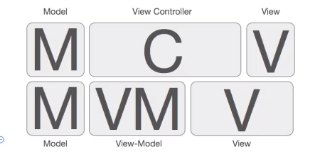

# Vue小记

##  一、Vue2使用

### 1、Vue基本使用

#### Vue的生命周期

生命周期函数就是vue实例在某一个时间点会自动执行的函数。

- `beforeCreate`

- `created`：在模板渲染成html前调用，即通常初始化某些属性值，然后再渲染成视图。
- `beforeMount`
- `mounted`：在模板渲染成html后调用，通常是初始化页面完成后，再对html的dom节点进行一些需要的操作。
- `beforeUpdate`
- `updated`
- `beforeDestory`
- `destoryed`

##### ajax请求应该放在哪个生命周期

- mounted
- JS是单线程的，ajax异步获取数据
- 放在mounted之前没有用，只会让逻辑更加混乱（event loop 因为生命周期是同步的，ajax是异步的，异步事件是在所有同步执行完成之后执行，放在created，会让人觉得ajax执行在mounted前，即mounted前就已经获得了ajax数据，其实ajax数据是在vue初始化完成后才获取的）

##### 何时需要使用beforeDestory

- 解绑自定义事件`event.$off`
- 清除定时器
- 解绑自定义的DOM事件，如`addEventListener`、`window`、`scroll`等


#### 模板语法

##### 插值

区别：v-text不会转译，v-html会转译

v-html：会有XSS风险，会覆盖子组件（可以使用`<pre>`标签）

```html
	<div id="app">
    	<!-- 插值表达式 -->
		<div>{{name}}</div>          <!--  <h1>hello</h1> -->
		<!-- v-text 与 {{}} 作用相同 -->
		<div v-text="name"></div>    <!--  <h1>hello</h1> -->
		<div v-html="name"></div>    <!--  hello -->
	</div>
```

对于所有的数据绑定，Vue.js 都提供了完全的 JavaScript **表达式**支持。注意：每个绑定都只能包含**单个表达式**。

```js
{{ number + 1 }}
{{ ok ? 'YES' : 'NO' }}
{{ message.split('').reverse().join('') }}

// 这是语句，不是表达式
{{ var a = 1 }}

```

##### 事件绑定：v-on

```html
<body>
	<div id="root">
       <!--  事件绑定 v-on: 简写为 @ -->
        <div v-on:click="handleClick"><h1>{{content}}</h1></div>
	</div>

	<script>
		new Vue({
			el:"#root",
			data:{
				content:"hello"
			},
			methods:{
				handleClick:function(){
					this.content = "world"
				}
			}
		})
	</script>
</body>
```

##### 属性绑定：v-bind

```html
<body>
	<div id="root">
	    <!-- 属性绑定 v-bind: 简写为 : -->
		<div :title="title">hello world</div>
	</div> 

	<script>
		new Vue({
			el:"#root",
			data:{
				title:"this is hello world"
			}
		})
	</script>
</body>
```

##### 双向数据绑定：v-model

其实，`v-model` 就是 `v-bind` 和 `v-on` 的语法糖。

**`v-model="message"` 相当于 `v-bind:value="message" v-on:input="message = $event.target.value"`**

```html
<body>
	<div id="root">
		<!-- 双向数据绑定 v-model -->
		<input v-model="content"/>
	    <div>{{content}}</div>
	</div> 

	<script>
		new Vue({
			el:"#root",
			data:{
				content:"this is content"
			}
		})
	</script>
</body>
```

##### v-if、v-else指令

```html
<body>
	<div id="root">
		<!-- v-if 条件渲染指令，存在与否，它根据表达式的真假来删除和插入元素  
                  当show=false时，直接从dom中移除 -->
		<div v-if="show">hello world</div>
        <!-- v-if的值为false时显示v-else内容，v-if 与 v-else必须紧贴
                另外 还有 v-else-if  -->
		<div v-else>bye world</div>
        <button @click="handleClick">toggle</button>
	</div>

	<script>
		new Vue({
			el: "#root",
			data: {
				show: true
			},
			methods:{
				handleClick:function(){
					this.show = !this.show
				}
			}
		})
	</script>
</body>
```

##### v-show指令

v-if 和 v-show的区别：

- v-show通过css display控制显示和隐藏

- v-if 组件真正的渲染和销毁DOM，而不是显示和隐藏
- 频繁切换显示状态用v-show，否则用v-if

```html
<body>
	<div id="root">
        <!-- v-show 条件渲染指令，显示与否
                    当show=false时，div中的display属性变为none，不会dom中移除。
                    推荐使用v-show -->
	    <div v-show="show">hello world</div>
        <button @click="handleClick">toggle</button>
	</div>

	<script>
		new Vue({
			el: "#root",
			data: {
				show: true
			},
			methods:{
				handleClick:function(){
					this.show = !this.show
				}
			}
		})
	</script>
</body>
```

##### v-for指令

**v-for中的key的用处**

- **提高性能**：当 Vue 更新视图时，它会根据 `key` 来识别哪些元素被修改、添加或移除。如果没有 `key`，Vue 会依赖其默认的算法（基于元素的位置）来比较元素，这样可能导致不必要的 DOM 操作。使用 `key` 后，Vue 能精确地找到每个项，从而减少不必要的 DOM 重排和重绘，提升性能。

- **保持组件状态**：如果渲染的是一个组件（而不是普通的 DOM 元素），使用 `key` 可以确保组件在渲染更新时保持正确的状态。例如，如果列表中有表单输入框，每个输入框都有自己的状态，使用 `key` 可以确保输入框状态不会因列表排序或元素移除而丢失。
- **避免渲染错误**：key 的存在可以帮助 Vue 确保在列表更新时，元素的顺序和内容保持稳定，避免出现不稳定的渲染或顺序错乱。

```html
<body>
	<div id="root">
		<ul>
        <!-- v-for 循环显示  :key 提升每一项渲染效率，不能相同
                   一般与后端数据库相连时该项为数据id -->
			<li v-for="(item,index) of list" :key="index">{{item}}</li>
		</ul>
	</div>

	<script>
		new Vue({
			el: "#root",
			data: {
				list: [1,2,3]
			}
		})
	</script>
</body>
```

#### 计算属性（computed）、监听器（watch）与方法（methods）

- **计算属性（computed）**

  对于任何复杂逻辑，你都应当使用计算属性。

  有缓存，data不变不会重新计算；提高性能

  

  - 计算属性缓存 vs 方法

    我们可以通过在表达式中调用方法来达到同样的效果：

    ```js
    // 在组件中
    methods: {
      reversedMessage: function () {
        return this.message.split('').reverse().join('')
      }
    }
    ```

    不同的是**计算属性是基于它们的响应式依赖进行缓存的**。只在相关响应式依赖发生改变时它们才会重新求值。这就意味着只要 `message` 还没有发生改变，多次访问 `reversedMessage` 计算属性会立即返回之前的计算结果，而不必再次执行函数。

    这也同样意味着下面的计算属性将不再更新，因为 `Date.now()` 不是响应式依赖：

    ```js
    computed: {
      now: function () {
        return Date.now()
      }
    }
    ```

    相比之下，每当触发重新渲染时，**调用方法将总会再次执行函数**。

    

  - 计算属性vs侦听属性

    ```js
    var vm = new Vue({
      el: '#demo',
      data: {
        firstName: 'Foo',
        lastName: 'Bar',
        fullName: 'Foo Bar'
      },
      watch: {
        firstName: function (val) {
          this.fullName = val + ' ' + this.lastName
        },
        lastName: function (val) {
          this.fullName = this.firstName + ' ' + val
        }
      }
    })
    ```

    侦听属性有缓存，但是代码是命令式且重复的。

    将它与计算属性的版本进行比较：

    ```js
    var vm = new Vue({
      el: '#demo',
      data: {
        firstName: 'Foo',
        lastName: 'Bar'
      },
      computed: {
        fullName: function () {
          return this.firstName + ' ' + this.lastName
        }
      }
    })
    ```

  - 计算属性的setter

    计算属性默认只有 getter ，不过在需要时你也可以提供一个 setter ：

    ```js
    // ...
    computed: {
      fullName: {
        // getter
        get: function () {
          return this.firstName + ' ' + this.lastName
        },
        // setter
        set: function (newValue) {
          var names = newValue.split(' ')
          this.firstName = names[0]
          this.lastName = names[names.length - 1]
        }
      }
    }
    // ...
    ```

    现在再运行 `vm.fullName = 'John Doe'` 时，setter 会被调用，`vm.firstName` 和 `vm.lastName` 也会相应地被更新。

- 监听器（watch）

  **当需要在数据变化时执行异步或开销较大的操作时，这个方式是最有用的。**

  **当值第一次绑定时，不会执行监听函数，只有值发生改变时才会执行。如果我们需要在最初绑定值的时候也执行函数，则就需要用到immediate属性。**

  ```js
  watch: {
      // 普通监听
      name(oldVal, val){
          console.log(oldVal)
      },
      firstName: {
          handler(newName, oldName) {
              this.fullName = newName + ' ' + this.lastName;
          },
          // 代表在watch里声明了firstName这个方法之后立即先去执行handler方法
          immediate: true,  	// 是否最初绑定的时候就执行
          deep: true 			// 是否深度监听
      }
  }
  ```
  
  `deep`的意思就是深入观察，监听器会一层层的往下遍历，给对象的所有属性都加上这个监听器，但是这样性能开销就会非常大了，任何修改`obj`里面任何一个属性都会触发这个监听器里的 handler。
  
  优化，我们可以使用字符串形式监听。
  
  ```js
  watch: {
    'obj.a': {
      handler(newName, oldName) {
        console.log('obj.a changed');
      },
      immediate: true,
      // deep: true
    }
  }
  ```
  
  PS：watch监听引用类型，拿不到oldVal


**methods,watch,computed的区别**

1. computed 属性的结果**会被缓存**，除非依赖的响应式属性**变化才会重新计算**。主要当作属性来使用
2. methods 方法表示一个具体的操作，主要书写业务逻辑
3. watch 一个对象，键是需要观察的表达式，值是对应回调函数。主要**用来监听某些特定数据的变化，从而进行某些具体的业务逻辑操作**；可以看作是 computed 和 methods 的结合体；**(与computed的区别是，watch更加适用于监听某一个值的变化并做对应的操作，比如请求后台接口等，而computed适用于计算已有的值并返回结果)**


#### class与style绑定

- 使用动态属性
- 使用驼峰式写法

下面通过一个点击改变颜色例子来说明样式绑定。

- class的对象绑定

  ```html
  <!DOCTYPE html>
  <html lang="en">
  <head>
  	<meta charset="UTF-8">
  	<title>class的对象绑定</title>
  	<script src="./vue.js"></script>
  	<style>
          .activited {
          	color: red;
          }
  	</style>
  </head>
  <body>
  	<div id="app">
          <!-- 方法一：class的对象绑定 -->
  		<div @click="handleDivClick"
  		     :class="{activited:isActivited}">
  		     Hello world
  		</div>
  	</div>
  
  	<script>
  		var vm = new Vue ({
  			el: "#app",
  			data: {
  				isActivited: false
  			},
  			methods: {
  				handleDivClick: function() {
  					this.isActivited = ! this.isActivited
  				}
  			}
  		})
  	</script>
  </body>
  </html>
  ```

- class的数组绑定

  ```html
  <!DOCTYPE html>
  <html lang="en">
  <head>
  	<meta charset="UTF-8">
  	<title>class的数组绑定</title>
  	<script src="./vue.js"></script>
  	<style>
          .activited {
          	color: red;
          }
  	</style>
  </head>
  <body>
  	<div id="app">
          <!-- 方法二：class的数组绑定 -->
  		<div @click="handleDivClick1"
  		     :class="[activited]">
  		     Hello world!
  		</div>
  	</div>
  
  	<script>
  		var vm = new Vue ({
  			el: "#app",
  			data: {
  				activited:""
  			},
  			methods: {
  				handleDivClick1: function() {
  					this.activited = this.activited === "activited" ? "" : "activited"
  				}
  			}
  		})
  	</script>
  </body>
  </html>
  ```

- style的对象绑定

  ```html
  <body>
  	<div id="app">
          <!-- 方法三：style的对象绑定 -->
  		<div @click="handleDivClick2"
  		     :style="styleObj">
  		     Hello world!!
  		</div>
  	</div>
  
  	<script>
  		var vm = new Vue ({
  			el: "#app",
  			data: {
  				styleObj: {
  					color: ""
  				}
  			},
  			methods: {
  				handleDivClick2: function() {
  					this.styleObj.color = this.styleObj.color === "" ? "red" : "";
  				}
  			}
  		})
  	</script>
  </body>
  ```

- style的数组绑定

  ```html
  <body>
  	<div id="app">
  	<!-- 方法四：style的数组绑定（与方法三相似） -->
  		<div @click="handleDivClick3"
  		     :style=[styleObj]>
  		     Hello world!!!
  		</div>
  	</div>
  
  	<script>
  		var vm = new Vue ({
  			el: "#app",
  			data: {
  				styleObj: {
  					color: ""
  				}
  			},
  			methods: {
  				handleDivClick3: function() {
  					this.styleObj.color = this.styleObj.color === "" ? "red" : "";
  				}
  			}
  		})
  	</script>
  </body>
  ```


#### 条件渲染

`v-if`，`v-else`，`v-show`基础知识详见上文指令部分。

**v-if和v-show的区别**

v-show仅仅控制元素的显示方式，将display属性在block和none来回切换；

而v-if会控制这个dom节点的存在与否。

当我们需要经常切换某个元素的显示/隐藏时，使用v-show会更加节省性能上的开销；

当只需要一次显示或隐藏时，使用v-if更合理。


- 在`<template>`元素上使用`v-if`条件渲染分组

  当我们需要切换多个元素时，可以把一个 `<template>` 元素当做不可见的包裹元素，并在上面使用 `v-if`。

  最终的渲染结果将不包含 `<template>` 元素。

  ```js
  <template v-if="ok">
    <h1>Title</h1>
    <p>Paragraph 1</p>
    <p>Paragraph 2</p>
  </template>
  ```

- `v-else-if`

  充当 `v-if` 的“else-if 块”，可以连续使用：

  ```js
  <div v-if="type === 'A'">
    A
  </div>
  <div v-else-if="type === 'B'">
    B
  </div>
  <div v-else-if="type === 'C'">
    C
  </div>
  <div v-else>
    Not A/B/C
  </div>
  ```

  类似于 `v-else`，`v-else-if` 也必须紧跟在带 `v-if` 或者 `v-else-if` 的元素之后。

- 用`key`管理可复用的元素

  Vue 会尽可能高效地渲染元素，通常会复用已有元素而不是从头开始渲染。

  但有时我们并不需要这样的功能，如当我们在使用账号登录时，可以选择用户名登录和邮箱登录，而这两者的信息可能是不一样的，这时我们可以增加key使切换时输入的内容清空。如下面的例子：

  ```html
  <body>
  <!-- 通过增加key能使v-if 与 v-else 切换时的内容清空 -->
  	<div id="app">
  		<div v-if="show">
  			用户名：<input key="username" />
  		</div>
  		<div v-else>
  			邮箱名：<input key="email"/>
  		</div>
  		<button @click="toggle">切换</button>
  	</div>
  
  	<script>
  		var vm = new Vue({
  			el: "#app",
  			data: {
  				show: true,
  			},
  			methods: {
  				toggle: function() {
  					this.show = !this.show
  				}
  			}
  		})
  	</script>
  </body>
  ```


#### 列表渲染

- 用`v-for`把一个数组对应为一组元素

```html
<body>
	<div id="app">
	<!-- v-for 循环显示  :key 提升每一项渲染效率，不能相同 一般与后端数据库相连时该项为数据id -->
	<!-- 可以用 of 替代 in 作为分隔符，因为它是最接近 JavaScript 迭代器的语法 -->
		<div v-for="(item, index) in list"
		     :key="item.id">
            {{index}}----{{item.text}}----{{item.id}}
		</div>
	</div>

	<script>
		var vm = new Vue({
			el: "#app",
			data: {
				list: [{
					id:"010120201",
					text:"hello"
				},{
					id:"010120202",
					text:"hello"
				},{
					id:"010120203",
					text:"hello"
				}]
			}
		})
	</script>
</body>
```

输出结果：

- 一个对象的`v-for`

```html
<body>
	<div id="app">
        <div v-for="(value, key, index) in object">
          {{ index }}. {{ key }}: {{ value }}
        </div>
	</div>

	<script>
		var vm = new Vue({
			el: "#app",
			data: {
				object: {
					firstName: 'John',
					lastName: 'Doe',
					age: 30
				}
			}
		})
	</script>
</body>
```

输出结果：

- **v-for 和 v-if 不能一起使用**

  v-for比v-if的优先级更高，这就说明在v-for的每次循环运行中每一次都会调用v-if的判断，所以不推荐v-if和v-for在同一个标签内同时使用。

  解决方法：过滤一个列表中的项目 (比如 v-for=“user in users” v-if=“user.isActive”)。在这种情形下，请将 users替换为一个计算属性 (比如 activeUsers)，让其返回过滤后的列表

- 当我们要在此基础上再加一个数据，在控制台中我们要重新定义该对象才能使页面改变。

```js
vm.object={
				firstName: 'John',
				lastName: 'Doe',
				age: 30,
				address: 'hangzhou'
			}
```

除此之外，我们还可以通过set方法向对象注入数据，同时页面更新。

方法一：`Vue.set(vm.object,"address","hangzhou")`

方法二：`vm.$set(vm.object,"address","hangzhou")`

- 注意事项

  由于 JavaScript 的限制，Vue 不能检测以下变动的数组：

  ​    1.当你利用索引直接设置一个项时，例如：`vm.items[indexOfItem] = newValue`

  ​    2.当你修改数组的长度时，例如：`vm.items.length = newLength`

  - 为了解决第一类问题，以下两种方式都可以实现和 `vm.items[indexOfItem] = newValue` 相同的效果，同时也将触发状态更新：

    ```js
    // Vue.set
    Vue.set(vm.items, indexOfItem, newValue)
    // Array.prototype.splice
    vm.items.splice(indexOfItem, 1, newValue)
    ```

    你也可以使用 `vm.$set` 实例方法，该方法是全局方法 Vue.set 的一个别名：

    `vm.$set(vm.items, indexOfItem, newValue)`

  - 为了解决第二类问题，你可以使用 splice：

    `vm.items.splice(newLength)`

#### 事件

- event参数，自定义参数

  1.event是原生的event对象，没有经过任何的装饰

  2.事件被挂载到当前元素

- 事件修饰符

  ```vue
  <!-- 阻止单击事件继续传播 -->
  <a v-on:click.stop="doThis"></a>
  <!-- 提交事件不再重载页面 -->
  <form v-on:submit.prevent="onSubmit"></form>
  <!-- 修饰符可以串联 -->
  <a v-on:click.stop.prevent="doThat"></a>
  <!-- 只有修饰符 -->
  <form v-on:submit.prevent></form>
  <!-- 添加事件监听器时使用事件捕获模式 -->
  <!-- 事件捕获：事件从最不精确的对象(document对象)开始触发，然后到最精确 -->
  <div v-on:click.capture="doThis">...</div>
  <!-- 只当在 event.target 是当前元素自身时触发处理函数 -->
  <!-- 即事件不是从内部元素触发的 -->
  <div v-on:click.self="doThat">...</div>
  ```

- 按键修饰符

  ```vue
  <!-- 即使 Alt 或 Shift 被一同按下时也会触发 -->
  <button @click.ctrl="onClick">A</button>
  <!-- 有且只有 Ctrl 被按下的时候才触发 -->
  <button @click.ctrl.exact="onCtrlClick">A</button>
  <!-- 没有任何系统修饰符被按下的时候才触发 -->
  <button @click.exact="onCtrlClick">A</button>
  ```


#### 表单

- v-model

  `<textarea v-model="desc"></textarea>`

  注意：`<textarea>{{desc}}</textarea>`是不允许的

- 常见的表单项 textarea checkbox radio select

- 修饰符 lazy number trim （v-model.lazy、v-model.number、v-model.trim）

  - 在输入框中，v-model 默认是同步数据，使用 **.lazy** 会转变为在 change 事件中同步 ， 也就是在**失去焦点 或者 按下回车键时才更新**
  - **.number 修饰符可以将 输入的值转化为Number类型** ，否则虽然你输入的是数字 但它的类型其实是String，在数字输入框中比较有用
  - **.trim** 修饰符会自动过滤掉输入的**首尾空格**

### 2、Vue组件使用

#### 组件使用中的细节点

- table 中只能使用tr标签，不能使用子组件标签，需要使用is
- 子组件中定义data必须是一个函数
  - vue组件相当于class，它可能会被用到很多地方，这就类似于new class实例

  - 而对于每一个实例，data都必须是独立的，所以要用函数返回

  - 如果不用函数，那多个实例就公用一个data了
- 使用ref操作dom:  this.$refs.xx

```html
	<div id="root">
		<!-- table 中只能使用tr标签 因此使用is  同理还有select中只能用option标签，ul中li标签 -->
		<table>
			<tbody>
				<tr is="row"></tr>
				<tr is="row"></tr>
				<tr is="row"></tr>
			</tbody>
		</table>

		<!-- 使用ref操作dom -->
		<counter ref="one" @change="handleChange"></counter>
		<counter ref="two" @change="handleChange"></counter>
		<div>{{total}}</div>
	</div>

	<script>
		// 子组件中定义data必须是一个函数
		Vue.component('row', {
			data: function() {
				return {
					content: 'this is a row'
				}
			},
			template: '<tr><td>{{content}}</td></tr>'
		})

		Vue.component('counter', {
			template:'<div @click="handleClick">{{number}}</div>',
			data: function () {
				return {
					number: 0
				}
			},
			methods: {
				handleClick: function() {
					this.number ++
					this.$emit('change')
				}
			}
		})


		var vm = new Vue ({
			el:"#root",
			data: {
				total: 0
			},
			methods: {
				handleChange: function() {
					this.total = this.$refs.one.number + this.$refs.two.number
				}
			}
		})
  </script>
```

#### 父子组件传值

扩展阅读：

[Vue2.0的三种常用传值方式、父传子、子传父、非父子组件传值](https://blog.csdn.net/lander_xiong/article/details/79018737)

[vue组件间通信六种方式（完整版）](https://www.cnblogs.com/hpx2020/p/10936279.html)

- 父组件通过属性形式向子组件传值

  ```js
  props: {
      list: {
          type: Array,
          default() {
              return []
          }
      }
  }
  ```

- 子组件通过事件触发形式向父组件传值

  ```js
  this.$emit(事件方法, 值)
  ```

  

```html
	<div id="root">
		<counter :count="3" @inc="handleIncrease"></counter>
		<counter :count="2" @inc="handleIncrease"></counter>
		<div>{{total}}</div>
	</div>

	<script>
// 单向数据流：父组件可以向子组件传递任何数据，但是父组件传递过来的数据不能在子组件中直接修改，可以复制一个副本，更改副本
		var counter = {
			props: ['count'],
			data: function() {
				return {
					number: this.count
				}
			},
			template: '<div @click="handleClick">{{number}}</div>',
			methods: {
				handleClick: function() {
					this.number = this.number + 2;
					this.$emit('inc', 2)	// 子组件通过事件触发形式向父组件传值
				}
			}
		}

		var vm = new Vue({
			el: '#root',
			data: {
				total: 5
			},
			components: {
				counter
			},
			methods: {
				handleIncrease: function(step) {
					this.total += step
				}
			}
		})
	</script>
```

#### vue中父组件调用子组件方法

用法： 子组件上定义`ref="refName"`,  父组件的方法中用 `this.$refs.refName.method` 去调用子组件方法

详解： 父组件里面调用子组件的函数，父组件先把函数/方法以属性形式传给子组件；那么就需要先找到子组件对象 ，即 `this.$refs.refName`.然后再进行调用，也就是 `this.$refs.refName.method`

1、在子组件中：`<div></div>`是必须要存在的 

2、在父组件中：首先要引入子组件 `import Child from './child';`

3、 `<child ref="mychild"></child>`是在父组件中为子组件添加一个占位，`ref="mychild"`是子组件在父组件中的名字

4、父组件中 components: {　　是声明子组件在父组件中的名字

5、在父组件的方法中调用子组件的方法，很重要 `this.$refs.mychild.parentHandleclick("嘿嘿嘿");`

#### 组件参数校验

```html
	<div id="root">
		<child content="hello world"></child>
	</div>

	<script>
		Vue.component('child', {
			props: {
				content: {
					type: String,
					required: false,   //如果是true，说明这个属性必传
					default: 'default value',   //当这个属性没有传递数据时，默认显示的值
					//校验
					validator: function(value) {
						return (value.length > 5)
					}
				}
			},
			template: '<div>{{content}}</div>'
		})

		var vm = new Vue({
			el: '#root'
		})
	</script>
```

#### 给子组件绑定原生事件

```html
<div id="root">
		<child @click.native="handleClick"></child>
	</div>

	<script>
		Vue.component('child', {
			template: '<div>Child</div>',
		})

		var vm = new Vue({
			el: '#root',
			methods: {
				handleClick: function() {
					alert('click')
				}
			}
		})
	</script>
```

#### 非父子组件的传值（Bus/总线/发布订阅模式/观察者模式）

```html
  <div id="root">
  	<child content="childOne"></child>
  	<child content="childTwo"></child>
  </div>

  <script>
  	// bus 总线 进行非父子组件的传值
  	Vue.prototype.bus = new Vue()


  	Vue.component('child', {
  		props: ['content'],
  		data: function() {
  			return {
  				myContent: this.content
  			}
  		},
  		template: '<div @click="handleClick">{{myContent}}</div>',
  		methods: {
  			handleClick: function() {
                // 派发方法
  				this.bus.$emit('change', this.myContent)
  			}
  		},
      	// 生命周期钩子 该组件被挂载时会执行的函数
  		mounted() {
  			var this_ = this;
            // 接收方法
  			this.bus.$on('change', function(content) {
  				this_.myContent = content
  			})
  		},
        // 及时解绑自定义事件
        beforeDestory() {
            // 及时销毁，否则可能造成内存泄漏
            event.$off('change', function(content) {
  				this_.myContent = content
  			})
        }
  	})

    var vm = new Vue({
      el: "#root"
    })
  </script>
```

#### 组件生命周期

- 单个组件

  created  页面还没开始渲染，但Vue实例已经初始化完成

  mounted  页面渲染完成  基本情况在mounted中进行操作，如ajax获取信息，绑定事件等

  beforeDestroy  解除绑定，销毁子组件以及事件监听器，如自定义事件，setTimeout，window、document事件

- 父子组件

  父组件先开始初始化，再子组件初始化，子组件渲染完成后，父组件才渲染完成

  index created

  list created

  list mounted

  index mounted

  父组件先开始进入更新状态，再子组件，子组件更新完成后，父组件才更新完成

  index beforeUpdate

  list beforeUpdate

  list updated

  index updated

  销毁destroy同理

### 3、Vue高级特性

#### :star:自定义组件如何实现v-model

##### Vue2

在vue2中，自定义组件使用 `v-model` ，需要在组件内部定义 `value` prop，然后通过 `this.$emit('input', newValue)` 触发更新即可。

```vue
<!-- CustomInput.vue -->
<template>
  <input :value="value" @input="$emit('input', $event.target.value)" />
</template>

<script>
export default {
  props: ['value'],
}
</script>
```

使用方式：

```vue
<CustomInput v-model="searchText" />
```

##### Vue3

在Vue 3中，自定义组件实现`v-model`的方式与Vue 2有所不同。Vue 3中，`v-model`是`modelValue`属性和`update:modelValue`事件的语法糖。同时，Vue 3还支持多个`v-model`绑定。

```vue
<!-- CustomInput.vue -->
<template>
  <input :value="modelValue" @input="$emit('update:modelValue', $event.target.value)" />
</template>

<script setup>
defineProps(['modelValue'])
defineEmits(['update:modelValue'])
</script>
```

使用方式：

```vue
<CustomInput v-model="searchText" />
```


**Vue 3 支持在同一个组件上绑定多个 `v-model`：**

```vue
<!-- 父组件 -->
<UserForm
  v-model:name="userName"
  v-model:age="userAge"
/>
```

```vue
<!-- 子组件 UserForm.vue -->
<input :value="name" @input="$emit('update:name', $event.target.value)">
<input :value="age" @input="$emit('update:age', $event.target.value)">

<script setup>
defineProps(['name', 'age'])
defineEmits(['update:name', 'update:age'])
</script>
```


------

**👉注意，从 Vue 3.4 开始，官方推荐的实现方式是使用 defineModel() 宏：**

在 Vue 3.3 及以上版本中，引入了新的宏 `defineModel()`，它极大地简化了自定义组件中 `v-model` 的实现。`defineModel()` 是一个编译宏，它会自动声明一个 prop 和一个对应的更新事件。

**单值绑定**

```vue
<!-- 子组件 CustomInput.vue -->
<script setup>
// 使用 defineModel() 自动创建 modelValue
const model = defineModel()
</script>

<template>
  <input v-model="model">
</template>
```

```vue
<!-- 父组件 -->
<template>
  <CustomInput v-model="message" />
</template>
```

**多个 v-model 绑定**

```vue
<!-- 子组件 UserForm.vue -->
<script setup>
const name = defineModel('name')
const age = defineModel('age')
</script>

<template>
  <input v-model="name">
  <input v-model="age" type="number">
</template>
```

```vue
<!-- 父组件 -->
<template>
  <UserForm 
    v-model:name="userName"
    v-model:age="userAge"
  />
</template>
```


#### :star:nextTick

**核心作用：在下次 DOM 更新循环结束后执行回调，确保我们能操作到最新的 DOM 状态。**

- Vue是异步渲染
- data改变之后，DOM不会立刻渲染
- nextTick会在DOM渲染之后被触发，以获取最新DOM节点


**数据变化后操作 DOM**

```vue
<script setup>
async function increment() {
  count.value++
  // DOM 还未更新
  console.log(document.getElementById('counter').textContent) // 0
  await nextTick()
  // DOM 此时已经更新
  console.log(document.getElementById('counter').textContent) // 1
}
</script>

<template>
  <button id="counter" @click="increment">{{ count }}</button>
</template>
```

**在生命周期钩子中操作 DOM**

```js
<script setup>
import { ref, onMounted, nextTick } from 'vue'
// 创建 DOM 引用
const element = ref(null)

onMounted(() => {
  // 直接访问可能未渲染完成
  console.log(element.value.offsetHeight) // 0 或未定义
  // 使用 nextTick 确保 DOM 已渲染
  nextTick(() => {
    console.log(element.value.offsetHeight) // 实际高度
  })
})
</script>
```

注意，在vue2中和vue3的选项式 API中，我们使用this.$nextTick(callback)的方式调用。

```js
this.$nextTick(() => {
  console.log(this.$refs.text.innerText) // "更新后的文本"
})
```


#### :star:插槽

没有插槽的情况下在组件标签内写一些内容是不起任何作用的，当在组件中声明了slot元素后，在组件元素内写的内容就会替换slot。

用于父组件中往子组件中插入一段内容。

##### 单个插槽

```html
  <div id="root">
    <child>
      <h1>hello</h1>
    </child>
  </div>

  <script>

    var child = {
      template: '<div><slot>默认内容，即父组件没设置内容时，这里显示</slot></div>'
    }

    var vm = new Vue({
      components: {
        child
      },
      el: "#root"
    })
  </script>
```

##### 具名插槽

通过给 `<slot>` 元素添加 `name` 属性来定义不同的插槽，这样就可以在父组件中指定具体的内容应该出现在哪个位置。

```html
  <div id="root">
    <child>
        <!-- 缩写 <template #header> -->
        <template v-slot:header>
            <h1>将插入header slot中</h1>
        </template>
        <p>将插入到main slot中，即未命名的slot</p>
        <template v-slot:footer>
            <h1>将插入footer slot中</h1>
        </template>
    </child>
  </div>

  <script>

    var child = {
      template: `<div>
                  <slot name="header"></slot>
                  <div>
                    <h2>content</h2>
                  </div>
                  <slot name="footer"></slot>
                </div>`
    }

    var vm = new Vue({
      components: {
        child: child
      },
      el: "#root"
    })
  </script>
```

##### 作用域插槽

允许子组件向父组件传递数据，并且在父组件中根据这些数据动态地生成内容。这通常通过 `<slot>` 标签的 `v-bind` 绑定来实现。

```html
<div id="root">
    <child>
        <template v-slot="slotProps">
            <ul>
              <li v-for="item in slotProps.items" :key="item">{{ item }}</li>
            </ul>
        </template>
        <!-- 使用解构 -->
        <template v-slot="{ items }">
            <ul>
              <li v-for="item in items" :key="item">{{ item }}</li>
            </ul>
        </template>
    </child>
</div>

<script>
    Vue.component('child', {
        data: function() {
            return {
                items: [1, 2, 3, 4]
            }
        },
        template: `<div>
                    <ul>
                        <slot :items="items"></slot>
                    </ul>
                   </div>`
    })

    var vm = new Vue({
        el: '#root'
    })
</script>
```

##### 具名作用域插槽

具名作用域插槽的工作方式也是类似的，插槽 props 可以作为 `v-slot` 指令的值被访问到：`v-slot:name="slotProps"`。

当使用缩写时是这样：

```vue
<MyComponent>
  <template #header="headerProps">
    {{ headerProps }}
  </template>

  <template #default="defaultProps">
    {{ defaultProps }}
  </template>

  <template #footer="footerProps">
    {{ footerProps }}
  </template>
</MyComponent>
```

向具名插槽中传入 props：

```vue
<slot name="header" message="hello"></slot>
```

注意插槽上的 `name` 是一个 Vue 特别保留的 attribute，不会作为 props 传递给插槽。因此最终 `headerProps` 的结果是 `{ message: 'hello' }`。


#### :star:动态组件与v-once指令

- 动态组件用法 `<component :is="component-name" />`  

  被传给 `:is` 的值可以是以下几种：

  - 被注册的组件名
  - 导入的组件对象

- 需要根据数据，动态渲染的场景，如常见的有文本，视频，图片组件的新闻详情页。即组件类型不确定。

- 每次都会销毁和重建，为了性能优化，也可以使用keep-alive缓存

```html
	<div id="root">
	    <!-- 动态组件 -->
		<!-- <component :is="type"></component> -->
	    <!-- 使用v-once -->
		<child-one v-if="type ==='child-one'"></child-one>
		<child-two v-if="type ==='child-two'"></child-two>
		<button @click="handleBtnClick">change</button>
	</div>

	<script>
		// v-once修饰的组件会把该dom隐藏掉,它还在内存里面,等到你需要它的时候就可以迅速渲染,从而提升性能。
		Vue.component('child-one', {
			template: '<div v-once>child-one</div>'
		})

		Vue.component('child-two', {
			template: '<div v-once>child-two</div>'
		})

		var vm = new Vue({
			el: '#root',
			data: {
				type: 'child-one'
			},
			methods: {
				handleBtnClick: function() {
					this.type = (this.type === 'child-one' ? 'child-two': 'child-one');
				}
			}
		})
	</script>
```


#### 异步组件

使用import()函数按需加载

同步引入组件：`import formDemo from './formDemo'`

异步引入组件：

```js
components:{
	formDemo: () => import('./formDemo')
}
```

何时使用异步组件

- 加载大组件
- 路由异步加载


#### :star:keep-alive

```vue
<keep-alive>
	<KeepAliveStageA v-if="state === 'A'" />
    <KeepAliveStageB v-if="state === 'B'" />
    <KeepAliveStageC v-if="state === 'C'" />
</keep-alive>
```

- `<KeepAlive>` 是一个内置组件，它的功能是在多个组件间动态切换时缓存被移除的组件实例。

- 频繁切换不需要重复渲染，用于tab切换等

- Vue常见性能优化

- v-show和keep-alive的区别：

  v-show是在css层面，控制元素的显示方式，将display属性在block和none来回切换；

  keep-alive是vue中的一个抽象组件，用于保存组件的渲染状态。
  
  

```vue
<keep-alive :include="whiteList" :exclude="blackList" :max="amount">
    <router-view></router-view>
</keep-alive>
```

**include**定义缓存白名单，keep-alive会缓存命中的组件；**exclude**定义缓存黑名单，被命中的组件将不会被缓存；**max**定义缓存组件上限，超出上限使用LRU的策略置换缓存数据。

> 内存管理的一种页面置换算法，对于在内存中但又不用的数据块（内存块）叫做LRU，操作系统会根据哪些数据属于LRU而将其移出内存而腾出空间来加载另外的数据。


**何时使用keep-alive**

- 缓存组件，不需要重复渲染
- 如多个静态tab页的切换
- 优化性能


**Vue 3 的 keep-alive 的缓存机制原理**

- 缓存池：keep-alive 内部**使用一个 Map 存储已渲染的组件实例，键通常是组件的 key（或 name）**。
- 激活与挂起：如果组件切换时已经缓存，直接复用缓存的组件实例；如果组件未缓存，则渲染并缓存新的组件实例。 此外，keep-alive 还会激活特殊的钩子函数：
- 当组件被缓存时，会触发 deactivated 钩子。
- 当组件从缓存中恢复时，会触发 activated 钩子。

一个简单的实现如下：

```javascript
const KeepAliveImpl = {
  name: 'KeepAlive',
  // 已缓存的组件实例。
  _cache: new Map(),
  _activeCache: new Map(),

  render() {
    const vnode = this.$slots.default()[0] // 获取动态组件的 vnode
    const key = vnode.key || vnode.type.name

    if (this._cache.has(key)) {
      const cachedVnode = this._cache.get(key)
      this._activeCache.set(key, cachedVnode)
      return cachedVnode
    } else {
      return vnode // 未缓存，直接渲染
    }
  },

  mounted() {
    const key = this.$vnode.key
    if (!this._cache.has(key)) {
      this._cache.set(key, this.$vnode)
    }
  },

  beforeDestroy() {
    const key = this.$vnode.key
    this._cache.delete(key)
  },
}
```


### 4、Vuex使用

`Vuex`解决项目中多个组件之间的数据通信和状态管理。

[vue组件间通信六种方式（完整版）](https://www.cnblogs.com/hpx2020/p/10936279.html)

#### Vuex五大核心属性

**state，getter，mutation，action，module**

- state：存储数据，存储状态；在根实例中注册了store 后，用 `this.$store.state` 来访问；对应vue里面的data；存放数据方式为响应式，vue组件从store中读取数据，如数据发生变化，组件也会对应的更新。
- getter：可以认为是 store 的计算属性，它的返回值会根据它的依赖被缓存起来，且只有当它的依赖值发生了改变才会被重新计算。
- mutation：更改 Vuex 的 store 中的状态的唯一方法是提交 mutation。
- action：包含任意异步操作，通过提交 mutation 间接变更状态。
- module：将 store 分割成模块，每个模块都具有state、mutation、action、getter、甚至是嵌套子模块。

#### Vuex原理

Vuex实现了一个单向数据流，在全局拥有一个State存放数据，当组件要更改State中的数据时，必须通过Mutation进行，Mutation同时提供了订阅者模式供外部插件调用获取State数据的更新。而当所有异步操作(常见于调用后端接口异步获取更新数据)或批量的同步操作需要走Action，但Action也是无法直接修改State的，还是需要通过Mutation来修改State的数据。最后，根据State的变化，渲染到视图上。

#### 各模块在流程中的功能

- Vue Components：Vue组件。HTML页面上，负责接收用户操作等交互行为，执行dispatch方法触发对应action进行回应。
- dispatch：操作行为触发方法，是唯一能执行action的方法。
- actions：**操作行为处理模块,由组件中的$store.dispatch('action 名称', data1)来触发。然后由commit()来触发mutation的调用 , 间接更新 state**。负责处理Vue Components接收到的所有交互行为。包含同步/异步操作，支持多个同名方法，按照注册的顺序依次触发。向后台API请求的操作就在这个模块中进行，包括触发其他action以及提交mutation的操作。该模块提供了Promise的封装，以支持action的链式触发。
- commit：状态改变提交操作方法。对mutation进行提交，是唯一能执行mutation的方法。
- mutations：**状态改变操作方法，由actions中的commit('mutation 名称')来触发**。是Vuex修改state的唯一推荐方法。该方法只能进行同步操作，且方法名只能全局唯一。操作之中会有一些hook暴露出来，以进行state的监控等。
- state：页面状态管理容器对象。集中存储Vue components中data对象的零散数据，全局唯一，以进行统一的状态管理。页面显示所需的数据从该对象中进行读取，利用Vue的细粒度数据响应机制来进行高效的状态更新。
- getters：state对象读取方法。图中没有单独列出该模块，应该被包含在了render中，Vue Components通过该方法读取全局state对象。


#### mutation 和 action 有什么区别

`mutation` 可以直接修改 `store` 中的 **state**值，它只支持同步操作。

 `Action` 不能直接修改 **state**，而是通过调用 `mutation` 来间接修改，它用于处理异步操作。


#### Vuex与localStorage

vuex 是 vue 的状态管理器，存储的数据是响应式的。但是并不会保存起来，刷新之后就回到了初始状态，**具体做法应该在vuex里数据改变的时候把数据拷贝一份保存到localStorage里面，刷新之后，如果localStorage里有保存的数据，取出来再替换store里的state。**

```js
let defaultCity = "上海"
try {   // 用户关闭了本地存储功能，此时在外层加个try...catch
  if (!defaultCity){
    defaultCity = JSON.parse(window.localStorage.getItem('defaultCity'))
  }
}catch(e){}
export default new Vuex.Store({
  state: {
    city: defaultCity
  },
  mutations: {
    changeCity(state, city) {
      state.city = city
      try {
      window.localStorage.setItem('defaultCity', JSON.stringify(state.city));
      // 数据改变的时候把数据拷贝一份保存到localStorage里面
      } catch (e) {}
    }
  }
})
```

这里需要注意的是：由于vuex里，我们保存的状态，都是数组，而localStorage只支持字符串，所以需要用JSON转换：

```js
JSON.stringify(state.subscribeList);   // array -> string
JSON.parse(window.localStorage.getItem("subscribeList"));    // string -> array
```


### 5、Vue Router使用

#### 路由模式

##### hash模式（默认）

- 通过监听url中的hash变化来进行路由跳转

- 可以通过`window.location.hash`属性获取和设置hash值。比如这个URL：http://www.abc.com/#/hello, hash 的值为#/hello。

- **它的特点在于：hash 虽然出现URL中，但不会随请求发送到服务器端，因此改变hash不会重新加载页面。**

- hash模式背后的原理是**onhashchange**事件，可以在window对象上监听这个事件

  ```js
  // 监听hash变化
  window.onhashchange = (event) => {
      console.log('old url', event.oldURL)
      console.log('new url', event.newURL)
  
      console.log('hash:', location.hash)
      // 进行一些操作
  }
  ```

- hash 变化方式

  -  JS 修改 url
  - 手动修改 url 的 hash
  - 浏览器前进、后退


##### history路由(需要server端支持)

利用了HTML5 History Interface 中新增的`pushState() `和`replaceState() `方法

```javascript
history.go(-2);	// 后退两次
history.go(2);	// 前进两次
history.back(); // 后退
hsitory.forward(); // 前进

// 参数：stateObj, title, url
// 浏览器不会刷新页面
history.pushState({color: 'red'}, 'red', 'red') // 添加历史记录
history.replaceState({color: 'red'}, 'red', 'red') // 修改历史记录

// 监听历史记录变化
window.onpopstate = function(event){
    console.log('onpopstate', event.state, location.pathname)
     if(event.state && event.state.color === 'red'){
           document.body.style.color = 'red';
      }
}
```

**history.pushState**方法接受三个参数，依次为：

1、state：一个与指定网址相关的状态对象，popstate事件触发时，该对象会传入回调函数。如果不需要这个对象，此处可以填null。可用它来传一些数据

2、title：新页面的标题，但是所有浏览器目前都忽略这个值，因此这里可以填null。

3、url：新的网址，必须与当前页面处在同一个域。浏览器的地址栏将显示这个网址。

history.replaceState方法跟pushState一样只不过replaceState是修改当前的状态。


##### 两者选择 

- toB 的系统推荐用hash，简单易用，对url规范不敏感
- toC 的系统，可以考虑选择h5 history，但需要服务端支持 


#### 动态路由

```js
const User = {
    template: '<div>User {{ $route.params.id }}</div>'
}

const router = new VueRouter({
    routes: [
        // 动态路径参数 以冒号开头 能命中'/user/20','/user/10'等格式的路由
        { path: '/user/:id', components: User }
    ]
})
```

#### 懒加载

```js
const router = new VueRouter({
    routes: [
        { 
            path: '/user/:id', 
            // 异步加载组件
            components: () => import('./../components/Navigator')
        }
    ]
})
```

#### 嵌套路由

实际生活中的应用界面，通常由多层嵌套的组件组合而成。同样地，URL 中各段动态路径也按某种结构对应嵌套的各层组件，例如：

```css
/user/foo/profile                     /user/foo/posts
+------------------+                  +-----------------+
| User             |                  | User            |
| +--------------+ |                  | +-------------+ |
| | Profile      | |  +------------>  | | Posts       | |
| |              | |                  | |             | |
| +--------------+ |                  | +-------------+ |
+------------------+                  +-----------------+
```

借助 `vue-router`，使用嵌套路由配置，就可以很简单地表达这种关系。

```html
<div id="app">
  <router-view></router-view>
</div>
const User = {
  template: '<div>User {{ $route.params.id }}</div>'
}

const router = new VueRouter({
  routes: [
    { path: '/user/:id', component: User }
  ]
})

```

#### 导航守卫

##### 全局前置守卫

可以使用 `router.beforeEach` 注册一个全局前置守卫：

```js
const router = createRouter({ ... })

router.beforeEach((to, from) => {
  // ...
  // 返回 false 以取消导航
  return false
})
```

每个守卫方法接收两个参数：

- **`to`**: 即将要进入的目标
- **`from`**: 当前导航正要离开的路由

可以返回的值如下:

- `false`: 取消当前的导航。如果浏览器的 URL 改变了(可能是用户手动或者浏览器后退按钮)，那么 URL 地址会重置到 `from` 路由对应的地址。
- 一个[路由地址](https://router.vuejs.org/zh/api/#routelocationraw): 通过一个路由地址重定向到一个不同的地址，如同调用 `router.push()`，且可以传入诸如 `replace: true` 或 `name: 'home'` 之类的选项。它会中断当前的导航，同时用相同的 `from` 创建一个新导航。


##### 路由守卫

```js
const routes = [
  {
    path: '/users/:id',
    component: UserDetails,
    beforeEnter: (to, from) => {
      // reject the navigation
      return false
    },
  },
]
```


##### 组件内的守卫

```js
<script>
export default {
  beforeRouteEnter(to, from) {
    // 在渲染该组件的对应路由被验证前调用
    // 不能获取组件实例 `this` ！
    // 因为当守卫执行时，组件实例还没被创建！
  },
  beforeRouteUpdate(to, from) {
    // 在当前路由改变，但是该组件被复用时调用
    // 举例来说，对于一个带有动态参数的路径 `/users/:id`，在 `/users/1` 和 `/users/2` 之间跳转的时候，
    // 由于会渲染同样的 `UserDetails` 组件，因此组件实例会被复用。而这个钩子就会在这个情况下被调用。
    // 因为在这种情况发生的时候，组件已经挂载好了，导航守卫可以访问组件实例 `this`
  },
  beforeRouteLeave(to, from) {
    // 在导航离开渲染该组件的对应路由时调用
    // 与 `beforeRouteUpdate` 一样，它可以访问组件实例 `this`
  },
}
</script>
```


##### :star:导航守卫的实际应用

- 认证和授权

用于检查用户的登录状态或权限，防止未授权用户访问受限页面。

```javascript
router.beforeEach((to, from, next) => {
  const isAuthenticated = !!localStorage.getItem('token')
  if (to.meta.requiresAuth && !isAuthenticated) {
    next('/login') // 未登录，跳转到登录页
  } else {
    next() // 已登录，正常导航
  }
})
```

- 数据预加载

在进入路由前预加载必要的数据，确保页面渲染时数据已准备好。

```javascript
router.beforeEach(async (to, from, next) => {
  if (to.name === 'userInfo') {
    await store.dispatch('fetchUserData') // 预加载用户数据
  }
  next()
})
```

- 动态修改页面标题

根据路由信息动态更改浏览器标签页的标题，提升用户体验。

```javascript
router.afterEach((to) => {
  document.title = to.meta.title || '自定义标题'
})
```

- 动画和加载效果

在路由切换时展示加载动画或过渡效果，提升用户体验。

```javascript
router.beforeEach((to, from, next) => {
  store.commit('setLoading', true) // 开始加载动画
  next()
})

router.afterEach(() => {
  store.commit('setLoading', false) // 结束加载动画
})
```

- 日志记录和分析

在路由切换时记录用户行为，用于分析或调试。

```javascript
router.afterEach((to, from) => {
  console.log(`用户从 ${from.fullPath} 跳转到 ${to.fullPath}`)
})
```

- 防止访问不存在的页面

通过守卫检查路由是否存在，避免导航到无效页面。

```javascript
router.beforeEach((to, from, next) => {
  const routeExists = router.getRoutes().some((route) => route.name === to.name)
  if (!routeExists) {
    next('/404') // 跳转到 404 页面
  } else {
    next()
  }
})
```


## :star:二、Vue原理

### :star:1、MVVM

是指数据层（Model）- 视图层（View）- 数据视图（ViewModel）的响应式框架

- 修改View层，Model对应数据发生变化。

- Model数据变化，不需要查找DOM，直接更新View。

- 在MVVM架构下，View 和 Model 之间并没有直接的联系，而是通过ViewModel进行交互。

- MVVM 的核心在于通过**双向数据绑定**机制实现 View 和 ViewModel 的自动同步，减少了手动更新UI的工作量。


**MVC和MVVM的区别**

**MVC**

优点:

- 易懂: 简单易懂
- 层次分明: 共三个部分，各自完成各自的内容，在有Controller将大家协调在一起。

弊端:

- 量级重 : `View`和`Controller`处理过多的业务逻辑如协调模型和视图之间的所有交互，导致量级重，维护成本很高。
- 过轻的`Model`对象:在实践中往往大家都把Model的量级设计的非常轻，总容易当做数据模型来对待。

**MVVM**

优点:

- 低耦合: `View`可以独立于Model变化和修改，一个`ViewModel`可以绑定到不同的View 上。
- 可重用性: 可以把一些视图逻辑放在一个`ViewModel`里面，让很多`View`重用这段视图逻辑。

弊端:

- 数据绑定后使得`Bug`很难被调试。
- 数据绑定和数据转化需要`花费更多`的内存成本。

**二者之间的关系图**

MVVM实质上是把 MVC 中的C的功能给拆分了。




### :star:2、双向数据绑定原理

双向数据绑定是指数据模型与视图之间的双向同步。Vue.js 通过 `v-model` 指令实现了这一功能。

**1、数据模型到视图的同步**

- Vue.js **使用响应式系统来跟踪数据变化**。当一个属性被访问或修改时，Vue 会自动触发相应的更新。

- Vue 2.x 使用 `Object.defineProperty` 对数据对象的每个属性递归添加 `getter/setter` ，当数据的属性被访问时，触发 `getter` ，当属性被修改时，触发 `setter` 通知视图进行更新。通过这种方式，Vue 可以监控数据的变化，并在数据变化时通知视图更新。

- Vue 3.x 使用`Proxy`通过代理对象拦截整个对象的操作，无需递归初始化所有属性，性能更好。

**2、视图到数据模型的同步**

这个方向的同步通常涉及**事件监听和数据更新**。

当用户与视图交互时（例如在输入框中输入数据），视图会触发一个事件（如 `input` 事件）。`v-model` 指令会监听这些事件，并将事件触发的数据变化同步回数据模型。


### :star:3、响应式原理（Vue2）

响应式原理是**实现数据模型到视图同步（数据驱动视图）**的关键技术，它确保了当数据模型中的数据发生变化时，视图能够自动更新。

响应式原理是通过**数据劫持结合发布-订阅模式**实现的：

- 当一个vue实例创建时，vue会遍历data选项的属性，用`Object.defineProperty()`将它们转为`getter`/`setter`并且在内部追踪相关依赖，在属性被访问和修改时同时变化。 

- 每个组件实例都有相应的`Watcher`程序实例，能够订阅并收到每个属性变动的通知

- 当数据修改时，依赖项的`setter`被调用，进而触发`Watcher`上相应的监听回调，从而更新视图


#### **核心API**

`Object.defineProperty(obj, props, descriptor)`

作用： 在对象上定义一个新属性或者修改原有属性

返回值： 修改后的目标对象obj

参数定义：

- obj: 在其上定义或修改属性的目标对象
- props: 属性名称
- descriptor: 属性描述符

```js
const data = {}
const name = 'zhangsan'
Object.defineProperty(data, "name", {
    enumerable: true,
    configurable: true,
    // 拦截get，当我们访问data.key时会被这个方法拦截到
    get: function() {
        // 我们在这里收集依赖
        console.log('get')
        return name
    },
    // 拦截set，当我们为data.key赋值时会被这个方法拦截到
    set: function(newVal) {
        // 当数据变更时，通知依赖项变更UI
        console.log('set')
        name = newVal
    }
})

// 测试
console.log(data.name) // get zhangsan
data.name = 'lisi'     // set
```


#### **如何深度监听data变化（简单实现）**

```js
function updateView() {
    console.log('视图更新')
}
function defineReactive(target, key, value) {
    // 深度监听
    observe(value)
    // 核心API
    Object.defineProperty(target, key, {
        get() {
            return value
        },
        set(newValue) {
            if (newValue !== value) {
                // 设置新值
                observe(newValue)
                value = newValue
                // 触发更新视图
                updateView()
            }
        }
    })
}

function observe(target) {
    if (typeof target !== 'object' || target === null) {
        // 不是对象或数组
        return target
    }
    // 重新定义各个熟悉（for in也可以遍历数组）
    for (let key in target) {
        defineReactive(target, key, target[key])
    }
}

const data = {
    name: 'zhangsan',
    age: 20,
    info: {
        address: 'beijing' // 需要深度监听
    }
}

data.info.address = 'shanghai'
```


#### **如何监听数组变化（简单实现）**

- Object.defineProperty不能监听数组变化
- 重新定义原型，重写push pop等方法，实现监听
- Proxy可以原生支持监听数组变化

```js
// 重新定义数组原型
const oldArrayProperty = Array.propertype;
// 创建新对象，原型指向oldArrayProperty，再扩展新的方法不会影响原型
const arrProto = Object.create(oldArrayProperty);

// 比如 这个新对象有push方法，则先实现他自己定义的push方法
// 然后再处理原型数组的push方法  
// 即 Array.prototype.push(this, ...arguments)
['push', 'pop', 'shift', 'splice'].forEach(methodName => {
    arrProto[methodName] = function () {
        updateView() // 触发视图更新
        // 再去实现原型数组中对应的方法
        oldArrayProperty[methodName].call(this, ...arguments)
    }
})

function observe(target) {
    if (typeof target !== 'object' ||target === null) {
        return target
    }
    // 监听数组
    if (Array.isArray(target)) {
        target.__proto__ = arrProto
    }
    for (let key in target) {
        defineReactive(target, key, target[key])
    }
}
```


#### **Object.defineProperty() 的缺点**

- 深度监听需要递归到底（必须遍历对象的每个属性、必须深层遍历嵌套的对象），一次性计算量大
- 无法监听新增/删除属性（因此出现 Vue.set Vue.delete 来弥补该缺点）
- 无法原生监听数组，需要特殊处理


### :star:4、Vue3如何实现响应式

#### 学习Proxy语法

[代理（Proxy）](https://csmsimona.github.io/%E5%89%8D%E7%AB%AF%E5%9F%BA%E7%A1%80%E6%B1%87%E6%80%BB/JavaScript%E5%B0%8F%E8%AE%B0.html#_16%E3%80%81%E4%BB%A3%E7%90%86-proxy)

Proxy基本使用

```js
// const data = {
//     name: 'zhangsan',
//     age: 20,
// }
const data = ['a', 'b', 'c']

const proxyData = new Proxy(data, {
    get(target, key, receiver) {
        // 只处理本身（非原型的）属性
        const ownKeys = Reflect.ownKeys(target)
        if (ownKeys.includes(key)) {
            console.log('get', key) // 监听
        }

        const result = Reflect.get(target, key, receiver)
        return result // 返回结果
    },
    set(target, key, val, receiver) {
        // 重复的数据，不处理
        if (val === target[key]) {
            return true
        }

        const result = Reflect.set(target, key, val, receiver)
        console.log('set', key, val)
        // console.log('result', result) // true
        return result // 是否设置成功
    },
    deleteProperty(target, key) {
        const result = Reflect.deleteProperty(target, key)
        console.log('delete property', key)
        // console.log('result', result) // true
        return result // 是否删除成功
    }
})
```

Reflect的作用

- 和Proxy能力一一对应
- 规范化、标准化、函数式
- 替代掉Obejct上的工具函数，如Object.getOwnPropertyNames(obj) 可用 Reflect.ownKeys(obj) 来代替


#### Vue3如何用Proxy实现响应式

通俗的理解，在对象之前设一层拦截，要对目标对象做的相应的处理，必须通过这层拦截，他可以对外部的处理做一些过滤和操作

```js
// 创建响应式
function reactive(target = {}) {
    if (typeof target !== 'object' || target == null) {
        // 不是对象或数组，则返回
        return target
    }

    // 代理配置
    const proxyConf = {
        get(target, key, receiver) {
            // 只处理本身（非原型的）属性
            const ownKeys = Reflect.ownKeys(target)
            if (ownKeys.includes(key)) {
                console.log('get', key) // 监听
            }
    
            const result = Reflect.get(target, key, receiver)
        
            // 深度监听
            // 性能如何提升的？
            return reactive(result)
        },
        set(target, key, val, receiver) {
            // 重复的数据，不处理
            if (val === target[key]) {
                return true
            }
    
            const ownKeys = Reflect.ownKeys(target)
            if (ownKeys.includes(key)) {
                console.log('已有的 key', key)
            } else {
                console.log('新增的 key', key)
            }

            const result = Reflect.set(target, key, val, receiver)
            console.log('set', key, val)
            // console.log('result', result) // true
            return result // 是否设置成功
        },
        deleteProperty(target, key) {
            const result = Reflect.deleteProperty(target, key)
            console.log('delete property', key)
            // console.log('result', result) // true
            return result // 是否删除成功
        }
    }

    // 生成代理对象
    const observed = new Proxy(target, proxyConf)
    return observed
}

// 测试数据
const data = {
    name: 'zhangsan',
    age: 20,
    info: {
        city: 'beijing',
        a: {
            b: {
                c: {
                    d: {
                        e: 100
                    }
                }
            }
        }
    }
}

const proxyData = reactive(data)
```


#### 使用Proxy实现响应式的优势

- `Proxy` 可拦截 **13 种对象操作**（如 `get`、`set`、`deleteProperty`、`has`、`ownKeys` 等），而 `Object.defineProperty` 仅能拦截 `get/set`。
- 深层监听数组对象的变化
- 自动检测**新增/删除属性**，无需手动调用类似 `Vue.set/delete` 的 API。
- 可以直接监听数组变化
- `Proxy` 只在访问属性时递归代理嵌套对象（按需响应），而 `defineProperty` 需要初始化时递归遍历所有属性，对大对象性能更好。
- 代理整个对象而非每个属性，避免为每个属性创建独立的 `getter/setter`。

注意：`Proxy` 不支持 IE（但现代浏览器/框架已普遍支持）


### :star:5、vdom（虚拟dom）

用JS模拟DOM结构，DOM变化的对比，放在JS层进行，减少操作DOM的次数，减少回流和重绘，优化 UI 渲染性能

1）用 JavaScript 对象结构表示 DOM 树的结构；

2）然后用这个树构建一个真正的 DOM 树，插到文档当中

3）当状态变更的时候，重新构造一棵新的对象树

4）然后用新的树和旧的树进行比较，记录两棵树差异

5）把所记录的差异应用到步骤 2) 所构建的真正的 DOM 树上，视图就更新了

**用js模拟DOM结构**

```html
<!-- DOM结构 -->
<div id="div1" class="container">
    <p>
        vdom
    </p>
    <ul style="font-size: 20px;">
        <li>a</li>
    </ul>
</div>
```

```js
// js模拟
{
    tag: 'div',
    props: {
        className: 'container',
        id: 'div1'
    },
    children: [
        {
            tag: 'p',
            children: 'vdom'
        }, {
            tag: 'ul',
            props: {
                style: 'font-size: 20px;'
            },
            children: [
                {
                    tag: 'li',
                    children: 'a'
                }
            ]
        }
    ]
}
```


### :star:6、diff算法

diff算法指的就是**两个虚拟DOM作比对**

diff 算法的核心算法流程如下：

- 节点对比

  如果新旧节点类型相同，则继续比较它们的属性。如果节点类型不同（如元素和文本节点不同），则直接**替换**整个节点。

- 属性更新

   如果节点类型相同，接下来检查节点的属性。对于不同的属性值进行更新，移除旧属性，添加新属性。

- 子节点比对： 对于有子节点的元素（如 div），Vue 会使用不同的策略来优化子节点更新： 

  - 文本节点的更新：如果新旧子节点都是文本节点，直接更新文本内容。
  - 数组类型子节点的比对：如果新旧子节点都是数组，Vue 会通过 `LIS 算法` 来优化节点的重新排列，避免过多的 DOM 操作。


#### **Vue3 diff 算法做了哪些优化**

- 静态标记与动态节点的区分

  Vue3引入了 `静态标记（Static Marking）` 机制，通过在模板编译阶段为静态节点添加标记，避免了对这些节点的重复比较。这使得Vue3能够更高效地处理静态内容，减少不必要的DOM操作。

- 双端对比策略

  Vue3的Diff算法采用了双端对比策略，即从新旧节点的头部和尾部同时开始比较，快速定位无序部分。这种策略显著减少了全量对比的复杂度，提升了性能。

- 最长递增子序列（LIS）优化

  在处理节点更新时，Vue3利用最长递增子序列（LIS）算法来优化对比流程。通过找到新旧节点之间的最长递增子序列，Vue3可以减少不必要的DOM操作，从而提高更新效率。

- 事件缓存与静态提升

  事件缓存：Vue3将事件缓存为静态节点，避免每次渲染时重新计算事件处理逻辑，从而减少性能开销。 

  静态提升：对于不参与更新的元素，Vue3将其提升为静态节点，仅在首次创建时进行处理，后续不再重复计算。

- 类型检查与属性对比

  Vue3在Diff算法中增加了类型检查和属性对比功能。如果节点类型不同，则直接替换；如果类型相同，则进一步对比节点的属性，生成更新操作。

- 动态插槽的优化

  Vue3对动态插槽进行了优化，通过动态节点的类型化处理，进一步提升了Diff算法的效率


#### **Vue diff 算法和 React diff 算法的区别**

Vue 和 React 的 diff 算法核心目标相同：**高效地找出虚拟 DOM (Virtual DOM) 树的变化，并将最小变更应用到真实 DOM 上**。

##### **Diff 策略的核心思想**

**React (Fiber 架构之后):**

- **基于链表结构的递归协调**: 使用 Fiber 节点构成的链表树结构。
- 启发式算法 (Heuristic O(n) Algorithm): 遵循两个核心假设：
  1. **不同类型的元素会产生不同的树**: 如果根节点类型不同（如从 `<div>` 变成 `<span>`），React 会直接销毁整棵旧子树并重建新子树。
  2. **开发者可以通过 `key` prop 暗示哪些子元素在不同渲染下保持稳定**: 在同层级子节点列表比较时，`key` 帮助 React 识别节点的移动、添加或删除。
- **逐层比较 (Level by Level)**: 只比较同层级的节点，不会尝试跨层级移动节点（除非销毁重建）。这是其 O(n) 复杂度的基础。

**Vue (2.x & 3.x):**

- 也基于 O(n) 的启发式算法: **同样遵循“不同类型元素产生不同树”和“`key` 标识稳定节点”的原则**。
- 更积极的同层级节点比较策略 (Vue 2 双端比较):

  - **Vue 的双端对比策略**

    分四步优化对比效率（Vue2 核心逻辑，Vue3 优化为最长递增子序列）：

    1. **头头对比**：新旧头指针节点相同则复用，指针后移
    2. **尾尾对比**：新旧尾指针节点相同则复用，指针前移
    3. **头尾交叉对比**：旧头 vs 新尾，旧尾 vs 新头
    4. **中间乱序对比**：建立 key-index 映射表，复用可匹配节点

    ```js
    // 旧列表：[A, B, C, D]
    // 新列表：[D, A, B, C]
    // Vue 通过步骤3头尾对比，仅移动 D 到头部
    ```
  - Vue 2: 在同层级子节点列表比较时，采用 “**双端比较**” (Double-end Diff) 算法。它会同时从新旧子节点列表的头（`oldStartIdx`, `newStartIdx`）和尾（`oldEndIdx`, `newEndIdx`） 开始向中间遍历比较。这种策略能更高效地识别出头尾节点相同但位置移动的情况（如列表反转），减少不必要的 DOM 操作。
  - Vue 3: 在双端比较的基础上，进行了重大优化，引入了 “**最长递增子序列” (Longest Increasing Subsequence - LIS) 算法**。在双端比较无法处理的中间节点乱序移动场景下（如 `[A, B, C, D]` -> `[D, A, B, C]`），**Vue 3 会利用 LIS 算法找出新列表中相对顺序保持不变的、最长的一组节点**。这样就能最小化移动节点的次数，仅移动那些不在最长稳定序列中的节点。这是 Vue 3 diff 性能提升的关键点之一。


##### **组件粒度更新**

**React:**

- 默认情况下，**父组件更新会导致所有子组件递归更新 (除非使用 `React.memo`, `shouldComponentUpdate`, `PureComponent` 或 `useMemo` 进行手动优化)。** 即使子组件的 props 没有变化，其 `render` 函数也会被调用（生成新的 VNode），然后进入 diff 过程。虽然 diff 可能判断出 DOM 无需更新，但生成 VNode 和 diff 本身也是有成本的。
- 需要开发者显式优化: 性能优化很大程度上依赖于开发者手动实现 `shouldComponentUpdate` 或使用 `React.memo` 等来阻止不必要的子组件渲染和 diff。

**Vue:**

- **响应式系统驱动的细粒度更新**:
  - Vue 2: 每个组件实例对应一个 Watcher。当响应式数据变化时，会通知对应的 Watcher，触发组件更新。子组件只在其依赖的 props 或自身状态变化时才会更新。
  - Vue 3: 引入了基于 Proxy 的响应式系统和 `effect` 跟踪。更新粒度更细，组件更新只依赖于其实际使用的响应式数据。如果父组件更新但传递给子组件的 props 没有变化（或子组件没有使用变化的父级数据），子组件通常不会更新。
- 编译时优化辅助: Vue 的模板编译器**在编译阶段就能分析出模板中哪些部分是动态的（依赖响应式数据）**。**结合响应式系统，这使得 Vue 在组件更新层面通常比 React 更“智能”和“自动”，减少了不必要的子组件 diff。**

##### **静态内容优化**

**React:**

- **手动控制更新**： 需通过 `React.memo`、`shouldComponentUpdate` 或 `useMemo` 避免无效渲染

  ```jsx
  const MemoComp = React.memo(() => <div>Static Content</div>)
  ```

**Vue:**

- 强大的编译时优化:
  - **静态提升 (Static Hoisting)**: Vue 的模板编译器在编译阶段会将纯静态节点（及其子树）提取到 `render` 函数外部。这些静态节点对应的 VNode 只会在应用初始化时创建一次，后续更新时直接复用，避免了重复创建 VNode 和 diff 的成本。
  - **静态子树标记 (Vue 2) / Block Tree (Vue 3)**:
    - Vue 2: 在 diff 过程中，遇到标记为 `static` 的节点/子树会直接跳过其内部 diff。
    - Vue 3: 引入了更先进的 Block Tree 概念。一个 “Block” 是一个动态节点的容器（根通常是模板中的 `v-if`/`v-for`/根节点）。编译器会分析出哪些节点是动态的，哪些是静态的，并建立父子 Block 的依赖关系。在更新时：
      - 如果一个 Block 的结构指令条件（如 `v-if` 的值）没有改变，且其内部的动态节点没有变化（通过 `patchFlag` 判断），那么整个 Block 及其包含的所有静态内容都可以被跳过 diff。
      - 这大幅减少了需要 diff 的节点数量，尤其对于包含大量静态内容但只有小部分动态内容的组件。

##### **动态节点更新优化 (Vue 3 特有)**

**Vue 3:**

- **Patch Flags (补丁标志)**: 编译器在生成 VNode 时，会为动态节点打上 `patchFlag`。这个标志是一个位掩码，精确指示了该节点哪些部分需要被更新（例如：`1` 表示文本内容变化，`2` 表示 class 变化，`4` 表示 style 变化，`8` 表示 props 变化等等）。
- 作用: 在 `patch` (更新真实 DOM) 阶段**，运行时可以直接根据 `patchFlag` 精准定位需要更新的部分**，跳过对其他属性的不必要检查和更新。例如，如果 `patchFlag` 是 `1`，就只更新 `textContent`，完全不需要检查或更新 `class`, `style`, `props`。这显著提升了更新动态节点的效率。

**React:** 

**没有直接等效的机制。**在 diff VNode 属性时，需要比较新旧 props 对象的所有键值对（虽然 React 内部也有一些优化，但不如 `patchFlag` 直接和高效）。


##### **总结对比表**

| 特性           | React (Fiber)                          | Vue 2                            | Vue 3 (核心优势)                               |
| :------------- | :------------------------------------- | :------------------------------- | :--------------------------------------------- |
| 核心 Diff 策略 | 同层级递归比较 (逐层)                  | 同层级比较 + 双端比较            | 同层级比较 + 双端比较 + LIS 算法               |
| 组件更新粒度   | 默认递归更新子组件 (需手动优化)        | 响应式依赖追踪 (子组件按需更新)  | 响应式依赖追踪 + 更细粒度 effect               |
| 静态内容优化   | 运行时 diff 快 (但需生成 VNode)        | 静态子树标记 (跳过 diff)         | 静态提升 + Block Tree (跳过 VNode 生成和 diff) |
| 动态节点优化   | 无特殊机制                             | 无特殊机制                       | Patch Flags (精准更新)                         |
| 节点移动优化   | 依赖 `key`，同层级顺序调整效率一般     | 依赖 `key`，双端比较优化头尾移动 | 依赖 `key`，LIS 算法优化乱序移动               |
| 设计侧重点     | 运行时优化，灵活性高                   | 响应式 + 编译时辅助              | 强大的编译时优化 + 响应式                      |
| 开发者优化负担 | 较高 (需主动使用 `memo`, `useMemo` 等) | 较低                             | 最低 (编译器自动优化较多)                      |
| 适用场景       | 大型动态应用（需精细控制）             | 中小型应用（快速开发）           | 中小型应用（快速开发）                         |


##### **核心结论**

- React: 更注重**运行时**的灵活性和通用性（JSX 赋予了极大灵活性），其 diff 策略相对基础。性能优化很大程度上依赖开发者手动干预（`key`, `memo`, `useMemo`, `useCallback`）。
- Vue (尤其是 Vue 3): 充分利用**编译时**信息进行激进优化（静态提升、Block Tree、Patch Flags），结合响应式系统实现更细粒度的自动更新。其 diff 算法（特别是同层级列表的 LIS 优化）在处理节点移动和动态更新上效率更高，且减少了对开发者手动优化的依赖。Vue 的设计哲学倾向于“开箱即用”的性能。


### :star:7、模板编译

Vue 的模板编译过程是将开发者编写的 `.vue` 单文件组件中的 `<template>` 部分（或独立的 HTML 模板字符串）**转换**成浏览器能够执行的 **JavaScript 渲染函数 (`render` 函数)** 的过程。

它主要分为三个阶段：**模板解析**、**AST优化** 和 **代码生成**：

#### 1.模板解析

Vue 使用其解析器将 HTML 模板转换为 **抽象语法树（AST）**。在这个阶段，Vue 会分析模板中的标签、属性和指令，生成一棵树形结构。每个节点表示模板中的一个元素或属性。

如：

```javascript
<div>
  <p>{{ message }}</p>
  <button v-on:click="handleClick">点击</button>
</div>
```

被解析成的 AST 类似于下面的结构：

```javascript
{
    type: 1, // 节点类型：1 表示元素节点
    tag: 'div', // 元素的标签名
    children: [ // 子节点（嵌套的 HTML 元素）
        {
            type: 1, // 子节点是一个元素节点
            tag: 'p',
            children: [{
                type: 2, // 2 表示插值表达式节点
                expression: 'message' // 表达式 'message'
            }]
        },
        {
            type: 1, // 另一个元素节点
            tag: 'button',
            events: { // 事件监听
                click: 'handleClick' // 绑定 click 事件，执行 handleClick 方法
            },
            children: [{
                type: 3, // 文本节点
                text: '点击' // 按钮文本
            }]
        }
    ]
}
```

#### 2.AST优化

Vue 在生成渲染函数前，会对 AST 进行优化。优化的核心目标是标记 **静态节点**，在渲染时，Vue 可以跳过这些静态节点，提升性能。

> **静态节点**指所有的渲染过程中都不变化的内容，比如 `某个div标签内的静态文本`

**Vue 3 增强优化：** Vue 3 引入了更激进的编译时优化，如：

- **静态提升 (Static Hoisting)：** 将静态节点对应的 VNode 创建函数提升到 `render` 函数外部，只在应用初始化时执行一次，避免每次 `render` 调用时重复创建相同的 VNode。
- **补丁标志 (Patch Flags)：** 在动态节点上标记其需要更新的类型（如 `TEXT`, `CLASS`, `PROPS` 等），使运行时 `diff` 过程可以跳过对该节点不必要的检查，直接定位到需要更新的部分。
- **缓存事件处理函数 (Cache Event Handlers)：** 避免内联事件处理函数造成不必要的子组件更新。

#### 3.代码生成

生成渲染函数是编译的最终阶段，这个阶段会将优化后的 AST 转换成 JavaScript 渲染函数。

- 深度遍历 AST。
- 根据节点的类型（元素、文本、插值、指令等），拼接生成对应的 JavaScript 代码片段：
  - 元素节点：生成调用 `_createElementVNode` (Vue 3) 或 `_c` (Vue 2) 函数的代码，传入标签名、属性对象（包含处理好的指令、事件、props 等）、子节点数组。
  - 文本节点：生成调用 `_createTextVNode` (Vue 3) 或 `_v` (Vue 2) 函数的代码。
  - 插值表达式：生成访问对应组件实例 `data` 或 `props` 中属性的代码，并包装在文本 VNode 创建函数中。
  - 指令（`v-if`, `v-for`）：生成相应的条件判断（三元表达式或 `if` 语句）或循环（`map`）逻辑代码。
- 将所有片段组合成一个完整的 JavaScript 函数字符串。

例如，像这样的模板：

```html
<div id="app">{{ message }}</div>
```

最终会生成类似这样的渲染函数：

```javascript
function render() {
  return createVNode(
    'div',
    {
      id: 'app',
    },
    [createTextVNode(this.message)]
  )
}
```

渲染函数的返回值是一个 `虚拟 DOM（VDOM）树` ，Vue 会根据 `虚拟 DOM` 来更新实际的 `DOM` 。由于 `渲染函数` 被 Vue 的响应式系统包裹，当数据发生变化时，渲染函数会被重新执行生成新的虚拟 DOM，因此页面也会实时更新。


### :star:8、Vue整体实现流程

**1、组件实例创建**

当我们第一次访问页面时，Vue创建组件实例，解析`props`、`data`、`methods`等属性方法，在组合式API中，执行 `setup()`。

**2、响应式系统建立**

基于 `Proxy` 实现 `reactive`、`ref`，建立依赖收集和触发更新机制，`props` 传递时自动响应式处理。

**3、模板编译与渲染**

将 template 编译为渲染函数，Vue 3 通过 静态提升等方式优化性能，Vite 预编译 `SFC（单文件组件）`。

**4、DOM 挂载**

执行渲染函数生成 VNode，通过 `Patch 算法` 转换为真实 DOM 并插入页面，同时初始化子组件。`mounted（Options API`）或 `onMounted（Composition API）`触发，可进行 DOM 操作。

**5、响应式更新**

状态变更触发 `Diff` 算法 计算最小 DOM 更新，`beforeUpdate`、`updated（Options API）`或 `onBeforeUpdate`、`onUpdated（Composition API）`执行相应逻辑。

**6、组件销毁**

移除 DOM，清理副作用（解绑事件、销毁 `watcher`、清理 `effect`），递归卸载子组件，触发 `beforeUnmount`、`unmounted（Options API）`或 `onBeforeUnmount`、`onUnmounted（Composition API）`。


## 三、Vue3学习

### 1、vue2.x 有哪些不足

- vue2.x**对数组对象的深层监听无法实现**。因为组件每次渲染都是将data里的数据通过Object.defineProperty进行响应式或者双向绑定上，**无法监听新增/删除属性**，后加的属性是不会被绑定上，也就不会触发更新渲染。
- vue2.x在模板编译过程中会涉及到许多不必要的CPU工作。
- 随着功能的增长，复杂组件的代码变得难以维护。
- vue2.x是采用Facebook的Flow做类型检查，但在某些情况下推断有问题，且对typescript支持不太友好（需要使用一堆装饰器语法）。

### :star:2、Vue2和Vue3的区别（Vue3比Vue2有什么优势）

#### 源码优化

- 更好的代码管理方式：monorepo 根据功能将不同的模块拆分到packages目录下不同的子目录中。这样使得模块拆分更细化，职责划分更明确，模块之间的依赖关系也更加明确，开发人员也更容易阅读、理解和更改所有模块源码，提高代码的可维护性。
- 采用typescript开发，也省去了单独维护d.ts文件的麻烦。

#### :star:性能优化

- **源码体积优化**：移除了一些冷门的feature（比如filter、inline-template等），引入tree-shaking技术减少打包体积。
- **数据劫持优化**：使用Proxy代替vue2.x中的defineProperty，能够深层监听数组对象的变化。
- **编译优化**：检测出模板中的静态节点、子树甚至数据对象，并在生成的代码中将它们提升到渲染函数之外。这样可以避免在每次渲染时重新创建这些对象，从而大大提高内存使用率并减少垃圾回收的频率。
- **语法API优化**：推出composition API优化逻辑组合和优化逻辑复用。使用 `setup()` 方法代替了部分选项式 API，通过函数的方式组织逻辑，代码更加清晰简洁。
- **虚拟 DOM 重构**：Vue3的虚拟DOM采用了更高效的 `Diff算法`，减少了渲染和更新的开销。

#### **新特性和改进**

- **Teleport**：可以将组件的DOM渲染到指定的DOM节点之外，例如模态框、通知等。
- **Fragment 支持**：Vue3支持组件返回多个根节点，不再需要单一根节点。
- Vue3原生支持 `TypeScript`，提供更完善的类型推导和开发体验。
- Vue3支持为一个组件绑定多个 `v-model`，并且可以自定义 `prop` 和 `event` 名称。


### 3、Vue3生命周期

#### Options API生命周期

- beforeDestory改为beforeUnmount

- destoryed改为unmounted

- 其他沿用vue2的生命周期

#### Composition API生命周期

| Options API     | setup内部的钩子   |
| --------------- | ----------------- |
| beforeCreate    | 不需要            |
| created         | 不需要            |
| beforeMount     | onBeforeMount     |
| mounted         | onMounted         |
| beforeUpdate    | onBeforeUpdate    |
| updated         | onUpdated         |
| beforeUnmount   | onBeforeUnmount   |
| unmounted       | onUnmounted       |
| errorCaptured   | onErrorCaptured   |
| renderTracked   | onRenderTracked   |
| renderTriggered | onRenderTriggered |

```js
import { onBeforeMount, onMounted, onBeforeUpdate, onUpdated, onBeforeUnmount, onUnmounted } from 'vue'

export default {
    // 等于 beforeCreate 和 created
    setup() {
        console.log('setup')

        onBeforeMount(() => {
            console.log('onBeforeMount')
        })
        onMounted(() => {
            console.log('onMounted')
        })
        onBeforeUpdate(() => {
            console.log('onBeforeUpdate')
        })
        onUpdated(() => {
            console.log('onUpdated')
        })
        onBeforeUnmount(() => {
            console.log('onBeforeUnmount')
        })
        onUnmounted(() => {
            console.log('onUnmounted')
        })
    }
}
```


#### 如何选择

- 不建议共用，会引起混乱
- 小型项目、业务逻辑简单，用Options API
- 中大型项目、业务逻辑复杂，用Composition API


### 4、Composition API（组合式API）的使用

#### setup()

##### 基本使用

`setup()` 钩子是在组件中使用组合式 API 的入口

我们可以使用[响应式 API](https://cn.vuejs.org/api/reactivity-core.html) 来声明响应式的状态，在 `setup()` 函数中返回的对象会暴露给模板和组件实例。其他的选项也可以通过组件实例来获取 `setup()` 暴露的属性：

```vue
<script>
import { ref } from 'vue'

export default {
  setup() {
    const count = ref(0)

    // 返回值会暴露给模板和其他的选项式 API 钩子
    return {
      count
    }
  },

  mounted() {
    console.log(this.count) // 0
  }
}
</script>

<template>
  <button @click="count++">{{ count }}</button>
</template>
```


##### `<script setup>`

在 `setup()` 函数中手动暴露大量的状态和方法非常繁琐。幸运的是，我们可以通过使用[单文件组件 (SFC)](https://cn.vuejs.org/guide/scaling-up/sfc.html) 来避免这种情况。我们可以使用 `<script setup>` 来大幅度地简化代码：

```vue
<script setup>
import { ref } from 'vue'

const count = ref(0)

function increment() {
  count.value++
}
</script>

<template>
  <button @click="increment">
    {{ count }}
  </button>
</template>
```


##### 访问props

`setup` 函数的第一个参数是组件的 `props`。和标准的组件一致，一个 `setup` 函数的 `props` 是响应式的，并且会在传入新的 props 时同步更新。

```js
export default {
  props: {
    title: String
  },
  setup(props) {
    console.log(props.title)
  }
}
```

请注意如果你解构了 `props` 对象，解构出的变量将会丢失响应性。因此我们推荐通过 `props.xxx` 的形式来使用其中的 props。

**PS：在最新版本v3.5中，响应式props已支持解构**

```js
<script setup lang="ts">
const { name } = defineProps({
  name: String,
});

console.log(name);
</script>
```


##### **`<script setup>`中访问props**

`defineProps` 是一个仅 `<script setup>` 中可用的编译宏命令，并不需要显式地导入。声明的 props 会自动暴露给模板。`defineProps` 会返回一个对象，其中包含了可以传递给组件的所有 props：

```js
<script setup>
    import { ref, onMounted } from 'vue'
    const props = defineProps(['title'])

    onMounted(() => {
		console.log(props.title)
    })
</script>

<template>
  <h4>{{ title }}</h4>
</template>
```

[props校验](https://cn.vuejs.org/guide/components/props.html#prop-validation)


##### Setup 上下文

传入 `setup` 函数的第二个参数是一个 **Setup 上下文**对象。上下文对象暴露了其他一些在 `setup` 中可能会用到的值：

```js
export default {
  setup(props, context) {
    // 透传 Attributes（非响应式的对象，等价于 $attrs）
    console.log(context.attrs)

    // 插槽（非响应式的对象，等价于 $slots）
    console.log(context.slots)

    // 触发事件（函数，等价于 $emit）
    console.log(context.emit)

    // 暴露公共属性（函数）
    console.log(context.expose)
  }
}
```

该上下文对象是非响应式的，可以安全地解构


#### computed

接受一个 [getter 函数](https://developer.mozilla.org/zh-CN/docs/Web/JavaScript/Reference/Functions/get#description)，返回一个只读的响应式 [ref](https://cn.vuejs.org/api/reactivity-core.html#ref) 对象。该 ref 通过 `.value` 暴露 getter 函数的返回值。

computed的优点，可动态返回一个响应式对象，并且不用显式声明依赖的可监听对象。

创建一个只读的计算属性 ref：

```js
const count = ref(1)
const plusOne = computed(() => count.value + 1)

console.log(plusOne.value) // 2

plusOne.value++ // 错误
```

创建一个可写的计算属性 ref：

```js
const count = ref(1)
const plusOne = computed({
  get: () => count.value + 1,
  set: (val) => {
    count.value = val - 1
  }
})

plusOne.value = 1
console.log(count.value) // 0
```


#### 侦听器

##### watch

`watch` 的第一个参数可以是不同形式的“数据源”：它可以是一个 ref (包括计算属性)、一个响应式对象、一个 [getter 函数](https://developer.mozilla.org/zh-CN/docs/Web/JavaScript/Reference/Functions/get#description)、或多个数据源组成的数组

```js
watch(
  () => state.someObject,
  (newValue, oldValue) => {
    // 注意：`newValue` 此处和 `oldValue` 是相等的
    // *除非* state.someObject 被整个替换了
  },
  { 
      immediate: true,	// 立即执行
      deep: true,	// 深度监听
      once: false   // 希望回调只在源变化时触发一次，可使用 once: true 选项
  }
)
```


**侦听单个ref**

```js
import { ref, watch } from 'vue'

const question = ref('')

watch(question, async (newQuestion, oldQuestion) => {
    console.log('ref watch', newQuestion, oldQuestion)
})
```

**侦听getter 函数**

```js
const x = ref(0)
const y = ref(0)

watch(
  () => x.value + y.value,
  (sum) => {
    console.log(`sum of x + y is: ${sum}`)
  }
)
```

**侦听多个来源组成的数组**

```js
const x = ref(0)
const y = ref(0)

watch([x, () => y.value], ([newX, newY]) => {
  console.log(`x is ${newX} and y is ${newY}`)
})
```

**注意：不能直接侦听响应式对象的属性值，需要用一个返回该属性的 getter 函数**

```js
const obj = reactive({ count: 0 })

// 错误，因为 watch() 得到的参数是一个 number
watch(obj.count, (count) => {
  console.log(`Count is: ${count}`)
})

// 提供一个 getter 函数
watch(
  () => obj.count,
  (count) => {
    console.log(`Count is: ${count}`)
  }
)
```


##### watchEffect

立即执行传入的一个函数，并响应式追踪其依赖，并在其依赖变更时重新运行该函数

```js
const numberRef = ref(100)
const state = reactive({
    name: 'ccc',
    age: 20
})

watchEffect(() => {
    // 初始化时，一定会执行一次（收集要监听的数据）
    console.log('state.age', state.age)
    console.log('state.name', state.name)
})
```


##### :star:watch和watchEffect的区别是什么

- **依赖追踪方式**

`watch` ：需要**显式声明依赖**，监听指定的数据源；可以监听多个数据源或进行深度监听。

```js
import { watch, reactive } from 'vue'
const state = reactive({
  count: 0,
})
watch(
  () => state.count, // 显式声明监听的依赖
  (newCount, oldCount) => {
    console.log(`新值 ${newCount} 老值 ${oldCount}`)
  }
)
```

`watchEffect` ：会**自动追踪** **作用域内所有的响应式依赖**，不需要显式声明依赖。

```js
import { watchEffect, reactive } from 'vue'
const state = reactive({
  count: 0,
})
watchEffect(() => {
  console.log(`Count 变化了: ${state.count}`) // 自动追踪 `state.count`
})
```

- **执行时机**

`watch` ：在监听的响应式数据变化后立即执行。

`watchEffect` ：在 **组件挂载时** 执行一次副作用，并在 **依赖发生变化时** 再次执行。

- **适用场景**

`watch` ：适用于 **监听特定数据** 变化并执行副作用的场景，如 API 请求、保存操作等。适合需要 **访问新值和旧值** 进行比较的场景。

`watchEffect` ：不需要访问旧值，适用于 **自动追踪多个响应式依赖** 的副作用，如渲染、自动保存等。


#### 响应式

##### :star:ref

**ref的实现：** 为了实现基本数据类型的响应式，Vue 设计了 `ref` 。 `ref` 会将基本数据类型封装为一个包含 `value` 属性的对象，通过 `getter` 和 `setter` 实现响应式依赖追踪和更新。当访问或修改 `ref.value` 时，Vue 内部会触发依赖更新。此外，对于复杂数据类型（如对象或数组）， `ref` 的内部实现会直接调用 `reactive` ，将复杂数据类型变为响应式。

- 在组合式 API 中，推荐使用 [`ref()`](https://cn.vuejs.org/api/reactivity-core.html#ref) 函数来声明响应式状态

- `ref()` 接收参数，并将其包裹在一个带有 `.value` 属性的 ref 对象中返回

- 在模板中使用 ref 时，我们**不需要**附加 `.value`。为了方便起见，当在模板中使用时，ref 会自动解包。

```vue
<script>
import { ref } from 'vue'

export default {
  // `setup` 是一个特殊的钩子，专门用于组合式 API。
  setup() {
    const count = ref(0)

    // 将 ref 暴露给模板
    return {
      count
    }
  }
}
</script>
<template>
	<div>{{ count }}</div>
</template>
```


**深层响应式**

Ref 可以持有任何类型的值，包括深层嵌套的对象、数组或者 JavaScript 内置的数据结构，比如 `Map`。

Ref 会使它的值具有深层响应性。这意味着即使改变嵌套对象或数组时，变化也会被检测到

```js
import { ref } from 'vue'

const obj = ref({
  nested: { count: 0 },
  arr: ['foo', 'bar']
})

function mutateDeeply() {
  // 以下都会按照期望工作
  obj.value.nested.count++
  obj.value.arr.push('baz')
}
```

非原始值将通过 [`reactive()`](https://cn.vuejs.org/guide/essentials/reactivity-fundamentals.html#reactive) 转换为响应式代理

也可以通过 [shallow ref](https://cn.vuejs.org/api/reactivity-advanced.html#shallowref) 来放弃深层响应性。对于浅层 ref，只有 `.value` 的访问会被追踪。


**ref使用场景**

- 当你需要处理单一的数据项，比如一个状态变量，如用户是否登录的状态。

- 当你需要在模板中使用一个 DOM 元素或组件实例的引用时，可以使用 `ref` 关联一个元素或组件。

- 当你处理的是嵌套不深的对象或数组，特别是当对象或数组本身不需要进一步响应式处理时。


**为何 ref 需要 value 属性**

Vue 3 中， `ref` 之所以需要 `.value` 属性，主要是因为 Vue 3 使用 `Proxy` 实现响应式。 

`Proxy` 对对象或数组的每个属性进行深度代理，因此可以追踪嵌套属性的变化。而 **`Proxy` 无法直接处理基本数据类**型（如 `number` 、 `string` 、 `boolean` ），这使得 `reactive` 无法用于基本数据类型。

**为了实现基本数据类型的响应式**，Vue 设计了 `ref` ，它将基本数据类型封装为一个包含 `value` 属性的对象，并通过 `getter` 和 `setter` 进行依赖追踪和更新。当访问或修改 `ref.value` 时，Vue 会触发依赖更新。


##### :star:reactive

**reactive的实现：**`reactive` 通过 `Proxy` 对对象或数组的每个属性进行深度代理，实现响应式。这种设计使得 `reactive` 能自动追踪所有嵌套属性的变化，但由于 `Proxy` 无法直接处理基本数据类型（如 `number` 、 `string` 、 `boolean` ），因此， `reactive` 不适用于基本数据类型。

```vue
<script>
import { reactive } from 'vue'

export default {
  setup() {
    const state = reactive({ count: 0 })

    return {
      state
    }
  }
}
</script>
<template>
	<button @click="state.count++">
      {{ state.count }}
    </button>
</template>
```


**注意：当 ref 作为响应式数组或原生集合类型 (如 `Map`) 中的元素被访问时，它不会被解包**

```js
const books = reactive([ref('Vue 3 Guide')])
// 这里需要 .value
console.log(books[0].value)

const map = reactive(new Map([['count', ref(0)]]))
// 这里需要 .value
console.log(map.get('count').value)
```


**`reactive()` 的局限性**

1. **有限的值类型**：它只能用于对象类型 (对象、数组和如 `Map`、`Set` 这样的[集合类型](https://developer.mozilla.org/en-US/docs/Web/JavaScript/Reference/Global_Objects#keyed_collections))。它不能持有如 `string`、`number` 或 `boolean` 这样的[原始类型](https://developer.mozilla.org/en-US/docs/Glossary/Primitive)。

2. **不能替换整个对象**：由于 Vue 的响应式跟踪是通过属性访问实现的，因此我们必须始终保持对响应式对象的相同引用。这意味着我们不能轻易地“替换”响应式对象，因为这样的话与第一个引用的响应性连接将丢失：

   ```js
   let state = reactive({ count: 0 })
   
   // 上面的 ({ count: 0 }) 引用将不再被追踪
   // (响应性连接已丢失！)
   state = reactive({ count: 1 })
   ```

3. **对解构操作不友好**：当我们将响应式对象的原始类型属性解构为本地变量时，或者将该属性传递给函数时，我们将丢失响应性连接：

   ```js
   const state = reactive({ count: 0 })
   
   // 当解构时，count 已经与 state.count 断开连接
   let { count } = state
   // 不会影响原始的 state
   count++
   
   // 该函数接收到的是一个普通的数字
   // 并且无法追踪 state.count 的变化
   // 我们必须传入整个对象以保持响应性
   callSomeFunction(state.count)
   ```

由于这些限制，我们**建议使用 `ref()` 作为声明响应式状态的主要 API**。


**reactive使用场景**

- 当你需要处理一个**复杂的对象**，比如包含多个属性的对象，以及这些属性可能还包含其他对象或数组（**深层嵌套**）。
- 当你需要整个对象都具有响应性，而不仅仅是某个特定的值。


##### toRef

基于响应式对象上的一个属性，创建一个对应的 ref。

这样创建的 ref 与其源属性保持同步：改变源属性的值将更新 ref 的值，反之亦然。

```js
const state = reactive({
  foo: 1,
  bar: 2
})

// 双向 ref，会与源属性同步
const fooRef = toRef(state, 'foo')

// 更改该 ref 会更新源属性
fooRef.value++
console.log(state.foo) // 2

// 更改源属性也会更新该 ref
state.foo++
console.log(fooRef.value) // 3
```

注意，这不同于：

```js
const fooRef = ref(state.foo)
```

上面这个 ref **不会**和 `state.foo` 保持同步，因为这个 `ref()` 接收到的是一个纯数值。


##### toRefs

将一个响应式对象转换为一个普通对象，这个普通对象的每个属性都是指向源对象相应属性的 ref。

每个单独的 ref 都是使用 [`toRef()`](https://cn.vuejs.org/api/reactivity-utilities.html#toref) 创建的。

```js
const state = reactive({
  foo: 1,
  bar: 2
})

const stateAsRefs = toRefs(state)
/*
stateAsRefs 的类型：{
  foo: Ref<number>,
  bar: Ref<number>
}
*/

// 这个 ref 和源属性已经“链接上了”
state.foo++
console.log(stateAsRefs.foo.value) // 2

stateAsRefs.foo.value++
console.log(state.foo) // 3
```


**应用：合成函数返回响应式对象**

```js
function useFeatureX() {
    const state = reactive({
        x: 1,
        y: 2
    })
    // 逻辑运行状态，省略N行
    // 返回时转换为ref
    return toRefs(state)
}
```

```js
export default {
    setup() {
        // 可以在不失去响应性的情况下破坏结构
        const { x, y } = useFeatureX()
        return {
            x, y
        }
    }
}
```


#### 组件上的Ref

```vue
<script setup>
import { ref, onMounted } from 'vue'
import Child from './Child.vue'

const child = ref(null)

onMounted(() => {
  // child.value 是 <Child /> 组件的实例
})
</script>

<template>
  <Child ref="child" />
</template>
```

如果一个子组件使用的是选项式 API 或没有使用 `<script setup>`，被引用的组件实例和该子组件的 `this` 完全一致，这意味着父组件对子组件的每一个属性和方法都有完全的访问权。


**注意**：使用了 `<script setup>` 的组件是**默认私有**的：一个父组件无法访问到一个使用了 `<script setup>` 的子组件中的任何东西，除非子组件在其中通过 `defineExpose` 宏显式暴露

```vue
<script setup>
import { ref } from 'vue'

const a = 1
const b = ref(2)

// 像 defineExpose 这样的编译器宏不需要导入
defineExpose({
  a,
  b
})
</script>
```


#### DOM 更新时机

当你修改了响应式状态时，DOM 会被自动更新。但是需要注意的是，DOM 更新不是同步的。Vue 会在“nextTick”更新周期中缓冲所有状态的修改，以确保不管你进行了多少次状态修改，每个组件都只会被更新一次。

```js
import { nextTick } from 'vue'

async function increment() {
  count.value++
  await nextTick()
  // 现在 DOM 已经更新了
}
```


#### `v-model`

##### 基本使用

从 Vue 3.4 开始，推荐的实现方式是使用 [`defineModel()`](https://cn.vuejs.org/api/sfc-script-setup.html#definemodel) 

```vue
<!-- Child.vue -->
<script setup>
const model = defineModel()

function update() {
  model.value++
}
</script>

<template>
  <div>Parent bound v-model is: {{ model }}</div>
  <button @click="update">Increment</button>
</template>
```

```vue
<!-- Parent.vue -->
<Child v-model="countModel" />
```

`defineModel()` 返回的值是一个 ref。它可以像其他 ref 一样被访问以及修改，不过它能起到在父组件和当前变量之间的双向绑定的作用：

- 它的 `.value` 和父组件的 `v-model` 的值同步；
- 当它被子组件变更了，会触发父组件绑定的值一起更新。


##### 接收参数

组件上的 `v-model` 也可以接受一个参数

在子组件中，我们可以通过将字符串作为第一个参数传递给 `defineModel()` 来支持相应的参数

```vue
<!-- MyComponent.vue -->
<script setup>
const title = defineModel('title')
</script>

<template>
  <input type="text" v-model="title" />
</template>
```

```vue
<!-- Parent.vue -->
<MyComponent v-model:title="bookTitle" />
```

如果需要额外的 prop 选项，应该在 model 名称之后传递：

```js
const title = defineModel('title', { required: true })
```


##### 底层机制

- 一个名为 `modelValue` 的 prop，本地 ref 的值与其同步；
- 一个名为 `update:modelValue` 的事件，当本地 ref 的值发生变更时触发。

自定义实现v-model

```vue
<!-- Child.vue -->
<script setup>
const props = defineProps(['modelValue'])
const emit = defineEmits(['update:modelValue'])
</script>

<template>
  <input
    :value="modelValue"
    @input="emit('update:modelValue', $event.target.value)"
  />
</template>
```


#### 依赖注入

解决props逐级传递的问题

一个父组件相对于其所有的后代组件，会作为**依赖提供者**。

任何后代的组件树，无论层级有多深，都可以**注入**由父组件提供给整条链路的依赖。

##### Provide (提供)

为组件后代提供数据

- 第一个参数被称为**注入名**，可以是一个字符串或是一个 `Symbol`。后代组件会用注入名来查找期望注入的值。一个组件可以多次调用 `provide()`，使用不同的注入名，注入不同的依赖值。

- 第二个参数是提供的值，值可以是任意类型，包括响应式的状态，比如一个 ref

```vue
<script setup>
import { provide } from 'vue'

provide('message', 'hello!')
</script>
```

##### Inject (注入)

注入上层组件提供的数据

```vue
<script setup>
import { inject } from 'vue'

const message = inject('message')
</script>
```

如果提供的值是一个 ref，注入进来的会是该 ref 对象，而**不会**自动解包为其内部的值。


#### Composition API如何实现代码逻辑复用（组合式函数）

在 Vue 应用的概念中，**“组合式函数”(Composables)** 是一个利用 Vue 的组合式 API 来封装和复用**有状态逻辑**的函数。它和自定义 `React hooks` 非常相似。

- 抽离逻辑代码到一个函数
- 函数命名约定为useXxxx格式（React Hooks也是）
- 在setup中引用useXxxx函数


例一：

useCount 是一个计数逻辑管理的组合式函数，它返回一个 `count` 变量和增加、减少、重置count的方法。

```js
<script setup>
import { ref } from 'vue'

// 实现 useCount 组合式函数
function useCount() {
  const count = ref(0)
  const increment = () => {
    count.value++
  }
  const decrement = () => {
    count.value--
  }
  const reset = () => {
    count.value = 0
  }
  return {
    count,
    increment,
    decrement,
    reset,
  }
}

// 使用 useCount 组合式函数
const { count, increment, decrement, reset } = useCount()
</script>

<template>
  <div>
    <h2>计数器: {{ count }}</h2>
    <button @click="increment">增加</button>
    <button @click="decrement">减少</button>
    <button @click="reset">重置</button>
  </div>
</template>
```


例二：

使用 Vue3 Composable 组合式函数，实现 useRequest

```js
import { ref, computed } from 'vue';
import axios from 'axios';

// 实现 useRequest 组合式函数
function useRequest(url) {
  const loading = ref(false); // 请求状态
  const data = ref(null); // 响应数据
  const error = ref(null); // 错误信息

  const fetchData = async () => {
    loading.value = true;
    error.value = null;
    try {
      const response = await axios.get(url); /
      data.value = response.data;
    } catch (err) {
      error.value = err.message || '请求失败'; /
    } finally {
      loading.value = false;
    }
  };

  // 自动触发请求
  fetchData();

  return {
    loading,
    data,
    error,
  };
}

export default useRequest;
```

使用

```js
<script setup>
import useRequest from './useRequest'
const url = 'https://www.mianshipai.com/'
const { loading, data, error } = useRequest(url)
</script>
<template>
  <div>
    <h2>请求数据</h2>
    <div v-if="loading">加载中...</div>
    <div v-else-if="error">{{ error }}</div>
    <div v-else>
      <p>{{ data }}</p>
    </div>
  </div>
</template>
```


#### :star:组合式函数和React Hooks的对比

- 前者setup只会被调用一次，而后者函数会被多次调用
- 前者无需useMemo useCallback，因为setup只调用一次
- 前者无需顾虑调用顺序，而后者需要保证hooks的顺序一致
- 前者 reactive+ref 比后者 useState，要难理解


### 5、vue3升级了哪些重要的功能

#### createApp

```js
// vue2.x
const app = new Vue({ /* 选项 */})

Vue.use(/* ... */)
Vue.mixin(/* ... */)
Vue.component(/* ... */)
Vue.directive(/* ... */)

// vue3.x
const app = Vue.createApp({ /* 选项 */})

app.use(/* ... */)
app.mixin(/* ... */)
app.component(/* ... */)
app.directive(/* ... */)
```

#### emits属性

父组件

```vue
<HelloWorld :msg="msg" @onSayHello="sayHello"
```

子组件

````vue
export default {
    name: 'HelloWorld',
    props: {
    	msg: String
    },
	emits: ['onSayHello'],
    setup(props, { emit }) {
    	emit('onSayHello', 'aaa')
    }
}
````

#### 生命周期

[看上面](#_3、vue3生命周期)

#### 多事件

```vue
<!-- 在methods里定义one two两个函数-->
<button @click="one($event), two($event)">
    Submit
</button>
```

#### Fragment

模板中不需要再加一个div

```vue
<!-- vue2.x 组件模板 -->
<template>
	<div>
        <h3>{{title}}</h3>
        <div v-html="content"></div>
    </div>
</template>

<!-- vue3 组件模板 -->
<template>
    <h3>{{title}}</h3>
    <div v-html="content"></div>
</template>
```

#### 移除.sync

改成v-model:xx形式，都是语法糖

#### 异步组件的写法

```vue
<!-- vue2 写法 -->
new Vue({
    // ...
    components: {
    	'my-component': () => import('./my-component.vue')
    }
})
<!-- vue3 写法 -->
import { createApp, defineAsyncComponent } from 'vue'
createApp({
	// ...
    components: {
    	AsyncComponent: defineAsyncComponent(() => import('./my-component.vue'))
    }
})
```

#### 移除filter

#### :star:Teleport

`<Teleport>` 是一个内置组件，它可以将一个组件内部的一部分模板“传送”到该组件的 DOM 结构外层的位置去。

示例：将组件加载到body上

`to="body"` 加到body里面

```vue
<button @click="modalOpen = true">
    Open full screen modal! (with teleport)
</button>
<teleport to="body">
	<div v-if="modalOpen">
        <div>
            <button @click="modalOpen = false">
                Close
            </button>
        </div>
    </div>
</teleport>
```

#### :star:Suspense

用于处理异步组件和延迟加载

它的核心目标是**提升异步数据加载场景下的用户体验**，提供统一的加载状态与错误处理机制。


**核心功能与使用场景**

1. **异步组件加载（`defineAsyncComponent`）**
2. **组件中使用 `async setup()`**
   `setup()` 函数可以是异步的（比如发起网络请求）。
3. **深层嵌套的异步依赖**
   即使异步操作位于组件树深处，`<Suspense>` 也能在最外层统一控制加载状态。


**基础用法结构**

- `<Suspense>` 会自动追踪所有嵌套在其中的异步操作（包括子孙组件内部的异步任务）。
- 所有异步任务完成前，显示 `#fallback` 插槽内容。
- 所有任务完成后，渲染默认插槽内容。

```vue
<template>
  <Suspense>
    <!-- 渲染异步内容的默认插槽 -->
    <AsyncComponent />

    <!-- #fallback 插槽：显示加载状态 -->
    <template #fallback>
      <div>正在加载你的秘密武器...</div>
    </template>
  </Suspense>
</template>

<script setup>
import { defineAsyncComponent } from 'vue';

const AsyncComponent = defineAsyncComponent(() => 
  import('./YourAsyncComponent.vue')
);
</script>
```

**组合式API支持**

在 `async setup()` 中可直接使用异步操作：

```js
<script setup>
async function fetchData() {
  const res = await fetch('/api/data');
  return res.json();
}

const data = await fetchData(); // 直接在 setup 中 await
</script>
```

 **注意**：当该组件被包裹在 `<Suspense>` 中时，Vue 会智能地等待 `await` 操作完成。


**错误处理**

需配合 Vue 的 **错误捕捉 API** 处理异步错误：

```js
<template>
  <ErrorBoundary>
    <Suspense>
      <AsyncComponent />
      <template #fallback>Loading...</template>
    </Suspense>
  </ErrorBoundary>
</template>

<script setup>
import { onErrorCaptured } from 'vue';

onErrorCaptured((err) => {
  console.error("异步组件崩溃了！", err);
  return false; // 阻止错误继续冒泡
});
</script>
```


**多组件并行加载**

```js
<Suspense>
  <div class="dashboard">
    <AsyncChartA />
    <AsyncChartB />
  </div>
  <template #fallback>
    <PlaceholderGrid rows="3" />
  </template>
</Suspense>
```


**何时使用 Suspense？**

- 你希望用一个 **统一容器** 管理多个异步组件的加载状态。
- 存在**嵌套深层的异步数据请求**，需要在最外层展示加载中状态。
- 项目需要实现**骨架屏（Skeleton Screen）** 等高级加载体验。
- 使用 **`async setup()` 或异步组件加载器（`defineAsyncComponent`）**。


#### Composition API

[看上面](#_4、composition-api-组合式api)


### :star:7、Vue3为何比Vue2快（Vue3性能提升原因）

#### 1. **响应式系统重构（Proxy 替代 defineProperty）**

- **Vue 2 的缺陷**：
  使用 `Object.defineProperty` 递归遍历对象所有属性进行劫持，需为每个属性创建独立的 `getter/setter`。
  - **无法检测新增/删除属性**（需 `Vue.set`/`Vue.delete`）。
  - **数组需重写方法**（如 `push`, `pop`）。
  - **初始化性能差**：深度递归消耗大。
- **Vue 3 的优化**：
  采用 ES6 的 **`Proxy`** 代理整个对象：
  - **直接监听整个对象**，无需递归初始化。
  - **支持动态属性增删**。
  - **数组变化无需特殊处理**。
  - **懒代理**：仅在访问嵌套对象时创建 Proxy，减少初始化开销。


#### 2. **编译优化（Compiler Improvements）**

##### (1) 静态节点提升（Static Hoisting）

- **Vue 3**：将模板中的静态节点（无动态绑定）提取到渲染函数外。

  ```js
  // 编译后示例
  const _hoisted_1 = /*#__PURE__*/_createVNode("div", null, "静态内容", -1 /* HOISTED */);
  ```

  - **复用静态节点**：避免每次渲染重复创建，直接复用 VNode。

##### (2) 补丁标志（Patch Flags）

- **Vue 3**：编译时分析动态绑定类型（如 `class`、`style`、`text`），在 VNode 上标记 `patchFlag`（如 `1` 代表文本动态）。

  ```js
  // 编译后示例
  _createVNode("div", { class: _normalizeClass({ active: isActive }) }, null, 2 /* CLASS */);
  ```

  - **靶向更新**：Diff 时仅对比带标志的动态内容，跳过静态子树。

##### (3) 区块树（Block Tree）

- **优化动态节点**：
  将动态节点按结构划分为“区块”（Block），内部动态节点保存为数组（`dynamicChildren`）。
  - **Diff 时跳过静态区块**：直接遍历 `dynamicChildren` 数组更新，避免全树遍历。


#### 3. **虚拟 DOM 重写（Virtual DOM Rewrite）**

- **优化 Diff 算法**：
  - 基于编译时的 `patchFlag` 和 `dynamicChildren`，实现 **靶向更新**。
  - 对比时跳过静态根节点，减少 90% 的无效比对。
  - 
- **扁平化 VNode 结构**：
  减少内存占用，提升遍历速度。


#### 4. **Tree-Shaking 支持**

- **模块化架构**：Vue 3 将功能拆解为独立 API（如 `reactive`, `watch`, `nextTick`）。

- **按需引入**：未使用的功能（如 `v-model`、`Transition`）不会打包到生产代码。

  ```js
  import { createApp, ref } from 'vue'; // 只引入所需模块
  ```


#### 5. **其他关键优化**

- **事件监听缓存**：
  将事件处理函数缓存（如 `_cache[0]`），避免重复生成。
- **SSR 提速**：
  服务端渲染优化，字符串拼接性能提升 3 倍。
- **组合式 API 间接优化**：
  逻辑复用减少不必要的组件重渲染。


#### 性能对比总结

| 优化项       | Vue 2            | Vue 3                   | 提升效果                  |
| :----------- | :--------------- | :---------------------- | :------------------------ |
| 响应式系统   | `defineProperty` | `Proxy`                 | 初始化快 100%，内存减 50% |
| Diff 效率    | 全树遍历         | 靶向更新（Patch Flags） | Diff 速度快 2-5 倍        |
| 静态内容处理 | 重复创建         | 静态提升（Hoisting）    | 渲染速度提升 40%+         |
| 打包体积     | 全量引入         | Tree-Shaking            | 最小生产包仅 10KB         |


### 8、Pinia

#### :star:Vuex和Pinia的区别

Vue 官方已将 Pinia 作为 **[默认状态管理库](https://vuejs.org/guide/scaling-up/state-management.html#pinia)**，新项目应优先使用 Pinia。

##### 1. **核心设计理念**

- **Vuex**：基于 **Options API** 的设计思想，强制使用 `state`、`mutations`、`actions`、`getters` 四个核心概念进行状态管理。逻辑分离清晰，但代码结构相对固定。
- **Pinia**：专为 **Composition API** 设计（同时兼容 Options API）。采用更灵活的单一 Store 结构，将状态、计算属性和方法（同步/异步）整合在一个定义中，减少模板代码。

##### 2. **TypeScript 支持**

- **Vuex**：对 TypeScript 支持较弱。需要编写额外的类型声明代码来获得类型推断，配置相对繁琐，类型体验不够理想。
- **Pinia**：**原生完美支持 TypeScript**。Store 的状态、`getters` 和 `actions` 能自动推断类型，提供卓越的 IDE 自动补全和类型检查体验，几乎无需额外配置。

##### 3. **模块化管理方式**

- **Vuex**：使用 **嵌套 `modules`**。需要在一个中心化的 store 中注册模块，模块间通信需要通过根 store 或命名空间路径（如 `'moduleA/actionName'`），结构可能变得复杂。
- **Pinia**：采用 **扁平化、独立的 Store**。每个 Store 是一个独立的实体，通常定义在单独的文件中。Store 之间通信**直接导入并调用**其他 Store 的方法即可，无需通过中心化的根结构或命名空间。

##### 4. **API 风格与状态修改**

- **Vuex**：
  - 必须通过 **`commit` 触发 `mutations`** 来**同步**修改 `state`。
  - 通过 **`dispatch` 触发 `actions`** 处理**异步**操作或包含多个 `mutation` 的复杂逻辑。
  - 强制分离同步 (`mutations`) 和异步 (`actions`) 逻辑。
- **Pinia**：
  - **没有 `mutations` 概念**。
  - 可以在 `actions` 方法中**直接同步或异步地修改 `state`**（使用 `this` 访问 state，如 `this.count++`）。
  - 更自由，减少了必须使用 `commit` 的约束，代码更简洁。

##### 5. **响应式原理**

- **Vuex**：基于 Vue 2 的响应式系统（`Object.defineProperty`）。
- **Pinia**：基于 Vue 3 的响应式系统核心（`reactive` / `ref`），更现代高效。

##### 6. **包体积**

- **Vuex**：体积相对较大（约 3.4KB gzip）。
- **Pinia**：**体积更小巧**（约 1.5KB gzip），得益于更简洁的设计和 API。

##### 7. **开发体验与简洁性**

- **Vuex**：结构清晰但规则严格（如必须通过 `mutations` 改状态），需要编写相对更多的“样板代码”（定义 `mutations`、`actions` 等）。
- **Pinia**：**API 更简洁直观**。移除 `mutations` 减少了心智负担和代码量，直接修改状态和扁平化 Store 设计提升了开发效率和代码可读性。


### 9、如何统一监听 Vue 组件报错

在 Vue 3 中，可以通过 全局错误处理器 `（errorHandler）` 和 生命周期钩子（例如 `onErrorCaptured` ）来统一监听和处理组件中的错误。

- **通过全局错误处理器 `app.config.errorHandler`**

```TypeScript
import { createApp } from 'vue';
const app = createApp(App);
// 设置全局错误处理器
app.config.errorHandler = (err, instance, info) => {
  console.error('捕获到组件错误: ', err);
  console.log('发生错误的组件实例: ', instance);
  console.log('错误信息: ', info);
};

app.mount('#app');
```

- **局部错误捕获（onErrorCaptured）**

`onErrorCaptured` 钩子可以捕获后代组件传递过程中的错误信息

```vue
<script setup>
import { onErrorCaptured } from 'vue'

onErrorCaptured((err, instance, info) => {
  console.error('局部捕获到错误: ', err)
  console.log('错误来源组件: ', instance)
  console.log('错误信息: ', info)

  // 这个钩子可以通过返回 false 来阻止错误继续向上传递。
  return false // 如果需要让错误冒泡到全局，省略或返回 true
})
</script>

<template>
  <div>
    <h2>局部错误捕获示例</h2>
    <ErrorProneComponent />
  </div>
</template>
```

> Vue官方API： [onErrorCaptured](https://cn.vuejs.org/api/composition-api-lifecycle.html#onerrorcaptured)、[errorHandler](https://cn.vuejs.org/api/application.html#app-config-errorhandler)
