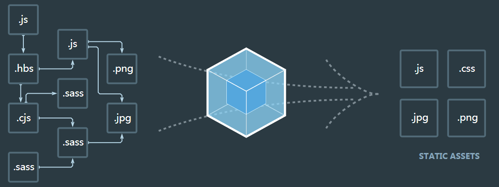

# 前端工程化

**前端为什么要进行打包构建**

- 体积更小（tree-shaking、压缩、合并），加载更快
- 编译高级语言或语法（TS、ES5+、模块化、scss）
- 兼容性和错误提示（polyfill、postcss、eslint）
- 统一高效的开发环境
- 统一的构建流程和产出标准
- 集成公司构建规范（提测、上线等）

## 一、Webpack

### 基础:star:

#### 概念

##### 什么是webpack

本质上，*webpack* 是一个现代 JavaScript 应用程序的**静态模块打包器(module bundler)**。它做的事情是，分析你的项目结构，找到JavaScript模块以及其它的一些浏览器不能直接运行的拓展语言（Scss，TypeScript等），并将其转换和打包为合适的格式供浏览器使用。

webpack可以将工程中的静态资源根据我们声明的依赖关系，打包出最后的正常运行的输出文件。官网显示的这幅图很形象地描述了这个过程：



在webpack中，所有的静态资源都可以被处理为一个模块，包括js、图片、css、字体。

##### 模块化的好处

- 更轻松地拆分代码逻辑，对于大型工程尤其重要
- 更容易地去管理变量，模块会自动生成一个局部变量环境，减少全局变量的污染
- 显式地声明依赖关系，想想之前在head中引入很多script标签，由于script顺序错误而引起的bug

##### Webpack和Grunt以及Gulp相比有什么特性

其实Webpack和另外两个并没有太多的可比性，Gulp/Grunt是一种能够优化前端的开发流程的工具，而WebPack是一种模块化的解决方案，不过Webpack的优点使得Webpack在很多场景下可以替代Gulp/Grunt类的工具。

**Grunt和Gulp的工作方式是：在一个配置文件中，指明对某些文件进行类似编译，组合，压缩等任务的具体步骤，工具之后可以自动替你完成这些任务**。

#### 入口(entry)

入口是指依赖关系图的开始，从入口开始寻找依赖，打包构建。

webpack 允许一个或多个入口配置。

- 工程的入口文件配置，在这里的js文件以及在里面被引用的文件会被webpack找到打包。

- 进入入口起点后，webpack 会找出有哪些模块和库是入口起点（直接和间接）依赖的。

- 每个依赖项随即被处理，最后输出到称之为 *bundles* 的文件中。默认值为 `./src`。

配置写法有三种：

- 对象，可配置多入口，可配置chunk名，灵活可扩展，最常用,一个属性就是一个entry chunk

```JavaScript
module.exports = {
  entry: {
    app: './src/app.js',        //应用程序(app)入口
    vendors: './src/vendors.js' //第三方库(vendor)入口
  }
};
```

- 字符串, 最简单直接方式，单入口，chunk名默认为main

```javascript
module.exports = {
  entry: './path/to/my/entry/file.js'
};
// 是下面的简写
const config = {
  entry: {
    main: './path/to/my/entry/file.js'
  }
};
```

- 数组, 多入口，将多个入口文件打包为一个chunk，chunk名默认为main

```
module.exports = {
  entry: ['./path/to/my/entry/file.js', './path/to/my/entry/file1.js']
};
```

入口一般用对象写法即可，其他两种写法的可忽略。

##### 多页面应用程序

```javascript
//webpack.config.js
const config = {
  entry: {
    pageOne: './src/pageOne/index.js',
    pageTwo: './src/pageTwo/index.js',
    pageThree: './src/pageThree/index.js'
  }
};
```

#### 输出(output)

打包的输出的文件配置，告诉 webpack 在哪里输出它所创建的 *bundles*，以及如何命名这些文件，默认值为 `./dist`。

Output用于配置打包输出的文件，包括输出文件的文件名、输出路径、静态资源地址，这里列出最常用的4种：

```javascript
module.exports = {
  entry: {
    app: './src/app.js',
    search: './src/search.js'
  },
  output: {
    filename: 'js/[name].js',
    chunkFilename: 'js/[name].js',
    path: __dirname + '/dist',  //必须是绝对地址
    publicPath: 'http://cdn.example.com/assets/[hash]/'
  }
};
```

#### 加载器(loader)

Loader可以理解为不同类型模块的处理器，**将这些不同类型的模块处理为浏览器可运行和识别的代码，用于加载某些资源文件**。

因为 webpack 只能理解 JavaScript 和 JSON 文件，对于其他资源例如 css，图片，或者其他的语法集，比如 jsx， coffee，是没有办法加载的。 这就需要对应的loader将资源转化，加载进来。从字面意思也能看出，loader是用于加载的，它作用于一个个文件上。

比如babel-loader将es6以上代码转换为es5代码；sass-loader将sass代码解析为css代码；url-loader和file-loader可以将图片、字体等静态文件解析为base64码或者静态文件地址。Loaders给我们提供了处理模块的入口，在里面可以使用全部的js功能，从而使webpack具有了强大而灵活的能力。

> 注意，loader 能够 `import` *导入任何类型的模块（例如* `.css` 文件），这是 webpack 特有的功能，其他打包程序或任务执行器的可能并不支持。我们认为这种语言扩展是有很必要的，因为这可以使开发人员创建出更准确的依赖关系图。

1. `test` 属性，用于标识出应该被对应的 loader 进行转换的某个或某些文件。

2. `use` 属性，表示进行转换时，应该使用哪个 loader。

   loader配置：

```javascript
module: {
    rules: [
          //js Loaders
        {
             test: /\.js$/,
             exclude: /(node_modules|bower_components)/,
             use: 'babel-loader'
        },
          //css Loaders
        {
            test: /\.sass$/,
            use: [ 'style-loader', 'css-loader', 'postcss-loader', 'sass-loader' ]
        }
    ]
}
```

#### 插件(plugins)

- plugin 用于**扩展webpack的功能**。它直接作用于 webpack，扩展了它的功能。

- 当然loader也是变相的扩展了 webpack ，但是它只专注于转化文件（transform）这一个领域。

- 而plugin的功能更加的丰富，而不仅局限于资源的加载。**比如代码分割、静态资源处理、环境变量的注入、将所有css的module抽取为单个文件等。**

- webpack自身也是用插件系统构建起来的。**插件的目的是做任何loaders做不了的事情。**

- 插件的范围包括，从打包优化和压缩，一直到重新定义环境中的变量。

- `webpack`基于发布订阅模式，在运行的生命周期中会广播出许多事件，插件通过监听这些事件，就可以在特定的阶段执行自己的插件任务，从而实现自己想要的功能

想要使用一个插件，你只需要 `require()` 它，然后把它添加到 `plugins` 数组中。多数插件可以通过选项(option)自定义。

你也可以在一个配置文件中因为不同目的而多次使用同一个插件，这时需要通过使用 `new` 操作符来创建它的一个实例。

plugins配置：

```javascript
//webpack.config.js
const HtmlWebpackPlugin = require('html-webpack-plugin'); // 通过 npm 安装
const webpack = require('webpack'); // 用于访问内置插件

const config = {
  module: {
    rules: [
      { test: /\.txt$/, use: 'raw-loader' }
    ]
  },
  plugins: [
    new HtmlWebpackPlugin({template: './src/index.html'})
  ]
};

module.exports = config;
```

#### 模式(mode)

通过选择 `none` 、`development` 或 `production` 之中的一个，来设置 `mode` 参数，你可以启用相应模式下的 webpack 内置的优化

```javascript
module.exports = {
  mode: 'production'
};
```


#### 解析（resolve）

resolve 用于设置模块如何解析，常用配置如下：

- alias：配置别名，简化模块引入；
- extensions：在引入模块时可不带后缀；
- symlinks：用于配置 npm link 是否生效，禁用可提升编译速度。

```js
module.exports = {
    resolve: {
        extensions: ['.js', '.jsx', '.ts', '.tsx', '.json', '.d.ts'],
        alias: {
          '@': paths.appSrc,
        },
        symlinks: false,
      }
}
```


#### 优化（optimization）

optimization 用于自定义 webpack 的内置优化配置，一般用于生产模式提升性能，常用配置项如下：

- minimize：是否需要压缩 bundle；
- minimizer：配置压缩工具，如 TerserPlugin、OptimizeCSSAssetsPlugin；
- splitChunks：拆分 bundle；
- runtimeChunk：是否需要将所有生成 chunk 之间共享的运行时文件拆分出来。

```js
module.exports = {
  optimization: {
    minimizer: [
      // 在 webpack@5 中，你可以使用 `...` 语法来扩展现有的 minimizer（即 `terser-webpack-plugin`），将下一行取消注释
      // `...`,
      new CssMinimizerPlugin(),
    ],
    splitChunks: {
      // include all types of chunks
      chunks: 'all',
      // 重复打包问题
      cacheGroups:{
        vendors:{ //node_modules里的代码
          test: /[\\/]node_modules[\\/]/,
          chunks: "all",
          name: 'vendors', //chunks name
          priority: 10, //优先级
          enforce: true 
        }
      }
    },
  },
}
```

### 实践:star:

[一个完整的webpack配置文件](https://github.com/csmSimona/webpacktest/blob/master/webpack.config.js)

[学习 Webpack5 之路（实践篇）](https://juejin.cn/post/6991774994552324133)

#### 基本配置

##### 拆分配置和merge

使用 webpack-merge 合并通用配置和特定环境配置

```bash
npm i webpack-merge -D
```

通用环境配置

```js
// webpack.common.js
module.exports = {} // 暂不添加配置
```

开发环境配置

```js
// webpack.dev.js
const { merge } = require('webpack-merge')
const common = require('./webpack.common')

module.exports = merge(common, {}) // 暂不添加配置
```

生产环境配置

```js
// webpack.prod.js
const { merge } = require('webpack-merge')
const common = require('./webpack.common')

module.exports = merge(common, {}) // 暂不添加配置
```

##### 启动本地服务

```js
devServer: {
    port: 8080,
    progress: true,  // 显示打包的进度条
    contentBase: distPath,  // 根目录（本地服务器所加载的页面所在的目录）
    open: true,  // 自动打开浏览器
    compress: true,  // 启动 gzip 压缩

    // 设置代理
    proxy: {
        // 将本地 /api/xxx 代理到 localhost:3000/api/xxx
        '/api': 'http://localhost:3000',

        // 将本地 /api2/xxx 代理到 localhost:3000/xxx
        '/api2': {
            target: 'http://localhost:3000',
            pathRewrite: {
                '/api2': ''
            }
        }
    }
}
```

##### 处理ES6

babel-loader

```js
modlue: {
    rules: [
        // js Loaders
        {
             test: /\.js$/,
             exclude: /(node_modules|bower_components)/,
             use: 'babel-loader'
        },
    ]
}
```

##### 处理样式

loader执行顺序：从后往前

sass-loader -> postcss-loader -> css-loader -> style-loader

- sass-loader：用于将sass翻译成浏览器可识别的css
- postcss-loader：浏览器兼容css
- css-loader：处理 `import / require（） @import / url` 引入的内容
- style-loader：用于将 CSS 插入到 DOM 中，通过使用多个 `<style></style>` 自动把 styles 插入到 DOM 中


> [PostCSS](https://link.juejin.cn/?target=https%3A%2F%2Fgithub.com%2Fpostcss%2Fpostcss) 是一个用 JavaScript 工具和插件转换 CSS 代码的工具。
>
> - 可以自动为 CSS 规则添加前缀；
> - 将最新的 CSS 语法转换成大多数浏览器都能理解的语法；
> - css-modules 解决全局命名冲突问题。

```js
modlue: {
    rules: [
      	// css Loaders
        {
            test: /\.sass$/,
            use: [ 'style-loader', 'css-loader', 'postcss-loader', 'sass-loader' ]
        }
    ]
}
```

##### 处理图片

- 生产模式

  ```js
  module: {
      rules: [
          // 图片 - 考虑 base64 编码的情况
          {
              test: /\.(png|jpg|jpeg|gif)$/,
              use: {
                  loader: 'url-loader',
                  options: {
                      name:'[name]_[hash].[ext]',
                      // 小于 5kb 的图片用 base64 格式产出
                      // 否则，依然延用 file-loader 的形式，产出 url 格式
                      limit: 5 * 1024,
                      outputPath:'image/'		//打包图片的位置
                      
                      // 设置图片的 cdn 地址（也可以统一在外面的 output 中设置，那将作用于所有静态资源）
                      // publicPath: 'http://cdn.abc.com'
                  }
              }
          },
      ]
  },
  ```

- 开发模式

  ```js
  module: {
      rules: [
          // 直接引入图片 url
          {
              test: /\.(png|jpg|jpeg|gif)$/,	//打包以png|jpg|jpeg|gif结尾的所有图片文件
              use:{
                  loader:'file-loader',
                  options: {
                      name:'[name]_[hash].[ext]',//保持原图片的名字+hash值和后缀,主要单引号
                      outputPath:'image/'//打包图片的位置
                  }
              }
          }
      ]
  },
  ```

在 webpack 5 中，可以使用内置的 [Asset Modules](https://link.juejin.cn/?target=https%3A%2F%2Fwebpack.docschina.org%2Fguides%2Fasset-modules%2F)，将 images 图像混入我们的系统中。

在 webpack 5 之前，通常使用：

- [`raw-loader`](https://v4.webpack.js.org/loaders/raw-loader/) 将文件导入为字符串
- [`url-loader`](https://v4.webpack.js.org/loaders/url-loader/) 将文件作为 data URI 内联到 bundle 中
- [`file-loader`](https://v4.webpack.js.org/loaders/file-loader/) 将文件发送到输出目录

资源模块类型(asset module type)，通过添加 4 种新的模块类型，来替换所有这些 loader：

- `asset/resource` 发送一个单独的文件并导出 URL。之前通过使用 `file-loader` 实现。
- `asset/inline` 导出一个资源的 data URI。之前通过使用 `url-loader` 实现。
- `asset/source` 导出资源的源代码。之前通过使用 `raw-loader` 实现。
- `asset` 在导出一个 data URI 和发送一个单独的文件之间自动选择。之前通过使用 `url-loader`，并且配置资源体积限制实现。

```js
const paths = require('./paths');
module.exports = {
    module: {
        rules: [
          {
            test: /\.(png|svg|jpg|jpeg|gif)$/i,
            include: paths.appSrc,
            type: 'asset/resource',
          },
        ],
      },
}
```


##### Source Map

`sourceMap`是一项**将编译、打包、压缩后的代码映射回源代码的技术**，由于打包压缩后的代码并没有阅读性可言，一旦在开发中报错或者遇到问题，直接在混淆代码中`debug`问题会带来非常糟糕的体验，`sourceMap`**可以帮助我们快速定位到源代码的位置，提高我们的开发效率**。`sourceMap`其实并不是`Webpack`特有的功能，而是`Webpack`支持`sourceMap`，像`JQuery`也支持`souceMap`。

**配置：**

```js
module.exports =  merge(common, {
  // 开发工具，开启 source map，编译调试
  devtool: 'eval-cheap-module-source-map',
})
```

source map 有许多 [可用选项](https://webpack.docschina.org/configuration/devtool/)。本例选择的是 `eval-cheap-module-source-map`

> 注：为加快生产环境打包速度，不为生产环境配置 devtool。

既然是一种源码的映射，那必然就需要有一份映射的文件，来标记混淆代码里对应的源码的位置，通常这份映射文件以`.map`结尾，里边的数据结构大概长这样：

```js
{
  "version" : 3,                          // Source Map版本
  "file": "out.js",                       // 输出文件（可选）
  "sourceRoot": "",                       // 源文件根目录（可选）
  "sources": ["foo.js", "bar.js"],        // 源文件列表
  "sourcesContent": [null, null],         // 源内容列表（可选，和源文件列表顺序一致）
  "names": ["src", "maps", "are", "fun"], // mappings使用的符号名称列表
  "mappings": "A,AAAB;;ABCDE;"            // 带有编码映射数据的字符串
}
```

其中`mappings`数据有如下规则：

- 生成文件中的一行的每个组用“;”分隔；
- 每一段用“,”分隔；
- 每个段由1、4或5个可变长度字段组成；

有了这份映射文件，我们只需要在我们的压缩代码的最末端加上这句注释，即可让sourceMap生效：

```js
//# sourceURL=/path/to/file.js.map
```

有了这段注释后，浏览器就会通过`sourceURL`去获取这份映射文件，通过解释器解析后，实现源码和混淆代码之间的映射。因此sourceMap其实也是一项需要浏览器支持的技术。

如果我们仔细查看webpack打包出来的bundle文件，就可以发现在默认的`development`开发模式下，每个`_webpack_modules__`文件模块的代码最末端，都会加上`//# sourceURL=webpack://file-path?`，从而实现对sourceMap的支持。


##### HtmlWebpackPlugin

`npx webpack --config config/webpack.prod.js` 后仅生成了 bundle.js，我们还需要一个 HTML5 文件，用来动态引入打包生成的 bundle 文件。

引入 `HtmlWebpackPlugin` 插件，生成一个 HTML5 文件， 其中包括使用 `script` 标签的 body 中的所有 webpack 包。

```bash
npm install --save-dev html-webpack-plugin
```

配置
```js
module.exports = {
  plugins: [
    // 生成html，自动引入所有bundle
    new HtmlWebpackPlugin({
      title: 'index.html',
    }),
  ],
}
```

##### 执行命令

优化 webpack 的实时编译、打包编译指令。

通过 cross-env 配置环境变量，区分开发环境和生产环境。

安装：

```bash
npm install --save-dev cross-env
```

修改 package.json：

```javascript
{
    "scripts": {
        "dev": "cross-env NODE_ENV=development webpack serve --open --config config/webpack.dev.js",
        "build": "cross-env NODE_ENV=production webpack --config config/webpack.prod.js"
      },
}
```

现在可以运行 webpack 指令：

- npm run dev：本地构建；
- npm run build：生产打包。


#### 高级配置

##### 多入口

```js
    entry: {
        index: path.join(srcPath, 'index.js'),
        other: path.join(srcPath, 'other.js')
    },
	output: {
        // filename: 'bundle.[contentHash:8].js',  // 打包代码时，加上 hash 戳
        filename: '[name].[contentHash:8].js', // name 即多入口时 entry 的 key
        path: distPath,
        // publicPath: 'http://cdn.abc.com'  // 修改所有静态文件 url 的前缀（如 cdn 域名），这里暂时用不到
    },
    plugins: [
        // new HtmlWebpackPlugin({
        //     template: path.join(srcPath, 'index.html'),
        //     filename: 'index.html'
        // })

        // 多入口 - 生成 index.html
        new HtmlWebpackPlugin({
            template: path.join(srcPath, 'index.html'),
            filename: 'index.html',
            // chunks 表示该页面要引用哪些 chunk （即上面的 index 和 other），默认全部引用
            chunks: ['index', 'vendor', 'common']  // 要考虑代码分割
        }),
        // 多入口 - 生成 other.html
        new HtmlWebpackPlugin({
            template: path.join(srcPath, 'other.html'),
            filename: 'other.html',
            chunks: ['other']  // 只引用 other.js
        })
    ]
```


##### 懒加载

在一个js中异步加载的js，构建打包后生成另外的js

```js
// 引用动态数据 - 懒加载
setTimeout(() => {
    // 回顾vue react异步组件
    // 定义一个chunk
    import('./dynamic-data.js').then(res => {
        console.log(res.default.message);   // 注意这里的default
    })
}, 1500)
```

##### 处理JSX

配置.babellrc，babel解析

```
{
    "presets": ["@babel/preset-react"],
    "plugins": []
}
```

##### 处理Vue

```js
rules: [
    {
        test: /\.vue$/,
        loader: ['vue-loader'],
        include: srcPath
    },
]
```


##### module、chunk、bundle的区别

- module：各个源码文件，webpack中一切皆模块
- chunk：多模块合并成的，如`entry`、`import()`、`splitChunk`
- bundle：最终的输出文件


##### 热更新

[热更新](https://webpack.docschina.org/guides/hot-module-replacement/) 指的是，在开发过程中，修改代码后，仅更新修改部分的内容，无需刷新整个页面。

使用 webpack 内置的 HMR 插件，更新 webpack-dev-server 配置。

```js
// webpack.dev.js
module.export = {
    devServer: {
        contentBase: './dist',
        hot: true, // 热更新
      },
}
```


- 自动刷新：整个网页全部刷新，速度较慢，状态会丢失
- 热更新：新代码生效，网页不刷新，状态不丢失，但是成本更高

```js
    const HotModuleReplacementPlugin = require('webpack/lib/HotModuleReplacementPlugin');

    entry: {
        // index: path.join(srcPath, 'index.js'),
        index: [
            'webpack-dev-server/client?http://localhost:8080/',
            'webpack/hot/dev-server',
            path.join(srcPath, 'index.js')
        ],
        other: path.join(srcPath, 'other.js')
    },
    plugins: [
        new webpack.DefinePlugin({
            // window.ENV = 'production'
            ENV: JSON.stringify('development')
        }),
        new HotModuleReplacementPlugin()
    ],
	devserver: {
        hot: true
    }
```

```js
// index.js
// 增加，开启热更新之后的代码逻辑
if (module.hot) {
    module.hot.accept(['./math'], () => {
        const sumRes = sum(10, 20)
        console.log('sumRes in hot', sumRes)
    })
}
```


### 优化

[学习 Webpack5 之路（优化篇）](https://juejin.cn/post/6996816316875161637?searchId=202409161748330E857FD24E94D6369813)

#### 优化效率工具

安装以下 webpack 插件，帮助我们分析优化效率：

- [progress-bar-webpack-plugin](https://link.juejin.cn?target=https%3A%2F%2Fwww.npmjs.com%2Fpackage%2Fprogress-bar-webpack-plugin)：查看编译进度；
- [speed-measure-webpack-plugin](https://link.juejin.cn?target=https%3A%2F%2Fwww.npmjs.com%2Fpackage%2Fspeed-measure-webpack-plugin)：查看编译速度；
- [webpack-bundle-analyzer](https://link.juejin.cn?target=https%3A%2F%2Fwww.npmjs.com%2Fpackage%2Fwebpack-bundle-analyzer)：打包体积分析。


#### 加快构建速度

##### cache缓存

Webpack 5 引入了持久化缓存机制，通过 `cache: { type: 'filesystem' }` 来缓存生成的模块和编译信息，大幅提升二次构建速度、打包速度，当构建突然中断，二次进行构建时，可以直接从缓存中拉取，可提速 **90%** 左右。

```js
module.exports = {
    cache: {
      type: 'filesystem', // 使用文件缓存
    },
}
```


##### 优化babel-loader

```js
{
    test: /\.js$/,
  	loader: ['babel-loader?cacheDirectory'],	// 开启缓存
    include: path.resolve(__dirname, 'src'),	// 明确范围
    // 排除范围，include和exclude两者选一个即可
    // exclude: path.resolve(__dirname, 'node_modules')
}
```


##### IgnorePlugin 避免引用无用模块（直接不引入，代码中没有）

以moment.js为例，忽略语言包

```js
// 忽略 moment 下的 /locale 目录
new webpack.IgnorePlugin(/\.\/locale/, /moment/),
```


##### noParse避免重复打包（引入，但不打包）

```js
module.exports = {
    module: {
        // 独完整的 react.min.js 文件就没有采用模块化
        // 忽略对 react.min.js 文件的递归解析处理
        noParse: [/react\.min\.js$/]
    }
}
```


##### thread-loader 多线程

通过 [thread-loader](https://webpack.docschina.org/loaders/thread-loader/#root) 将耗时的 loader 放在一个独立的 worker 池中运行，加快 loader 构建速度。

```bash
npm i -D thread-loader
```

我们应该仅在非常耗时的 loader 前引入 thread-loader（例如sass-loader）

```js
module.exports = {
    rules: [
        {
        test: /\.module\.(scss|sass)$/,
        include: paths.appSrc,
        use: [
          'style-loader',
          {
            loader: 'css-loader',
            options: {
              modules: true,
              importLoaders: 2,
            },
          },
          {
            loader: 'postcss-loader',
            options: {
              postcssOptions: {
                plugins: [
                  [
                    'postcss-preset-env',
                  ],
                ],
              },
            },
          },
          {
            loader: 'thread-loader',
            options: {
              workerParallelJobs: 2 // 一个 worker 进程中并行执行工作的数量
            }
          },
          'sass-loader',
        ].filter(Boolean),
      },
    ]
}
```


##### 自动刷新

```js
    watch: true, // 开启监听，默认为 false
    watchOptions: {
        ignored: /node_modules/, // 忽略哪些
        // 监听到变化发生后会等300ms再去执行动作，防止文件更新太快导致重新编译频率太高
        // 默认为 300ms
        aggregateTimeout: 300,
        // 判断文件是否发生变化是通过不停的去询问系统指定文件有没有变化实现的
        // 默认每隔1000毫秒询问一次
        poll: 1000
    }
```


##### 总结

用于生产环境

- 优化babel-loader
- IgnorePlugin
- noParse
- thread-loader

开发环境

- cache缓存
- 自动刷新


#### 减小打包体积:star:

##### 1.代码压缩

- 在 webpack 可以使用如下插件进行压缩：

  - JavaScript：`TerserWebpackPlugin`
  - CSS ：`CssMinimizerPlugin`
  - HTML：`HtmlWebpackPlugin`

- 使用 `gzip` 压缩

  - html、js、css资源，使用 gzip 后通常可以将体积压缩70%以上

  - 使用 webpack 进行 gzip 压缩的方式，使用 `compression-webpack-plugin` 插件

- 使用`Brotli`压缩


**JS压缩（TerserWebpackPlugin）**

使用 [TerserWebpackPlugin](https://webpack.docschina.org/plugins/terser-webpack-plugin) 来压缩 JavaScript。

webpack5 自带最新的 `terser-webpack-plugin`，无需手动安装。

`terser-webpack-plugin` 默认开启了 `parallel: true` 配置，并发运行的默认数量： `os.cpus().length - 1` ，本文配置的 parallel 数量为 4，使用多进程并发运行压缩以提高构建速度。

```js
const TerserPlugin = require('terser-webpack-plugin');
module.exports = {
    optimization: {
        minimizer: [
            new TerserPlugin({
              parallel: 4,
              terserOptions: {
                parse: {
                  ecma: 8,
                },
                compress: {
                  ecma: 5,
                  warnings: false,
                  comparisons: false,
                  inline: 2,
                },
                mangle: {
                  safari10: true,
                },
                output: {
                  ecma: 5,
                  comments: false,
                  ascii_only: true,
                },
              },
            }),
        ]
    }
}
```


**css压缩（CssMinimizerWebpackPlugin）**

使用 [CssMinimizerWebpackPlugin](https://webpack.docschina.org/plugins/css-minimizer-webpack-plugin/#root) 压缩 CSS 文件。

`CssMinimizerWebpackPlugin` 将在 Webpack 构建期间搜索 CSS 文件，优化、压缩 CSS。

```bash
npm install -D css-minimizer-webpack-plugin
```

```js
const CssMinimizerPlugin = require("css-minimizer-webpack-plugin");

module.exports = {
  optimization: {
    minimizer: [
      new CssMinimizerPlugin({
          parallel: 4,
        }),
    ],
  }
}
```

这将仅在生产环境开启 CSS 优化。

如果还想在开发环境下启用 CSS 优化，请将 `optimization.minimize` 设置为 `true`


##### 2.使用 `url-loader` 将图片转 base64

```js
// 安装
npm install url-loader --save-dev
    
// 配置
module.exports = {
  module: {
    rules: [{
        test: /.(png|jpg|gif)$/i,
        use: [{
            loader: 'url-loader',
            options: {
              // 小于 10kb 的图片转化为 base64
              limit: 1024 * 10
            }
        }]
     }]
  }
};
```

##### 3.使用`image-webpack-loader`插件进行图片压缩

##### 4.使用Tree Shaking 移除未使用的代码

Webpack 中的 Tree Shaking 是一种优化技术，用于消除未使用的代码，从而减小程序包的大小。

Tree Shaking 的主要目的是通过静态分析来识别和去除那些不会被执行的代码，从而提高应用的加载速度和性能。

通过 `mode: 'production'` 或配置 `optimization.usedExports: true`，自动删除未使用的代码，减少打包体积。

##### 5.使用 [purgecss-webpack-plugin](https://github.com/FullHuman/purgecss/tree/main/packages/purgecss-webpack-plugin) 对 CSS Tree Shaking

```bash
npm i purgecss-webpack-plugin -D
```

因为打包时 CSS 默认放在 JS 文件内，因此要结合 webpack 分离 CSS 文件插件 `mini-css-extract-plugin` 一起使用，先将 CSS 文件分离，再进行 CSS Tree Shaking。

```js
// webpack.prod.js
const glob = require('glob')
const MiniCssExtractPlugin = require('mini-css-extract-plugin')
const PurgeCSSPlugin = require('purgecss-webpack-plugin')
const paths = require('paths')

module.exports = {
  plugins: [
    // 打包体积分析
    new BundleAnalyzerPlugin(),
    // 提取 CSS
    new MiniCssExtractPlugin({
      filename: "[name].css",
    }),
    // CSS Tree Shaking
    new PurgeCSSPlugin({
      paths: glob.sync(`${paths.appSrc}/**/*`,  { nodir: true }),
    }),
  ]
}
```


##### 6.抽离公共代码（splitChunks）

**将基础库代码单独拆包打包合并**

为了更好利用缓存，我们一般会把不容易变化的部分单独抽取出来。例如一个 React 技术栈的项目，可能会将 React、Redux、React-Router 这类基础库单独打包出一个文件。

这样做的优点在于，由于基础库被单独打包在一起了，即使业务代码经常变动，也不会导致整个缓存失效。基础框架/库、项目中的 common、util 仍然可以利用缓存，不会每次发布新版都会让用户花费不必要的带宽重新下载基础库。

可以通过 `optimization.splitChunks`来分离一些公共库。

webpack 将根据以下条件自动拆分 chunks：

- 新的 chunk 可以被共享，或者模块来自于 `node_modules` 文件夹；
- 新的 chunk 体积大于 20kb（在进行 min+gz 之前的体积）；
- 当按需加载 chunks 时，并行请求的最大数量小于或等于 30；
- 当加载初始化页面时，并发请求的最大数量小于或等于 30； 通过 splitChunks 把 react 等公共库抽离出来，不重复引入占用体积。

```JavaScript
// webpack.config.js
module.exports = {
    //...
    optimization: {
        // 分割代码块
        splitChunks: {
            /**
             * initial 入口 chunk，对于异步导入的文件不处理
                async 异步 chunk，只对异步导入的文件处理
                all 全部 chunk
             */
            chunks: 'all',
            // 缓存分组
            cacheGroups: {
                // 第三方模块
                vendor: {
                    name: 'vendor', // chunk 名称
                    priority: 1, // 权限更高，优先抽离，重要！！！
                    test: /node_modules/,
                    minSize: 0,  // 大小限制
                    minChunks: 1  // 最少复用过几次
                },
                // 公共的模块
                common: {
                    name: 'common', // chunk 名称
                    priority: 0, // 优先级
                    minSize: 0,  // 公共模块的大小限制
                    minChunks: 2  // 公共模块最少复用过几次
                }
            }
        }
    }
}
```


##### 7.抽离CSS文件（MiniCssExtractPlugin）

[MiniCssExtractPlugin](https://webpack.docschina.org/plugins/mini-css-extract-plugin/) 插件将 CSS 提取到单独的文件中，为每个包含 CSS 的 JS 文件创建一个 CSS 文件，并且支持 CSS 和 SourceMaps 的按需加载。

```bash
npm install -D mini-css-extract-plugin
```

配置：

```js
const MiniCssExtractPlugin = require("mini-css-extract-plugin");

module.exports = {
  plugins: [new MiniCssExtractPlugin()],
  module: {
    rules: [
        {
        test: /\.module\.(scss|sass)$/,
        include: paths.appSrc,
        use: [
          'style-loader',
          isEnvProduction && MiniCssExtractPlugin.loader, // 仅生产环境
          {
            loader: 'css-loader',
            options: {
              modules: true,
              importLoaders: 2,
            },
          },
          {
            loader: 'postcss-loader',
            options: {
              postcssOptions: {
                plugins: [
                  [
                    'postcss-preset-env',
                  ],
                ],
              },
            },
          },
          {
            loader: 'thread-loader',
            options: {
              workerParallelJobs: 2
            }
          },
          'sass-loader',
        ].filter(Boolean),
      },
    ]
  },
};
```

> 注意：MiniCssExtractPlugin.loader 要放在 style-loader 后面。


##### 8.最小化 entry chunk

通过配置 `optimization.runtimeChunk = true`，为运行时代码创建一个额外的 chunk，减少 entry chunk 体积，提高性能。

`webpack.prod.js` 配置方式如下：

```javascript
module.exports = {
    optimization: {
        runtimeChunk: true,
      },
    };
}
```


##### 9.给打包出来的文件名添加哈希，实现浏览器缓存文件

通过 Webpack 的 `[contenthash]` 配置为输出文件名生成唯一的哈希值，确保文件内容变化时，浏览器能够重新获取新文件。

```js
output: {
  filename: '[name].[contenthash].js',
  path: path.resolve(__dirname, 'dist'),
}
```

##### 

##### 10.使用CDN加速

1、publicPath配置cdn网址 `publicPath: 'http://cdn.abc.com'  // 修改所有静态文件 url 的前缀（如 cdn 域名）`

2、将打包资源CSS、JS等上传到cdn


### Webpack构建流程概述:star:

1、读取`webpack`的配置参数；

2、启动`webpack`，创建`Compiler`对象并开始解析项目；

3、从入口文件（`entry`）开始解析，并且找到其导入的依赖模块（`module`），递归遍历分析，形成依赖关系树；

4、对不同文件类型的依赖模块文件使用对应的`Loader`进行编译，最终转为`Javascript`文件；

5、整个过程中`webpack`会通过发布订阅模式，向外抛出一些`hooks`，而`webpack`的插件（`plugins`）即可通过监听这些关键的事件节点，执行插件任务进而达到干预输出结果的目的。

6、Webpack 将编译后的模块输出为最终的捆绑文件（bundle），将编译后的代码写入到指定的输出路径。如果配置了源映射（Source Maps），Webpack 会生成源映射文件，帮助调试。

7、构建完成后，Webpack 会输出一些统计信息，如构建时间、文件大小等。


### Webpack中, 如何实现按需加载？

在 Webpack 中实现按需加载（代码分割/懒加载）的核心思路是 **将代码拆分为独立 chunk，在需要时动态加载**。

**一、基础方法：动态导入（Dynamic Import）** 

通过 `import()` 语法实现按需加载，Webpack 会自动将其拆分为独立 chunk。

**1. 代码中使用动态导入**

```javascript
// 示例：点击按钮后加载模块
document.getElementById('btn').addEventListener('click', async () => {
  const module = await import('./module.js')
  module.doSomething()
})
```

**2. 配置 Webpack** 

确保 `webpack.config.js` 的 `output` 配置中包含 `chunkFilename` ：

```javascript
module.exports = {
  output: {
    filename: '[name].bundle.js',
    chunkFilename: '[name].[contenthash].chunk.js', // 动态导入的 chunk 命名规则
    path: path.resolve(__dirname, 'dist'),
    publicPath: '/', // 确保 chunk 的公共路径正确
  },
}
```

**二、框架集成：React/Vue 路由级按需加载** 

结合前端框架的路由系统实现组件级懒加载。

**React 示例**

```javascript
import React, { Suspense, lazy } from 'react'
import { BrowserRouter as Router, Route, Switch } from 'react-router-dom'

const Home = lazy(() => import('./routes/Home'))
const About = lazy(() => import('./routes/About'))

function App() {
  return (
    <Router>
      <Suspense fallback={<div> Loading... </div>}>
        <Switch>
          <Route exact path="/" component={Home} />
          <Route
            path="/about"
            component={About}
          />
        </Switch>
      </Suspense>
    </Router>
  )
}
```

**Vue 示例**

```javascript
const routes = [
  {
    path: '/',
    component: () => import('./views/Home.vue'),
  },
  {
    path: '/about',
    component: () => import('./views/About.vue'),
  },
]
```

**三、优化配置：代码分割策略** 

通过 `SplitChunksPlugin` 优化公共代码提取。

**Webpack 配置**

```javascript
module.exports = {
  optimization: {
    splitChunks: {
      chunks: 'all', // 对所有模块进行分割（包括异步和非异步）
      cacheGroups: {
        vendors: {
          test: /[\\/]node_modules[\\/]/,
          name: 'vendors', // 提取 node_modules 代码为 vendors 块
          priority: 10, // 优先级
          reuseExistingChunk: true,
        },
        common: {
          minChunks: 2, // 被至少两个 chunk 引用的代码
          name: 'common',
          priority: 5,
          reuseExistingChunk: true,
        },
      },
    },
  },
}
```

**四、Babel 配置（如需支持旧浏览器）** 

安装 Babel 插件解析动态导入语法：

```bash
npm install @babel/plugin-syntax-dynamic-import --save-dev
```

在 `.babelrc` 或 `babel.config.json` 中添加插件：

```json
{
  "plugins": ["@babel/plugin-syntax-dynamic-import"]
}
```

**五、预加载与预取（可选优化）** 

通过注释提示浏览器提前加载资源（需结合框架使用）。

**React 示例**

```javascript
const About = lazy(
  () =>
    import(
      /* webpackPrefetch: true */ // 预取（空闲时加载）
      /* webpackPreload: true */ // 预加载（与父 chunk 并行加载）
      './routes/About'
    )
)
```

**六、验证效果**

1. **构建产物分析**：
   - 运行 `npx webpack --profile --json=stats.json` 生成构建报告。
   - 使用 [Webpack Bundle Analyzer](https://github.com/webpack-contrib/webpack-bundle-analyzer) 可视化分析 chunk 分布。
2. **网络请求验证**：
   - 打开浏览器开发者工具，观察触发动态导入时是否加载新 chunk。


## 二、Babel

### babel-polyfill

已过时

> 替代方案：`core-js` 和 `regenerator-runtime`

- 什么是polyfill ：补丁 兼容语法
- corejs和regenerator
- babel-polyfill是两者的集合
- babel7.4之后弃用babel-polyfill
- 推荐直接使用corejs和regenerator
- 问题：会污染全局环境

#### babel-polyfill 配置按需引入

```js
// .babelrc
"presets": [
        [
            "@babel/preset-env",
            {
                "useBuiltIns": "usage",
                "corejs": 3
            }
        ]
    ]
```

### babel-runtime

- 不会污染全局环境（会重新取变量名）

- 适用于开发第三方库


### babel和webpack的区别

- babel：js语法编译工具，被用来处理 `.js` 文件，并将它们转换为兼容的代码。
- webpack：打包构建工具，则负责整个打包过程，包括依赖解析、代码转换、优化和输出。


## 三、Vite:star:

Vite 是一个现代化的前端构建工具，由 Evan You（Vue.js 的作者）创建。

### 特点

1. **快速启动**：Vite 使用浏览器原生的 ES 模块导入机制来快速启动开发服务器，无需长时间的编译和打包过程。
2. **热模块替换（HMR）**：Vite 支持热模块替换，可以在开发过程中实时更新模块而不刷新整个页面，从而提供更快的反馈循环。
3. **增量构建**：Vite 在构建时只重新构建有变化的部分，而不是整个应用，这样可以大幅提高构建速度。
4. **插件系统**：类似于 Webpack，Vite 也有丰富的插件生态系统，支持多种语言和预处理器，如 TypeScript、Sass 等。
5. **生产优化**：Vite 在生产环境中提供代码分割、压缩、树摇（tree shaking）等优化手段，以生成体积更小、加载更快的构建产物。

### 工作原理:star:

1. **开发模式**：在开发模式下，Vite **利用浏览器的 ES 模块加载功能（`<script type="module">`）来即时加载模块**，不需要预先编译整个应用。这样可以实现几乎瞬时的启动速度。
2. **构建模式**：在构建模式下使用rollup，Vite 会对应用进行优化，包括代码分割、压缩、树摇等，生成适合生产环境的静态资源。


### vite为什么比webpack快:star:

[搞懂vite为什么比webpack快！运行原理、构建方式等有什么不同！](https://juejin.cn/post/7283682738497765413?searchId=202409171645329C70DB852CD241B7CC4A)

- 绝大多数现代浏览器都已经支持`ES module`了， 我们只需要在`<script>`标签中添加`type="module"`，就可以使用`ES module`了

- 在`<script type="module">`中，浏览器遇到内部的import引用时，会自动发起http请求，去加载对应的模块。

- vite也正是利用了`ES module`这个特性，**使用vite运行项目时，首先会用`esbuild`进行预构建，将所有模块转换为`es module`**，不需要对我们整个项目进行编译打包，而是**在浏览器需要加载某个模块时，拦截浏览器发出的请求，根据请求进行`按需编译`，然后返回给浏览器**。

- 这样一来，首次启动项目（冷启动）时，自然也就比webpack快很多了，并且项目大小对vite启动速度的影响也很小。

#### 构建方式

**webpack**

webpack是基于`nodejs`运行的，但`js`只能单线程运行，无法利用多核CPU的优势，当项目越来越大时，构建速度也就越来越慢了。

**vite**

vite`预构建`与`按需编译`的过程，都是使用`esbuild`完成的。

`esbuild`是用`go`语言编写的，可以充分利用多核CPU的优势，所以vite开发环境下的`预构建`与`按需编译`速度，都是非常快的。

#### http2

vite充分利用了http2可以并发请求的优势，这也是速度快的一个主要原因。

在之前http1的时候，浏览器对同一个域名的请求，是有并发限制的，一般为6个，如果并发请求6个以上，就会造成阻塞问题，所以在http1的时代，我们要减少打包产物的文件数量，减少并发请求，来提高项目的加载速度。

2015年以后，http2出现了，他可以并发发送多个请求，不会出现http1的并发限制。这时候，将打包产物分成多个小模块，并行去加载，反而会更快。

vite也充分利用了这一优势，对项目资源进行了合理的拆分，访问项目时，同时加载多个模块，来提升项目访问速度。

#### 热更新

模块热替换(hot module replacement - HMR)，该功能可以实现应用程序运行过程中，替换、添加或删除模块，而无需重新加载整个页面，也就是我们常说的`热更新`。

vite与webpack虽然都支持HMR,但两个工具的实现原理是不一样的。

**webpack**

webpack项目中，每次修改文件，都会**对整个项目重新进行打包**，这对大项目来说，是非常不友好的。

虽然webpack现在有了缓存机制，但还是无法从根本上解决这个问题。

**vite**

vite项目中，监听到文件变更后，会用`websocket`通知浏览器，重新发起新的请求，**只对该模块进行重新编译**，然后进行替换。

并且基于`es module`的特性，vite利用浏览器的缓存策略，针对源码模块（我们自己写的代码）做了`协商缓存`处理，针对依赖模块（第三方库）做了`强缓存`处理，这样我们项目的访问的速度也就更快了。

#### 生产环境

**vite生产环境下，为什么使用rollup打包呢？**

Rollup 是一款 `ES Module` 打包器， 从作用上来看，`Rollup` 与 `Webpack` 非常类似。不过相比于 `Webpack`，`Rollup`要小巧的多，打包生成的文件更小。 因为小巧，自然在这种特定的打包环境下，`Rollup`的打包速度也要比 `Webpack` 快很多。

vite正是基于`es module`的特性实现的，所以使用rollup要更合适一些。

**vite生产环境下，为什么不用esbuild打包呢？**

尽管esbuild的打包速度比rollup更快，但 Vite 目前的插件 API 与使用 esbuild 作为打包器并不兼容，rollup插件api与基础建设更加完善，所以在生产环境vite使用rollup打包会更稳定一些。

如果后面esbuild基础建设与生态更加完善后，esbuild还是更有优势的。

**所以使用vite可能会带来开发环境与生产环境打包结果不一致的问题。**


### webpack和vite的区别:star:

#### 区别总结

1. **启动速度**：
   - **Vite**：利用浏览器原生 ES 模块导入机制，启动速度非常快。
   - **Webpack**：需要先编译整个应用，启动速度相对较慢。
2. **热模块替换（HMR）**：
   - **Vite**：支持高效的 HMR，可以在开发过程中实时更新模块。
   - **Webpack**：也支持 HMR，但相对于 Vite 可能稍逊一筹。
3. **构建速度**：
   - **Vite**：利用增量构建技术，构建速度较快。
   - **Webpack**：构建速度较慢，尤其是在处理大型项目时。
4. **配置复杂性**：
   - **Vite**：配置相对简单，适合快速搭建项目。
   - **Webpack**：配置较为复杂，但提供了更多定制化的选项。
5. **插件系统**：
   - **Vite**：插件系统相对简单，但足够强大。
   - **Webpack**：插件系统更为强大，可以执行更复杂的构建任务。

#### 适用场景

- **Vite** 更适合用于构建追求快速开发体验的现代前端项目，特别是那些对启动速度和开发效率有较高要求的项目。
- **Webpack** 更适合用于构建大型、复杂的项目，特别是那些包含多种模块格式和资源的项目。


### webpack和Rollup的区别:star:

#### 区别总结

1. **模块支持**：
   - **Rollup** 主要针对 ES 模块，更适合处理纯 ES 模块的项目。
   - **Webpack** 支持多种模块格式，更适合处理混合模块格式的项目。
2. **Tree Shaking**：
   - **Rollup** 对 Tree Shaking 的支持更为彻底，能够更有效地移除未使用的代码。
   - **Webpack** 也支持 Tree Shaking，但可能不如 Rollup 那么彻底。
3. **构建速度**：
   - **Rollup** 的构建速度通常更快，特别是在处理较小的项目时。
   - **Webpack** 在处理大型项目时可能会稍慢一些，但提供了更多的优化选项。
4. **配置复杂性**：
   - **Rollup** 的配置相对简单，适合快速搭建项目。
   - **Webpack** 的配置更为复杂，但提供了更多定制化的选项。
5. **插件系统**：
   - **Rollup** 的插件系统相对简单，但足够强大。
   - **Webpack** 的插件系统更为强大，可以执行更复杂的构建任务。

#### 适用场景

- **Rollup** 更适合用于**构建纯 ES 模块的项目**，特别是那些对 Tree Shaking 和构建速度有较高要求的项目。
- **Webpack** 更适合用于**构建大型、复杂的项目**，特别是那些包含**多种模块格式和资源**的项目


### Vite如何集成TypeScript？如何配置？

在 Vite 项目中，虽然默认支持 TypeScript，但 Vite 本身不会阻止编译时出现 TypeScript 错误。为了更严格的类型检查和错误提示，我们需要配置 TypeScript。

- **添加 TypeScript 配置（如果没有）**

通过以下命令生成 `tsconfig.json` 配置文件

```plain
npx tsc --init
```

创建好 `tsconfig.json` 后，Vite 会根据该配置文件来编译 TypeScript。

- **强化 TypeScript 错误提示**

Vite 默认不会阻止编译时的 TypeScript 错误。如果我们想要在开发时严格检查 TypeScript 错误并阻止编译，可以使用 `vite-plugin-checker` 插件。

```javascript
npm i vite-plugin-checker --save-dev
```

然后在 `vite.config.ts` 中引入并配置该插件：

```typescript
// vite.config.ts
import checker from 'vite-plugin-checker'
import { defineConfig } from 'vite'

export default defineConfig({
  plugins: [checker({ typescript: true })],
})
```

这样，任何 TypeScript 语法错误都会在控制台显示，并阻止编译。

- **打包时进行 TypeScript 检查**

虽然 Vite 只会执行 `.ts` 文件的转译，而不会执行类型检查，但我们可以通过以下方式确保在打包时进行 TypeScript 类型检查。

修改 `package.json` 配置

```json
{
  "scripts": {
    "dev": "vite",
    "build": "tsc --noEmit && vite build"
  }
}
```

`tsc --noEmit` 会执行类型检查，但不会生成编译后的文件。如果存在类型错误，打包过程会被阻止。

- **TypeScript 智能提示**

Vite 默认为 `import.meta.env` 提供了类型定义，但是对于自定义的 `.env` 文件，TypeScript 的智能提示默认不生效。为了实现智能提示，可以在 `src` 目录下创建一个 `env.d.ts` 文件：

```typescript
/// <reference types="vite/client" />

interface ImportMetaEnv {
  readonly VITE_APP_TITLE: string
  readonly VITE_APP_HAHA: string
}

interface ImportMeta {
  readonly env: ImportMetaEnv
}
```

### 如何在Vite中配置代理？

在 Vite 中配置代理可以通过 `server.proxy` 选项来实现。

```js
// vite.config.js
import { defineConfig } from 'vite'

export default defineConfig({
  server: {
    proxy: {
      // 代理 /api 请求到目标服务器
      '/api': {
        target: 'http://localhost:5000', // 目标服务器地址
        changeOrigin: true, // 修改请求头中的 Origin 字段为目标服务器的 origin
        secure: false, // 是否允许 HTTPS 请求
        rewrite: (path) => path.replace(/^\/api/, ''), // 重写请求路径，将 /api 替换为空
      },

      // 代理某些静态资源请求
      '/assets': {
        target: 'http://cdn-server.com', // 目标是静态资源服务器
        changeOrigin: true,
        rewrite: (path) => path.replace(/^\/assets/, '/static'), // 将 /assets 路径重写为 /static
      },
    },
  },
})
```


### 简述Vite的依赖预加载机制

Vite 的依赖预构建机制通过在开发模式下提前处理常用依赖（如 Vue、React 等），将这些依赖转换为浏览器可以直接执行的格式。这避免了每次启动时重新编译这些依赖，显著提升了启动速度。预构建的依赖被缓存，并在后续启动时复用缓存，进一步加速了开发过程中的构建和启动时间。

具体来说，它的工作原理如下：

- **依赖识别和路径补全**： Vite 会首先识别项目中需要的依赖，并对非绝对路径或相对路径的引用进行路径补全。比如，`Vue` 的加载路径会变为 `node_modules/.vite/deps/Vue.js?v=1484ebe8`，这一路径显示了 Vite 在 `node_modules/.vite/deps` 文件夹下存放了经过预处理的依赖文件。
- **转换成 ES 模块**： 一些第三方包（特别是遵循 CommonJS 规范的包）在浏览器中无法直接使用。为了应对这种情况，Vite 会使用 **esbuild** 工具将这些依赖转换为符合 ES 模块规范的代码。转换后的代码会被存放在 `node_modules/.vite/deps` 文件夹下，这样浏览器就能直接识别并加载这些依赖。
- **统一集成 ES 模块**： Vite 会对每个包的不同模块进行统一集成，将各个分散的模块（如不同的 ES 函数或组件）合并成一个或几个文件。这不仅减少了浏览器发起多个请求的次数，还能够加快页面加载速度。


### 简述Vite插件开发流程

Vite 插件开发基于 Rollup 插件系统，因此其生命周期和钩子与 Rollup 插件非常相似。以下是开发流程和关键步骤：

**1、理解插件生命周期** 

Vite 插件有一系列生命周期钩子，每个钩子对应不同的功能需求，主要钩子包括：

- **config**：用于修改 Vite 配置，通常在构建或开发过程中使用。
- **configureServer**：用于修改开发服务器的行为，如自定义请求处理。
- **transform**：对文件内容进行转换，适用于文件类型转换或代码处理。
- **buildStart** 和 **buildEnd**：在构建过程开始和结束时触发，适用于日志记录或优化操作。

插件开发的核心是根据具体需求，在合适的生命周期钩子中实现业务逻辑。

**2、插件基本结构**

Vite 插件的基本结构如下：

```javascript
export default function myVitePlugin() {
  return {
    name: 'vite-plugin-example', // 插件名称
    config(config) {
      // 修改 Vite 配置
    },
    configureServer(server) {
      // 修改开发服务器行为
    },
    transform(src, id) {
      // 对文件内容进行转换
    },
  }
}
```

插件对象必须包含一个 `name` 属性，用于标识插件，还可以根据需求实现其他钩子。

**3、插件开发**

在插件开发过程中，根据需求实现不同的钩子逻辑。

例如，假设我们需要创建一个插件来处理自定义文件类型并将其转换为 JavaScript：

```javascript
const fileRegex = /\.(my-file-ext)$/

export default function transformFilePlugin() {
  return {
    name: 'vite-plugin-transform-file',
    transform(src, id) {
      if (fileRegex.test(id)) {
        return {
          code: compileFileToJS(src), // 将文件内容转换为 JavaScript
          map: null, // 可以返回 source map
        }
      }
    },
  }
}
```

- **transform**：此钩子对符合 `fileRegex` 正则表达式的文件（`.my-file-ext`）进行转换，并返回转换后的 JavaScript 代码。

**4、插件使用**

插件开发完成后，可以在 Vite 配置中使用：

```javascript
import transformFilePlugin from 'vite-plugin-transform-file'

export default {
  plugins: [transformFilePlugin()],
}
```

**5、发布插件**

开发完成后，插件可以通过 npm 发布，或者将其托管在 GitHub 上，方便团队或社区使用。


### Vite中可做的项目优化

#### 1、启用 Gzip/Brotli 压缩

使用 `vite-plugin-compression` 插件开启 Gzip 或 Brotli 压缩，可以有效减小传输的文件体积，提升加载速度。

安装依赖：

```shell
npm install vite-plugin-compression --save-dev 
```

配置示例：

```javascript
import compression from 'vite-plugin-compression'
export default defineConfig({
  plugins: [
    compression({
      algorithm: 'gzip', // 或 'brotli' 压缩
      threshold: 10240, // 文件大于 10KB 时启用压缩
    }),
  ],
})
```

> 参考博文：[vite打包优化vite-plugin-compression的使用](https://juejin.cn/post/7222901994840244279)

#### 2、代码分割

- 路由分割

使用动态导入实现按需加载，减小初始包的体积，提高页面加载速度。

```javascript
const module = import('./module.js') // 动态导入
```

或者在路由中使用懒加载：

```javascript
const MyComponent = () => import('./MyComponent.vue')
```

- 手动控制分包

在 Vite 中，你可以通过配置 Rollup 的 `manualChunks` 选项来手动控制如何分割代码。这个策略适用于想要将特定的依赖或模块提取成单独的 chunk 文件。

```javascript
import { defineConfig } from 'vite'
export default defineConfig({
  build: {
    minify: false,
    // 在这里配置打包时的rollup配置
    rollupOptions: {
      manualChunks: (id) => {
        if (id.includes('node_modules')) {
          return 'vendor'
        }
      },
    },
  },
})
```

> 参考博文：[Vite性能优化之分包策略](https://juejin.cn/post/7177982374259949624)

#### 3、图片优化

使用 `vite-plugin-imagemin` 插件对项目中的图片进行压缩，减少图片体积，提升加载速度。

```shell
npm install vite-plugin-imagemin --save-dev
```

```javascript
export default defineConfig({
  plugins: [
    ViteImagemin({
      gifsicle: {
        optimizationLevel: 3,
      },
      optipng: {
        optimizationLevel: 7,
      },
      mozjpeg: {
        quality: 85,
      },
      pngquant: {
        quality: [0.65, 0.9],
      },
    }),
  ],
})
```

#### 4、依赖优化

配置 Vite 的 `optimizeDeps` 选项，提前预构建常用依赖，减少开发环境下的启动时间。

```javascript
export default defineConfig({
  optimizeDeps: {
    include: ['lodash', 'vue', 'react'], // 预构建依赖
  },
})
```


