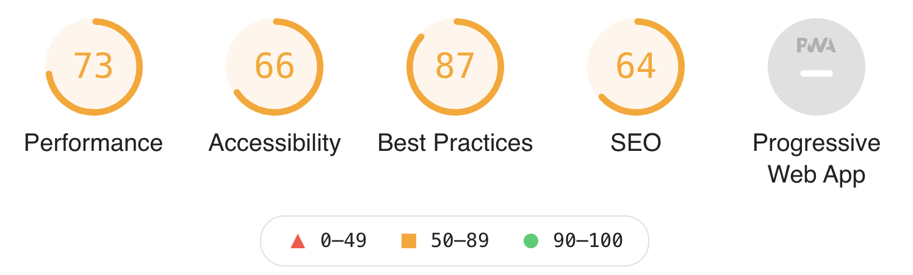

# 前端性能优化

## 常规性能优化

### 一、利用缓存减少远程请求

#### **1、浏览器缓存**

设置合适的缓存策略，如使用`Cache-Control`头设置资源缓存时间

具体可看：[强缓存和协商缓存](https://csmsimona.github.io/前端基础汇总/计算机网络.html#_11、强缓存和协商缓存)

#### 2、**Service Worker**

使用 Service Worker 来缓存静态资源，实现离线访问


### 二、减少HTTP请求

#### **1、合并文件**

将多个CSS或JS文件合并为一个文件，减少HTTP请求次数。

#### **2、使用精灵图（Sprite）**

将多个小图标合并成一个图片，使用CSS背景定位来显示不同部分。

精灵图的核心原理在于设置不同的背景偏移量，大致包含两点：

- 不同的图标元素都会将 `background-url` 设置为合并后的精灵图的 uri；
- 不同的图标通过设置对应的 `background-position` 来展示大图中对应的图标部分。

#### 3、高频率请求场景使用节流和防抖

[节流（Throttle）和防抖（Debounce）](https://csmsimona.github.io/前端基础汇总/JavaScript小记.html#_7、节流和防抖)

**节流是指在一段时间内，不管事件触发了多少次，只执行一次回调。** 

**防抖是指在事件被触发后延迟一段时间后再执行回调，如果在这段延迟时间内事件又被触发，则重新计算延迟时间。** 

**节流是将多次执行变成每隔一段时间执行，防抖是将多次执行变为最后一次执行。**

例：实时搜索框频繁输入内容使用防抖、搜索联想使用节流


### 三、加快请求速度

#### **1、避免多余重定向**

#### **2、DNS预解析**

```html
<link rel="dns-prefetch" href="http://yourwebsite.com">
```

#### **3、预先建立连接**

```html
<link rel="preconnect" href="http://yourwebsite.com">
```

#### **4、静态资源使用CDN**

内容分发网络（CDN）是一组分布在多个不同地理位置的 Web 服务器。

对于使用 CDN 的资源，DNS 解析会将 CDN 资源的域名解析到 CDN 服务的负载均衡器上，负载均衡器可以通过请求的信息获取用户对应的地理区域，从而**通过负载均衡算法，在背后的诸多服务器中，综合选择一台地理位置近、负载低的机器来提供服务**。例如为北京联通用户解析北京的服务器 IP。这样，用户在之后访问 CDN 资源时都是访问北京服务器，距离近，速度快。

#### **5、使用服务端渲染（SSR）**

[什么是服务端渲染](https://csmsimona.github.io/%E5%89%8D%E7%AB%AF%E5%9F%BA%E7%A1%80%E6%B1%87%E6%80%BB/%E5%89%8D%E7%AB%AF%E5%B8%B8%E8%A7%81%E9%9D%A2%E8%AF%95%E9%A2%98.html#%E4%BB%80%E4%B9%88%E6%98%AF%E6%9C%8D%E5%8A%A1%E7%AB%AF%E6%B8%B2%E6%9F%93)


### 四、加速页面解析与处理

#### **1、注意资源在页面文档中的位置**

浏览器在加载HTML内容时，是将HTML内容从上至下依次解析，解析到link或者script标签就会加载href或者src对应链接内容，为了第一时间展示页面给用户，就需要将CSS提前加载，不要受 JS 加载影响。

一般情况下都是CSS在头部，JS在底部。

#### **2、使用 defer 和 async异步加载JS**

防止 JavaScript 脚本的下载阻塞 DOM 构建

- `defer` 会在 HTML 解析完成后，按照脚本出现的次序再顺序执行
- `async` 则是下载完成就立即开始执行，同时阻塞页面解析，不保证脚本间的执行顺序。
- 推荐在一些与主业务无关的 JavaScript 脚本上使用 async。例如统计脚本、监控脚本、广告脚本等。

#### **3、懒加载（Lazy Load）**

[图片懒加载与预加载](https://csmsimona.github.io/%E5%89%8D%E7%AB%AF%E5%9F%BA%E7%A1%80%E6%B1%87%E6%80%BB/HTML%E5%B0%8F%E8%AE%B0.html#_22%E3%80%81%E5%9B%BE%E7%89%87%E6%87%92%E5%8A%A0%E8%BD%BD%E5%92%8C%E9%A2%84%E5%8A%A0%E8%BD%BD)

通过监听页面滚动，判断图片是否进入视野，从而真正去加载图片

对于页面上的元素只需要将原本的 `src` 值设置到 `data-src` 中即可，而 `src` 可以设置为一个统一的占位图。

如果想使用懒加载，还可以借助一些已有的工具库，例如 [aFarkas/lazysizes](https://github.com/aFarkas/lazysizes)、[verlok/lazyload](https://github.com/verlok/lazyload)、[tuupola/lazyload](https://github.com/tuupola/lazyload) 等。

#### **4、预加载与预获取**

使用`<link rel="preload">`和`<link rel="prefetch">`来提前加载或获取关键资源。


### 五、提高渲染性能

#### **1、减少重排重绘**

[浏览器渲染过程](https://csmsimona.github.io/前端基础汇总/HTML小记.html#_14、浏览器渲染页面的过程)

[重排和重绘](https://csmsimona.github.io/%E5%89%8D%E7%AB%AF%E5%9F%BA%E7%A1%80%E6%B1%87%E6%80%BB/HTML%E5%B0%8F%E8%AE%B0.html#_19%E3%80%81%E9%87%8D%E7%BB%98-repaint-%E5%92%8C%E9%87%8D%E6%8E%92-reflow)

##### 减少DOM操作

- **避免频繁的DOM查询**：对于需要频繁访问的DOM元素，将其查询结果缓存起来，避免多次调用`document.querySelector`或`getElementById`等方法。
- **批量操作DOM**
  - **使用文档片段（DocumentFragment）**：在操作多个DOM节点时，先将它们添加到`DocumentFragment`中，最后一次性插入DOM。
  - **离线操作DOM**：将元素从DOM树中移除，完成操作后再插入。比如操作表格时可以先将表格移出文档流，更新后再插回去。
- **使用虚拟DOM**：如果使用React、Vue等框架，这些框架的虚拟DOM机制可以大幅减少实际的DOM操作。虚拟DOM通过对比新旧DOM树的差异来最小化实际的DOM操作次数。
- **合并DOM更新：**在动画或大量DOM更新时，将操作放入`requestAnimationFrame`回调中，以确保它们在同一帧内进行，避免多次重排
- 使用`resize`事件时，做**防抖**和**节流**处理

##### CSS优化

- **查找元素的优化**：应该尽可能的通过ID或者类来查找元素，避免通过属性来查找元素。
- **避免使用CSS表达式**：CSS表达式会导致每次重排时都重新计算，增加重排次数。通过**更改 className 批量修改元素样式**
- **避免使用**`width: auto`：使用明确的宽度值可以减少浏览器计算和重排的频率。
- 尽量少使用`dispaly:none`，可以使用`visibility:hidden`代替，`dispaly:none`会造成**重排**，`visibility:hidden`会造成**重绘**。
- 尽量**减少深度嵌套或复杂选择器的使用**，以提高 CSS 渲染效率。
- **避免使用表格布局**：因为在表格元素上触发回流会导致其中所有其他元素的回流

##### 动画相关优化

- 将**复杂的动画元素定位为 fixed 或 absolute** 减少重排
- **使用will-change属性**：对于可能频繁改变的元素，可以设置`will-change`属性来提示浏览器提前进行优化。（但避免过度使用 will-change；在动画中遇到性能问题时考虑使用它）
- 在 GPU 上渲染动画：浏览器已经优化了 CSS 动画，使其适用于触发动画属性的重绘（因此也包括回流）。为了提高性能，**将具有动画效果的元素移动到 GPU 上**。**可以触发 GPU 硬件加速的 CSS 属性包括 transform、filter、will-change 和 position:fixed。**动画将在 GPU 上处理，提高性能，特别是在移动设备上（但避免过度使用，因为可能会导致性能问题）。


#### **2、使用CSS动画**

尽量使用CSS动画代替JavaScript动画，因为CSS动画通常在性能上更优。


### 六、图片资源优化

#### **1、使用精灵图（Sprite）**

#### **2、使用合适的图片格式**

- 对于能够显示WebP格式的浏览器尽量使用WebP格式。因为WebP格式具有更好的图象数据压缩算法，能带来更小的图片体积，而且拥有肉眼识别无差异的图象质量，缺点就是兼容性并不好

- 小图使用PNG

- 照片使用JPEG

- 使用 SVG 应对矢量图场景

  在一些需要缩放与高保真的情况，或者用作图标的场景下，使用 SVG 这种矢量图非常不错。有时使用 SVG 格式会比相同的 PNG 或 JPEG 更小。

#### **3、图片压缩**

使用压缩工具减少图像文件的大小

[tinypng（熊猫压缩）](https://tinypng.com/)

[在线图像优化器](https://imagecompressor.com/zh/)

[图片压缩工具](https://www.bejson.com/ui/compress_img/)

#### **4、使用CDN**

#### **5、图标用Iconfont代替**

#### **6、尽可能利用 CSS3效果代替图片**

有很多图片使用 CSS 效果（渐变、阴影等）就能画出来，这种情况选择 CSS3 效果更好。因为代码大小通常是图片大小的几分之一甚至几十分之一。


### 七、字体文件优化

#### **1、字体裁剪**

一个字体库中可能会包含很多字（尤其是在中文的场景下），但是并非每个字都会使用到，因此可以将不需要使用到的字体剔除

**font-spider（字蛛）减少ttf字体文件大小**

[使用font-spider压缩字体文件](../使用font-spider压缩字体文件/使用font-spider压缩字体文件.md)

#### **2、font-display**

在 `@font-face` 中设置 `font-display: swap`，让 FOIT 的默认行为变为 FOUT (Flash of Unstyled Text)，即先会使用默认字体样式展示文本，字体加载完毕后再将文本的字体样式进行替换。

```CSS
@font-face {
  font-family: "Orbitron";
  src: url("./Orbitron-VariableFont_wght.ttf");
  font-display: swap;
}
```

[font-display兼容性](https://caniuse.com/css-font-rendering-controls)

#### **3、开启CDN**

#### **4、开启gzip压缩**

#### **5、fontmin-webpack**

webpack插件，将图标字体缩小为仅使用的字形


### **八、减少第三方依赖**

- **按需引入**：使用 lodash、moment 等库时，可以使用类似`lodash-es`、`date-fns`等按需引入的版本，避免加载整个库。

- **轻量替代方案**：寻找更轻量的库或原生API代替大型库，例如使用`fetch`替代`axios`。

- **剔除掉无用的语言包**：例如项目中使用了 momentjs，发现打包后有很多没有用到的语言包

  使用 `moment-locales-webpack-plugin` 插件，剔除掉无用的语言包


### 九、构建优化（webpack）

#### 优化效率工具

安装以下 webpack 插件，帮助我们分析优化效率：

- [progress-bar-webpack-plugin](https://link.juejin.cn?target=https%3A%2F%2Fwww.npmjs.com%2Fpackage%2Fprogress-bar-webpack-plugin)：查看编译进度；
- [speed-measure-webpack-plugin](https://link.juejin.cn?target=https%3A%2F%2Fwww.npmjs.com%2Fpackage%2Fspeed-measure-webpack-plugin)：查看编译速度；
- [webpack-bundle-analyzer](https://link.juejin.cn?target=https%3A%2F%2Fwww.npmjs.com%2Fpackage%2Fwebpack-bundle-analyzer)：打包体积分析。

#### 加快构建速度

##### 1.持久化缓存（cache）

Webpack 5 引入了持久化缓存机制，通过 `cache: { type: 'filesystem' }` 来缓存生成的模块和编译信息，大幅提升二次构建速度、打包速度，当构建突然中断，二次进行构建时，可以直接从缓存中拉取，可提速 **90%** 左右。

```js
module.exports = {
    cache: {
      type: 'filesystem', // 使用文件缓存
    },
}
```

##### 2.优化babel-loader

```js
{
    test: /\.js$/,
  	loader: ['babel-loader?cacheDirectory'],	// 开启缓存
    include: path.resolve(__dirname, 'src'),	// 明确范围
    // 排除范围，include和exclude两者选一个即可
    // exclude: path.resolve(__dirname, 'node_modules')
}
```

##### 3.IgnorePlugin 避免引用无用模块（直接不引入，代码中没有）

以moment.js为例，忽略语言包

```js
// 忽略 moment 下的 /locale 目录
new webpack.IgnorePlugin(/\.\/locale/, /moment/),
```

##### 4.noParse避免重复打包（引入，但不打包）

```js
module.exports = {
    module: {
        // 独完整的 react.min.js 文件就没有采用模块化
        // 忽略对 react.min.js 文件的递归解析处理
        noParse: [/react\.min\.js$/]
    }
}
```

##### 5.thread-loader 多线程

通过 [thread-loader](https://webpack.docschina.org/loaders/thread-loader/#root) 将耗时的 loader 放在一个独立的 worker 池中运行，加快 loader 构建速度。

```bash
npm i -D thread-loader
```

我们应该仅在非常耗时的 loader 前引入 thread-loader（例如sass-loader）

```js
module.exports = {
    rules: [
        {
        test: /\.module\.(scss|sass)$/,
        include: paths.appSrc,
        use: [
          'style-loader',
          {
            loader: 'css-loader',
            options: {
              modules: true,
              importLoaders: 2,
            },
          },
          {
            loader: 'postcss-loader',
            options: {
              postcssOptions: {
                plugins: [
                  [
                    'postcss-preset-env',
                  ],
                ],
              },
            },
          },
          {
            loader: 'thread-loader',
            options: {
              workerParallelJobs: 2 // 一个 worker 进程中并行执行工作的数量
            }
          },
          'sass-loader',
        ].filter(Boolean),
      },
    ]
}
```

##### 6.自动刷新

```js
    watch: true, // 开启监听，默认为 false
    watchOptions: {
        ignored: /node_modules/, // 忽略哪些
        // 监听到变化发生后会等300ms再去执行动作，防止文件更新太快导致重新编译频率太高
        // 默认为 300ms
        aggregateTimeout: 300,
        // 判断文件是否发生变化是通过不停的去询问系统指定文件有没有变化实现的
        // 默认每隔1000毫秒询问一次
        poll: 1000
    }
```


##### 总结

用于生产环境

- 优化babel-loader
- IgnorePlugin
- noParse
- thread-loader

开发环境

- cache缓存
- 自动刷新


#### 减小打包体积

##### 1.代码压缩

- 在 webpack 可以使用如下插件进行压缩：

  - JavaScript：`TerserWebpackPlugin`
  - CSS ：`CssMinimizerPlugin`
  - HTML：`HtmlWebpackPlugin`

- 使用 `gzip` 压缩

  - html、js、css资源，使用 gzip 后通常可以将体积压缩70%以上

  - 使用 webpack 进行 gzip 压缩的方式，使用 `compression-webpack-plugin` 插件
  
- 使用`Brotli`压缩


**JS压缩（TerserWebpackPlugin）**

使用 [TerserWebpackPlugin](https://webpack.docschina.org/plugins/terser-webpack-plugin) 来压缩 JavaScript。

webpack5 自带最新的 `terser-webpack-plugin`，无需手动安装。

`terser-webpack-plugin` 默认开启了 `parallel: true` 配置，并发运行的默认数量： `os.cpus().length - 1` ，本文配置的 parallel 数量为 4，使用多进程并发运行压缩以提高构建速度。

```js
const TerserPlugin = require('terser-webpack-plugin');
module.exports = {
    optimization: {
        minimizer: [
            new TerserPlugin({
              parallel: 4,
              terserOptions: {
                parse: {
                  ecma: 8,
                },
                compress: {
                  ecma: 5,
                  warnings: false,
                  comparisons: false,
                  inline: 2,
                },
                mangle: {
                  safari10: true,
                },
                output: {
                  ecma: 5,
                  comments: false,
                  ascii_only: true,
                },
              },
            }),
        ]
    }
}
```


**css压缩（CssMinimizerWebpackPlugin）**

使用 [CssMinimizerWebpackPlugin](https://webpack.docschina.org/plugins/css-minimizer-webpack-plugin/#root) 压缩 CSS 文件。

`CssMinimizerWebpackPlugin` 将在 Webpack 构建期间搜索 CSS 文件，优化、压缩 CSS。

```bash
npm install -D css-minimizer-webpack-plugin
```

```js
const CssMinimizerPlugin = require("css-minimizer-webpack-plugin");

module.exports = {
  optimization: {
    minimizer: [
      new CssMinimizerPlugin({
          parallel: 4,
        }),
    ],
  }
}
```

这将仅在生产环境开启 CSS 优化。

如果还想在开发环境下启用 CSS 优化，请将 `optimization.minimize` 设置为 `true`


##### 2.使用 `url-loader` 将图片转 base64

```js
// 安装
npm install url-loader --save-dev
    
// 配置
module.exports = {
  module: {
    rules: [{
        test: /.(png|jpg|gif)$/i,
        use: [{
            loader: 'url-loader',
            options: {
              // 小于 10kb 的图片转化为 base64
              limit: 1024 * 10
            }
        }]
     }]
  }
};
```

##### 3.使用`image-webpack-loader`插件进行图片压缩

##### 4.使用Tree Shaking 移除未使用的代码

Webpack 中的 Tree Shaking 是一种优化技术，用于消除未使用的代码，从而减小程序包的大小。

Tree Shaking 的主要目的是通过静态分析来识别和去除那些不会被执行的代码，从而提高应用的加载速度和性能。

通过 `mode: 'production'` 或配置 `optimization.usedExports: true`，自动删除未使用的代码，减少打包体积。

##### 5.使用 [purgecss-webpack-plugin](https://github.com/FullHuman/purgecss/tree/main/packages/purgecss-webpack-plugin) 对 CSS Tree Shaking

```bash
npm i purgecss-webpack-plugin -D
```

因为打包时 CSS 默认放在 JS 文件内，因此要结合 webpack 分离 CSS 文件插件 `mini-css-extract-plugin` 一起使用，先将 CSS 文件分离，再进行 CSS Tree Shaking。

```js
// webpack.prod.js
const glob = require('glob')
const MiniCssExtractPlugin = require('mini-css-extract-plugin')
const PurgeCSSPlugin = require('purgecss-webpack-plugin')
const paths = require('paths')

module.exports = {
  plugins: [
    // 打包体积分析
    new BundleAnalyzerPlugin(),
    // 提取 CSS
    new MiniCssExtractPlugin({
      filename: "[name].css",
    }),
    // CSS Tree Shaking
    new PurgeCSSPlugin({
      paths: glob.sync(`${paths.appSrc}/**/*`,  { nodir: true }),
    }),
  ]
}
```


##### 6.抽离公共代码（splitChunks）

**将基础库代码单独拆包打包合并**

为了更好利用缓存，我们一般会把不容易变化的部分单独抽取出来。例如一个 React 技术栈的项目，可能会将 React、Redux、React-Router 这类基础库单独打包出一个文件。

这样做的优点在于，由于基础库被单独打包在一起了，即使业务代码经常变动，也不会导致整个缓存失效。基础框架/库、项目中的 common、util 仍然可以利用缓存，不会每次发布新版都会让用户花费不必要的带宽重新下载基础库。

可以通过 `optimization.splitChunks`来分离一些公共库。

webpack 将根据以下条件自动拆分 chunks：

- 新的 chunk 可以被共享，或者模块来自于 `node_modules` 文件夹；
- 新的 chunk 体积大于 20kb（在进行 min+gz 之前的体积）；
- 当按需加载 chunks 时，并行请求的最大数量小于或等于 30；
- 当加载初始化页面时，并发请求的最大数量小于或等于 30； 通过 splitChunks 把 react 等公共库抽离出来，不重复引入占用体积。

```JavaScript
// webpack.config.js
module.exports = {
    //...
    optimization: {
        // 分割代码块
        splitChunks: {
            /**
             * initial 入口 chunk，对于异步导入的文件不处理
                async 异步 chunk，只对异步导入的文件处理
                all 全部 chunk
             */
            chunks: 'all',
            // 缓存分组
            cacheGroups: {
                // 第三方模块
                vendor: {
                    name: 'vendor', // chunk 名称
                    priority: 1, // 权限更高，优先抽离，重要！！！
                    test: /node_modules/,
                    minSize: 0,  // 大小限制
                    minChunks: 1  // 最少复用过几次
                },
                // 公共的模块
                common: {
                    name: 'common', // chunk 名称
                    priority: 0, // 优先级
                    minSize: 0,  // 公共模块的大小限制
                    minChunks: 2  // 公共模块最少复用过几次
                }
            }
        }
    }
}
```


##### 7.抽离CSS文件（MiniCssExtractPlugin）

[MiniCssExtractPlugin](https://webpack.docschina.org/plugins/mini-css-extract-plugin/) 插件将 CSS 提取到单独的文件中，为每个包含 CSS 的 JS 文件创建一个 CSS 文件，并且支持 CSS 和 SourceMaps 的按需加载。

```bash
npm install -D mini-css-extract-plugin
```

配置：

```js
const MiniCssExtractPlugin = require("mini-css-extract-plugin");

module.exports = {
  plugins: [new MiniCssExtractPlugin()],
  module: {
    rules: [
        {
        test: /\.module\.(scss|sass)$/,
        include: paths.appSrc,
        use: [
          'style-loader',
          isEnvProduction && MiniCssExtractPlugin.loader, // 仅生产环境
          {
            loader: 'css-loader',
            options: {
              modules: true,
              importLoaders: 2,
            },
          },
          {
            loader: 'postcss-loader',
            options: {
              postcssOptions: {
                plugins: [
                  [
                    'postcss-preset-env',
                  ],
                ],
              },
            },
          },
          {
            loader: 'thread-loader',
            options: {
              workerParallelJobs: 2
            }
          },
          'sass-loader',
        ].filter(Boolean),
      },
    ]
  },
};
```

> 注意：MiniCssExtractPlugin.loader 要放在 style-loader 后面。


##### 8.最小化 entry chunk

通过配置 `optimization.runtimeChunk = true`，为运行时代码创建一个额外的 chunk，减少 entry chunk 体积，提高性能。

`webpack.prod.js` 配置方式如下：

```javascript
module.exports = {
    optimization: {
        runtimeChunk: true,
      },
    };
}
```


##### 9.给打包出来的文件名添加哈希，实现浏览器缓存文件

通过 Webpack 的 `[contenthash]` 配置为输出文件名生成唯一的哈希值，确保文件内容变化时，浏览器能够重新获取新文件。

```js
output: {
  filename: '[name].[contenthash].js',
  path: path.resolve(__dirname, 'dist'),
}
```

##### 

##### 10.使用CDN加速

1、publicPath配置cdn网址 `publicPath: 'http://cdn.abc.com'  // 修改所有静态文件 url 的前缀（如 cdn 域名）`

2、将打包资源CSS、JS等上传到cdn


### 十、监控与分析

#### **1、**[**webpack-bundle-analyzer**](https://github.com/webpack-contrib/webpack-bundle-analyzer)

可以通过 [webpack-bundle-analyzer](https://github.com/webpack-contrib/webpack-bundle-analyzer) 这个工具来查看打包代码里面各个模块的占用大小

```Bash
npm install webpack-bundle-analyzer -D
// vue.config.js
module.exports = {     
   chainWebpack: (config) => {
        // 分析打包大小
        if (process.env.npm_config_report) {
          config.plugin('webpack-bundle-analyzer')
            .use(require('webpack-bundle-analyzer').BundleAnalyzerPlugin)
            .end();
        }
   }
}

// package.json
{
  "name": "name",
  "version": "0.0.1",
  "scripts": {
    "report": "set npm_config_report=true && vue-cli-service build",
  },
  ...
 }
npm run report
```

#### **2、使用性能检测工具**

使用[Lighthouse](#性能检测工具lighthouse)、PageSpeed Insights等工具分析和优化页面性能。

#### 3、检查加载性能:star:

一个网站加载性能如何主要看白屏时间和首屏时间。

- 白屏时间：指从输入网址，到浏览器开始渲染第一个像素点之间的时间。优化目标：< 0.8秒
- 首屏时间（First Screen Load Time）：用户无需滚动就能看到的页面区域完全渲染完成的时间。优化目标：≤2.5秒
- FCP（First Contentful Paint）首次内容绘制：用户开始输入`url`（开始导航） 到页面上任意一部分内容呈现在屏幕上的时间
  - 浏览器渲染第一段DOM。图片、非白色的` < canvas > `元素和 `svg` 被认为是 DOM 内容，`iframe`中的任何内容不包含在内
  - 表示用户首次看到页面有内容出现（即使只是部分内容）
  - 优化目标：≤1.8秒

##### 计算白屏时间

没有浏览器原生API支持，通常使用以下方法：

- **Performance API**：

  ```javascript
  const timing = window.performance.timing;
  const whiteScreenTime = timing.responseStart - timing.navigationStart;
  ```

- **DOM变化监听**：

  ```javascript
  // 在<head>底部记录起始时间
  window.pageStartTime = Date.now();
  
  // 使用MutationObserver监听首次DOM变化
  const observer = new MutationObserver(() => {
    const endTime = Date.now();
    const whiteScreenDuration = endTime - window.pageStartTime;
    // 记录白屏时间
    observer.disconnect();
  });
  
  observer.observe(document, {
    childList: true,
    subtree: true
  });
  ```

##### 测量FCP

浏览器提供了PerformanceObserver API进行测量：

```js
// 方法一：使用PerformanceObserver监听FCP事件
const observer = new PerformanceObserver((list) => {
  for (const entry of list.getEntries()) {
    if (entry.name === 'first-contentful-paint') {
      const fcpTime = entry.startTime;
      console.log('FCP时间：', fcpTime, 'ms');
      // 发送到分析服务器
    }
  }
});

// 开始观察paint类型的性能条目
observer.observe({ entryTypes: ['paint'] });

// 方法二：直接获取性能时间点
const fcpEntry = performance.getEntriesByName('first-contentful-paint')[0];
const fcp = fcpEntry.startTime;
```


##### 计算首屏时间

没有标准化方法，常用技术包括：

- **关键元素标记法**

  ```js
  // 定义首屏关键元素
  const firstScreenElements = [
    document.getElementById('header'),
    document.querySelector('.hero'),
    // 其他首屏元素...
  ];
  
  Promise.all(firstScreenElements.map(el => {
    return new Promise(resolve => {
      if (el.complete || el.readyState === 'complete') {
        resolve();
      } else {
        el.addEventListener('load', resolve);
        el.addEventListener('error', resolve);
      }
    });
  })).then(() => {
    const firstScreenTime = Date.now() - performance.timing.navigationStart;
    // 记录首屏时间
  });
  ```

- 粗略的计算首屏时间

    ```JavaScript
    // 方法一
    window.addEventListener('load', () => {
        let timing = performance.timing;
        // domContentLoadedEventEnd：DOMContentLoaded事件结束的时间点
        // loadEventEnd：页面加载完成的时间点，可以用来计算完整页面加载时间
        let firstPaint = timing.domContentLoadedEventEnd- timing.navigationStart;
        console.log('FCP:', firstPaint);
    });
    
    // 方法二
    // 获取当前时间作为开始时间
    const startTime = performance.now();
    
    // 监听load事件，当页面加载完成后触发
    window.addEventListener('load', () => {
        // 计算页面加载完成的时间
        const endTime = performance.now();
        console.log(`首屏加载时间: ${endTime - startTime}ms`);
    });
    ```

- 通过计算首屏区域内的所有图片加载时间，然后取其最大值

  ```html
  <!DOCTYPE html>
  <html lang="en">
  
  <head>
    <meta charset="UTF-8">
    <meta name="viewport" content="width=device-width, initial-scale=1.0">
    <title>首屏时间计算-统计首屏最慢图片加载时间</title>
    <script>
      window.pageStartTime = Date.now()
    </script>
  </head>
  
  <body>
    
    
    <script>
      function load() {
        window.firstScreen = Date.now()
      }
      window.onload = function () {
        // 首屏时间
        console.log(window.firstScreen - window.pageStartTime)
      }
    </script>
  </body>
  </html>
  ```

- **截图比较法**：

  ```js
  // 使用Puppeteer等工具
  const browser = await puppeteer.launch();
  const page = await browser.newPage();
  
  // 设置视口大小
  await page.setViewport({ width: 1200, height: 800 });
  
  // 开始导航并记录时间
  const startTime = Date.now();
  await page.goto('https://example.com', { waitUntil: 'networkidle0' });
  
  // 截取首屏
  const screenshot = await page.screenshot({ clip: { x: 0, y: 0, width: 1200, height: 800 } });
  
  // 与预存的完整首屏截图比较
  const similarity = compareScreenshots(screenshot, referenceImage);
  
  if (similarity > 0.95) {
    const firstScreenTime = Date.now() - startTime;
    // 记录首屏时间
  }
  ```

  

#### **4、检查运行性能**

配合 chrome 的开发者工具，我们可以查看网站在运行时的性能。

打开网站，按 F12 选择 performance，点击左上角的灰色圆点，变成红色就代表开始记录了。这时可以模仿用户使用网站，在使用完毕后，点击 stop，然后你就能看到网站运行期间的性能报告。如果有红色的块，代表有掉帧的情况；如果是绿色，则代表 FPS 很好。


## Vue 项目性能优化

### **1、模板和指令优化**

- 合理使用`v-show`和`v-if`

- 使用 `v-for` 时，尽量提供唯一的 `key` ，避免重复渲染。

- 使用 `v-once` 指令，只渲染一次，避免不必要的计算。

- 使用 `v-memo` 指令，对使用`v-for`生成的列表进行渲染优化。`(vue3.2新增)`

  用于缓存计算结果。只有当指定的依赖发生变化时，才会重新计算和渲染。


### **2、组件优化**

- 合理使用 `keep-alive` 组件，缓存组件实例，避免重复渲染。
- 使用异步组件加载，减少首屏加载时间。

    ```js
    const AsyncComponent = defineAsyncComponent(() => import('./MyComponent.vue'))
    ```

- 配合 Vue Router 使用路由懒加载，实现路由页面按需加载。
- 合理划分组件，提升复用性和渲染性能。


### **3、响应式优化**

- 使用 `Object.freeze` 冻结对象，避免不必要的响应式。

- 使用 stop 停止不必要的watchEffect副作用执行，以减少性能消耗。

- watch的优化

  - 避免滥用深度监听，降低性能开销。

  - 对于频繁触发的响应式数据变化，可以通过防抖和节流优化监听逻辑。

    ```js
    import { debounce } from 'lodash'
  
    watch(
      () => searchQuery,
      debounce((newQuery) => {
        fetchSearchResults(newQuery)
      }, 300)
    )
    ```

  - 可以通过返回函数只监听具体的依赖，减少不必要的触发。

    ```js
    watch([() => user.name, () => user.age], ([newName, newAge]) => {
      //...
    })
    ```

  - 当监听器在某些条件下不再需要时，可以通过返回的 stop 方法手动停止监听，以节省资源

    ```js
    const stop = watch(
      () => data.value,
      (newValue) => {
        if (newValue === 'done') {
          stop() // 停止监听
        }
      }
    )
    ```

  - 当多个监听器的回调逻辑类似时，可以合并监听

    ```js
    watch([() => user.name, () => user.age], ([newName, newAge]) => {
      //...
    })
    ```

### **4、其他**

- 自定义事件、dom事件、定时器等及时销毁

- webpack层面的优化

- 前端通用的性能优化，如图片懒加载

  

## React项目性能优化

- 渲染列表时加key
- 自定义事件、DOM事件及时销毁
- 合理使用异步组件
- 减少函数 bind this 的次数
- 合理使用SCU、PureComponent 和memo
- 合理使用Immutable.js
- webpack层面的优化
- 前端通用的性能优化，如图片懒加载
- 使用SSR
- setState异步函数：能将多个数据的改变结合成一次来做，降低虚拟DOM的比对频率。
- ajax请求放在`componentDidMount`里
- `useMemo`: 用于缓存昂贵的计算结果，避免在每次渲染时重复计算。

  ```js
  function ExpensiveComponent({ items, filter }) {
    const filteredItems = useMemo(() => {
      return items.filter((item) => item.includes(filter))
    }, [items, filter]) // 仅在 items 或 filter 变化时重新计算
  
    return (
      <ul>
        {filteredItems.map((item) => (
          <li key={item}>{item}</li>
        ))}
      </ul>
    )
  }
  ```
- `useCallback`: 用于缓存回调函数，避免在每次渲染时创建新的函数实例。

  ```js
  function ParentComponent() {
    const [count, setCount] = useState(0)
  
    const handleClick = useCallback(() => {
      setCount((prevCount) => prevCount + 1)
    }, []) // 空依赖数组，函数不会重新创建
  
    return (
      <div>
        <ChildComponent onClick={handleClick} />
        <p>Count: {count}</p>
      </div>
    )
  }
  
  const ChildComponent = React.memo(({ onClick }) => {
    console.log('ChildComponent rendered')
    return <button onClick={onClick}>Click me</button>
  })
  ```
- `React.memo`: 是一个高阶组件，用于缓存组件的渲染结果，避免在 props 未变化时重新渲染

  ```js
  const MyComponent = React.memo(({ value }) => {
    console.log('MyComponent rendered')
    return <div>{value}</div>
  })
  
  function ParentComponent() {
    const [count, setCount] = useState(0)
  
    return (
      <div>
        <button onClick={() => setCount(count + 1)}>Increment</button>
        <MyComponent value="Hello" /> {/* 不会因 count 变化而重新渲染 */}
      </div>
    )
  }
  ```
- `Suspense`: 用于在异步加载数据或组件时显示加载状态，可以减少初始加载时间，提升用户体验

  ```js
  const LazyComponent = React.lazy(() => import('./LazyComponent'))
  
  function MyComponent() {
    return (
      <React.Suspense fallback={<div>Loading...</div>}>
        <LazyComponent />
      </React.Suspense>
    )
  }
  ```
- `路由懒加载`：通过动态导入（dynamic import）将路由组件拆分为单独的代码块，按需加载。可以减少初始加载的代码量，提升页面加载速度

  ```js
  import { BrowserRouter as Router, Route, Routes } from 'react-router-dom'
  import React, { Suspense } from 'react'
  
  const Home = React.lazy(() => import('./Home'))
  const About = React.lazy(() => import('./About'))
  
  function App() {
    return (
      <Router>
        <Suspense fallback={<div>Loading...</div>}>
          <Routes>
            <Route path="/" element={<Home />} />
            <Route path="/about" element={<About />} />
          </Routes>
        </Suspense>
      </Router>
    )
  }
  ```

  


## Vite中可做的项目优化

### 1、启用 Gzip/Brotli 压缩

使用 `vite-plugin-compression` 插件开启 Gzip 或 Brotli 压缩，可以有效减小传输的文件体积，提升加载速度。

安装依赖：

```shell
npm install vite-plugin-compression --save-dev 
```

配置示例：

```javascript
import compression from 'vite-plugin-compression'
export default defineConfig({
  plugins: [
    compression({
      algorithm: 'gzip', // 或 'brotli' 压缩
      threshold: 10240, // 文件大于 10KB 时启用压缩
    }),
  ],
})
```

> 参考博文：[vite打包优化vite-plugin-compression的使用](https://juejin.cn/post/7222901994840244279)

### 2、代码分割

- 路由分割

使用动态导入实现按需加载，减小初始包的体积，提高页面加载速度。

```javascript
const module = import('./module.js') // 动态导入
```

或者在路由中使用懒加载：

```javascript
const MyComponent = () => import('./MyComponent.vue')
```

- 手动控制分包

在 Vite 中，你可以通过配置 Rollup 的 `manualChunks` 选项来手动控制如何分割代码。这个策略适用于想要将特定的依赖或模块提取成单独的 chunk 文件。

```javascript
import { defineConfig } from 'vite'
export default defineConfig({
  build: {
    minify: false,
    // 在这里配置打包时的rollup配置
    rollupOptions: {
      manualChunks: (id) => {
        if (id.includes('node_modules')) {
          return 'vendor'
        }
      },
    },
  },
})
```

> 参考博文：[Vite性能优化之分包策略](https://juejin.cn/post/7177982374259949624)

### 3、图片优化

使用 `vite-plugin-imagemin` 插件对项目中的图片进行压缩，减少图片体积，提升加载速度。

```shell
npm install vite-plugin-imagemin --save-dev
```

```javascript
export default defineConfig({
  plugins: [
    ViteImagemin({
      gifsicle: {
        optimizationLevel: 3,
      },
      optipng: {
        optimizationLevel: 7,
      },
      mozjpeg: {
        quality: 85,
      },
      pngquant: {
        quality: [0.65, 0.9],
      },
    }),
  ],
})
```

### 4、依赖优化

配置 Vite 的 `optimizeDeps` 选项，提前预构建常用依赖，减少开发环境下的启动时间。

```javascript
export default defineConfig({
  optimizeDeps: {
    include: ['lodash', 'vue', 'react'], // 预构建依赖
  },
})
```


## 性能检测工具Lighthouse

### 1、简介

Lighthouse 是一款检测网页质量的自动化工具，Google提供的开源软件，任何网站都可以免费使用。可以检查的网站性能、可访问性、SEO等，并给出优化建议。



### 2、安装使用

- Chrome 开发者工具

- Chrome 扩展程序

- 命令行安装

  ```bash
  npm i lighthouse -g
  lighthouse https://www.baidu.com/ --view
  ```

  

### 3、评分指标

1、**FCP（First Contentful Paint）**： 首次内容绘制

- 用户开始输入url（开始导航） 到页面上任意一部分内容呈现在屏幕上的时间（浏览器渲染第一段DOM。图片、非白色的 < canvas > 元素和 svg 被认为是 DOM 内容，iframe中的任何内容不包含在内）。
- 这个指标对于没有使用ssr技术的web app意义并不大，因为第一绘制发生的时间通常JS还没加载完毕。

2、**SI（Speed Index）**：速度指数（分数越低越好）

- 衡量页面加载期间内容的视觉显示速度。
- 它要求的是页面的渲染过程应该是渐进的，内容一点点出现，而不是开始一段时间一直是空白，然后全部内容一下出现。
- 这个指标跟页面渲染时间和渲染方式有关，如果页面渲染时间很短，页面一下就出来了，那它的得分也会很高。该指标权重为 10%

3、**TTI（Time to Interactive）**：首次可操作（比如可点击可滚动）

- 衡量一个页面需要多长时间才能完全交互
- 主要影响因素就是页面渲染速度和 JS 阻塞时间。

4、**TBT（Total Blocking Time）**：总阻塞时间

- 在FCP和TTI之间，所有超过50ms的long task的超过时间之和
- 要求我们所有的 JS 任务(宏任务，一般是函数)执行时间不要大于 50 ms

5、**LCP（Largest Contentful Paint）**：当前页面上”最大的内容“渲染时间

- 衡量页面的主要内容对用户可见的时间

6、**CLS（Cumulative Layout Shift）**：累积布局移位

- 网页布局在加载期间的偏移量，普遍用于测量视觉稳定性。

- 得分范围是0－1，其中0表示没有偏移，1表示最大偏移。要求我们在渲染页面过程中，不要频繁发生内容块的偏移。


### 4、常见问题

1. `Use HTTP/2`

   http1.1替换为http2.0后可使用二进制标头和多路复用（可以只通过一个 TCP 连接就可以传输所有的请求数据，并行请求）。

2. `Remove unused CSS` 或者 `Remove unused JavaScript`（移除无用的js和css）

3. `Serve static assets with an efficient cache policy`（为静态资源提供缓存）

4. `Reduce JavaScript execution time` 减少js的执行时间

    当JavaScript执行时间超过2秒时，Lighthouse将显示警告。执行时间超过3.5秒时，审核将失败

    - 拆分代码
    - 缩小并压缩代码
    - 删除未使用的代码 (tree shaking)
    - 使用缓存代码

