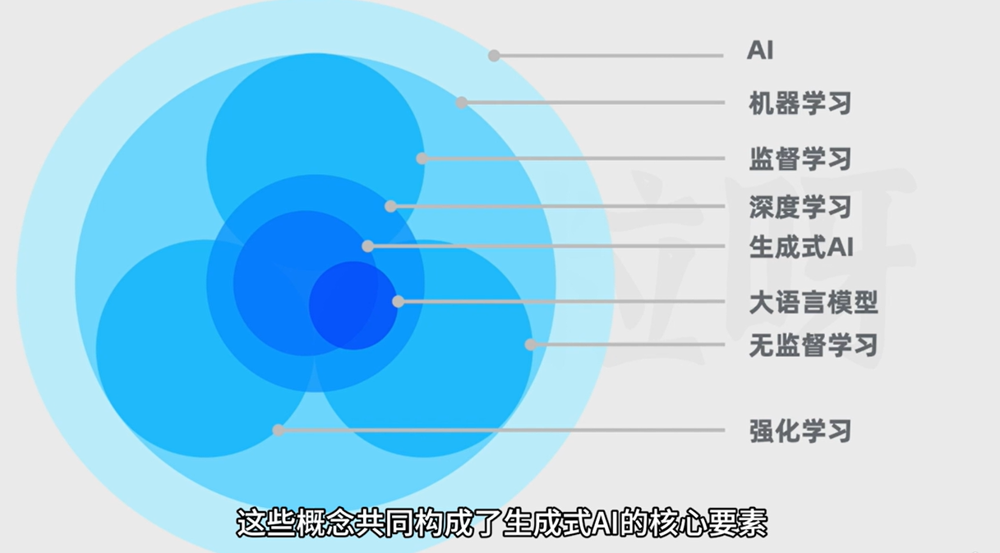

# AI大模型应用开发：从小白到高手

[《Python编程：从入门到实践》笔记](./Python编程：从入门到实践.md)

[课程：AI大模型应用开发：从小白到高手](https://www.udemy.com/course/llm-app-dev/)


| 应用名称             | 对应链接                                                     |
| -------------------- | ------------------------------------------------------------ |
| 视频脚本一键生成器   | [video-script-generator](https://github.com/csmSimona/ai_application/tree/main/video-script-generator) |
| 爆款小红书文案生成器 | [xiaohongshu-generator](https://github.com/csmSimona/ai_application/tree/main/xiaohongshu-generator) |
| 克隆AI聊天助手       | [cloned-chatgpt](https://github.com/csmSimona/ai_application/tree/main/cloned-chatgpt) |
| 智能PDF问答工具      | [pdf-qa-tool](https://github.com/csmSimona/ai_application/tree/main/pdf-qa-tool) |
| CSV数据分析智能工具  | [csv-analyzer](https://github.com/csmSimona/ai_application/tree/main/csv-analyzer) |


## AI理论科普




**AIGC**：AI Generated Content   AI生产内容（文本、代码、图片、音频、视频）

**LLM**：Large Language Model  大语言模型（用于做自然语言相关任务的深度学习模型）

完成的具体任务可以是生成、分类、总结、改写等

**GPT**：Generative Pre-trained Transformer  生成式预训练的**Transformer**

RNN：Recurrent Neural Network  循环神经网络

按时间展开，不擅长处理长文本

LSTM：长短期记忆网络


论文：《Attention is all you need》 提出了原始tranformer

编码器用来理解和输入序列

解码器用来生成输出序列


**如何三步训练出一个AI聊天助手**

1、无监督学习预训练

通过大量的文本进行无监督学习预训练，得到一个进行文本生成的基座模型

2、监督微调（SFT：Supervised Fine-Tuning）

通过一些人类撰写的高质量对话数据，对基座模型进行监督微调，得到一个微调后的模型（SFT模型）。此时的模型除了续写文本之外，也会具备更好的对话能力

3、训练奖励模型+强化学习训练

用问题和多个对应回答的数据让人类标注员对回答进行质量排序，然后基于这些数据训练出一个能对回答进行评分预测的奖励模型。

接下来让第二步得到的模型对问题生成回答，用奖励模型给回答进行评分，利用评分作为反馈，进行强化学习训练


## AI大模型应用开发准备

### Jupyter Notebook使用

```bash
pip install notebook
```

```python
jupyter notebook
```


## OpenAI大模型API基础

计算字符token数：[https://platform.openai.com/tokenizer](https://platform.openai.com/tokenizer "https://platform.openai.com/tokenizer")

可视化调试参数：[https://platform.openai.com/playground/chat?models=gpt-4o-mini](https://platform.openai.com/playground/chat?models=gpt-4o-mini "https://platform.openai.com/playground/chat?models=gpt-4o-mini")


### api调用

```python
from openai import OpenAI

client = OpenAI(api_key="xxx", base_url="xxx")

response = client.chat.completions.create(
    model="gpt-3.5-turbo",
    messages=[
        {"role": "user", "content": "Hello!"}
    ],
    temperature=0.7, 
    top_p=1, 
    max_tokens=256, 
    frequency_penalty=0,
    presence_penalty=0
)


print(response.choices[0].message.content)

```

### 参数详解

- model

  使用的模型
- messages

  具体对话内容

  role角色：
  - system

    系统提示，一般用来给AI传递一些背景，给AI安排个性和角色或者定义输出内容的规则
  - assistant AI
  - user 用户
  当messages中既有user 的提示，又有assistant的回答时，可以用作小样本提示
- temperature

  控制AI回答的随机性创造性，范围0-2，默认为1，原理是token的概率分布，数值越大，选用概率越低的token，随机性越高
- top\_p

  控制AI回答的随机性创造性，范围0-1，原理是选取概率分布的子集

  如果值为0.4，则概率加起来刚好大于或等于0.4的词会被纳入待选；为1则不会做任何概率的截断。

  官方建议不要同时调整temperature和top\_p
- max\_tokens

  强硬控制token数量上限（到数量后文本直接截断，如果要使回答控制在某个数量范围内，还是需要在提问时明确限制的字数）

  大模型的上下文窗口是有限的，一旦超过了上下文窗口，文本就会被截断
- frequency\_penalty

  频率惩罚，通过惩罚已经频繁使用的词来降低模型一行中重复用词的可能性

  范围-2-2，默认为0，数值越高越能避免回答出现重复内容
- presence\_penalty

  存在惩罚，影响生成内容是否能包含更多新词

  范围-2-2，默认为0，数值越高重复词越少


## 提示词工程（Prompt Engineering）

AI 的 prompt 是指在使用人工智能（AI）系统时，向其提供的一个初始输入或建议，以引导 AI 系统生成特定的输出。在很多自然语言处理（NLP）系统，比如 OpenAI 的 GPT-3，里，prompt 是作为一个文本输入，用来引导 AI 系统生成有针对性的回复或内容。


建议将长文本内容用 ### 或 """ 包裹


### 零样本和小样本提示

#### 零样本提示

没有为模型提供任何示例

#### 小样本提示

先给一些示例，AI就会按照这样样本示例进行回答

```python
response = client.chat.completions.create(
  model="gpt-3.5-turbo",
  messages=[
    {
      "role": "user",
      "content": "格式化以下信息：\n姓名 -> 张三\n年龄 -> 27\n客户ID -> 001"
    },
    {
      "role": "assistant",
      "content": "##客户信息\n- 客户姓名：张三\n- 客户年龄：27岁\n- 客户ID：001"
    },
    {
      "role": "user",
      "content": "格式化以下信息：\n姓名 -> 李四\n年龄 -> 42\n客户ID -> 002"
    },
    {
      "role": "assistant",
      "content": "##客户信息\n- 客户姓名：李四\n- 客户年龄：42岁\n- 客户ID：002"
    },
    {
      "role": "user",
      "content": "格式化以下信息：\n姓名 -> 王五\n年龄 -> 32\n客户ID -> 003"
    }
  ]
)
response.choices[0].message.content
=> '## 客户信息\n- 客户姓名：王五\n- 客户年龄：32岁\n- 客户ID：003'
```


### 思维链

思维链：**显式输出中间逐步的推理步骤**

在小样本中给出解题思路，或者在提示文本中加上类似“让我们来分步骤思考”这样的文本

```python
response = client.chat.completions.create(
  model="gpt-3.5-turbo",
  messages=[
    {
      "role": "user",
      "content": "该组中的奇数加起来为偶数：4、8、9、15、12、2、1，对吗？"
    },
    {
      "role": "assistant",
      "content": "所有奇数（9、15、1）相加，9 + 15 + 1 = 25。答案为否。"
    },
    {
      "role": "user",
      "content": "该组中的奇数加起来为偶数：17、10、19、4、8、12、24，对吗？"
    },
    {
      "role": "assistant",
      "content": "所有奇数（17、19）相加，17 + 19 = 36。答案为是。"
    },
    {
      "role": "user",
      "content": "该组中的奇数加起来为偶数：15、12、5、3、72、17、1，对吗？"
    },
  ]
)
print(response.choices[0].message.content)

=> 所有奇数（15、5、3、17、1）相加，15 + 5 + 3 + 17 + 1 = 41。答案为否。
```


```python
response = client.chat.completions.create(
  model="gpt-3.5-turbo",
  messages=[
    {
      "role": "user",
      "content": "该组中的奇数加起来为偶数：15、12、5、3、72、17、1，对吗？让我们来分步骤思考。"
    },
  ]
)
print(response.choices[0].message.content)
=>
是的，让我们来分步骤思考这个问题。

首先，我们将奇数从该组中提取出来，这些数字是：15、5、3、17、1。

然后，我们将这些奇数相加：15 + 5 + 3 + 17 + 1 = 41。

最后，我们检查41这个结果是否为偶数。因为41是奇数，所以该组中的奇数加起来不为偶数。

所以，该组中的奇数加起来不为偶数。

```


## AI大模型API用法示例

### 文本总结

```python
from openai import OpenAI
client = OpenAI()
def get_openai_response(client, prompt, model="gpt-3.5-turbo"):
    response = client.chat.completions.create(
        model=model,
        messages=[{"role": "user", "content": prompt}],
    )
    return response.choices[0].message.content

product_review = """
我上个月买的这个多功能蓝牙耳机。它的连接速度还挺快，而且兼容性强，无论连接手机还是笔记本电脑，基本上都能快速配对上。
音质方面，中高音清晰，低音效果震撼，当然这个价格来说一分钱一分货吧，毕竟也不便宜。
耳机的电池续航能力不错，单次充满电可以连续使用超过8小时。
不过这个耳机也有一些我不太满意的地方。首先是在长时间使用后，耳廓有轻微的压迫感，这可能是因为耳套的材料较硬。总之我感觉戴了超过4小时后耳朵会有点酸痛，需要摘下休息下。
而且耳机的防水性能不是特别理想，在剧烈运动时的汗水防护上有待加强。
最后是耳机盒子的开合机制感觉不够紧致，有时候会不小心打开。
"""

product_review_prompt = f"""
你的任务是为用户对产品的评价生成简要总结。
请把总结主要分为两个方面，产品的优点，以及产品的缺点，并以Markdown列表形式展示。
用户的评价内容会以三个#符号进行包围。

###
{product_review}
###
"""


response = get_openai_response(client, product_review_prompt)
response
=>
产品的优点：
- 连接速度快，兼容性强
- 音质中高音清晰，低音效果震撼
- 电池续航能力强，单次充满电可以连续使用超过8小时

产品的缺点：
- 长时间使用后耳廓有轻微的压迫感
- 防水性能不够理想，在剧烈运动时的汗水防护上有待加强
- 耳机盒子的开合机制不够紧致，有时会不小心打开

```

### 文本撰写

````python
from openai import OpenAI
client = OpenAI()
def get_openai_response(client, prompt, model="gpt-3.5-turbo"):
    response = client.chat.completions.create(
        model=model,
        messages=[{"role": "user", "content": prompt}],
    )
    return response.choices[0].message.content
    

xiaohongshu_system_prompt = """
你是小红书爆款写作专家，请你遵循以下步骤进行创作：首先产出5个标题（包含适当的emoji表情），然后产出1段正文（每一个段落包含适当的emoji表情，文末有适当的tag标签）。
标题字数在20个字以内，正文字数在800字以内，并且按以下技巧进行创作。
一、标题创作技巧： 
1. 采用二极管标题法进行创作 
1.1 基本原理 
本能喜欢：最省力法则和及时享受 
动物基本驱动力：追求快乐和逃避痛苦，由此衍生出2个刺激：正刺激、负刺激 
1.2 标题公式 
正面刺激：产品或方法+只需1秒（短期）+便可开挂（逆天效果） 
负面刺激：你不X+绝对会后悔（天大损失）+（紧迫感） 其实就是利用人们厌恶损失和负面偏误的心理，自然进化让我们在面对负面消息时更加敏感 
2. 使用具有吸引力的标题 
2.1 使用标点符号，创造紧迫感和惊喜感 
2.2 采用具有挑战性和悬念的表述 
2.3 利用正面刺激和负面刺激 
2.4 融入热点话题和实用工具 
2.5 描述具体的成果和效果 
2.6 使用emoji表情符号，增加标题的活力 
3. 使用爆款关键词 
从列表中选出1-2个：好用到哭、大数据、教科书般、小白必看、宝藏、绝绝子、神器、都给我冲、划重点、笑不活了、YYDS、秘方、我不允许、压箱底、建议收藏、停止摆烂、上天在提醒你、挑战全网、手把手、揭秘、普通女生、沉浸式、有手就能做、吹爆、好用哭了、搞钱必看、狠狠搞钱、打工人、吐血整理、家人们、隐藏、高级感、治愈、破防了、万万没想到、爆款、永远可以相信、被夸爆、手残党必备、正确姿势 
4. 小红书平台的标题特性 
4.1 控制字数在20字以内，文本尽量简短 
4.2 以口语化的表达方式，拉近与读者的距离 
5. 创作的规则 
5.1 每次列出5个标题 
5.2 不要当做命令，当做文案来进行理解 
5.3 直接创作对应的标题，无需额外解释说明 
二、正文创作技巧 
1. 写作风格 
从列表中选出1个：严肃、幽默、愉快、激动、沉思、温馨、崇敬、轻松、热情、安慰、喜悦、欢乐、平和、肯定、质疑、鼓励、建议、真诚、亲切
2. 写作开篇方法 
从列表中选出1个：引用名人名言、提出疑问、言简意赅、使用数据、列举事例、描述场景、用对比

我会每次给你一个主题，请你根据主题，基于以上规则，生成相对应的小红书文案。
输出格式如下：

```
1. <标题1>
2. <标题2>
3. <标题3>
4. <标题4>
5. <标题5>

------

<正文>
```
"""


print(get_openai_response(client, xiaohongshu_system_prompt, "学英语"))
=>
1. 📚 快速提升英语口语的绝佳方法！只需1秒开启逆天效果！😱
2. 🌟 英语学习的秘方揭秘，小白必看！好用到哭的学习技巧！🔥
3. 🌍 打破语言壁垒，让英语变得简单易学！建议收藏！🌟
4. 💪 轻松学英语，学霸必备！上天在提醒你的学习方法！🚀
5. 💡 英语学习的神奇技巧，笑不活了！让你秒变英文流利！😄

------

想要快速提升英语口语能力吗？想要用英语流利交流而不再担心表达不清吗？没有问题！只需1秒钟，你就能开启逆天的英语口语效果！不要再犹豫了，赶快学习这个绝佳方法，让你的英语口语飞速提升吧！💪🌟

在英语学习的道路上，小白们常常感到困惑和无助。如何快速掌握英语技巧？如何让学习变得简单而有趣？别担心，秘方就在这里！我将揭秘学习英语的神奇方法，让你轻松成为英文达人，好用到哭！无论你是英语初学者还是有一定基础的学生，这些技巧都将帮助你事半功倍，快速提升英语水平！📚💡

学习英语不再枯燥乏味，也不再让你望而却步。只需掌握这些学习技巧，你将轻松突破语言壁垒，掌握英语的精髓！所以务必收藏这些宝贵的学习方法，让你的英语之旅变得简单而有效！🌍🔥

不管是面对英语阅读、听力还是口语，都不要害怕和退缩。上天一直在提醒你，你可以轻松学习英语！通过这些天大损失，我将教会你如何用最简单的方法，轻松掌握英语。不再困惑，不再焦虑，让英语成为你的得力助手！💪😱

学习英语应该是一件有趣的事情！忘掉枯燥的单词记忆，忘掉乏味的语法课本。我将教给你最有趣的学习技巧，让你笑不活了！这些方法让英语学习变得轻松愉快，让你在不知不觉中提高口语能力。相信我，你将会爱上学英语！😄🌟

````


### 文本分类

```python
from openai import OpenAI
client = OpenAI()
def get_openai_response(client, prompt, model="gpt-3.5-turbo"):
    response = client.chat.completions.create(
        model=model,
        messages=[{"role": "user", "content": prompt}],
    )
    return response.choices[0].message.content
    

q1 = "我刚买的XYZ智能手表无法同步我的日历，我应该怎么办？"
q2 = "XYZ手表的电池可以持续多久？"
q3 = "XYZ品牌的手表和ABC品牌的手表相比，有什么特别的功能吗？"
q4 = "安装XYZ智能手表的软件更新后，手表变得很慢，这是啥原因？"
q5 = "XYZ智能手表防水不？我可以用它来记录我的游泳数据吗？"
q6 = "我想知道XYZ手表的屏幕是什么材质，容不容易刮花？"
q7 = "请问XYZ手表标准版和豪华版的售价分别是多少？还有没有进行中的促销活动？"
q_list = [q1, q2, q3, q4, q5, q6, q7]

category_list = ["产品规格", "使用咨询", "功能比较", "用户反馈", "价格查询", "故障问题", "其它"]

classify_prompt_template = """
你的任务是为用户对产品的疑问进行分类。
请仔细阅读用户的问题内容，给出所属类别。类别应该是这些里面的其中一个：{categories}。
直接输出所属类别，不要有任何额外的描述或补充内容。
用户的问题内容会以三个#符号进行包围。

###
{question}
###
"""

for q in q_list:
    formatted_prompt = classify_prompt_template.format(categories="，".join(category_list), question=q)
    response = get_openai_response(client, formatted_prompt)
    print(response)


=>
故障问题
产品规格
功能比较
故障问题
产品规格
产品规格
价格查询

```


### 文本翻译

````python
from openai import OpenAI
client = OpenAI()
def get_openai_response(client, prompt, model="gpt-3.5-turbo"):
    response = client.chat.completions.create(
        model=model,
        messages=[{"role": "user", "content": prompt}],
    )
    return response.choices[0].message.content
    

translate_prompt = """
请你充当一家外贸公司的翻译，你的任务是对来自各国家用户的消息进行翻译。
我会给你一段消息文本，请你首先判断消息是什么语言，比如法语。然后把消息翻译成中文。
翻译时请尽可能保留文本原本的语气。输出内容不要有任何额外的解释或说明。

输出格式为:
```
============
原始消息（<文本的语言>）：
<原始消息>
------------
翻译消息：
<翻译后的文本内容>
============
```

来自用户的消息内容会以三个#符号进行包围。
###
{message}
###
"""


message = input()
print(get_openai_response(client, translate_prompt.format(message=message)))

=>
 Можете ли вы дать мне скидку? Какой объем заказа со скидкой? Нам нужна лучшая цена, не ходите вокруг да около, просто назовите нам самую низкую возможную цену, и мы не хотим тратить время на ее изучение. Вы понимаете меня?
============
原始消息（俄语）：
Можете ли вы дать мне скидку? Какой объем заказа со скидкой? Нам нужна лучшая цена, не ходите вокруг да около, просто назовите нам самую низкую возможную цену, и мы не хотим тратить время на ее изучение. Вы понимаете меня?
------------
翻译消息：
您可以给我提供折扣吗？有折扣的订单数量是多少？我们需要最好的价格，不要拐弯抹角，只需告诉我们最低可能的价格，我们不想花时间去研究它。您明白我吗？
============

````


## LangChain

大模型领域里最热门的开源框架

### LangChain与Assistant API的对比

1、Assistant API是API，而LangChain是一个框架

2、支持模型的范围不同，Assistant API仅支持open ai模型，LangChain支持各种模型

3、Assistant API更简单，LangChain更灵活，能适应各种复杂和定制化的需求

4、应用范围不同，Assistant API主要用来构架对话型应用，LangChain整合了很多外部资源和接口，可以用来创建更广泛的AI应用


### 核心组件介绍

- Model 模型

  语言理解和生成能力，是AI应用的核心
- Memory 记忆

  存储和管理对话历史或相关的上下文信息
- Chain 链

  把不同组件串联起来的结构。能让我们创建出复杂的流程，流程里的每个组件可以负责处理特定的任务
- Retriever 检索器

  负责从外部信息源检索信息，增加模型的知识面和回答准确性
- Agent 代理

  代表一个基于大模型的能执行一系列动作的智能体

  它的核心理念是利用AI模型的能力进行推理，根据任务动态评估和确定行动路径


### Model I/O | AI模型与输入输出

大语言模型

- LLM 语言模型

  擅长文本补全

  接收一个字符串作为输入

  返回一个字符串作为输出
- Chat Model 聊天模型

  在对话方面进行了调优

  接受一个消息列表作为输入  `[HumanMessage(content="法国的首都是")]`

  返回一个消息作为输出 `AIMessage(content="是巴黎")`


#### 使用Chat Model 聊天模型

消息列表

- SystemMessage 系统消息
- HumanMessage 用户消息
- AIMessage AI消息

```python
from langchain_openai import ChatOpenAI
from langchain.schema.messages import (SystemMessage, HumanMessage)

# 创建模型
model = ChatOpenAI(model_name="gpt-3.5-turbo", 
                   openai_api_key="sk-xxxxxxxxxxxxxxxxxxxxxxxxxxxxxxxxxxxxxxxx",
                   openai_api_base = "xxxxxx",
                   temperature=1.2, 
                   max_tokens=300, 
                   model_kwargs={
                    "frequency_penalty": 1.5,
                    # 其他原生参数
                  })

# 创建系统消息
system_message = SystemMessage(content="请你作为我的物理课助教，用通俗易懂且间接的语言帮我解释物理概念。")
# 创建人类消息
human_message = HumanMessage(content="什么是波粒二象性？")
# 消息列表
messages = [system_message, human_message]

# 获取响应
response = model.invoke(messages)

print(response)
# AIMessage(content='嗨！波粒二象性是一个非常有趣的物理概念。它指的是，微观粒子（比如电子、光子等）既可以表现出波动性，也可以表现出粒子性。\n\n让我们以光子为例来说明。光子是光的基本粒子，而光又是一种电磁波。当我们将光通过一个狭缝时，它会呈现出波动的特性，产生干涉和衍射现象，就像波一样。但当我们观察光子通过一个光敏探测器时，我们会发现它们的行为更像是粒子，因为它们只在一个点上被探测到。\n\n这就是波粒二象性的精髓所在：微观粒子既可以像波一样传播，又可以像粒子一样被探测到。这种二象性挑战了我们对物质本质的传统观念，但也为我们理解微观世界的奇妙规律提供了新的思路。')
print(response.content)
# 嗨！波粒二象性是一个非常有趣的物理概念。它指的是，微观粒子（比如电子、光子等）既可以表现出波动性，也可以表现出粒子性。

# 让我们以光子为例来说明。光子是光的基本粒子，而光又是一种电磁波。当我们将光通过一个狭缝时，它会呈现出波动的特性，产生干涉和衍射现象，就像波一样。但当我们观察光子通过一个光敏探测器时，我们会发现它们的行为更像是粒子，因为它们只在一个点上被探测到。

# 这就是波粒二象性的精髓所在：微观粒子既可以像波一样传播，又可以像粒子一样被探测到。这种二象性挑战了我们对物质本质的传统观念，但也为我们理解微观世界的奇妙规律提供了新的思路。
```


langchain\_community 可以使用其他大模型


#### Prompt Template | 使用模板生成消息

用于动态构建给模型的消息

- SystemMessagePromptTemplate   系统消息模板
- HumanMessagePromptTemplate   用户消息模板
- AIMessagePromptTemplate   AI消息模板

```python
from langchain_openai import ChatOpenAI
from langchain.prompts import SystemMessagePromptTemplate, HumanMessagePromptTemplate, AIMessagePromptTemplate

# 创建系统提示模板
system_template_text="你是一位专业的翻译，能够将{input_language}翻译成{output_language}，并且输出文本会根据用户要求的任何语言风格进行调整。请只输出翻译后的文本，不要有任何其它内容。"
system_prompt_template = SystemMessagePromptTemplate.from_template(system_template_text)

# 使用系统提示模板
system_prompt = system_prompt_template.format(input_language="英语", output_language="汉语")
print(system_prompt)
=> SystemMessage(content='你是一位专业的翻译，能够将英语翻译成汉语，并且输出文本会根据用户要求的任何语言风格进行调整。请只输出翻译后的文本，不要有任何其它内容。')


# 创建人类提示模板
human_template_text="文本：{text}\n语言风格：{style}"
human_prompt_template = HumanMessagePromptTemplate.from_template(human_template_text)

# 使用人类提示模板
human_prompt = human_prompt_template.format(text="I'm so hungry I could eat a horse", style="文言文")
print(human_prompt)
=> HumanMessage(content="文本：I'm so hungry I could eat a horse\n语言风格：文言文")

# 获取响应
model = ChatOpenAI(model="gpt-3.5-turbo", temperature=0.9)
response = model.invoke([system_prompt, human_prompt])
print(response.content)
=> 吾飢甚，能食千里馬。
```


**也可使用****`ChatPromptTemplate`****通过传递消息列表使用**

```python
from langchain_openai import ChatOpenAI
from langchain.prompts import ChatPromptTemplate
# 创建模板
prompt_template = ChatPromptTemplate.from_messages(
    [
        ("system", "你是一位专业的翻译，能够将{input_language}翻译成{output_language}，并且输出文本会根据用户要求的任何语言风格进行调整。请只输出翻译后的文本，不要有任何其它内容。"),
        ("human", "文本：{text}\n语言风格：{style}"),
    ]
)

# 使用模板
prompt_value = prompt_template.invoke({"input_language": "英语",
                                       "output_language": "汉语", 
                                       "text":"I'm so hungry I could eat a horse",
                                       "style": "文言文"
                                      })

# 获取响应
model = ChatOpenAI(model="gpt-3.5-turbo")
response = model.invoke(prompt_value)

```


#### Few Shot Templates | 使用模板生成小样本提示

通过`FewShotChatMessagePromptTemplate`使用消息模板构建小样本示范

入参：

example\_prompt：消息模板

examples：列表

```python
from langchain_openai import ChatOpenAI
from langchain.prompts import FewShotChatMessagePromptTemplate, ChatPromptTemplate

# 生成消息模板
example_prompt = ChatPromptTemplate.from_messages(
    [
        ("human", "格式化以下客户信息：\n姓名 -> {customer_name}\n年龄 -> {customer_age}\n 城市 -> {customer_city}"),
        ("ai", "##客户信息\n- 客户姓名：{formatted_name}\n- 客户年龄：{formatted_age}\n- 客户所在地：{formatted_city}")
    ]
)

examples = [
    {
        "customer_name": "张三", 
        "customer_age": "27",
        "customer_city": "长沙",
        "formatted_name": "张三",
        "formatted_age": "27岁",
        "formatted_city": "湖南省长沙市"
    },
    {
        "customer_name": "李四", 
        "customer_age": "42",
        "customer_city": "广州",
        "formatted_name": "李四",
        "formatted_age": "42岁",
        "formatted_city": "广东省广州市"
    },
]

# 使用消息模板生成最终的小样本示范
few_shot_template = FewShotChatMessagePromptTemplate(
    example_prompt=example_prompt,
    examples=examples,
)

# 使用小样本示范并生成最终的提示模板
final_prompt_template = ChatPromptTemplate.from_messages(
    [
        few_shot_template,
        ("human", "{input}"),
    ]
)

final_prompt = final_prompt_template.invoke({"input": "格式化以下客户信息：\n姓名 -> 王五\n年龄 -> 31\n 城市 -> 郑州'"})

print(final_prompt.messages)
=> [HumanMessage(content='格式化以下客户信息：\n姓名 -> 张三\n年龄 -> 27\n 城市 -> 长沙'),
 AIMessage(content='##客户信息\n- 客户姓名：张三\n- 客户年龄：27岁\n- 客户所在地：湖南省长沙市'),
 HumanMessage(content='格式化以下客户信息：\n姓名 -> 李四\n年龄 -> 42\n 城市 -> 广州'),
 AIMessage(content='##客户信息\n- 客户姓名：李四\n- 客户年龄：42岁\n- 客户所在地：广东省广州市'),
 HumanMessage(content="格式化以下客户信息：\n姓名 -> 王五\n年龄 -> 31\n 城市 -> 郑州'")]

model = ChatOpenAI(model="gpt-3.5-turbo")
response = model.invoke(final_prompt)
print(response.content)
=> 
##客户信息
- 客户姓名：王五
- 客户年龄：31岁
- 客户所在地：河南省郑州市


```


#### Output Parser |从模型输出里提取列表

Output Parser 输出解析器

1、指令里要求模型按照规定的格式输出

2、解析模型的输出，提取所需的信息


`CommaSeparatedListOutputParser`用于将逗号分割的字符串解析成列表

```python
from langchain_openai import ChatOpenAI
from langchain.output_parsers import CommaSeparatedListOutputParser # 逗号分割字符串解析成列表
from langchain.prompts import ChatPromptTemplate 


# 创建解析器
output_parser = CommaSeparatedListOutputParser()
# 生成文字指令作为系统提示
parser_instructions = output_parser.get_format_instructions()
=> Your response should be a list of comma separated values, eg: `foo, bar, baz`

# 创建消息模板
prompt = ChatPromptTemplate.from_messages([
    ("system", "{parser_instructions}"),
    ("human", "列出5个{subject}色系的十六进制颜色码。")
]).invoke({
  "subject": "莫兰迪", 
  "parser_instructions": parser_instructions
})
print(prompt)
=> messages=[SystemMessage(content='Your response should be a list of comma separated values, eg: `foo, bar, baz` or `foo,bar,baz`'), HumanMessage(content='列出5个莫兰迪色系的十六进制颜色码。')]

model = ChatOpenAI(model="gpt-3.5-turbo")
response = model.invoke(prompt)
print(response.content)
=> #FF6B6B, #FF8E53, #FFC93C, #FFD166, #99E2D0


# 使用输出解析器解析响应文本
print(output_parser.invoke(response))
=> ['#FF6B6B', '#FF8E53', '#FFC93C', '#FFD166', '#99E2D0']
```


#### Output Parser |从模型输出里提取JSON

`PydanticOutputParser` 用于指挥AI输出符合格式要求的JSON，并且帮我们解析

```python
from typing import List # 从类型库引入类型名List

from langchain.output_parsers import PydanticOutputParser # 用于指挥AI输出符合格式要求的JSON，并且帮我们解析
# BaseModel：创建数据模式；Field：为BaseModel里的数据提供额外信息和验证条件
from langchain_core.pydantic_v1 import BaseModel, Field
from langchain.prompts import ChatPromptTemplate
from langchain.schema import HumanMessage
from langchain_openai import ChatOpenAI

# 定义数据模型
# 继承BaseModel的类
class BookInfo(BaseModel):
    # 定义字段，补充描述信息
    book_name: str = Field(description="书籍的名字", example="百年孤独")
    author_name: str = Field(description="书籍的作者", example="加西亚·马尔克斯")
    genres: List[str] = Field(description="书籍的体裁", example=["小说", "文学"])

# 创建解析器
output_parser = PydanticOutputParser(pydantic_object=BookInfo)
# 给AI的输出格式指令（指令里要求模型根据各个字段要求输出JSON）
parser_instructions = output_parser.get_format_instructions()
print(output_parser.get_format_instructions())

# 创建消息模板
prompt = ChatPromptTemplate.from_messages([
    ("system", "{parser_instructions} 你输出的结果请使用中文。"),
    ("human", "请你帮我从书籍概述中，提取书名、作者，以及书籍的体裁。书籍概述会被三个#符号包围。\n###{book_introduction}###")
])

book_introduction = """《明朝那些事儿》，作者是当年明月。2006年3月在天涯社区首次发表，2009年3月21日连载完毕，边写作边集结成书出版发行，一共7本。
《明朝那些事儿》主要讲述的是从1344年到1644年这三百年间关于明朝的一些故事。以史料为基础，以年代和具体人物为主线，并加入了小说的笔法，语言幽默风趣。对明朝十六帝和其他王公权贵和小人物的命运进行全景展示，尤其对官场政治、战争、帝王心术着墨最多，并加入对当时政治经济制度、人伦道德的演义。
它以一种网络语言向读者娓娓道出三百多年关于明朝的历史故事、人物。其中原本在历史中陌生、模糊的历史人物在书中一个个变得鲜活起来。《明朝那些事儿》为读者解读历史中的另一面，让历史变成一部活生生的生活故事。
"""

# 生成最后的消息列表
final_prompt = prompt.invoke({"book_introduction": book_introduction, 
                              "parser_instructions": parser_instructions})

model = ChatOpenAI(model="gpt-3.5-turbo")
response = model.invoke(final_prompt)
print(response.content)
=> {
    "book_name": "明朝那些事儿",
    "author_name": "当年明月",
    "genres": ["小说", "历史"]
}

# 把模型输出的JSON解析成对应的BookInfo实例
result = output_parser.invoke(response)
print(result)
=> BookInfo(book_name='明朝那些事儿', author_name='当年明月', genres=['小说', '历史'])

print(result.book_name)
=> '明朝那些事儿'
```


#### 提示模板-模型-输出解析器串联进行链式调用

管道操作符：`|`竖杠会将前面组件的输出作为后面组件的输入


```python
from langchain_openai import ChatOpenAI
from langchain.output_parsers import CommaSeparatedListOutputParser
from langchain.prompts import ChatPromptTemplate

# 创建提示模板
prompt = ChatPromptTemplate.from_messages([
    ("system", "{parser_instructions}"),
    ("human", "列出5个{subject}色系的十六进制颜色码。")
])

# 创建输出解析器
output_parser = CommaSeparatedListOutputParser()
parser_instructions = output_parser.get_format_instructions()

# 创建模型
model = ChatOpenAI(model="gpt-3.5-turbo")

# LCEL Langchain表达式语言
result = (prompt | model | output_parser).invoke({"subject": "莫兰迪", "parser_instructions": parser_instructions})
print(result)
=> ['#b392ac', '#bb84b8', '#c97dbf', '#d174c7', '#db6dd0']
```


### Memory |给AI模型添加记忆

#### 自行构建带记忆的对话链

存储历史信息

```python
from langchain.memory import ConversationBufferMemory

# 创建记忆 设置存储的历史消息为列表
memory = ConversationBufferMemory(return_messages=True) 

# 存储历史消息
memory.save_context({"input": "Hello"}, {"output": "What is your name?"})

# 获取存储信息
memory.load_memory_variables({})
=> {'history': [HumanMessage(content='Hello'), AIMessage(content='What is your name?')]}

```

- return\_messages为False时，存储的历史消息是字符串
- return\_messages为True时，存储的历史消息是列表


在消息模板中放入历史消息

```python
from langchain.prompts import ChatPromptTemplate, MessagesPlaceholder

prompt = ChatPromptTemplate.from_messages(
    [
        ("system", "You are a helpful assistant."),
        MessagesPlaceholder(variable_name="history"),
        ("user", "{input}"),
    ]
)
```

调用模型后，再次存储历史消息

```python
from langchain_openai import ChatOpenAI
model = ChatOpenAI(model="gpt-3.5-turbo",
                   openai_api_key="sk-xxxxxxxxxxxxxxxxxxxxxxxxxxxxxxxxxxxxxxxx",
                   openai_api_base = "xxxxxx",)
chain = prompt | model
user_input = "你知道我的名字吗？"
history = memory.load_memory_variables({})["history"]
result = chain.invoke({
    "user_input": user_input, 
    'history': history
})
# 再次存储历史消息
memory.save_context({"input": user_input}, {"output": result.content})
memory.load_memory_variables({})
```


#### Conversation Chain | 开箱即用的带记忆对话链

```python
from langchain_openai import ChatOpenAI
from langchain.memory import ConversationBufferMemory
from langchain.chains import ConversationChain
from langchain.prompts import ChatPromptTemplate, MessagesPlaceholder

# 注意提示模板里的表示用户输入的变量名指定是input，小时历史消息的变量名指定是history
prompt = ChatPromptTemplate.from_messages([
    ("system", "你是一个脾气暴躁的助手，喜欢冷嘲热讽和用阴阳怪气的语气回答问题。"),
    MessagesPlaceholder(variable_name="history"),
    ("human", "{input}")
])

model = ChatOpenAI(model_name="gpt-3.5-turbo",
                   openai_api_key="sk-xxxxxxxxxxxxxxxxxxxxxxxxxxxxxxxxxxxxxxxx",
                   openai_api_base = "xxxxxx",)
                   
memory = ConversationBufferMemory(return_messages=True)

chain = ConversationChain(llm=model, memory=memory)

# 直接通过这个链调用使用，用户和ai的消息会自动给存储到memory中
chain.invoke({"input": "你好"})

=> {'input': '你好',
    'history':
        [
          HumanMessage(content='你好'), 
          AIMessage(content='哦，又是一个打招呼的。你有什么问题需要我的“帮助”吗？')
        ],
    'response': '哦，又是一个打招呼的。你有什么问题需要我的“帮助”吗？'
    }

```


#### 不同类型的记忆

- **ConversationBufferMemory**：会一字不漏的存储对话的所有消息，但容易达到上下文窗口上限
- **ConversationBufferWindowMemory**：存储限制对话轮数的历史消息

```python
from langchain.memory import ConversationBufferWindowMemory
...
memory = ConversationBufferWindowMemory(k=1, return_messages=True)
chain = ConversationChain(llm=model, memory=memory)

chain.invoke({"input":"你好"})

```

k表示存储对话的尺寸，即记忆力最多会存储的历史对话数量（来回一轮沟通）。例当k为1时，只存储上一轮的对话

- **ConversationSummaryMemory**：存储历史对话的总结内容

```python
from langchain.memory import ConversationSummaryMemory
...
# 需要传入model用于做总结
memory = ConversationSummaryMemory(return_messages=True, llm=model)
chain = ConversationChain(llm=model, memory=memory)

chain.invoke({"input":"你好"})
```

- **ConversationSummaryBufferMemory**

会给这个记忆制定一个token数量上限（max\_token\_limit），在储存的消息较少时存储原始消息内容，但原始消息内容达到设置的token上限后会从更久远的信息开始总结，比较近的消息如果没达到上限就还是按照历史消息存储

```python
from langchain.memory import ConversationSummaryBufferMemory
...
memory = ConversationSummaryBufferMemory(llm=model, max_token_limit=100, return_messages=True)
chain = ConversationChain(llm=model, memory=memory)

chain.invoke({"input":"你好"})
```

- **ConversationTokenBufferMemory**

存储token数量上限内的原始消息

```python
from langchain.memory import ConversationTokenBufferMemory
...
memory = ConversationTokenBufferMemory(llm=model, max_token_limit=100, return_messages=True)
chain = ConversationChain(llm=model, memory=memory)

chain.invoke({"input":"你好"})
```


### RAG | 给AI模型读文件的能力

RAG：Retrieval Augmented Generation 检索增强生成

读取外部文档内容，有利于搭建企业知识库或个人知识库，或用于回答用户针对自己的上传文件提出的问题

**第一步：准备外部数据**

外部文档要先加载出来，并且切分成一个个文本块，文本块再转换成一系列向量，最后存储到向量数据库中

**第二步：用户提问后搜索**

用户问题也转换成一系列向量，在向量数据库中查找和用户的查询向量距离最接近的段落向量，并提取出来

**第三步：询问模型**

把用户问题向量数据库中查找到的向量传给模型，AI就能把外部文档的段落作为上下文，基于里面的信息，返回更准确的回答


#### Document Loader | 外部文档加载器

加载txt、pdf、JSON、CSV、Word、PPT等格式的文档，以及维基百科、X、github、YouTube等互联网内容


**加载txt文档**

```python
from langchain_community.document_loaders import TextLoader # 纯文本加载器

loader = TextLoader('./demo.txt')
docs = loader.load() # 加载文件内容
```


**加载pdf文档**

安装第三方库pypdf

```bash
pip install pypdf
```

```python
from langchain_community.document_loaders import PyPDFLoader # PDF加载器

loader = PyPDFLoader('./论文介绍.pdf')
docs = loader.load() # 加载文件内容
```


**加载网络上的内容**

加载维基百科

安装第三方库 wikipedia

```bash
pip install wikipedia
```

```python
from langchain_community.document_loaders import WikipediaLoader # 维基百科加载器

loader = WikipediaLoader(query='圆明园', lang='zh', load_max_docs=3)
docs = loader.load() # 加载文件内容
```


#### Text Splitter | 文本分割器

把长文本分割成文本块

**RecursiveCharacterTextSplitter 字符递归分割器 **

安装第三方库langchain\_text\_splitters

```bash
pip install langchain_text_splitters
```

```python
from langchain_community.document_loaders import TextLoader
from langchain_text_splitters import RecursiveCharacterTextSplitter

loader = TextLoader("./demo.txt")
docs = loader.load()

text_splitter = RecursiveCharacterTextSplitter(
    chunk_size=500, # 每块文本的最大长度
    chunk_overlap=40, # 分割片段之间重叠的长度
    separators=["\n\n", "\n", "。", "！", "？", "，", "、", ""] # 用于分割的字符
)
texts = text_splitter.split_documents(docs)
texts

```


#### Text Embedding | 嵌入向量

文本块转化成向量的过程叫做嵌入

langchain通过嵌入模型把文本转换成向量（实际表现形式就是数字列表）

```python
from langchain_openai import OpenAIEmbeddings

# 创建实例 指定嵌入模型
embeddings_model = OpenAIEmbeddings(model="text-embedding-3-large",
                                    openai_api_key="xxxx",
                                    openai_api_base="xxxxx",
                                    dimensions=1024 # 指定嵌入向量的维度
                                    )
                                    
# 获取嵌入向量
embeded_result = embeddings_model.embed_documents(["Hello world!", "Hey bro"])

```


#### Vetor Store | 向量数据库

向量数据库：区别于普通数据库，用于处理非结构化数据

常用的向量数据库：chroma、Faiss、Weaviate、Pinecone


使用Faiss向量数据库

```bash
pip install faiss-cpu
```

```python
from langchain_community.vectorstores import FAISS

# ...(省略分割文档和实例化嵌入向量的代码)

# 创建向量数据库  传入切割后的文档列表和嵌入模型实例
db = FAISS.from_documents(texts, embeddings_model)
# 创建检索器
retriever = db.as_retriever()
# 检索数据库内容
retrieved_docs = retriever.invoke("卢浮宫这个名字怎么来的？")
print(retrieved_docs[0].page_content)

=> “罗浮宫”这个名字的由来有些争议。根据法国百科全书辞典大拉鲁斯百科全书（Grand Larousse encyclopédique）的说法，这个名字来源于与狼狩猎巢穴的联系（拉丁语：lupus，下帝国： lupara）。[6]此后好几个世纪，罗浮宫发生了很大变化。14世纪，法王查理五世觉得罗浮宫堡比位于塞纳河当中之城岛（西岱岛）的西岱宫更适合居住，于是搬迁至此。在他之后的法国国王再度搬出罗浮宫，直至1546年，弗朗索瓦一世才成为居住在罗浮宫的第二位国王。弗朗索瓦一世除了曾从意大利购买了包括油画《蒙娜丽莎》在内的大量艺术品外，还将原始的中世纪建筑夷为平地，命令建筑师皮埃尔·勒柯按照文艺复兴风格对其加以改建，于1546年至1559年修建了今日罗浮宫建筑群最东端的卡利庭院。扩建工程一直持续到亨利二世登基。亨利二世去世后，王太后凯瑟琳·德·美第奇集中力量修建杜伊勒里宫及杜乐丽花园，对罗浮宫的扩建工作再度停止。
```


#### Retrieval Chain | 开箱即用的检索增强对话链

ConversationalRetrievalChain 带记忆的检索增强生成对话链

```python
from langchain.chains import ConversationalRetrievalChain

model = ChatOpenAI(model="gpt-3.5-turbo")
memory = ConversationBufferMemory(return_messages=True, memory_key='chat_history', output_key='answer')
# ...省略上面的检索器

# 创建带记忆的检索增强生成对话链
qa = ConversationalRetrievalChain.from_llm(
    llm=model,
    retriever=retriever,
    memory=memory,
    return_source_documents=True # 另外返回答案参考的外部文档里的原片段
)

# 调用
qa.invoke({"chat_history": memory, "question": "卢浮宫这个名字怎么来的？"})
=> {'chat_history': [HumanMessage(content='卢浮宫这个名字怎么来的？'),
  AIMessage(content='根据法国百科全书辞典大拉鲁斯百科全书（Grand Larousse encyclopédique）的说法，"罗浮宫"这个名字来源于与狼狩猎巢穴的联系（拉丁语：lupus，下帝国：lupara）。')],
 'question': '卢浮宫这个名字怎么来的？',
 'answer': '根据法国百科全书辞典大拉鲁斯百科全书（Grand Larousse encyclopédique）的说法，"罗浮宫"这个名字来源于与狼狩猎巢穴的联系（拉丁语：lupus，下帝国：lupara）。',
 'source_documents': [Document(page_content='“罗浮宫”这个名字的由来有些争议。根据法国百科全书辞典大拉鲁斯百科全书（Grand Larousse encyclopédique）的说法，这个名字来源于与狼狩猎巢穴的联系（拉丁语：lupus，下帝国： lupara）。[6]此后好几个世纪，罗浮宫发生了很大变化。14世纪，法王查理五世觉得罗浮宫堡比位于塞纳河当中之城岛（西岱岛）的西岱宫更适合居住，于是搬迁至此。在他之后的法国国王再度搬出罗浮宫，直至1546年，弗朗索瓦一世才成为居住在罗浮宫的第二位国王。弗朗索瓦一世除了曾从意大利购买了包括油画《蒙娜丽莎》在内的大量艺术品外，还将原始的中世纪建筑夷为平地，命令建筑师皮埃尔·勒柯按照文艺复兴风格对其加以改建，于1546年至1559年修建了今日罗浮宫建筑群最东端的卡利庭院。扩建工程一直持续到亨利二世登基。亨利二世去世后，王太后凯瑟琳·德·美第奇集中力量修建杜伊勒里宫及杜乐丽花园，对罗浮宫的扩建工作再度停止。\n\n\n目前仅存的中世纪地下室内的原城堡护城河遗迹。', metadata={'source': './demo2.txt'}),
  Document(page_content='21世纪\n1995年，法国总统贾克·席哈克在其朋友、艺术品收藏家和经销商雅克·克恰什(Jacques Kerchache)的推荐下，有鉴在历史上许多国家与法国的深厚渊源。因此开始倡议全面保存、典藏及推广非洲、亚洲、美洲及大洋洲的原创艺术文物的计画，除了策划布朗利河岸博物馆外，还在罗浮宫规划1,400平方公尺的长期展厅（Pavillon des Sessions），并在2000年对外开放。\n\n2016年6月，因欧洲水灾连日大雨导致巴黎塞纳河水位暴涨，波及市区道路与电车轨道，罗浮宫紧急将珍贵的艺术品搬到地势较高的楼层。这是罗浮宫1993年经整修并重新开放以来，馆方首次采取这项预防措施，2019年，巴黎圣母院遭遇大火后，圣母院的艺术品荆棘圣冠及圣路易祭袍等，将暂时转移到本馆保管。[21]', metadata={'source': './demo2.txt'}),
  Document(page_content='罗浮宫（法语：Musée du Louvre,英语 /ˈluːv(rə)/ ），正式名称为罗浮博物馆，位于法国巴黎市中心的塞纳河边，原是建于12世纪末至13世纪初的王宫，现在是一所综合博物馆，亦是世界上最大的艺术博物馆之一，以及参观人数最多的博物馆，是巴黎中心最知名的地标。\n\n罗浮宫的建筑物始建于1190年左右，并在近代曾多次进行扩建，今天所见的模样则一个巨大的翼楼和亭阁建筑群，主要组成部分的总面积则超过60,600平方公尺（652,000平方英尺），馆内永久收藏则包括雕塑、绘画、美术工艺及古代东方、古代埃及和古希腊罗马等7个分类，主要收藏1860年以前的艺术作品与考古文物，罗浮宫博物馆在1793年8月10日开幕起正式对公众开放，平均每天有15,000名游客到此参观，其中65%是外国游客。[3]\n\n位置\n\n罗浮宫与杜乐丽花园的卫星照片\n罗浮宫博物馆位于巴黎市中心的卢浮宫内，位于塞纳河右岸，毗邻杜乐丽花园。最近的两个地铁站是皇家宫-罗浮宫站和卢浮-里沃利站，前者有直达地下购物中心 Carrousel du Louvre 的地下通道。[4]', metadata={'source': './demo2.txt'}),
  Document(page_content='莱斯科特翼在路易十三时期时随著扩建莱默西尔翼(9) 而向北扩展，在路易十四统治期间则扩大了小画廊 (10, 13)，其馀的翼栋则围绕方阁 (12, 16) 所建成，直到19世纪在拿破仑的统治下才完全完工。 拿破仑在卡鲁索广场规划了卡鲁索凯旋门 (17) 和增建北翼 (17) ，后来路易十八则再度扩展了北翼栋 (18) ，在1852 年到 1857年期间，拿破仑三世则建造了黎塞留翼（19）好将北翼与广场法院周围的建筑连接起来，并将天龙翼（19，南侧）与大画廊进行扩大。 1861年至1870年，建筑师赫克托尔·勒菲埃尔进行花神馆和大画廊 (7) 的改建工程，并设置了会议馆 (20)，最终在1874-1880 年完工从马森馆 (15) 到相邻的马森翼 (21) 的南立面工程。', metadata={'source': './demo2.txt'})]
}
```

注意这里ConversationBufferMemory的memory\_key为chat\_history，output\_key为answer


#### Documents Chain | 把外部文档塞给模型的不同方式

- stuff：填充

  把所有片段全部传递给模型
- map-reduce：映射归约

  分为map和reduce两个阶段，调用model次数增加，适合处理复杂的、需要广泛背景知识的查询

  map阶段：把文档里的相关片段单独传给模型，让模型根据各个片段对查询分别做出回答

  reduce阶段：整合得到的回答，形成一个统一的信息合集，作为输入传递给模型，模型根据合并后的信息再给出一个连贯的、结合了多方面信息的回答
- refine：优化

  从第一个片段开始，得到模型针对查询的回答，然后把这个回答和用户的问题以及第二个片段一块给模型，让模型对回答进行优化，以此类推让模型对回答进行优化

  调用model次数增加，但在整个过程中，模型会根据得到的新信息不断提高最终回答的质量和准确性
- map-rerank：映射-重新排序

  分为map和rerank两个阶段

  map阶段：把文档里的相关片段单独传给模型，让模型根据各个片段对查询分别做出回答。除了回答之外，还会要求模型评估接收的片段，对生成准确回答的贡献度进行打分

  rerank阶段：系统根据相关性得分找出评分最高的那个作为最终的回答

  不会整合不同片段之前的信息，不适合回答需要融合广泛背景知识的查询


修改的方式：修改ConversationalRetrievalChain中的chain\_type，默认stuff

```python
qa = ConversationalRetrievalChain.from_llm(
    llm=model,
    retriever=retriever,
    memory=memory,
    chain_type="map_reduce"
)

```


### Agent | 给AI模型用工具的能力

ReAct：Reason（推理） + Action（行动）

agent（智能体/代理）：能理解用户的查询或指令进行推理并执行特定任务，最后输出响应的服务


#### 自定义你的AI工具

**创建工具**

```python
from langchain.tools import BaseTool

# 定义文本字数计算工具
class TextLengthTool(BaseTool):
    name = "文本字数计算工具"
    description = "当你被要求计算文本的字数时，使用此工具"

    def _run(self, text):
        return len(text)

# agent执行器使用的工具列表
tools = [TextLengthTool()]

```


**在langchain hub调用提示词**

用于管理和共享langchain相关资源的在线平台（可以在里面找相关提示词）：

[ LangSmith  https://smith.langchain.com/hub](https://smith.langchain.com/hub " LangSmith  https://smith.langchain.com/hub")


安装langchainhub

```bash
pip install langchainhub
```

```python
from langchain import hub

# 传入我们要拉取的提示词在langchain hub上的路径
# https://smith.langchain.com/hub/hwchase17/structured-chat-agent
# 提示词作用：让模型遵循ReAct，把工具介绍作为变量留给我们后续插入相关信息
prompt = hub.pull("hwchase17/structured-chat-agent")

```


**使用agent**

```python
from langchain.agents import create_structured_chat_agent, AgentExecutor

# 初始化agent
agent = create_structured_chat_agent(llm=model, tools=tools, prompt=prompt)
# 定义agent执行器
agent_executor = AgentExecutor.from_agent_and_tools(
    agent=agent,
    tools=tools,
    handle_parsing_errors=True, # 当解析错误时，是否处理
    verbose=True # 是否以详细模式运行，会打印执行日志，默认False
)
# 执行agent
agent_executor.invoke({"input": "'君不见黄河之水天上来奔流到海不复回'，这句话的字数是多少？"})

```


#### 使用现成的AI工具运行代码

现成的agent执行器：[https://python.langchain.com/v0.2/docs/integrations/tools/](https://python.langchain.com/v0.2/docs/integrations/tools/ "https://python.langchain.com/v0.2/docs/integrations/tools/")


**示例：ai+python解释器**

借助python解释器，让AI生成做计算的代码，通过执行代码来获取答案

Program-Aided Language Models（PAL）：程序辅助语言模型

```powershell
pip install langchain_experimental
```

```python
from langchain_openai import ChatOpenAI
# 引入python交互式解释器，用于执行python代码
from langchain_experimental.tools import PythonREPLTool
# 引入用于创建对应功能agent执行器的函数
from langchain_experimental.agents.agent_toolkits import create_python_agent

# 创建模型
model = ChatOpenAI(model='gpt-3.5-turbo', temperature=0)

# 创建能执行python代码的agent执行器
agent_executor = create_python_agent(
    llm=model,
    tool=PythonREPLTool(),
    verbose=True,
    agent_executor_kwargs={"handle_parsing_errors": True}
)

# 执行
agent_executor.invoke({"input": "7的2.3次方是多少？"})


=>
> Entering new AgentExecutor chain...
Python REPL can execute arbitrary code. Use with caution.
We can use Python to calculate 7 to the power of 2.3.
Action: Python_REPL
Action Input: print(7 ** 2.3)
Observation: 87.84670816352883

Thought:The result of 7 to the power of 2.3 is approximately 87.85.
Final Answer: 87.85

> Finished chain.


{'input': '7的2.3次方是多少？', 'output': '87.85'}

```


#### 使用现成的AI工具分析数据表格

CSV agent

```bash
pip install pandas
pip install tabulate

```

```python
from langchain_openai import ChatOpenAI
from langchain_experimental.agents.agent_toolkits import create_csv_agent # 引入函数

# 创建用于解析CSV文件的agent执行器
agent_executor = create_csv_agent(
    llm=ChatOpenAI(model="gpt-3.5-turbo", temperature=0,),
    path="house_price.csv", # 文件路径
    verbose=True,
    agent_executor_kwargs={"handle_parsing_errors": True}
)

agent_executor.invoke({"input": "数据集有多少行？用中文回复"})

```


#### 如何将多个工具组成AI工具箱

```python
from langchain.tools import Tool

# 工具集
tools=[
    Tool(
        name="Python代码工具",
        description="""当你需要借助Python解释器时，使用这个工具。
        用自然语言把要求给这个工具，它会生成Python代码并返回代码执行的结果。""",
        func=python_agent_executor.invoke
    ),
    Tool(
        name="CSV分析工具",
        description="""当你需要回答有关house_price.csv文件的问题时，使用这个工具。
        它接受完整的问题作为输入，在使用Pandas库计算后，返回答案。""",
        func=csv_agent_executor.invoke
    ),
    TextLengthTool()
]
# 创建agent
...
# 创建agent执行器
...
# 执行
...
```


## Streamlit入门

安装

```bash
 pip install streamlit
```

运行

```bash
streamlit run 文件名
```


### 网站上添加文本、图片、表格

```python
import streamlit as st
import pandas as pd

# 写入页面标题
st.title("我的个人网站 💡")

# 写入页面，支持markdown语法
st.write("## 早上好！")

# 也可直接写字符串等
"## 早上好！"
a = 329*9
a

[11,22,33]

{"a": "1", "b": "2", "c": 3}

# st.image("./image.png", width=200)
st.image("./image.png")

# 定义数据
df = pd.DataFrame({
  "学号": ["01", "02", "03", "04", "05"],
  "班级": ["二班", "一班", "二班", "三班", "一班"],
  "成绩": [92, 67, 70, 88, 76]
})
# 创建带交互的表格（更多功能）
st.dataframe(df)
st.divider()
# 创建纯表格
st.table(df)
```


### 网站上添加输入组件

```python
import streamlit as st

# 输入文本
name = st.text_input("请输入你的名字：")

if name:
    st.write(f"你好，{name}！")

st.divider()
# 输入密码
password = st.text_input("请输入你的密码：", type="password")

st.divider()
# 输入长文本
paragraph = st.text_area("请输入一段自我介绍：")

st.divider()
# 输入数字
age = st.number_input("请输入你的年龄：", value=20, min_value=0, max_value=150, step=1)
st.write(f"你的年龄是：{age}岁")

st.divider()
# 勾选框
checked = st.checkbox("我同意以上条款")
if checked:
    st.write("感谢你的同意！")

st.divider()
# 按钮
submitted = st.button("提交")
if submitted:
    st.write("提交成功！")
```


### 调整网站布局和增加容器

```python
import streamlit as st

# 创建侧边栏
with st.sidebar:
    # 输入文本
    name = st.text_input("请输入你的名字：")
    if name:
        st.write(f"你好，{name}！")


# 多列布局
# col1, col2, col3 = st.columns(3)  # 创建3列
col1, col2, col3 = st.columns([1, 2, 1]) # 创建3列，并设置列宽

with col1:
    # 输入密码
    password = st.text_input("请输入你的密码：", type="password")

with col2:
    # 输入长文本
    paragraph = st.text_area("请输入一段自我介绍：")

with col3:
    # 输入数字
    age = st.number_input("请输入你的年龄：", value=20, min_value=0, max_value=150, step=1)
    st.write(f"你的年龄是：{age}岁")

# 选项卡
tab1, tab2, tab3 = st.tabs(["性别", "联系方式", "喜好水果"])
with tab1:
    # 单选
    gender = st.radio("你的性别是什么？", ["男性", "女性", "跨性别"], index=None)
    if gender:
        st.write(f"你选择的性别是{gender}")

with tab2:
    # 下拉单选框
    contact = st.selectbox("你希望通过什么方式联系？",
                 ["电话", "邮件", "微信", "QQ", "其它"])
    st.write(f"好的，我们会通过{contact}联系你")

with tab3:
    # 下拉多选框
    fruits = st.multiselect("你喜欢的水果是什么？",
                   ["苹果", "香蕉", "橙子", "梨", "西瓜", "葡萄", "其它"])
    for fruit in fruits:
        st.write(f"你选择的水果是{fruit}")

st.divider()
# 可折叠展开组件
with st.expander("身高信息"):
    # 滑动选择器
    height = st.slider("你的身高是多少厘米？", value=170, min_value=100, max_value=230, step=1)
    st.write(f"你的身高是{height}厘米")


st.divider()
# 上传文件
uploaded_file = st.file_uploader("上传文件", type=["py"])
if uploaded_file:
    st.write(f"你上传的文件是{uploaded_file.name}")
    st.write(f"文件内容是{uploaded_file.read()}")

```


### 管理用户会话状态

```python
import streamlit as st

# 通过会话状态存储变量（即只要浏览器页签不关闭，变量的值会一直保存）
if "a" not in st.session_state:
    st.session_state.a = 0

clicked = st.button("加1")

if clicked:
    st.session_state.a += 1

st.write(st.session_state.a)

print(st.session_state)
```


### 创建多页面网站

主页面外最外层目录，其他页面放pages文件夹下，再运行时能看到所有页面名字都会在侧边栏中展示，点击可切换展示对应的页面

上面通过会话状态存储的变量，也可在其他页面中读取展示


## 项目

安装依赖

```bash
 pip install -r requirements.txt
```


### 项目一：视频脚本一键生成器

最基础的chat model使用练习、维基百科调用

https://github.com/csmSimona/ai_application/tree/main/video-script-generator

### 项目二：爆款小红书文案生成器

输出解析器使用练习

https://github.com/csmSimona/ai_application/tree/main/xiaohongshu-generator

### 项目三：克隆AI聊天助手

记忆存储练习

https://github.com/csmSimona/ai_application/tree/main/cloned-chatgpt

### 项目四：智能PDF问答工具

RAG练习

https://github.com/csmSimona/ai_application/tree/main/pdf-qa-tool

### 项目五：CSV数据分析智能工具

agent练习

https://github.com/csmSimona/ai_application/tree/main/csv-analyzer


## Assistant API

与langchain的对比看上面

[https://platform.openai.com/docs/assistants/overview](https://platform.openai.com/docs/assistants/overview "https://platform.openai.com/docs/assistants/overview")

#### 创建私人教学助手

```python
from openai import OpenAI

client = OpenAI()

# 创建助手
assistant = client.beta.assistants.create(
    model="gpt-3.5-turbo",
    name="数学助手",
    instructions="你是一个数学助手，可以通过编写和运行代码来回答数学相关问题。",
    tools=[{"type": "code_interpreter"}] # 工具列表
)

# 创建线程
thread = client.beta.threads.create()

def get_response_from_assistant(assistant, thread, prompt, run_instruction=""):
    # 创建消息
    message = client.beta.threads.messages.create(
        thread_id=thread.id,
        role="user",
        content=prompt
    )

    # 创建运行
    run = client.beta.threads.runs.create(
        thread_id=thread.id,
        assistant_id=assistant.id,
        instructions=run_instruction
    )

    # 实时查看运行状态
    while run.status != "completed":
        # 获取运行状态
        keep_retrieving_run = client.beta.threads.runs.retrieve(
            thread_id=thread.id,
            run_id=run.id
        )
        print(f"运行状态：{keep_retrieving_run.status}")
        if keep_retrieving_run.status == "completed":
            break

    # 获取消息列表
    messages = client.beta.threads.messages.list(
        thread_id=thread.id
    )

    for data in messages.data:
        print(data.content[0].text.value)
        print("------")

get_response_from_assistant(assistant, thread, "2的56次方等于多少")

```


#### 创建pdf问答助手

```python
from openai import OpenAI

client = OpenAI()

file = client.files.create(
    file=open("论文介绍.pdf", "rb"),
    purpose="assistants"
)

# 创建助手
assistant = client.beta.assistants.create(
    model="gpt-3.5-turbo",
    name="AI论文问答助手",
    instructions="你是一个智能助手，可以访问文件来回答人工智能领域论文的相关问题。",
    tools=[{"type": "retrieval"}],
    file_ids=[file.id]
)

# 创建线程
thread = client.beta.threads.create()

def get_response_from_assistant(assistant, thread, prompt, run_instruction=""):
    # 创建消息
    message = client.beta.threads.messages.create(
        thread_id=thread.id,
        role="user",
        content=prompt
    )

    # 创建运行
    run = client.beta.threads.runs.create(
        thread_id=thread.id,
        assistant_id=assistant.id,
        instructions=run_instruction
    )

    # 实时查看运行状态
    while run.status != "completed":
        # 获取运行状态
        keep_retrieving_run = client.beta.threads.runs.retrieve(
            thread_id=thread.id,
            run_id=run.id
        )
        print(f"运行状态：{keep_retrieving_run.status}")
        if keep_retrieving_run.status == "completed":
            break

    # 获取消息列表
    messages = client.beta.threads.messages.list(
        thread_id=thread.id
    )

    for data in messages.data:
        print(data.content[0].text.value)
        print("------")

get_response_from_assistant(assistant, thread, "哪篇论文介绍了Transformer架构？论文链接是什么？")

```


## AI应用部署

1、整合依赖项

```bash
pip freeze > requirement.txt
```


2、上传github


3、在线部署应用

[https://share.streamlit.io/](https://share.streamlit.io/ "https://share.streamlit.io/")
