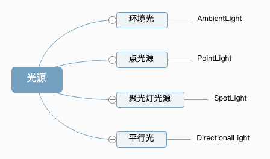
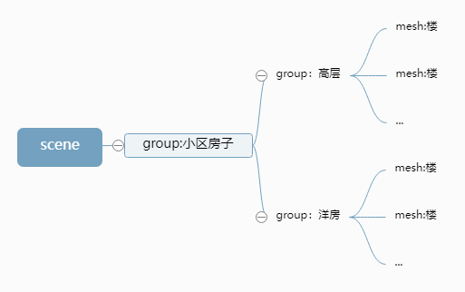
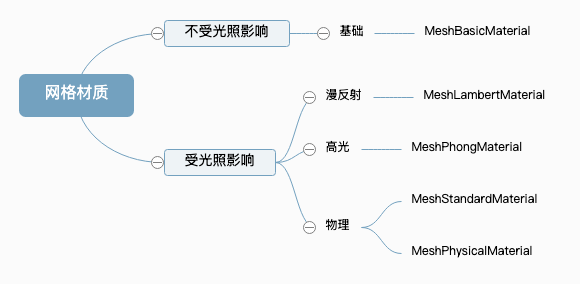
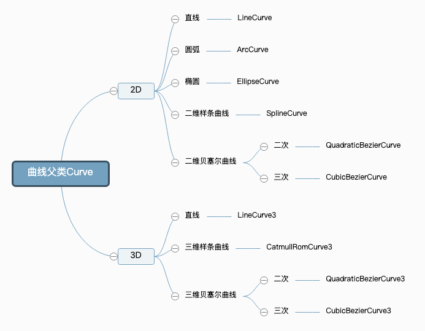
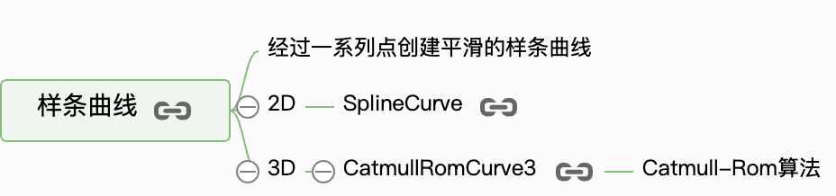
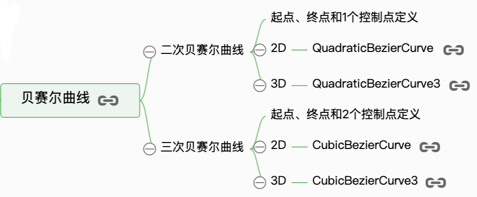
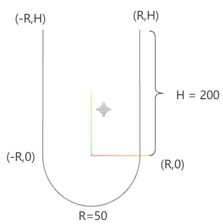
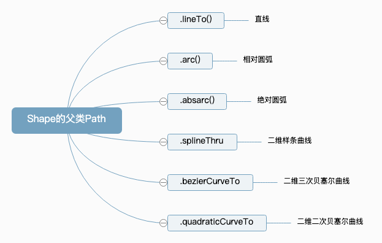

# Three.js基础课程

## 开始

[**官网**](https://threejs.org/docs/index.html#manual/zh/introduction/Installation "官网")

[**threejs教程电子书**](http://www.webgl3d.cn/pages/aac9ab/ "threejs教程电子书")

[**学习视频**](https://study.163.com/course/introduction.htm?courseId=1212760820&_trace_c_p_k2_=48c4bca8f6884a47830c69fe8852ab56 "学习视频")

[**blender教程**](https://study.163.com/course/introduction.htm?courseId=1213106822#/courseDetail?tab=1 "blender教程")

**3D模型gltf下载网站**

[http://www.webgl3d.cn/pages/c3ecc9/](http://www.webgl3d.cn/pages/c3ecc9/ "http://www.webgl3d.cn/pages/c3ecc9/")

[https://www.cpengx.cn/](https://www.cpengx.cn/ "https://www.cpengx.cn/")

**安装**

```javascript 
// 比如安装148版本
npm install three@0.148.0 --save

```


**引入**

```javascript 
// 引入three.js
import * as THREE from 'three';

```


**引入three.js其他扩展库**

```javascript 
// 引入扩展库OrbitControls.js
import { OrbitControls } from 'three/addons/controls/OrbitControls.js';
// 引入扩展库GLTFLoader.js
import { GLTFLoader } from 'three/addons/loaders/GLTFLoader.js';


// 扩展库引入——旧版本，比如122, 新版本路径addons替换了examples/jsm
import { OrbitControls } from 'three/examples/jsm/controls/OrbitControls.js';


```


## 一、快速入门

### 创建第一个3D案例

基本概念

场景Scene、相机Camera、渲染器Renderer

#### [第一步：创建3D场景](http://www.webgl3d.cn/pages/2e5d69/ "第一步：创建3D场景")

1. 创建 三维场景`Scene`
2. 创建 物体形状：几何体`Geometry`
3. 创建 物体外观：材质`Material`
4. 创建 物体：网格模型`Mesh`
5. 设置 模型位置`.position`
6. `.add()`方法 将模型添加到场景中

```javascript 
// 引入three.js
import * as THREE from 'three';
/**
 * 创建3D场景对象Scene
 */
const scene = new THREE.Scene();
/**
 * 创建网格模型
 */
//创建一个长方体几何对象Geometry
const geometry = new THREE.BoxGeometry(50, 50, 50);
// 材质对象Material
// 设置为基础网格材质
const material = new THREE.MeshBasicMaterial({
    color: 0x0000ff, //设置材质颜色
});
const mesh = new THREE.Mesh(geometry, material); // 网格模型对象Mesh
// 设置网格模型在三维空间中的位置坐标，默认是坐标原点
mesh.position.set(0,10,0);
scene.add(mesh); //网格模型添加到场景中 

// console.log('三维场景',scene);
```


#### [第二步：创建透视投影相机](http://www.webgl3d.cn/pages/c0b143/ "第二步：创建透视投影相机")

1. 实例化一个 透视投影相机`PerspectiveCamera`
2. 设置 相机位置.position
3. 设置 相机观察目标`.lookAt()`
4. 定义相机渲染输出的画布尺寸
5. 设置参数  透视投影相机`PerspectiveCamera`：视锥体

   透视投影相机的四个参数`fov, aspect, near, far`构成一个**四棱台**3D空间，被称为**视锥体**，只有视锥体之内的物体，才会渲染出来，视锥体范围之外的物体不会显示在Canvas画布上。

| 参数     | 含义                                               | 默认值  |
| ------ | ------------------------------------------------ | ---- |
| fov    | 相机视锥体竖直方向视野角度                                    | 50   |
| aspect | 相机视锥体水平方向和竖直方向长度比，一般设置为Canvas画布宽高比width / height | 1    |
| near   | 相机视锥体近裁截面相对相机距离                                  | 0.1  |
| far    | 相机视锥体远裁截面相对相机距离，far-near构成了视锥体高度方向               | 2000 |
|        |               |      |

```javascript 
// width和height用来设置渲染后，输出的画布宽高度。
const width = 800; //宽度
const height = 500; //高度
/**
 * 透视投影相机设置
 */
// 30:视场角度, width / height:Canvas画布宽高比, 1:近裁截面, 3000：远裁截面
const camera = new THREE.PerspectiveCamera(30, width / height, 1, 3000);

camera.position.set(200, 200, 200); //相机在Three.js三维坐标系中的位置

//相机观察目标指向Threejs 3D空间中某个位置
camera.lookAt(0, 0, 0); //坐标原点
// camera.lookAt(0, 10, 0);  //y轴上位置10
// camera.lookAt(mesh.position);//指向mesh对应的位置

```


#### [第三步：创建渲染器](http://www.webgl3d.cn/pages/b483f0/ "第三步：创建渲染器")

1. 创建WebGL渲染器WebGLRenderer
2. 设置Canvas画布尺寸`.setSize()`
3. 渲染器渲染方法`.render()`
4. 将canvas画布插入到web页面中  渲染器Canvas画布属性`.domElement`

```javascript 
/**
 * 创建渲染器对象
 */
const renderer = new THREE.WebGLRenderer();
renderer.setSize(width, height); //设置three.js渲染区域的尺寸(像素px)
renderer.render(scene, camera); //执行渲染操作，类比相机的拍照动作
//three.js执行渲染命令会输出一个canvas画布，也就是一个HTML元素，你可以插入到web页面中
document.body.appendChild(renderer.domElement);
```


### 三维坐标系

- 创建辅助观察坐标系

`THREE.AxesHelper()`的参数表示坐标系坐标轴线段尺寸大小，你可以根据需要改变尺寸。

```javascript 
// AxesHelper：辅助观察的坐标系
const axesHelper = new THREE.AxesHelper(150);
scene.add(axesHelper);

```


- 材质半透明设置

设置材质半透明,这样可以看到坐标系的坐标原点。

```typescript 
const material = new THREE.MeshBasicMaterial({
    color: 0x0000ff, //设置材质颜色
    transparent:true,//开启透明
    opacity:0.5,//设置透明度
});
```


- `AxesHelper`的xyz轴

three.js坐标轴颜色红**R**、绿**G**、蓝**B**分别对应坐标系的**x**、**y**、**z**轴，对于three.js的3D坐标系默认**y轴朝上**。

### [光源](http://www.webgl3d.cn/pages/b9504a/ "光源")



**基础网格材质**[MeshBasicMaterial](https://threejs.org/docs/index.html?q=MeshBasicMaterial#api/zh/materials/MeshBasicMaterial "MeshBasicMaterial")不会受到光照影响。

**漫反射网格材质**[MeshLambertMaterial](https://threejs.org/docs/index.html?q=MeshLambertMaterial#api/zh/materials/MeshLambertMaterial "MeshLambertMaterial")会受到光照影响，该材质也可以称为**Lambert网格材质**，音译为兰伯特网格材质。

1. 设置物体使用漫反射网格材质
2. 创建点光源
3. 设置光源位置
4. 光源添加到场景

```javascript 
// 材质对象Material
// 基础网格材质MeshBasicMaterial不受光照影响
// 漫反射网格材质；MeshLambertMaterial
const material = new THREE.MeshLambertMaterial({
    color: 0x00ffff, //设置材质颜色
});

/**

 * 光源设置
 */
//点光源
const pointLight = new THREE.PointLight(0xffffff, 1.0); // 光照颜色、光照强度
pointLight.decay = 0.0;//光源光照强度不随距离改变衰减
//点光源位置
// pointLight.position.set(400, 0, 0);//点光源放在x轴上
pointLight.position.set(400, 200, 300);//偏移光源位置，观察渲染效果变化
scene.add(pointLight); //点光源添加到场景中
```


- 点光源辅助观察`PointLightHelper`

```javascript 
// 光源辅助观察
const pointLightHelper = new THREE.PointLightHelper(pointLight, 10); // 要模拟的光源, 辅助对象的尺寸
scene.add(pointLightHelper);

```


### 相机控件OrbitControls

- 旋转：拖动鼠标左键
- 缩放：滚动鼠标中键
- 平移：拖动鼠标右键

1. 引入扩展库OrbitControls.js
2. 创建OrbitControls实例
3. 监听控制器，执行渲染操作

```javascript 
// 引入轨道控制器扩展库OrbitControls.js
import {
    OrbitControls
} from 'three/addons/controls/OrbitControls.js';

// 设置相机控件轨道控制器OrbitControls
const controls = new OrbitControls(camera, renderer.domElement);
// 如果OrbitControls改变了相机参数，重新调用渲染器渲染三维场景
controls.addEventListener('change', function () {
    renderer.render(scene, camera); //执行渲染操作
    // 浏览器控制台查看相机位置变化
    console.log('camera.position',camera.position);
});//监听鼠标、键盘事件


```


### 环境光

环境光[AmbientLight (opens new window)](https://threejs.org/docs/index.html?q=AmbientLight#api/zh/lights/AmbientLight "AmbientLight (opens new window)")没有特定方向，只是整体改变场景的光照明暗。

```javascript 
//环境光:没有特定方向，整体改变场景的光照明暗
const ambient = new THREE.AmbientLight(0xffffff, 0.4); // 光照颜色、光照强度
scene.add(ambient);

```


### 平行光

平行光[DirectionalLight (opens new window)](https://threejs.org/docs/index.html?q=DirectionalLight#api/zh/lights/DirectionalLight "DirectionalLight (opens new window)")就是沿着特定方向发射。

1. 创建平行光
2. 设置光源的方向position
3. 设置光源指向对象 target，默认为原点
4. 光源添加到场景

```javascript 
// 平行光
const directionalLight = new THREE.DirectionalLight(0xffffff, 1);
// 设置光源的方向：通过光源position属性和目标指向对象的position属性计算
directionalLight.position.set(80, 100, 50);
// 方向光指向对象网格模型mesh，可以不设置，默认的位置是0,0,0
directionalLight.target = mesh;
scene.add(directionalLight);

```


- 平行光辅助观察DirectionalLightHelper

```javascript 
// DirectionalLightHelper：可视化平行光
const dirLightHelper = new THREE.DirectionalLightHelper(directionalLight, 5, 0xff0000); // 模拟光源，辅助对象尺寸，模拟光源的颜色
scene.add(dirLightHelper);

```


### 动画渲染循环

- 请求动画帧`window.requestAnimationFrame`
  - threejs可以借助HTML5的API请求动画帧`window.requestAnimationFrame`实现动画渲染。
  - requestAnimationFrame实现周期性循环执行
  - requestAnimationFrame默认每秒钟执行60次，但不一定能做到，要看代码的性能
- 创建渲染器对象后执行渲染操作就可以放到渲染循环中做了
- 设置了渲染循环，相机控件OrbitControls就不用再通过事件`change`执行渲染操作了

```javascript 
/**
 * 创建渲染器对象
 */
const renderer = new THREE.WebGLRenderer();
renderer.setSize(width, height); //设置three.js渲染区域的尺寸(像素px)
// renderer.render(scene, camera); //执行渲染操作
//three.js执行渲染命令会输出一个canvas画布，也就是一个HTML元素，你可以插入到web页面中
document.body.appendChild(renderer.domElement);

// 渲染循环
// requestAnimationFrame实现周期性循环执行
// requestAnimationFrame默认每秒钟执行60次，但不一定能做到，要看代码的性能
function render() {
    renderer.render(scene, camera); //执行渲染操作
    mesh.rotateY(0.01); //每次绕y轴旋转0.01弧度
    requestAnimationFrame(render); //请求再次执行渲染函数render，渲染下一帧
}
render();

// 设置相机控件轨道控制器OrbitControls
const controls = new OrbitControls(camera, renderer.domElement);
// // 如果OrbitControls改变了相机参数，重新调用渲染器渲染三维场景
// controls.addEventListener('change', function () {
//     renderer.render(scene, camera); //执行渲染操作
// }); //监听鼠标、键盘事件
```


### canvas画布宽高度动态变化

canvas画布宽高度动态变化,需要更新相机和渲染的参数，否则无法正常渲染。

```javascript 
// onresize 事件会在窗口被调整大小时发生
window.onresize = function () {
    // 重置渲染器输出画布canvas尺寸
    renderer.setSize(window.innerWidth, window.innerHeight);
    // 全屏情况下：设置观察范围长宽比aspect为窗口宽高比
    camera.aspect = window.innerWidth / window.innerHeight;
    // 渲染器执行render方法的时候会读取相机对象的投影矩阵属性projectionMatrix
    // 但是不会每渲染一帧，就通过相机的属性计算投影矩阵(节约计算资源)
    // 如果相机的一些属性发生了变化，需要执行updateProjectionMatrix ()方法更新相机的投影矩阵
    camera.updateProjectionMatrix();
};

```


### 通过stats.js扩展库 查看threejs渲染帧率

通过stats.js库可以查看three.js当前的渲染性能，具体说就是计算three.js的渲染帧率(FPS)。

所谓渲染帧率(FPS)，简单说就是three.js每秒钟完成的渲染次数，一般渲染达到每秒钟60次为最佳状态。

1. 引入Stats
2. 创建Stats对象
3. 将 stats.domElement 插入到web页面中
4. 在渲染函数中调用方法 stats.update()，来刷新时间

```javascript 
//引入性能监视器stats.js,显示帧率
import Stats from 'three/addons/libs/stats.module.js';
//创建stats对象
const stats = new Stats();
//Stats.domElement:web页面上输出计算结果,一个div元素
document.body.appendChild(stats.domElement);

// 渲染循环
function render() {
    stats.update();//渲染循环中执行stats.update()来刷新时间
    renderer.render(scene, camera); 
    mesh.rotateY(0.01);
    requestAnimationFrame(render);
}
render();

```


- 设置显示模式 setMode

```javascript 
// stats.domElement显示：渲染帧率  刷新频率,一秒渲染次数 
stats.setMode(0); // 默认模式

// stats.domElement显示：渲染周期  渲染一帧多长时间(单位：毫秒ms)
stats.setMode(1);

```


### Threejs常见几何体简介

```javascript 
//BoxGeometry：长方体
const geometry = new THREE.BoxGeometry(100, 100, 100);
// SphereGeometry：球体
const geometry = new THREE.SphereGeometry(50);
// CylinderGeometry：圆柱
const geometry = new THREE.CylinderGeometry(50,50,100);
// PlaneGeometry：矩形平面
const geometry = new THREE.PlaneGeometry(100,50);
// CircleGeometry：圆形平面
const geometry = new THREE.CircleGeometry(50);

```


Three.js的材质**默认正面可见**，反面不可见,对于**矩形**平面`PlaneGeometry`、**圆形**平面如果你想看到两面，可以设置`side: THREE.DoubleSide`。

```javascript 
const material = new THREE.MeshLambertMaterial({
    color: 0x00ffff, 
    // side: THREE.FrontSide, // 默认只有正面可见
    side: THREE.DoubleSide,// 双面可见
});
const mesh = new THREE.Mesh(geometry, material);
scene.add(mesh); 
```


### 高光网格材质Phong


`MeshPhongMaterial`可以提供一个镜面反射效果，该材质可以模拟具有镜面高光的光泽表面（例如涂漆木材）。

```javascript 
// 模拟镜面反射，产生一个高光效果
const material = new THREE.MeshPhongMaterial({
    color: 0xff0000,
    shininess: 20, // 高光部分的亮度，默认30
    specular: 0x444444, // 高光部分的颜色
});

```


### WebGL渲染器设置

- 渲染器锯齿属性`.antialias`
- 设置设备像素比`.setPixelRatio()`
- 设置背景颜色`.setClearColor()`

```javascript 
// WebGL渲染器设置
const renderer = new THREE.WebGLRenderer({
    antialias:true,//开启优化锯齿
});
renderer.setSize(width, height);
document.body.appendChild(renderer.domElement);

// 不同硬件设备的屏幕的设备像素比window.devicePixelRatio值可能不同
console.log('查看当前屏幕设备像素比',window.devicePixelRatio);

// 获取你屏幕对应的设备像素比.devicePixelRatio告诉threejs,以免渲染模糊问题
renderer.setPixelRatio(window.devicePixelRatio);

renderer.setClearColor(0x444444, 1); //设置背景颜色
```


### gui.js扩展库（可视化调整三维场景）

- 引入gui.js
  ```javascript 
  // 引入dat.gui.js的一个类GUI
  import { GUI } from 'three/addons/libs/lil-gui.module.min.js';

  ```

- 创建一个GUI对象
  ```javascript 
  // 实例化一个gui对象
  const gui = new GUI();

  // 改变交互界面style属性
  gui.domElement.style.right = '0px';
  gui.domElement.style.width = '300px';
  ```

- `.add()`方法快速创建UI交互界面

  格式：`.add(控制对象，对象具体属性，其他参数)`
  - 拖动条
    ```javascript 
    // 一个网格模型
    const geometry = new THREE.BoxGeometry(20, 20, 20);
    const material = new THREE.MeshLambertMaterial({color: 0x00ffff});
    const mesh = new THREE.Mesh(geometry, material);
    scene.add(mesh);

    // 通过GUI改变mesh.position对象的xyz属性
    gui.add(mesh.position, 'x', 0, 180);
    gui.add(mesh.position, 'y', 0, 180);
    gui.add(mesh.position, 'z', 0, 180);

    ```

  - 下拉菜单

    参数3是**数组或对象**时，生成的交互界面是下拉菜单
    ```javascript 
    gui.add(mesh.position, 'x', [-100, 0, 100]);

    gui.add(mesh.position, 'y', {
      左: -100, // 可以用中文
      中: 0,
      右: 100
    });

    ```

  - 单选框

    如果`.add()`改变属性的对应的数据类型如果是布尔值，那么交互界面就是一个单选框。
    ```javascript title="控制一个对象是否旋转"
    const obj = {
        rotate: false,
    };
    gui.add(obj, 'rotate').name('是否旋转');

    // 渲染循环
    function render() {
        // 当gui界面设置obj.rotate为true，mesh执行旋转动画
        if (obj.rotate) mesh.rotateY(0.01);
        renderer.render(scene, camera);
        requestAnimationFrame(render);
    }
    render();

    ```

- `.name()`方法 改变gui生成交互界面显示的内容
  ```javascript 
  //光源设置
  const directionalLight = new THREE.DirectionalLight(0xffffff, 1);
  directionalLight.position.set(100, 60, 50);
  scene.add(directionalLight);
  const ambient = new THREE.AmbientLight(0xffffff, 0.4);
  scene.add(ambient);

  // 通过GUI改变光照强度，范围0-2
  gui.add(ambient, 'intensity', 0, 2.0).name('环境光强度');
  gui.add(directionalLight, 'intensity', 0, 2.0).name('平行光强度');
  ```

- 步长`.step()`方法 设置交互界面每次改变属性值的间隔
  ```javascript 
  gui.add(ambient, 'intensity', 0, 2.0).name('环境光强度').step(0.1);

  ```

- `.onChange()`方法监听对应交互界面的属性变化
  ```javascript 
  const obj = {
      x: 30,
  };
  // 当obj的x属性变化的时候，就把此时obj.x的值value赋值给mesh的x坐标
  gui.add(obj, 'x', 0, 180).onChange(function(value){
    // 你可以写任何你想跟着obj.x同步变化的代码
      mesh.position.x = value;
  });

  ```

- `.addColor()`生成颜色值改变的交互界面
  ```javascript 
  gui.addColor(mesh.material, 'color');
  ```

- `.addFolder()`分组

  `.addFolder()`返回的子文件夹对象，同样具有gui对象的`.add()`、`.onChange()`、`.addColor()`等等属性。
  ```javascript 
  const gui = new GUI(); //创建GUI对象 
  const obj = {
      color: 0x00ffff,// 材质颜色
  };
  // 创建材质子菜单
  const matFolder = gui.addFolder('材质');
  // 材质颜色color
  matFolder.addColor(material, 'color')

  ```

- 关闭`.close()`和展开`.open()`交互界面
  ```javascript 
  // gui.close();//关闭菜单

  matFolder.close();

  ```


## 二、缓冲类型几何体BufferGeometry

BufferGeometry是一个没有任何形状的空几何体，你可以通过BufferGeometry自定义任何几何形状，具体一点说就是定义**顶点数据**。

### 定义一个几何体

1. 通过缓冲类型几何体`BufferGeometry`创建空几何体对象
2. 通过javascript[类型化数组](https://developer.mozilla.org/zh-CN/docs/Web/JavaScript/Typed_arrays "类型化数组")`Float32Array`创建一组xyz坐标数据用来表示几何体的顶点坐标
3. 通过`BufferAttribute`定义几何体顶点数据
4. 设置几何体顶点`.attributes.position`

```javascript 
const geometry = new THREE.BufferGeometry(); //创建一个空几何体对象
//类型数组创建顶点数据
const vertices = new Float32Array([
    0, 0, 0, //顶点1坐标
    50, 0, 0, //顶点2坐标
    0, 100, 0, //顶点3坐标
    0, 0, 10, //顶点4坐标
    0, 0, 100, //顶点5坐标
    50, 0, 10, //顶点6坐标
]);
// 创建属性缓冲区对象
const attribue = new THREE.BufferAttribute(vertices, 3); //3个为一组，表示一个顶点的xyz坐标
// 设置几何体attributes属性的位置属性
geometry.attributes.position = attribue;
```


### 创建点模型对象

1. 创建点材质`PointsMaterial`
2. 使用几何体和点材质 创建点模型对象`Points`

```javascript 
// 点渲染模式
const material = new THREE.PointsMaterial({
    color: 0xffff00,
    size: 10.0 //点对象像素尺寸
}); 
const points = new THREE.Points(geometry, material); // 点模型对象
```


### 创建线模型对象

1. 创建线材质`LineBasicMaterial`
2. 使用几何体和线材质 创建线模型对象
   - `Line`：一条连续的线
   - `LineLoop`：一条头尾相接的连续的线
   - `LineSegments`：线段

```javascript 
// 线条渲染模式
const material = new THREE.LineBasicMaterial({
    color: 0xffff00 //线条颜色
}); //材质对象
// 创建线模型对象   构造函数：Line、LineLoop、LineSegments
const line = new THREE.Line(geometry, material); //线条模型对象
```


### 创建网格模型对象

网格模型Mesh其实就一个一个三角形(面)拼接构成。使用网格模型Mesh渲染几何体geometry，就是几何体所有顶点坐标三个为一组，构成一个三角形，多组顶点构成多个三角形，就可以用来模拟表示物体的表面。

空间中一个三角形有正反两面，那么Three.js的规则是如何区分正反面的？非常简单，你的眼睛(相机)对着三角形的一个面，**如果三个顶点的顺序是逆时针方向，该面视为正面，如果三个顶点的顺序是顺时针方向，该面视为反面。**

```javascript 
const material = new THREE.MeshBasicMaterial({
    color: 0x00ffff, //材质颜色
    // side: THREE.FrontSide, //默认只有正面可见
    // side: THREE.BackSide, //设置只有背面可见
    side: THREE.DoubleSide, //两面可见
});
// 网格模型本质：一个一个三角形(面)构成
const mesh = new THREE.Mesh(geometry, material); 
```


### 构建一个矩形平面几何体

一个矩形平面，可以至少通过两个三角形拼接而成。而且两个三角形有两个顶点的坐标是重合的。

```javascript 
//类型数组创建顶点数据
const vertices = new Float32Array([
    0, 0, 0, //顶点1坐标
    80, 0, 0, //顶点2坐标
    80, 80, 0, //顶点3坐标

    0, 0, 0, //顶点4坐标   和顶点1位置相同
    80, 80, 0, //顶点5坐标  和顶点3位置相同
    0, 80, 0, //顶点6坐标
]);

```


### 几何体顶点索引数据

可以借助几何体顶点索引`geometry.index`来减少顶点坐标数据量

1、把上一节三角形重复的顶点位置坐标删除

2、通过Uint16Array类型数组创建顶点索引数据

3、索引数据赋值给几何体的index属性

```javascript 
import * as THREE from 'three';

const geometry = new THREE.BufferGeometry(); //创建一个几何体对象
// 类型数组创建顶点数据 把上一节三角形重复的顶点位置坐标删除
const vertices = new Float32Array([
    0, 0, 0, //顶点1坐标
    80, 0, 0, //顶点2坐标
    80, 80, 0, //顶点3坐标
    0, 80, 0, //顶点4坐标
]);
// 创建属性缓冲区对象
const attribue = new THREE.BufferAttribute(vertices, 3); //3个为一组，表示一个顶点的xyz坐标
// 设置几何体attributes属性的位置属性
geometry.attributes.position = attribue;

// Uint16Array类型数组创建顶点索引数据
const indexes = new Uint16Array([
    0, 1, 2, 0, 2, 3,
])
// BufferAttribute表示顶点索引属性的值
geometry.index = new THREE.BufferAttribute(indexes, 1); // 1个为一组
// 索引数据赋值给几何体的index属性
const material = new THREE.MeshBasicMaterial({
    color: 0x00ffff, 
    // side: THREE.FrontSide, //默认只有正面可见
    // side: THREE.BackSide, //设置只有背面可见
    side: THREE.DoubleSide, //两面可见
});
// 网格模型本质：一个一个三角形(面)构成
const mesh = new THREE.Mesh(geometry, material);

export default mesh;
```


### 顶点法线数据

把前面两节课的案例源码中`MeshBasicMaterial`材质改为`MeshLambertMaterial`材质，你会发现原来的矩形平面无法正常渲染，这其实很简单，使用受光照影响的材质，几何体BufferGeometry需要定义**顶点法线**数据`.attributes.normal`。

Three.js中法线是通过顶点定义，默认情况下，每个顶点都有一个法线数据，就像每一个顶点都有一个位置数据。

```javascript 
// 矩形平面，有索引，两个三角形，有2个顶点重合，有4个顶点
// 每个顶点的法线数据和顶点位置数据一一对应
const normals = new Float32Array([
    0, 0, 1, //顶点1法线( 法向量 )
    0, 0, 1, //顶点2法线
    0, 0, 1, //顶点3法线
    0, 0, 1, //顶点4法线
]);
// 设置几何体的顶点法线属性.attributes.normal
geometry.attributes.normal = new THREE.BufferAttribute(normals, 3);


// MeshBasicMaterial不受光照影响
// 使用受光照影响的材质，几何体Geometry需要定义顶点法线数据
const material = new THREE.MeshLambertMaterial({
    color: 0x0000ff, 
    side: THREE.DoubleSide, //两面可见
});

```


### [查看threejs自带几何体顶点](http://www.webgl3d.cn/pages/d8b07b/ "查看threejs自带几何体顶点")

### [旋转、缩放、平移几何体](http://www.webgl3d.cn/pages/1b0d6c/ "旋转、缩放、平移几何体")

## 三、模型对象、材质

点模型`Points`、线模型`Line`、网格网格模型`Mesh`等模型对象的父类都是[Object3D](http://www.yanhuangxueyuan.com/threejs/docs/index.html#api/zh/core/Object3D "Object3D")

### 三维向量Vector3与模型位置.position

三维向量`Vector3`有xyz三个分量，threejs中会用三维向量`Vector3`表示很多种数据，例如位置`.position`和缩放`.scale`属性。

```javascript 
//new THREE.Vector3()实例化一个三维向量对象
const v3 = new THREE.Vector3(0,0,0);
console.log('v3', v3);
v3.set(10,0,0);//set方法设置向量的值
v3.x = 100;//访问x、y或z属性改变某个分量的值
```


**改变模型位置**

```javascript 
mesh.position.y = 80;
// 或者
mesh.position.set(80,2,10);

```


**缩放**

```javascript 
mesh.scale.x = 2.0;
// 或者
mesh.scale.set(0.5, 1.5, 2)

```


**沿着自定义的方向移动**

```javascript 
//向量Vector3对象表示方向
const axis = new THREE.Vector3(1, 1, 1);
axis.normalize(); //向量归一化
//沿着axis轴表示方向平移100
mesh.translateOnAxis(axis, 100);

```


### 欧拉Euler与角度属性.rotation

模型的角度属性`.rotation`的属性值是欧拉对象[Euler](https://threejs.org/docs/index.html?q=Euler#api/zh/math/Euler "Euler")

```javascript 
// 创建一个欧拉对象，表示绕着xyz轴分别旋转45度，0度，90度
const Euler = new THREE.Euler( Math.PI/4,0, Math.PI/2);

// 也可以通过属性设置欧拉对象的三个分量值。
const Euler = new THREE.Euler();
Euler.x = Math.PI/4;
Euler.y = Math.PI/2;
Euler.z = Math.PI/4;

```


**改变角度**

```javascript 
//绕y轴的角度设置为60度
mesh.rotation.y = Math.PI/3;
//绕y轴的角度增加60度
mesh.rotation.y += Math.PI/3;
//绕y轴的角度减去60度
mesh.rotation.y -= Math.PI/3;
// 绕x轴旋转π/4
mesh.rotateX(Math.PI/4);

```


**绕某个轴旋转**

```javascript 
const axis = new THREE.Vector3(0,1,0);//向量axis
mesh.rotateOnAxis(axis,Math.PI/3);//绕y轴旋转60度

```


**旋转动画**

```javascript 
// 渲染循环
function render() {
    model.rotation.y+=0.01;
    // 或 model.rotateY(0.01);
    requestAnimationFrame(render);
}

```


### 克隆.clone()和复制.copy()

克隆`.clone()`简单说就是复制并实例化一个和原对象一样的新对象

```javascript 
const v1 = new THREE.Vector3(1, 2, 3);
console.log('v1',v1);
//v2是一个新的Vector3对象，和v1的.x、.y、.z属性值一样
const v2 = v1.clone();
console.log('v2',v2);

```


复制`.copy()`简单说就是把一个对象属性的属性值赋值给另一个对象

```javascript 
const v1 = new THREE.Vector3(1, 2, 3);
const v3 = new THREE.Vector3(4, 5, 6);
//读取v1.x、v1.y、v1.z的赋值给v3.x、v3.y、v3.z
v3.copy(v1);

```


```javascript 
// Mesh克隆
const mesh2 = mesh.clone();
mesh2.position.x = 100;

// 注意：通过克隆.clone()获得的新模型和原来的模型共享材质和几何体
// 改变材质颜色，或者说改变mesh2颜色，mesh和mesh2颜色都会改变
// material.color.set(0xffff00);
mesh2.material.color.set(0xffff00);

// 解决方法：克隆几何体和材质，重新设置mesh2的材质和几何体属性
mesh2.geometry = mesh.geometry.clone();
mesh2.material = mesh.material.clone();
// 改变mesh2颜色，不会改变mesh的颜色
mesh2.material.color.set(0xff0000);

```


## 四、层级模型

- 创建了两个网格模型mesh1、mesh2
- 通过`THREE.Group`类创建一个组对象group，通过`add`方法把网格模型mesh1、mesh2作为设置为组对象group的子对象
- 通过执行`scene.add(group)`把组对象group作为场景对象的scene的子对象

这样就构成了一个三层的层级结构

```javascript 
//创建两个网格模型mesh1、mesh2
const geometry = new THREE.BoxGeometry(20, 20, 20);
const material = new THREE.MeshLambertMaterial({color: 0x00ffff});
const group = new THREE.Group();
const mesh1 = new THREE.Mesh(geometry, material);
const mesh2 = new THREE.Mesh(geometry, material);
mesh2.translateX(25);
//把mesh1型插入到组group中，mesh1作为group的子对象
group.add(mesh1);
//把mesh2型插入到组group中，mesh2作为group的子对象
group.add(mesh2);
//把group插入到场景中作为场景子对象
scene.add(group);

```


### 遍历模型树结构



通过`.traverse()`递归遍历一个模型对象包含的所有后代

```javascript 
// 递归遍历model包含所有的模型节点
model.traverse(function(obj) {
    console.log('所有模型节点的名称',obj.name);
    // obj.isMesh：if判断模型对象obj是不是网格模型'Mesh'
    if (obj.isMesh) {//判断条件也可以是obj.type === 'Mesh'
        obj.material.color.set(0xffff00);
    }
});

```


### 查询模型节点

查找某个具体的模型`.getObjectByName()`

```javascript 
// 返回名.name为"4号楼"对应的对象
const nameNode = scene.getObjectByName ("4号楼");
nameNode.material.color.set(0xff0000);

```


### 本地坐标和世界坐标

任何一个模型的**本地坐标**(**局部坐标**)就是模型的`.position`属性。

一个模型的**世界坐标**，说的是，模型自身`.position`和所有父对象`.position`累加的坐标。

```javascript 
// mesh的世界坐标就是mesh.position与group.position的累加
const mesh = new THREE.Mesh(geometry, material); 
mesh.position.set(50, 0, 0);
const group = new THREE.Group();
group.add(mesh);
group.position.set(50, 0, 0);

```


\*\*`.getWorldPosition()`\*\***获取世界坐标**

`mesh.getWorldPosition(Vector3)`读取一个模型的世界坐标，并把读取结果存储到参数`Vector3`中。

```javascript 
// 声明一个三维向量用来表示某个坐标
const worldPosition = new THREE.Vector3();
// 获取mesh的世界坐标，你会发现mesh的世界坐标受到父对象group的.position影响
mesh.getWorldPosition(worldPosition);
console.log('世界坐标',worldPosition);
console.log('本地坐标',mesh.position);

```


\*\*`.add`\*\***给子对象添加一个局部坐标系**

```javascript 
//可视化mesh的局部坐标系
const meshAxesHelper = new THREE.AxesHelper(50);
mesh.add(meshAxesHelper);

```


**改变模型相对局部坐标原点位置**

通过改变几何体顶点坐标，可以改变模型自身相对坐标原点的位置

```javascript 
//长方体的几何中心默认与本地坐标原点重合
const geometry = new THREE.BoxGeometry(50, 50, 50);
// 平移几何体的顶点坐标,改变几何体自身相对局部坐标原点的位置
geometry.translate(50/2,0,0);

```


### [移除对象](http://www.webgl3d.cn/pages/e66ea7/ "移除对象")[.remove()](http://www.webgl3d.cn/pages/e66ea7/ ".remove()")

### [模型隐藏或显示](http://www.webgl3d.cn/pages/eeb05a/ "模型隐藏或显示")[visible](http://www.webgl3d.cn/pages/eeb05a/ "visible")

## 五、顶点UV坐标、纹理贴图

### 创建纹理贴图

通过纹理贴图加载器`TextureLoader`的`load()`方法加载一张图片可以返回一个纹理对象`Texture`，纹理对象`Texture`可以作为模型材质颜色贴图`.map`属性的值。

**注意：最新版本，webgl渲染器默认编码方式已经改变，为了避免色差，纹理对象编码方式要修改为**\*\*`THREE.SRGBColorSpace`\*\*

```javascript 
const geometry = new THREE.PlaneGeometry(200, 100); 
//纹理贴图加载器TextureLoader
const texLoader = new THREE.TextureLoader();
// .load()方法加载图像，返回一个纹理对象Texture
const texture = texLoader.load('./earth.jpg');
texture.colorSpace  = THREE.SRGBColorSpace; //设置为SRGB颜色空间

const material = new THREE.MeshLambertMaterial({
    // 设置纹理贴图：Texture对象作为材质map属性的属性值
    map: texture,//map表示材质的颜色贴图属性
});

```


### 自定义顶点UV坐标

**顶点UV坐标**的作用是从纹理贴图上提取像素映射到网格模型Mesh的几何体表面上。

顶点UV坐标可以在0\~1.0之间任意取值，纹理贴图**左下角**对应的UV坐标是`(0,0)`，**右上角**对应的坐标`(1,1)`。

顶点UV坐标`geometry.attributes.uv`和顶点位置坐标`geometry.attributes.position`是一一对应的

自定义顶点UV：

```javascript 
/**纹理坐标0~1之间随意定义*/
const uvs = new Float32Array([
    0, 0, //图片左下角
    1, 0, //图片右下角
    1, 1, //图片右上角
    0, 1, //图片左上角
]);
// 设置几何体attributes属性的位置normal属性
geometry.attributes.uv = new THREE.BufferAttribute(uvs, 2); //2个为一组,表示一个顶点的纹理坐标

```


### 圆形平面设置纹理贴图

通过圆形几何体`CircleGeometry`创建一个网格模型Mesh，把一张图片作为圆形Mesh材质的颜色贴图，这样就可以把一张方形图片剪裁渲染为圆形效果。

```javascript 
//CircleGeometry的顶点UV坐标是按照圆形采样纹理贴图
const geometry = new THREE.CircleGeometry(60, 100);
//纹理贴图加载器TextureLoader
const texLoader = new THREE.TextureLoader();
const texture = texLoader.load('./texture.jpg');
const material = new THREE.MeshBasicMaterial({
    map: texture,//map表示材质的颜色贴图属性
    side:THREE.DoubleSide,
});
const mesh = new THREE.Mesh(geometry, material);

```


### 纹理对象Texture阵列

使用threejs纹理对象`Texture`的阵列功能+矩形平面几何体`PlaneGeometry`实现一个地面瓷砖效果

1. 矩形平面设置颜色贴图
   ```javascript 
   const geometry = new THREE.PlaneGeometry(2000, 2000);
   //纹理贴图加载器TextureLoader
   const texLoader = new THREE.TextureLoader();
   // .load()方法加载图像，返回一个纹理对象Texture
   const texture = texLoader.load('./瓷砖.jpg');
   const material = new THREE.MeshLambertMaterial({
       // 设置纹理贴图：Texture对象作为材质map属性的属性值
       map: texture,//map表示材质的颜色贴图属性
   });
   const mesh = new THREE.Mesh(geometry, material);

   ```

2. 纹理对象`Texture`的阵列功能
   ```javascript 
   // .load()方法加载图像，返回一个纹理对象Texture
   const texture = texLoader.load('./瓷砖.jpg');
   // 设置阵列模式
   texture.wrapS = THREE.RepeatWrapping;
   texture.wrapT = THREE.RepeatWrapping;
   // uv两个方向纹理重复数量
   texture.repeat.set(12,12);//注意选择合适的阵列数量

   ```

3. 旋转矩形平面

   矩形平面默认是在XOY平面上，如果你想平行于XOZ平面，就需要手动旋转。
   ```javascript 
   // 旋转矩形平面
   mesh.rotateX(-Math.PI/2);

   ```


### 矩形Mesh+背景透明png贴图

整体思路：创建一个矩形平面，设置颜色贴图`.map`,注意选择背景透明的`.png`图像作为颜色贴图，同时材质设置`transparent: true`，这样png图片背景完全透明的部分不显示。

```javascript 
// 矩形平面网格模型设置背景透明的png贴图
const geometry = new THREE.PlaneGeometry(60, 60); //默认在XOY平面上
const textureLoader = new THREE.TextureLoader();
const material = new THREE.MeshBasicMaterial({
    map: textureLoader.load('./指南针.png'),        
    transparent: true, //使用背景透明的png贴图，注意开启透明计算
});
const mesh = new THREE.Mesh(geometry, material);
mesh.rotateX(-Math.PI / 2);

```


网格地面辅助观察`GridHelper`

```javascript 
// 添加一个辅助网格地面
const gridHelper = new THREE.GridHelper(300, 25, 0x004444, 0x004444);

```


### UV动画

通过纹理对象的偏移属性`.offset`实现一个UV动画效果

纹理对象Texture的`.offset`的功能是偏移贴图在Mesh上位置，本质上相当于修改了UV顶点坐标。

1. 通过阵列纹理贴图设置`.map`
2. 渲染循环中通过`.offset`设置了纹理映射偏移
3. 把`.wrapS`或`.wrapT`设置为重复映射模式`THREE.RepeatWrapping`

```javascript 
// 一个矩形平面几何体用来表示传送带
const geometry = new THREE.PlaneGeometry(200, 20);
//纹理贴图加载器TextureLoader
const texLoader = new THREE.TextureLoader();
// .load()方法加载图像，返回一个纹理对象Texture
const texture = texLoader.load('./纹理3.jpg');

const material = new THREE.MeshLambertMaterial({
    map: texture,//map表示材质的颜色贴图属性
});
const mesh = new THREE.Mesh(geometry, material);
mesh.rotateX(-Math.PI/2);

// 设置阵列
texture.wrapS = THREE.RepeatWrapping;
// uv两个方向纹理重复数量
texture.repeat.x=50;//注意选择合适的阵列数量


// 渲染循环
function render() {
    texture.offset.x +=0.001;//设置纹理动画：偏移量根据纹理和动画需要，设置合适的值
    renderer.render(scene, camera);
    requestAnimationFrame(render);
}
render();


```


## 六、加载外部三维模型(gltf)

### 加载.gltf文件(模型加载全流程)

1. gltf模型加载器`GLTFLoader.js`
   ```javascript 
   // 引入gltf模型加载库GLTFLoader.js
   import { GLTFLoader } from 'three/addons/loaders/GLTFLoader.js';

   // 创建GLTF加载器对象
   const loader = new GLTFLoader();


   loader.load( 'gltf模型.gltf', function ( gltf ) {
     console.log('控制台查看加载gltf文件返回的对象结构',gltf);
     console.log('gltf对象场景属性',gltf.scene);
     // 返回的场景对象gltf.scene插入到threejs场景中
     scene.add( gltf.scene );
   })

   ```

2. 相机参数根据需要设置

   大部分3D项目，一般都是使用**透视投影相机**`PerspectiveCamera`
   ```javascript 
   // 近裁截面near和远裁截面far，要能包含你想渲染的场景，否则超出视锥体模型会被剪裁掉，简单说near足够小，far足够大，主要是far。
   const camera = new THREE.PerspectiveCamera(30, width / height, 1, 3000);
   // camera.position.set(200, 200, 200);// 第1步：根据场景渲染范围尺寸设置 
   camera.position.set(292, 223, 185);// 第2步：通过相机控件OrbitControls的.position属性辅助设置
   camera.lookAt(100, 0, 0); // 通过相机控件OrbitControls的.lookAt属性辅助设置

   // 注意相机控件OrbitControls会影响lookAt设置，注意手动设置OrbitControls的目标参数，默认0,0,0
   // 设置相机控件轨道控制器OrbitControls
   const controls = new OrbitControls(camera, renderer.domElement);
   controls.target.set(100, 0, 0);
   controls.update();//update()函数内会执行camera.lookAt(controls.targe)

   ```

3. 加载gltf的时候，webgl渲染器编码方式设置

   查WebGL渲染器文档，你可以看到`.outputColorSpace`的默认值就是SRGB颜色空间`THREE.SRGBColorSpace`，意味着新版本代码中，加载gltf，没有特殊需要，不设置`.outputColorSpace`也不会引起色差。
   ```javascript 
   // 纹理贴图颜色偏差解决
   renderer.outputColorSpace = THREE.SRGBColorSpace;//设置为SRGB颜色空间

   ```


### 加载gltf不同文件形式

单独.gltf文件

```javascript 
// 单独.gltf文件
loader.load("../../工厂.gltf", function (gltf) { 
    scene.add(gltf.scene);
})

```


单独.glb文件

```javascript 
// 单独.glb文件
loader.load("../../工厂.glb", function (gltf) { 
    scene.add(gltf.scene);
})

```


.gltf + .bin + 贴图文件

```javascript 
// .gltf + .bin + 贴图文件
loader.load("../../工厂/工厂.gltf", function (gltf) { 
    scene.add(gltf.scene);
})

```


### 解决多个mesh共享材质的问题

1. 三维建模软件中设置，需要代码改变材质的Mesh不要共享材质，要独享材质。
2. 代码批量更改：克隆材质对象，重新赋值给mesh的材质属性

```javascript 
//用代码方式解决mesh共享材质问题
gltf.scene.getObjectByName("小区房子").traverse(function (obj) {
    if (obj.isMesh) {
        // .material.clone()返回一个新材质对象，和原来一样，重新赋值给.material属性
        obj.material = obj.material.clone();
    }
});
mesh1.material.color.set(0xffff00);
mesh2.material.color.set(0x00ff00);

```


### 纹理和渲染器colorSpace

如果没有特殊需要，一般为了正常渲染，避免颜色偏差，threejs代码中需要颜色贴图`.colorSpace`和渲染器`.colorSpace`属性值保持一致。

```javascript title="Color Space"
THREE.NoColorSpace = ""
THREE.SRGBColorSpace = "srgb"
THREE.LinearSRGBColorSpace = "srgb-linear"
```


```javascript 
//解决加载gltf格式模型颜色偏差问题
renderer.colorSpace = THREE.SRGBColorSpace;
texture.colorSpace = THREE.SRGBColorSpace;

```


### gltf模型更换纹理.map

如果你直接给gltf模型材质设置`.map`属性更换贴图，可能会出现纹理贴图错位的问题，这主要和纹理对象`Texture`的翻转属性`.flipY`有关。

`.flipY`表示是否翻转纹理贴图在Mesh上的显示位置。

纹理对象`Texture`翻转属性`.flipY`默认值是true。

```javascript 
const texLoader = new THREE.TextureLoader();
const texture = texLoader.load('./黑色.png');// 加载手机mesh另一个颜色贴图
texture.colorSpace = THREE.SRGBColorSpace; //和渲染器.colorSpace 一样值

loader.load("../手机模型.glb", function (gltf) {
    const mesh = gltf.scene.children[0]; //获取Mesh
    console.log('.flipY', mesh.material.map.flipY);
    // 注意把纹理贴图.flipY的值设置给gltf中纹理的值
    // 是否翻转纹理贴图
    texture.flipY = false;
})

```


## 七、PBR材质与纹理贴图

PBR就是基于物理的渲染(physically-based rendering)。

Three.js提供了两个PBR材质相关的API`标准网格材质(MeshStandardMaterial)`和`物理网格材质(MeshPhysicalMaterial)`。

`MeshPhysicalMaterial`是`MeshStandardMaterial`扩展的子类，提供了更多功能属性。



### PBR材质金属度`metalness` 和粗糙度`roughness`

**金属度**\*\*`metalness`\*\*&#x20;

表示材质像**金属**的程度, 非金属材料,如木材或石材,使用0.0,金属使用1.0。

threejs的PBR材质，`.metalness`默认是0.5,0.0到1.0之间的值可用于生锈的金属外观。

**粗糙度**\*\*`roughness`\*\*

表示模型表面的光滑或者说粗糙程度，越光滑镜面反射能力越强，越粗糙，表面镜面反射能力越弱，更多地表现为漫反射。

粗糙度`roughness`,0.0表示平滑的镜面反射,1.0表示完全漫反射,默认0.5。

**示例：重新设置材质的金属度和粗糙度属性**

```javascript 
// 引入Three.js
import * as THREE from 'three';
// 引入gltf模型加载库GLTFLoader.js
import { GLTFLoader } from 'three/addons/loaders/GLTFLoader.js';


const loader = new GLTFLoader(); //创建一个GLTF加载器

const model = new THREE.Group(); //声明一个组对象，用来添加加载成功的三维场景

loader.load("../../金属.glb", function (gltf) { 
    // 递归遍历所有模型节点批量修改材质
    gltf.scene.traverse(function(obj) {
        if (obj.isMesh) {//判断是否是网格模型
            // 重新设置材质的金属度和粗糙度属性
            obj.material.metalness = 1.0;//金属度
            obj.material.roughness = 0.5;//表面粗糙度
            
            // obj.material = new THREE.MeshStandardMaterial({
            //     color: obj.material.color, //读取材质原来的颜色
            //     // 金属度属性metalness：材质像金属的程度, 非金属材料,如木材或石材,使用0.0,金属使用1.0。
            //     // metalness默认0.5,0.0到1.0之间的值可用于生锈的金属外观
            //     metalness: 1.0,
            //     // metalness: 0.0,//没有金属质感    
            //     // 粗糙度属性roughness:模型表面粗糙程度,0.0表示平滑的镜面反射,1.0表示完全漫反射,默认0.5                      
            //     roughness: 0.5,
            //     // roughness: 1.0,//设置到完全漫反射状态，表面金属质感比较弱
            //     // roughness: 0.0,//完全镜面反射，就像一面镜子一样，注意配合环境贴图观察更明显
            // })
        }
    });
    model.add(gltf.scene);
})
export default model;

```


### 环境贴图`envMap`**和场景环境属性**\*\*`.environment`\*\*

立方体纹理加载器`CubeTextureLoader`的`.load()`方法是加载6张图片，返回一个立方体纹理对象`CubeTexture`。

所谓**环境贴图**，就是一个模型周围的环境的图像，比如一间房子，房子的**上下左右前后**分别拍摄一张照片，就是3D空间中6个角度方向的照片。

**环境贴图**\*\*`envMap`\*\***属性**

实际生活中，一个物体表面，往往会反射周围的环境。人的眼睛看到的东西，往往反射有周围景物，所以three.js渲染模型，如果想渲染效果更好看，如果想更符合实际生活情况，也需要想办法让模型反射周围景物。

MeshStandardMaterial材质的环境贴图属性是`.envMap`，通过PBR材质的贴图属性可以实现模型表面反射周围景物，这样渲染效果更好。

**环境贴图反射率**\*\*`.envMapIntensity`\*\*

`MeshStandardMaterial`的`.envMapIntensity`属性主要用来设置模型表面反射周围环境贴图的能力，或者说环境贴图对模型表面的影响能力。具体说`.envMapIntensity`相当于环境贴图的系数，环境贴图像素值乘以该系数后，在用于影响模型表面。

**示例：通过环境贴图设置材质的金属效果**

```javascript 
// 加载环境贴图
// 加载周围环境6个方向贴图
// 上下左右前后6张贴图构成一个立方体空间
// 'px.jpg', 'nx.jpg'：x轴正方向、负方向贴图  p:正positive  n:负negative
// 'py.jpg', 'ny.jpg'：y轴贴图
// 'pz.jpg', 'nz.jpg'：z轴贴图
// CubeTexture表示立方体纹理对象，父类是纹理对象Texture
const textureCube = new THREE.CubeTextureLoader()
    .setPath('../../环境贴图/环境贴图0/')
    .load(['px.jpg', 'nx.jpg', 'py.jpg', 'ny.jpg', 'pz.jpg', 'nz.jpg']);
   
loader.load("../../金属.glb", function (gltf) {
    // 递归遍历所有模型节点批量修改材质
    gltf.scene.traverse(function (obj) {
        if (obj.isMesh) { //判断是否是网格模型
            // console.log('obj.material',obj.material);
            // 重新设置材质的金属度和粗糙度属性
            obj.material.metalness = 1.0; //金属度
            obj.material.roughness = 0.35; //表面粗糙度
            obj.material.envMap = textureCube; //设置环境贴图
            // envMapIntensity：控制环境贴图对mesh表面影响程度
            obj.material.envMapIntensity = 1.0;//默认值1, 设置为0.0,相当于没有环境贴图


            // obj.material = new THREE.MeshStandardMaterial({
            //     color: obj.material.color, //读取材质原来的颜色
            //     metalness: 1.0, //金属度
            //     roughness: 0.5, //粗糙度
            //     envMap: textureCube, //设置pbr材质环境贴图
            //     // envMapIntensity：控制环境贴图对mesh表面影响程度
            //     envMapIntensity: 0.0, //默认值1, 设置为0.0,相当于没有环境贴图
            // })
        }
    });
    model.add(gltf.scene);
})

```


**场景环境属性**\*\*`.environment`\*\*

如果你希望环境贴图影响场景中scene所有Mesh，可以通过Scene的场景环境属性`.environment`实现,把环境贴图对应纹理对象设置为`.environment`的属性值即可。

```javascript 
//场景
const scene = new THREE.Scene();
scene.add(model); //模型对象添加到场景中

const textureCube = new THREE.CubeTextureLoader()
    // .setPath('../../环境贴图/环境贴图0/')
    .setPath('../../环境贴图/环境贴图3/')
    .load(['px.jpg', 'nx.jpg', 'py.jpg', 'ny.jpg', 'pz.jpg', 'nz.jpg']);
texture.colorSpace = THREE.SRGBColorSpace; // 和renderer.colorSpace一致
// 环境贴图纹理对象textureCube作为.environment属性值,影响所有模型
scene.environment = textureCube;
```


### MeshPhysicalMaterial清漆层`clearcoat`

MeshPhysicalMaterial是在MeshStandardMaterial基础上扩展出来的子类，除了继承了MeshStandardMaterial的金属度、粗糙度等属性，还新增了清漆`.clearcoat`、透光率`.transmission`、反射率`.reflectivity`、光泽`.sheen`、折射率`.ior`等等各种用于模拟生活中不同材质的属性。

**示例：车外壳油漆效果**

车外壳油漆效果，可以通过PBR材质的清漆层属性`.clearcoat`和清漆层粗糙度`.clearcoatRoughness`属性模拟。

```javascript 
const mesh = gltf.scene.getObjectByName('外壳01');
mesh.material = new THREE.MeshPhysicalMaterial( {
  clearcoat: 1.0,//物体表面清漆层或者说透明涂层的厚度
  clearcoatRoughness: 0.1,//透明涂层表面的粗糙度
} );

```


### 物理材质透光率`transmission`

为了更好的模拟玻璃、半透明塑料一类的视觉效果，可以使用物理透明度`.transmission`属性代替Mesh普通透明度属性`.opacity`。

使用`.transmission`属性设置Mesh透明度,即便完全透射的情况下仍可保持高反射率。

物理光学透明度`.transmission`的值范围是从0.0到1.0。默认值为0.0。

**折射率**\*\*`.ior`\*\*：非金属材料的折射率从1.0到2.333。默认值为1.5。不同材质的折射率，可以上网查询。

**示例：通过设置透光率**\*\*`.transmission`****和折射率****`.ior`\*\***等实现玻璃效果。**

```javascript 
const mesh = gltf.scene.getObjectByName('玻璃01')
mesh.material = new THREE.MeshPhysicalMaterial({
    metalness: 0.0,//玻璃非金属 
    roughness: 0.0,//玻璃表面光滑
    envMap: textureCube,//环境贴图
    envMapIntensity: 1.0, //环境贴图对Mesh表面影响程度
    // 设置透光率.transmission和折射率.ior
    transmission: 1.0, //玻璃材质透光率，transmission替代opacity 
    ior: 1.5,//折射率
})

```


**GUI可视化调试PBR材质属性**

gui.js库的使用参考**快速入门**章节介绍

```javascript 
const obj = {
    color: mesh.material.color, // 材质颜色
};
// 材质颜色color
matFolder.addColor(obj, 'color').onChange(function (value) {
    mesh.material.color.set(value);
});
// 范围可以参考文档
matFolder.add(mesh.material,'metalness',0,1);
matFolder.add(mesh.material,'roughness',0,1);
matFolder.add(mesh.material,'transmission',0,1);
matFolder.add(mesh.material,'ior',0,3);
matFolder.add(mesh.material,'envMapIntensity',0,10);

```


## 八、渲染器和前端UI界面

### Three.js背景透明度

通过Three.js渲染一个模型的时候，不希望canvas画布有背景颜色，也就是canvas画布完全透明，可以透过canvas画布看到画布后面叠加的HTML元素图文，呈现出来一种三维模型悬浮在网页上面的效果。

**1、** \*\*​`.setClearAlpha()`\*\***方法**

改变背景透明度值

```javascript 
renderer.setClearAlpha(0.8);
// 完全透明
renderer.setClearAlpha(0.0);
```


**2、背景透明**\*\*`alpha: true`\*\*

```javascript 
// 在构造函数参数中设置alpha属性的值
var renderer = new THREE.WebGLRenderer({
  alpha: true
});

```


**3、** \*\*​`.setClearColor()`\*\***方法**

`.setClearColor()`方法的参数2，可以用来设置背景颜色透明度。

```javascript 
renderer.setClearColor(0xb9d3ff, 0.4); //设置背景颜色和透明度

```


### Three.js渲染结果保存为图片

1. 配置webgl渲染器`preserveDrawingBuffer:true`
2. 按钮绑定鼠标事件
3. 创建超链接元素a：用于保存下载文件
4. Canvas画布通过`.toDataURL()`方法可以获取画布上的像素信息

```javascript 
// WebGL渲染器设置
const renderer = new THREE.WebGLRenderer({
    //想把canvas画布上内容下载到本地，需要设置为true
    preserveDrawingBuffer:true,
});

// 鼠标单击id为download的HTML元素，threejs渲染结果以图片形式下载到本地
document.getElementById('download').addEventListener('click',function(){
    // 创建一个超链接元素，用来下载保存数据的文件
    const link = document.createElement('a');
    // 通过超链接herf属性，设置要保存到文件中的数据
    const canvas = renderer.domElement; //获取canvas对象
    link.href = canvas.toDataURL("image/png");
    link.download = 'threejs.png'; //下载文件名
    link.click(); //js代码触发超链接元素a的鼠标点击事件，开始下载文件到本地
})

```


以不同的格式获取像素信息

```javascript 
canvas.toDataURL("image/png");
canvas.toDataURL("image/jpeg");
canvas.toDataURL("image/bmp");

```


### 深度冲突(模型闪烁)

创建两个重合的矩形平面Mesh，通过浏览器预览，当你旋转三维场景的时候，你会发现模型渲染的时候产生闪烁。

这种现象，主要是两个Mesh重合，电脑GPU分不清谁在前谁在后，这种现象，可以称为深度冲突`Z-fighting`。

解决方法：

- 两个矩形Mesh拉开距离

  适当偏移，解决深度冲突，偏移尺寸相对模型尺寸比较小，视觉上两个平面近似还是重合效果。

  注意：当两个面间隙很小，也可能出现深度冲突。从纯理论的角度，你能分清0和0.0000...0000001的大小，但是实际上，电脑GPU精度是有限的。
  ```javascript 
  mesh2.position.z = 1;
  ```

- webgl渲染器设置对数深度缓冲区

  当一个三维场景中有一些面距离比较近，有深度冲突，你可以尝试设置webgl渲染器设置对数深度缓冲区`logarithmicDepthBuffer: true`来优化或解决。

  `logarithmicDepthBuffer: true`作用简单来说，就是两个面间距比较小的时候，让threejs更容易区分两个面，谁在前，谁在后。
  ```javascript 
  // WebGL渲染器设置
  const renderer = new THREE.WebGLRenderer({
      // 设置对数深度缓冲区，优化深度冲突问题
      logarithmicDepthBuffer: true
  });

  ```

  注意：当两个面间隙过小，或者重合，你设置webgl渲染器对数深度缓冲区也是无效的

### 模型加载进度条

`loader.load(模型路径,加载完成函数,加载过程函数)`

模型本身是有大小的，通过浏览器从服务器加载的时候，本身网络传输是需要时间的。

`.load()`方法的参数2是一个函数，参数2函数是模型加载完成以后才会被调用执行。

`.load()`方法的参数3是一个函数，通过函数的参数获取模型加载信息,每当模型加载部分内容，该函数就会被调用，一次加载过程中一般会被调用多次，直到模型加载完成。

```javascript 
const percentDiv = document.getElementById("per"); // 获取进度条元素

loader.load("../工厂.glb", function (gltf) {
    model.add(gltf.scene);
    // 加载完成，隐藏进度条
    // document.getElementById("container").style.visibility ='hidden';
    document.getElementById("container").style.display = 'none';
}, function (xhr) {
    // 控制台查看加载进度xhr
    // 通过加载进度xhr可以控制前端进度条进度   
    const percent = xhr.loaded / xhr.total;
    console.log('加载进度' + percent);
     
    percentDiv.style.width = percent * 400 + "px"; //进度条元素长度
    percentDiv.style.textIndent = percent * 400 + 5 + "px"; //缩进元素中的首行文本
    // Math.floor:小数加载进度取整
    percentDiv.innerHTML = Math.floor(percent * 100) + '%'; //进度百分比
})
```


## 九、生成曲线、几何体

### 生成圆弧

通过代码算法生成圆弧线上的顶点坐标，并最后绘制一个圆弧效果。

实现方式参考第二章的“定义一个几何体”

1. 通过缓冲类型几何体`BufferGeometry`创建空几何体对象
2. 批量生成圆弧上的顶点数据
3. 通过javascript[类型化数组](https://developer.mozilla.org/zh-CN/docs/Web/JavaScript/Typed_arrays "类型化数组")`Float32Array`创建顶点数据用来表示几何体的顶点坐标
4. 通过`BufferAttribute`定义几何体顶点数据
5. 设置几何体顶点`.attributes.position`
6. 创建线材质
7. 创建线模型对象

```javascript 
const geometry = new THREE.BufferGeometry(); //创建一个几何体对象
const R = 100; //圆弧半径
const N = 50; //分段数量
const sp = 2 * Math.PI / N;//两个相邻点间隔弧度
// 批量生成圆弧上的顶点数据
const arr = [];
for (let i = 0; i < N; i++) {
    const angle =  sp * i;//当前点弧度
    // 以坐标原点为中心，在XOY平面上生成圆弧上的顶点数据
    const x = R * Math.cos(angle);
    const y = R * Math.sin(angle);
    arr.push(x, y, 0);
}
//类型数组创建顶点数据
const vertices = new Float32Array(arr);
// 创建属性缓冲区对象
//3个为一组，表示一个顶点的xyz坐标
const attribue = new THREE.BufferAttribute(vertices, 3); 
// 设置几何体attributes属性的位置属性
geometry.attributes.position = attribue;

// 线材质
const material = new THREE.LineBasicMaterial({
    color: 0xff0000 //线条颜色
});
// 创建线模型对象   构造函数：Line、LineLoop、LineSegments
// const line = new THREE.Line(geometry, material); 
const line = new THREE.LineLoop(geometry, material);//线条模型对象

```


注意：

- 使用`Line`渲染圆弧线会有一个缺口，不完全闭合，使用`LineLoop`可以封闭最后缺口。
- 使用Line渲染，也可以修改for循环条件多增加一个点绘制圆弧。`for (let i = 0; i < N + 1; i++)`

**圆弧设置圆心坐标**

```javascript 
const R = 100; //圆弧半径
const N = 50; //分段数量
const sp = 2 * Math.PI / N;//两个相邻点间隔弧度
// 设置圆心坐标
const cx = 200;
const cy = 100;
for (let i = 0; i < N+1; i++) {
    const angle = sp * i;//当前点弧度
    const x = cx + R * Math.cos(angle);
    const y = cy + R * Math.sin(angle);
    arr.push(x, y, 0);
}

```


### 使用几何体方法.setFromPoints()设置坐标数据

`.setFromPoints()`是几何体`BufferGeometry`的一个方法，通过该方法可以把数组`pointsArr`中坐标数据提取出来赋值给几何体。

具体说就是把pointsArr里面坐标数据提取出来，赋值给`geometry.attributes.position`属性

以生成矩形为例：

1. 用三维向量`Vector3`表示顶点的x、y、z坐标，作为数组元素创建一组顶点坐标
2. 通过缓冲类型几何体`BufferGeometry`创建空几何体对象
3. 使用几何体方法`.setFromPoints()`把数组`pointsArr`中坐标数据提取出来赋值给几何体
4. 创建线材质
5. 创建线模型对象

```javascript 
const pointsArr = [
    // 三维向量Vector3表示的坐标值
    new THREE.Vector3(0,0,0),
    new THREE.Vector3(0,100,0),
    new THREE.Vector3(0,100,100),
    new THREE.Vector3(0,0,100),
];

// 也可以使用二维向量
// const pointsArr = [
//     // 二维向量Vector2表示的坐标值
//     new THREE.Vector2(0,0),
//     new THREE.Vector2(100,0),
//     new THREE.Vector2(100,100),
//     new THREE.Vector2(0,100),
// ];

const geometry = new THREE.BufferGeometry();
// 把数组pointsArr里面的坐标数据提取出来，赋值给`geometry.attributes.position`属性
geometry.setFromPoints(pointsArr);

// 线材质
const material = new THREE.LineBasicMaterial({
    color: 0xff0000 //线条颜色
});
// 创建线模型对象   构造函数：Line、LineLoop、LineSegments
// const line = new THREE.Line(geometry, material); 
const line = new THREE.LineLoop(geometry, material);//线条模型对象

```


### 曲线Curve

生成圆弧除了通过代码算法生成之外，也可以直接通过threejs的api实现

threejs提供了很多常用的曲线或直线API，这些API曲线都有一个共同的父类`Curve`。



**曲线**\*\*`Curve`****方法****`.getPoints()`\*\*

- `.`[getPoints](http://www.yanhuangxueyuan.com/threejs/docs/index.html#api/zh/extras/core/Curve.getPoints "getPoints")`( divisions :Integer) :Array`

  divisions -- 要将曲线划分为的分段数。默认是**5**.
- 通过方法`.getPoints()`可以从曲线上按照一定的细分精度返回沿着曲线分布的顶点坐标。
- 细分数越高返回的顶点数量越多，自然轮廓越接近于曲线形状。
- 方法`.getPoints()`的返回值是一个由二维向量`Vector2`或三维向量`Vector3`构成的数组，`Vector2`表示位于同一平面内的点，`Vector3`表示三维空间中一点。

**曲线**\*\*`Curve`****方法****`.getSpacedPoints()`\*\*

通过`.getSpacedPoints()`和`.getPoints()`一样也可以从曲线Curve上返回一系列曲线上的顶点坐标。

通过`.getSpacedPoints()`是按照曲线长度**等间距**返回顶点数据，`.getPoints()`获取点的方式并不是按照曲线等间距的方式，而是会考虑曲线斜率变化，**斜率变化快的位置返回的顶点更密集**。

#### 椭圆弧线`EllipseCurve`

1. 创建一个形状为椭圆的曲线
2. 通过曲线`Curve`方法`.getPoints()`从曲线上获取顶点数据
3. 通过缓冲类型几何体`BufferGeometry`创建空几何体对象
4. 使用几何体方法`.setFromPoints()`提取曲线坐标数据
5. 创建线材质
6. 创建线模型对象

```javascript 
// 参数1和2表示椭圆中心坐标  参数3和4表示x和y方向半径
const arc = new THREE.EllipseCurve(0, 0, 120, 50);

//getPoints是基类Curve的方法，平面曲线会返回一个vector2对象作为元素组成的数组
const pointsArr = arc.getPoints(50); //分段数50，返回51个顶点
console.log('曲线上获取坐标',pointsArr);

const geometry = new THREE.BufferGeometry();
geometry.setFromPoints(pointsArr);

// 线材质
const material = new THREE.LineBasicMaterial({
    color: 0xff0000 //线条颜色
});
// 创建线模型对象
const line = new THREE.Line(geometry, material); 

```


#### 圆弧线`ArcCurve`

`ArcCurve( aX, aY, aRadius, aStartAngle, aEndAngle, aClockwise )`

语法和椭圆弧线`EllipseCurve`相似，区别是参数3和参数4不同，椭圆需要定义xRadius和yRadius两个半径，圆只需要通过参数3定义半径aRadius即可

aClockwise：是否顺时针绘制，默认值为false

```javascript 
// 逆时针绘制四分之一圆弧，参数5默认false，就是逆时针
const arc = new THREE.ArcCurve(0, 0, 100, 0, Math.PI/2, false);

// 顺时针绘制圆弧 这时候绘制出来是四分之三圆弧
// const arc = new THREE.ArcCurve(0, 0, 100, 0, Math.PI/2,true);

//getPoints是基类Curve的方法，平面曲线会返回一个vector2对象作为元素组成的数组
const pointsArr = arc.getPoints(50); //分段数50，返回51个顶点
console.log('曲线上获取坐标',pointsArr);

const geometry = new THREE.BufferGeometry();
geometry.setFromPoints(pointsArr);

// 线材质
const material = new THREE.LineBasicMaterial({
    color: 0xff0000 //线条颜色
});
// 创建线模型对象
const line = new THREE.Line(geometry, material); 

```


#### 样条曲线

用于绘制不规则曲线



**生成三维样条曲线**\*\*`CatmullRomCurve3`\*\*

- 在三维空间中随意设置几个顶点坐标，然后作为三维样条曲线`CatmullRomCurve3`的参数，你就可以生成一条穿过这几个点的光滑曲线。
- `CatmullRomCurve3`的参数是三维向量对象`Vector3`构成的数组。

```javascript 
// 三维向量Vector3创建一组顶点坐标
const arr = [
    new THREE.Vector3(-50, 20, 90),
    new THREE.Vector3(-10, 40, 40),
    new THREE.Vector3(0, 0, 0),
    new THREE.Vector3(60, -60, 0),
    new THREE.Vector3(70, 0, 80)
]
// 三维样条曲线
const curve = new THREE.CatmullRomCurve3(arr);

//曲线上获取点
const pointsArr = curve.getPoints(100); 
const geometry = new THREE.BufferGeometry();
//读取坐标数据赋值给几何体顶点
geometry.setFromPoints(pointsArr); 
// 线材质
const material = new THREE.LineBasicMaterial({
    color: 0x00fffff
});
// 线模型
const line = new THREE.Line(geometry, material);

```


**生成二维样条曲线**\*\*`SplineCurve`\*\*

- 二维样条曲线`SplineCurve`默认情况下就是在XOY平面生成一个平面的样条曲线。
- `SplineCurve`的参数是二维向量对象`Vector2`构成的数组。

```javascript 
// 二维向量Vector2创建一组顶点坐标
const arr = [
    new THREE.Vector2(-100, 0),
    new THREE.Vector2(0, 30),
    new THREE.Vector2(100, 0),
];
// 二维样条曲线
const curve = new THREE.SplineCurve(arr);

```


#### 贝塞尔曲线

和样条曲线一样，也用于绘制不规则曲线



**二维二次贝塞尔曲线**\*\*`QuadraticBezierCurve`\*\*

创建一条平滑的二维[二次贝塞尔曲线](http://en.wikipedia.org/wiki/Bézier_curve#mediaviewer/File:Bézier_2_big.gif "二次贝塞尔曲线")， 由起点、终点和一个控制点所定义

观察贝塞尔曲线规则：贝塞尔曲线经过p1、p3两个点，但是不经过p2点，贝塞尔曲线与直线p12和p23相切。

```javascript 
// p1、p2、p3表示三个点坐标
// p1、p3是曲线起始点，p2是曲线的控制点
const p1 = new THREE.Vector2(-80, 0);
const p2 = new THREE.Vector2(20, 100);
const p3 = new THREE.Vector2(80, 0);

// 二维二次贝赛尔曲线
const curve = new THREE.QuadraticBezierCurve(p1, p2, p3);

const pointsArr = curve.getPoints(100); //曲线上获取点
const geometry = new THREE.BufferGeometry();
geometry.setFromPoints(pointsArr); //读取坐标数据赋值给几何体顶点
const material = new THREE.LineBasicMaterial({color: 0x00fffff});
const line = new THREE.Line(geometry, material);

```


**三维二次贝赛尔曲线**\*\*`QuadraticBezierCurve3`\*\*

三维二次贝赛尔曲线`QuadraticBezierCurve3`与二维二次贝赛尔曲线`QuadraticBezierCurve`区别就是多了一个维度，参数是三维向量对象Vector3。

**二维三次贝塞尔曲线CubicBezierCurve**

二维三次贝塞尔曲线`CubicBezierCurve`与二维二次贝赛尔曲线`QuadraticBezierCurve`区别就是多了一个控制点。

```javascript 
// p1、p2、p3、p4表示4个点坐标
// p1、p4是曲线起始点，p2、p3是曲线的控制点
const p1 = new THREE.Vector2(-80, 0);
const p2 = new THREE.Vector2(-40, 50);
const p3 = new THREE.Vector2(50, 50);
const p4 = new THREE.Vector2(80, 0);

// 二维三次贝赛尔曲线
const curve = new THREE.CubicBezierCurve(p1, p2, p3, p4);

```


**三维三次贝赛尔曲线**\*\*`CubicBezierCurve3`\*\*

三维三次贝赛尔曲线`CubicBezierCurve3`与二维三次贝塞尔曲线`CubicBezierCurve`区别就是多了一个维度，参数是三维向量对象Vector3。

#### 样条、贝塞尔曲线应用：实现飞线轨迹

已知平面上两个点坐标`(-100,-100)`、`(100,100)`，需要生成一条飞线轨迹线，要求轨迹线把这两个点作为起始点,曲线有一定的高度。

**三维样条曲线CatmullRomCurve3实现飞线轨迹**

下面曲线的起始点设置在XOZ平面上，y方向为曲线高度方向。

```javascript 
// p1、p3轨迹线起始点坐标
const p1 = new THREE.Vector3(-100, 0, -100);
const p3 = new THREE.Vector3(100, 0, 100);
// 计算p1和p3的中点坐标
const x2 = (p1.x + p3.x)/2;
const z2 = (p1.z + p3.z)/2;
const h = 50;
const p2 = new THREE.Vector3(x2, h, z2);

const arr = [p1, p2, p3];
// 三维样条曲线
const curve = new THREE.CatmullRomCurve3(arr);

```


**三维二次贝赛尔曲线**\*\*`QuadraticBezierCurve3`\*\***实现飞线轨迹**

```javascript 
// p1、p3轨迹线起始点坐标
const p1 = new THREE.Vector3(-100, 0, -100);
const p3 = new THREE.Vector3(100, 0, 100);
// 计算p1和p3的中点坐标
const x2 = (p1.x + p3.x)/2;
const z2 = (p1.z + p3.z)/2;
const h = 100;
const p2 = new THREE.Vector3(x2, h, z2);
// 三维二次贝赛尔曲线
const curve = new THREE.QuadraticBezierCurve3(p1, p2, p3);

```


### 组合曲线`CurvePath`拼接曲线

通过threejs组合曲线`CurvePath`对象，你可以把直线、圆弧、贝塞尔等线条拼接为一条曲线。



```javascript 
const R = 50;//圆弧半径
const H = 200;//直线部分高度
// 直线1
const line1 = new THREE.LineCurve(new THREE.Vector2(R, H), new THREE.Vector2(R, 0));
// 圆弧
const arc = new THREE.ArcCurve(0, 0, R, 0, Math.PI, true);
// 直线2
const line2 = new THREE.LineCurve(new THREE.Vector2(-R, 0), new THREE.Vector2(-R, H));

// CurvePath创建一个组合曲线对象
const CurvePath = new THREE.CurvePath();
//line1, arc, line2拼接出来一个U型轮廓曲线，注意顺序
CurvePath.curves.push(line1, arc, line2);

// 执行.getPoints()，直线部分不会像曲线返回中间多余点，只需要起始点即可。
const pointsArr = CurvePath.getPoints(16); //曲线上获取点
// 执行.getSpacedPoints()，会发现直线部分会按照等间距方式返回顶点数据
// .getSpacedPoints()的精度参数提升，圆弧部分才会更加圆滑
// const pointsArr = CurvePath.getSpacedPoints(16); //圆弧不够光滑

const geometry = new THREE.BufferGeometry();
geometry.setFromPoints(pointsArr); //读取坐标数据赋值给几何体顶点

const material = new THREE.LineBasicMaterial({
    color: 0x00fffff
});
// 线模型
const line = new THREE.Line(geometry, material);
```


### 通过曲线路径生成管道`TubeGeometry`

管道`TubeGeometry`几何体的功能就是基于一个3D曲线路径，生成一个管道几何体。

`TubeGeometry(path, tubularSegments, radius, radiusSegments, closed)`

| 参数              | 值               |
| --------------- | --------------- |
| path            | 扫描路径，路径要用三维曲线   |
| tubularSegments | 路径方向细分数，默认64    |
| radius          | 管道半径，默认1        |
| radiusSegments  | 管道圆弧细分数，默认8     |
| closed          | Boolean值，管道是否闭合 |

```javascript 
// 三维样条曲线
const path = new THREE.CatmullRomCurve3([
    new THREE.Vector3(-50, 20, 90),
    new THREE.Vector3(-10, 40, 40),
    new THREE.Vector3(0, 0, 0),
    new THREE.Vector3(60, -60, 0),
    new THREE.Vector3(70, 0, 80)
]);

// path:路径   40：沿着轨迹细分数  2：管道半径   25：管道截面圆细分数
const geometry = new THREE.TubeGeometry(path, 40, 2, 25);
const material = new THREE.MeshLambertMaterial({
    color: 0x00ffff,
    side: THREE.DoubleSide, //双面显示看到管道内壁
    // wireframe: true,
});
const mesh = new THREE.Mesh(geometry, material);
```


### [旋转成型](http://www.webgl3d.cn/pages/4f1012/ "旋转成型")[LatheGeometry](http://www.webgl3d.cn/pages/4f1012/ "LatheGeometry")

### 轮廓填充`ShapeGeometry`

已知一个多边形的外轮廓坐标，可以通过这些外轮廓坐标生成一个多边形几何体平面

```javascript 
// 一组二维向量表示一个多边形轮廓坐标
const pointsArr = [
    new THREE.Vector2(-50, -50),
    new THREE.Vector2(-60, 0),
    new THREE.Vector2(0, 50),
    new THREE.Vector2(60, 0),
    new THREE.Vector2(50, -50),
]

// Shape表示一个平面多边形轮廓,参数是二维向量构成的数组pointsArr
const shape = new THREE.Shape(pointsArr);
// 多边形shape轮廓作为ShapeGeometry参数，生成一个多边形平面几何体
const geometry = new THREE.ShapeGeometry(shape);

const material = new THREE.MeshLambertMaterial({
    color: 0x00ffff,
    side:THREE.DoubleSide
});
const mesh = new THREE.Mesh(geometry, material);
```


### [拉伸](http://www.webgl3d.cn/pages/4ac668/ "拉伸")[ExtrudeGeometry](http://www.webgl3d.cn/pages/4ac668/ "ExtrudeGeometry")

### [扫描](http://www.webgl3d.cn/pages/a06aed/ "扫描")[ExtrudeGeometry](http://www.webgl3d.cn/pages/a06aed/ "ExtrudeGeometry")

### 多边形轮廓`Shape`

多边形轮廓`Shape`,是直接通过一组二维向量`Vector2`表示的xy点坐标创建。

`Shape`的父类是`Path`,`Path`提供了直线、圆弧、贝塞尔、样条等绘制方法，`Shape`也会从父类是`Path`继承这些图形绘制方法。

#### 通过绘制直线`.lineTo()`方法创建轮廓

`Shape`的父类是`Path`,`Path`提供了直线、圆弧、贝塞尔、样条等绘制方法，`Shape`也会从父类是`Path`继承这些图形绘制方法。



- `.currentPoint`属性字面意思是当前点，默认值`Vector2(0,0)`。
- 执行和`.moveTo()`、`.lineTo()`方法后，`currentPoint`会发生变化

```javascript 
const shape = new THREE.Shape();

shape.moveTo(10, 0); //.currentPoint变为(10,0)
// 绘制直线线段，起点(10,0)，结束点(100,0)
shape.lineTo(100, 0);//.currentPoint变为(100, 0)
shape.lineTo(100, 100);//.currentPoint变为(100, 100)
shape.lineTo(10, 100);//.currentPoint变为(10, 100)

// ShapeGeometry填充Shape获得一个平面几何体
// const geometry = new THREE.ShapeGeometry(shape);
// ExtrudeGeometry拉伸Shape获得一个长方体几何体
const geometry = new THREE.ExtrudeGeometry(shape, {
    depth:20,//拉伸长度
    bevelEnabled:false,//禁止倒角
});
```


#### 圆弧`.arc().absarc()`

圆弧方法`.arc()`使用方式和原来学习过的圆弧曲线`ArcCurve`整体相似，区别在于圆心定位方式有差异。

圆弧`.arc()`参数的圆心坐标是相对当前`.currentPoint`而言,而不是坐标原点。

`.`[arc](http://www.yanhuangxueyuan.com/threejs/docs/index.html#api/zh/extras/core/Path.arc "arc")`( x :Float, y :Float, radius :Float, startAngle :Float, endAngle :Float, clockwise :Boolean) :this`

- x, y -- 弧线的中心来自上次调用后的偏移量。
- radius -- 弧线的半径。
- startAngle -- 起始角，以弧度来表示。
- endAngle -- 终止角，以弧度来表示。
- clockwise -- 以顺时针方向创建（扫过）弧线。默认值为**false**。

如下面示例代码中，圆心位置在100,0 ，而当前位置在150,0，画圆弧时需要将相对坐标设置为-50,0

```javascript 
// 下面代码绘制了一个矩形+扇形的轮廓，圆心在(100, 0),半径50。
const shape = new THREE.Shape();
shape.lineTo(100+50, 0); //.currentPoint变为(100+50,0)
// 圆弧.arc参数的圆心0,0坐标是相对当前.currentPoint而言，而不是坐标原点
shape.arc(-50,0,50,0,Math.PI/2); //.currentPoint变为圆弧线结束点坐标
// 绘制直线，直线起点：圆弧绘制结束的点  直线结束点：(0, 0)
shape.lineTo(0, 50);

```


`.absarc()`圆心坐标不受到`.currentPoint`影响，以坐标原点作为参考

```javascript 
const shape = new THREE.Shape();
shape.lineTo(100, 0); //.currentPoint变为(100,0)
// absarc圆心坐标不受到.currentPoint影响，以坐标原点作为参考
shape.absarc(100,0,50,0,Math.PI/2); //.currentPoint变为圆弧线结束点坐标
shape.lineTo(0, 50);

```


#### 内孔`.holes`

借助多边形`Shape`的内孔`.holes`属性和`Path`对象可以实现多边形内部孔洞效果

```javascript 
// Shape外轮廓：矩形
const shape = new THREE.Shape();
// 绘制直线线段，线段起点：.currentPoint，线段结束点：(100,0)
shape.lineTo(100, 0);//.currentPoint变为(100, 0)
shape.lineTo(100, 100);//.currentPoint变为(100, 100)
shape.lineTo(0, 100);//.currentPoint变为(0, 100)

//Shape内孔轮廓
const path1 = new THREE.Path();// 圆孔1
path1.absarc(20, 20, 10);
const path2 = new THREE.Path();// 圆孔2
path2.absarc(80, 20, 10);
const path3 = new THREE.Path();// 方形孔
path3.moveTo(50, 50);
path3.lineTo(80, 50);
path3.lineTo(80, 80);
path3.lineTo(50, 80);
//三个内孔轮廓分别插入到holes属性中
shape.holes.push(path1, path2,path3);

const geometry = new THREE.ShapeGeometry(shape);
```


### 模型边界线`EdgesGeometry`

借助`EdgesGeometry`可以给模型设置一个模型边界线

**长方体边线**

先用`EdgesGeometry`重新计算长方体几何体，返回一个新的几何体，然后用线模型`LineSegments`模型渲染新的几何体即可。

```javascript 
const geometry = new THREE.BoxGeometry(50, 50, 50);
const material = new THREE.MeshLambertMaterial({
    color: 0x004444,
    transparent:true,
    opacity:0.5,
});
const mesh = new THREE.Mesh(geometry, material);

// 长方体作为EdgesGeometry参数创建一个新的几何体
const edges = new THREE.EdgesGeometry(geometry);
const edgesMaterial = new THREE.LineBasicMaterial({
  color: 0x00ffff,
})
const line = new THREE.LineSegments(edges, edgesMaterial);
mesh.add(line);

```


[**圆柱边线**](http://www.webgl3d.cn/pages/5fe984/#%E5%9C%86%E6%9F%B1%E8%BE%B9%E7%BA%BF "圆柱边线")

`EdgesGeometry`的第二个参数是thresholdAngle，仅当相邻面的法线之间的角度（单位为角度）超过这个值时，才会渲染边缘。默认值为1。

**外部gltf模型设置材质和边线**

```javascript 
loader.load("../建筑模型.gltf", function (gltf) {
    // 递归遍历设置每个模型的材质，同时设置每个模型的边线
    gltf.scene.traverse(function (obj) {
        if (obj.isMesh) {
            // 模型材质重新设置
            obj.material = new THREE.MeshLambertMaterial({
                color: 0x004444,
                transparent: true,
                opacity: 0.5,
            });
            // 模型边线设置
            const edges = new THREE.EdgesGeometry(obj.geometry);
            const edgesMaterial = new THREE.LineBasicMaterial({
                color: 0x00ffff,
            })
            const line = new THREE.LineSegments(edges, edgesMaterial);
            obj.add(line);
        }
    });
    model.add(gltf.scene);
})

```


**实例：通过边线绘制五角星的轮廓**

```javascript 
// 定义五角星的形状
const starShape = new THREE.Shape();
const innerRadius = 1;
const outerRadius = 2;
const x = 0;
const y = 0;
const points = 5;

for (let i = 0; i < points * 2; i++) {
    const angle = (Math.PI / points) * i;
    const radius = (i % 2 === 0) ? outerRadius : innerRadius;
    const px = x + radius * Math.cos(angle);
    const py = y + radius * Math.sin(angle);

    if (i === 0) {
        starShape.moveTo(px, py);
    } else {
        starShape.lineTo(px, py);
    }
}


// 创建几何体
const geometry = new THREE.ShapeGeometry(starShape);
// 五角星轮廓填充
// const material = new THREE.MeshBasicMaterial({ color: 0xffff00 });
// const mesh = new THREE.Mesh(geometry, material);

// 五角星边框轮廓
const edges = new THREE.EdgesGeometry(geometry);
// 创建材质
const material = new THREE.LineBasicMaterial({ color: 0xffff00 });
// 创建线条
const mesh = new THREE.LineSegments(edges, material);
```


### 几何体顶点颜色数据

**设置几何体顶点颜色**`.attributes.color`

- 每个点对应一个位置数据，同时对应一个颜色数据。
- 通过点、线、网格模型渲染几何体`Geometry`，如果希望顶点颜色`.attributes.color`起作用，需要设置材质属性\*\*`vertexColors:true`\*\*

```javascript 
const geometry = new THREE.BufferGeometry(); //创建一个几何体对象
const vertices = new Float32Array([
    0, 0, 0, //顶点1坐标
    50, 0, 0, //顶点2坐标
    0, 25, 0, //顶点3坐标
]);
// 顶点位置
geometry.attributes.position = new THREE.BufferAttribute(vertices, 3);

const colors = new Float32Array([
    1, 0, 0, //顶点1颜色
    0, 0, 1, //顶点2颜色
    0, 1, 0, //顶点3颜色
]);
// 设置几何体attributes属性的颜色color属性
//3个为一组,表示一个顶点的颜色数据RGB
geometry.attributes.color = new THREE.BufferAttribute(colors, 3); 

// 点渲染模式
const material = new THREE.PointsMaterial({
    // color: 0x333333,//使用顶点颜色数据，color属性可以不用设置
    vertexColors:true,//默认false，设置为true表示使用顶点颜色渲染
    size: 20.0, //点对象像素尺寸
});
const points = new THREE.Points(geometry, material); //点模型对象

```


**渐变直线**

自定几何体顶点颜色数据，然后用线模型Line渲染，就能得到渐变的直线效果

```javascript 
const colors = new Float32Array([
    1, 0, 0, //顶点1颜色 
    0, 0, 1, //顶点2颜色
    0, 1, 0, //顶点3颜色
]);
geometry.attributes.color = new THREE.BufferAttribute(colors, 3); 

const material = new THREE.LineBasicMaterial({
    vertexColors:true,//使用顶点颜色渲染
});
const line = new THREE.Line(geometry, material);

```


**网格模型颜色渐变**

和渐变直线类似，用网格模型Mesh渲染

```javascript 
const material = new THREE.MeshBasicMaterial({
    // color: 0x333333,//使用顶点颜色数据，color属性可以不用设置
    vertexColors:true,//默认false，设置为true表示使用顶点颜色渲染
    side: THREE.DoubleSide,
});
const mesh = new THREE.Mesh(geometry, material); 

```


### 一段曲线颜色渐变

1. 通过样条曲线`CatmullRomCurve3`生成一段曲线
2. 获取曲线的顶点数量
3. 通过顶点数量遍历，按照点在曲线上索引值顺序来计算每个点对应的颜色数据
4. 设置几何体顶点颜色
5. 线模型渲染渐变曲线

```javascript 
const geometry = new THREE.BufferGeometry(); //创建一个几何体对象
// 三维样条曲线
const curve = new THREE.CatmullRomCurve3([
    new THREE.Vector3(-50, 20, 90),
    new THREE.Vector3(-10, 40, 40),
    new THREE.Vector3(0, 0, 0),
    new THREE.Vector3(60, -60, 0),
    new THREE.Vector3(70, 0, 80)
]);
const pointsArr = curve.getSpacedPoints(100); //曲线取点      
geometry.setFromPoints(pointsArr); //pointsArr赋值给顶点位置属性     

const pos = geometry.attributes.position;
const count = pos.count; //顶点数量
// 计算每个顶点的颜色值
const colorsArr = [];
for (let i = 0; i < count; i++) {
    const percent = i / count; //点索引值相对所有点数量的百分比
    //根据顶点位置顺序大小设置颜色渐变
    // 红色分量从0到1变化，蓝色分量从1到0变化
    colorsArr.push(percent, 0, 1 - percent); //蓝色到红色渐变色
}

//类型数组创建顶点颜色color数据
const colors = new Float32Array(colorsArr);
// 设置几何体attributes属性的颜色color属性
geometry.attributes.color = new THREE.BufferAttribute(colors, 3);

const material = new THREE.LineBasicMaterial({
    vertexColors: true, //使用顶点颜色渲染
});
const line = new THREE.Line(geometry, material);

```


### Color颜色渐变插值方法`.lerpColors()`和`.lerp()`

通过方法`.lerpColors()`和`.lerp()`可以进行颜色混合

**`lerpColors`**

执行`.lerpColors(Color1,Color2, percent)`通过一个百分比参数`percent`，可以控制Color1和Color2两种颜色混合的百分比，Color1对应`1-percent`，Color2对应`percent`。

```javascript 
const c1 = new THREE.Color(0xff0000); //红色
const c2 = new THREE.Color(0x0000ff); //蓝色
const c = new THREE.Color();

// 颜色插值结果rgb(0.5,0,0.5)，c1和c2各取50%：
c.lerpColors(c1,c2, 0.5);
console.log('颜色插值结果',c);

```


**`lerp`**

`.lerp()`和`.lerpColors()`功能一样，只是具体语法细节不同。

c1与c2颜色混合，混合后的rgb值，赋值给c1的`.r`、`.g`、`.b`属性

通过颜色对象克隆方法`.clone()`可以返回一个新的颜色对象。

执行`c1.clone().lerp()`，c1和c2颜色混合后，不会改变c1的颜色值，改变的是`c1.clone()`返回的新颜色对象。

```javascript 
const c1 = new THREE.Color(0xff0000); //红色
const c2 = new THREE.Color(0x0000ff); //蓝色
const c = c1.clone().lerp(c2, percent);//颜色插值计算

```


### [查看或设置gltf几何体顶点](http://www.webgl3d.cn/pages/fde9a0/ "查看或设置gltf几何体顶点")

### 山脉地形高度可视化（渐变色应用）

1. 山脉几何体y坐标范围
2. 根据山脉顶点高度设置渐变颜色
3. Mesh渲染山脉顶点颜色

```javascript 
const loader = new GLTFLoader(); //创建一个GLTF加载器

const model = new THREE.Group(); //声明一个组对象，用来添加加载成功的三维场景

loader.load("../地形.glb", function (gltf) { //gltf加载成功后返回一个对象

    model.add(gltf.scene); //三维场景添加到model组对象中
    //mesh表示地形网格模型
    const mesh = gltf.scene.children[0];
    // 1. 山脉顶点数据
    const pos = mesh.geometry.attributes.position;
    const count = pos.count;//几何体顶点数量

    // 2. 计算模型y坐标高度差
    const yArr = [];//顶点所有y坐标，也就是地形高度
    for (let i = 0; i < count; i++) {
        yArr.push(pos.getY(i));//获取顶点y坐标，也就是地形高度
    }
    yArr.sort();//y坐标排序，以便于计算地形高度差
    const miny = yArr[0];
    const maxy = yArr[yArr.length - 1];
    const height = maxy - miny; //山脉整体高度  

    // 3. 计算每个顶点的颜色值
    const colorsArr = [];
    const c1 = new THREE.Color(0x0000ff);//山谷颜色
    const c2 = new THREE.Color(0xff0000);//山顶颜色
    for (let i = 0; i < count; i++) {
        //当前高度和整体高度比值
        const percent = (pos.getY(i) - miny) / height;
        const c = c1.clone().lerp(c2, percent);//颜色插值计算
        colorsArr.push(c.r, c.g, c.b); 
    }
    const colors = new Float32Array(colorsArr);
    // 设置几何体attributes属性的颜色color属性
    mesh.geometry.attributes.color = new THREE.BufferAttribute(colors, 3);
    // 4. 设置材质，使用顶点颜色渲染
    mesh.material = new THREE.MeshLambertMaterial({
        vertexColors:true,
    });
})
```


## 十、相机基础

### 正投影相机

- 正投影相机的**长方体可视化空间**和透视投影`PerspectiveCamera`**视锥体**相似，只是形状不同。
- 正投影相机`OrthographicCamera`和透视投影相机`PerspectiveCamera`的区别就是，透视投影可以模拟人眼观察世界的视觉效果（没有了近大远小的效果），正投影相机不会。
- 一些不需要透视的场景你可以选择使用正投影相机，比如整体预览一个中国地图的效果，或者一个2D可视化的效果。

```javascript 
// 构造函数格式
OrthographicCamera( left, right, top, bottom, near, far )

```


| 参数(属性) | 含义                                                  |
| ------ | --------------------------------------------------- |
| left   | 渲染空间的左边界                                            |
| right  | 渲染空间的右边界                                            |
| top    | 渲染空间的上边界                                            |
| bottom | 渲染空间的下边界                                            |
| near   | near属性表示的是从距离相机多远的位置开始渲染，一般情况会设置一个很小的值。 默认值0.1      |
| far    | far属性表示的是距离相机多远的位置截止渲染，如果设置的值偏小小，会有部分场景看不到。 默认值2000 |
|        |                   |

**创建正投影相机**

```javascript 
// 正投影相机
const width = window.innerWidth; //canvas画布宽度
const height = window.innerHeight; //canvas画布高度
const k = width / height; //canvas画布宽高比
const s = 600;//控制left, right, top, bottom范围大小
// 按canvas画布宽高比设置相机参数
const camera = new THREE.OrthographicCamera(-s * k, s * k, s, -s, 1, 8000);

camera.position.set(0, 2000, 0);//相机放在了y轴上
camera.lookAt(0, 0, 0);//指向坐标原点
```


注意`.position`位置和`far`参数的设置，确保你想看到的物体能够包含在far之内，超出far的不会渲染。

### Canvas画布跟随窗口变化

正投影相机`OrthographicCamera`的`left`、`right`属性受到canvas画布宽高比影响，所以需要随着canvas画布更新。

```javascript 
// Canvas画布跟随窗口变化
window.onresize = function () {
    const width = window.innerWidth; //canvas画布宽度
    const height = window.innerHeight; //canvas画布高度
    // 1. WebGL渲染器渲染的Cnavas画布尺寸更新
    renderer.setSize(width, height);
    // 2.1.更新相机参数
    const k = width / height; //canvas画布宽高比
    camera.left = -s*k;
    camera.right = s*k;
    // 2.2.相机的left, right, top, bottom属性变化了，通知threejs系统
    camera. updateP rojectionMatrix();
};
```


### 包围盒Box3

所谓包围盒`Box3`，就是一个长方体空间，把模型的所有顶点数据包围在一个最小的长方体空间中，这个最小长方体空间就是该模型的包围盒`Box3`。

包围盒Box3表示三维长方体包围区域，使用min和max两个属性来描述该包围区域，Box3的min和max属性值都是三维向量对象Vector3。

- 描述包围盒区域`.min`和`.max`
  - 描述一个长方体包围盒需要通过xyz坐标来表示，X范围\[Xmin,Xmax],Y范围\[Ymin,Ymax],Z范围\[Zmin,Zmax]
  - `.min`属性值是`Vector3(Xmin, Ymin, Zmin)`,`.max`属性值是`Vector3(Xmax, Ymax, Zmax)`.
- 计算模型最小包围盒`.expandByObject()`
  - 模型对象，比如mesh或group，作为`.expandByObject()`的参数，可以计算该模型的包围盒。
  - 可以通过`.min`和`.max`属性查看模型的包围盒信息。
- 包围盒尺寸`.getSize()`

  返回包围盒具体的长宽高尺寸
- 包围盒几何中心`.getCenter()`

```javascript 
const geometry = new THREE.BoxGeometry(50, 50, 50);
const material = new THREE.MeshLambertMaterial({
    color: 0x00ffff,
});
const mesh = new THREE.Mesh(geometry, material);

// 包围盒计算模型对象的大小和位置
const box3 = new THREE.Box3();
box3.expandByObject(mesh); // 计算模型包围盒
console.log('查看包围盒',box3);

const size = new THREE.Vector3();
box3.getSize(size); // 计算包围盒尺寸
console.log('模型包围盒尺寸',size);

const center = new THREE.Vector3();
box3.getCenter(center); // 计算包围盒中心坐标
console.log('模型中心坐标',center);

```


### 通过包围盒和正投影相机实现2D地图效果

1. 获取河南边界轮廓边界经纬度坐标
   ```javascript 
   import data from './data.js';// 河南省边界轮廓数据

   const pointsArr = [];// 一组二维向量表示一个多边形轮廓坐标
   data.forEach(function(e){
       // data坐标数据转化为Vector2构成的顶点数组
       const v2 = new THREE.Vector2(e[0],e[1])
       pointsArr.push(v2);
   })
   ```

2. 通过`ShapeGeometry`渲染河南省地图轮廓
   ```javascript 
   // Shape表示一个平面多边形轮廓,参数是二维向量构成的数组pointsArr
   const shape = new THREE.Shape(pointsArr);
   // 多边形shape轮廓作为ShapeGeometry参数，生成一个多边形平面几何体
   const geometry = new THREE.ShapeGeometry(shape);
   const material = new THREE.MeshLambertMaterial({
       color: 0x00ffff,
       side: THREE.DoubleSide
   });
   const mesh = new THREE.Mesh(geometry, material);

   ```

3. 使用正投影相机`OrthographicCamera`

   默认情况下，你运行案例源码，可以看到河南地图并没有居中显示，在canvas画布上显示的效果也比较小。

   如果你想地图全屏最大化居中显示，可以通过包围盒来辅助设置计算参数。
4. 包围盒`Box3`计算模型的中心位置和尺寸
   ```javascript 
   // 包围盒计算模型对象的大小和位置
   const box3 = new THREE.Box3();
   box3.expandByObject(mesh); // 计算模型包围盒
   const size = new THREE.Vector3();
   box3.getSize(size); // 计算包围盒尺寸
   console.log('模型包围盒尺寸',size);
   const center = new THREE.Vector3();
   box3.getCenter(center); // 计算包围盒中心坐标
   console.log('模型中心坐标',center);
   ```

5. 通过包围盒计算数据重新调整相机参数，使地图以适合的大小居中显示
   ```javascript 
   // 1.通过包围盒获得模型中心坐标
   const x = 113.51,y = 33.88;

   // 正投影相机
   const width = window.innerWidth; //canvas画布宽度
   const height = window.innerHeight; //canvas画布高度
   const k = width / height; //canvas画布宽高比
   // const s = 50; //控制left, right, top, bottom范围大小
   // 2.根据包围盒大小调整s，包围盒y方向尺寸的一半左右
   const s = 2.5;
   const camera = new THREE.OrthographicCamera(-s * k, s * k, s, -s, 1, 8000);
   // 3.地图平行于canvas画布
   camera.position.set(x, y, 300);//与观察点x、y一样，地图平行与canvas画布
   // 4.地图居中显示
   camera.lookAt(x, y, 0);

   ```

6. 如果使用了`OrbitControls`，需要设置`.target`和`.lookAt()`参数是相同坐标。
   ```javascript 
   const controls = new OrbitControls(camera, renderer.domElement);
   controls.target.set(x, y, 0); //与lookAt参数保持一致
   controls.update(); //update()函数内会执行camera.lookAt(controls.target)
   ```

7. 如果使用了辅助观察的坐标系，需要修改`position`
   ```javascript 
   //辅助观察的坐标系
   const axesHelper = new THREE.AxesHelper(1000);
   scene.add(axesHelper);
   axesHelper.position.set(x, y, 0);
   ```


### 相机动画

**直线运动**

如果连续改变相机的位置`.position`，就可以获得一个动画效果。

```javascript 
// 渲染循环
function render() {
    camera.position.z -= 0.3;//相机直线运动动画
    renderer.render(scene, camera);
    requestAnimationFrame(render);
}
render();

```


**圆周运动**

改变`.position`属性后，如果不执行`.lookAt()`方法，相机的观察方向默认不变。

如果你希望相机圆周运动的同时，改变相机视线方向，保持相机镜头始终指向坐标原点或其它位置，需要每次改变`.position`属性后，重新执行一遍`.lookAt()`方法

```javascript 
// 渲染循环
let angle = 0; //用于圆周运动计算的角度值
const R = 100; //相机圆周运动的半径
function render() {
    angle += 0.01;
    // 相机y坐标不变，在XOZ平面上做圆周运动
    camera.position.x = R * Math.cos(angle);
    camera.position.z = R * Math.sin(angle);
    // .position改变，重新执行lookAt(0,0,0)计算相机视线方向
    camera.lookAt(0,0,0);
    requestAnimationFrame(render);
}
render();

```


### [旋转渲染结果(.up相机上方向)](http://www.webgl3d.cn/pages/3bcff1/ "旋转渲染结果(.up相机上方向)")

### 管道漫游案例

1. 通过曲线路径生成管道`TubeGeometry`
   ```javascript 
   // 三维样条曲线
   const path = new THREE.CatmullRomCurve3([
       new THREE.Vector3(-50, 20, 90),
       new THREE.Vector3(-10, 40, 40),
       new THREE.Vector3(0, 0, 0),
       new THREE.Vector3(60, -60, 0),
       new THREE.Vector3(90, -40, 60),
       new THREE.Vector3(120, 30, 30),
   ]);
   // 样条曲线path作为TubeGeometry参数生成管道
   const geometry = new THREE.TubeGeometry(path, 200, 5, 30);
   ```

2. 通过纹理对象Texture阵列给管道贴图
   ```javascript 
   const texLoader = new THREE.TextureLoader(); 
   const texture = texLoader.load('./diffuse.jpg');//纹理贴图
   texture.wrapS = THREE.RepeatWrapping;//UV坐标U方向阵列模式
   texture.repeat.x = 10;//纹理沿着管道方向阵列(UV坐标U方向)
   const material = new THREE.MeshLambertMaterial({
       map: texture,
       side: THREE.DoubleSide, //双面显示看到管道内壁
   });
   const mesh = new THREE.Mesh(geometry, material);
   ```

3. 获得运动轨迹上的顶点

   通过曲线的`.getSpacedPoints()`方法可以从轨迹线上均匀的获得一系列顶点坐标数据，然后你可以用这些轨迹线上顶点坐标设置相机位置。
   ```javascript 
   // 从曲线轨迹线上等间距获取一定数量点坐标
   const pointsArr = path.getSpacedPoints(500);
   ```

4. 根据获取的顶点数据循环设置相机位置
5. 设置相机视线

   `.lookAt()`设置相机观察点为当前点`pointsArr[i]`的下一个点`pointsArr[i + 1]`，使相机视线和曲线上当前点切线重合。
6. 改变视场角度fov调节渲染效果
   ```javascript 
   // fov:90度
   const camera = new THREE.PerspectiveCamera(90, width / height, 1, 3000);

   ```


相机动画：

```javascript 
// 渲染循环
let i = 0; //在渲染循环中累加变化
function render() {
    if (i < pointsArr.length - 1) {
        // 相机位置设置在当前点位置
        camera.position.copy(pointsArr[i]);
        // 曲线上当前点pointsArr[i]和下一个点pointsArr[i+1]近似模拟当前点曲线切线
        // 设置相机观察点为当前点的下一个点，相机视线和当前点曲线切线重合
        camera.lookAt(pointsArr[i + 1]);
        i += 1; //调节速度
    } else {
        i = 0
    }
    renderer.render(scene, camera);
    requestAnimationFrame(render);
}
render();
```


### [OrbitControls旋转缩放限制](http://www.webgl3d.cn/pages/17b6dc/ "OrbitControls旋转缩放限制")

### 相机控件`MapControls`

| 相机控件类型        | 旋转     | 缩放     | 平移     | 适用场景      |
| ------------- | ------ | ------ | ------ | --------- |
| OrbitControls | 拖动鼠标左键 | 滚动鼠标中键 | 拖动鼠标右键 | 3D 场景     |
| MapControls   | 拖动鼠标右键 | 滚动鼠标中键 | 拖动鼠标左键 | 2D 地图或平面图 |

```javascript 
import {
    MapControls
} from 'three/addons/controls/OrbitControls.js';

const controls = new MapControls(camera, renderer.domElement);

controls.addEventListener('change', function () {
    // 鼠标右键旋转时候，查看.position变化
    // 鼠标左键拖动的时候，查看.position、.target的位置会变化
    console.log('camera.position',camera.position);
    console.log('controls.target',controls.target);
});

```


## 十一、光源和阴影

### 聚光源SpotLight

聚光源可以认为是一个沿着特定方会逐渐发散的光源，照射范围在三维空间中构成一个圆锥体。

1. 创建聚光源
2. 设置聚光光源发散角度
3. 设置光线衰弱`.decay`

   生活中聚光源，比如台灯、手电筒之类，随机距离的改变，光线会衰减，越来越弱，`.decay`默认值是2.0，如果你不希望衰减可以设置为`0.0`。
4. 设置聚光源的位置position
5. 设置光源目标对象 target，默认为原点

```javascript 
// 聚光源
// 0xffffff:光源颜色
// 1.0：光照强度intensity
const spotLight = new THREE.SpotLight(0xffffff,1.0);
scene.add(spotLight);//光源添加到场景中
// 设置聚光光源发散角度
spotLight.angle = Math.PI / 6;//光锥角度的二分之一
spotLight.decay = 0.0;//设置光源不随距离衰减
// 设置聚光光源位置
spotLight.position.set(0, 50, 0);

// spotLight.target是一个模型对象Object3D，默认在坐标原点
spotLight.target.position.set(50,0,0);
//spotLight.target添加到场景中.target.position才会起作用
scene.add(spotLight.target);

```


聚光源辅助对象`SpotLightHelper`

```javascript 
// 聚光源辅助对象，可视化聚光源
const spotLightHelper = new THREE.SpotLightHelper(spotLight, 0xffffff)
scene.add(spotLightHelper);

```


### **平行光阴影对象**`DirectionalLightShadow`

#### **阴影**相机属性`.shadow.camera`

- 平行光`DirectionalLight`的`.shadow`属性是**平行光阴影对象**`DirectionalLightShadow`
- 平行光阴影对象`DirectionalLightShadow`有一个相机属性`.camera`
- `.shadow.camera`属性值(正投影相机`OrthographicCamera`)

**`CameraHelper`****可视化****`.shadow.camera`**

为了方便观察阴影渲染的范围，可以把平行光对应的阴影相机`.shadow.camera`可视化显示

```javascript 
// 可视化平行光阴影对应的正投影相机对象
const cameraHelper = new THREE.CameraHelper(directionalLight.shadow.camera);
scene.add(cameraHelper);

```


**设置相机**\*\*`.shadow.camera`\*\***长方体范围**

同正投影相机，可以通过`.left`、`.right`、`.top`、`.bottom`、`.near`、`.far`属性调整平行光阴影相机的参数（即设置可视化阴影相机的长方体空间）

```javascript 
// 设置三维场景计算阴影的范围
directionalLight.shadow.camera.left = -50;
directionalLight.shadow.camera.right = 50;
directionalLight.shadow.camera.top = 200;
directionalLight.shadow.camera.bottom = -100;
directionalLight.shadow.camera.near = 0.5;
directionalLight.shadow.camera.far = 600;

```


#### 阴影贴图尺寸属性`.mapSize`

用于提升边缘渲染效果

mapSize属性默认512x512

如果你的阴影边缘不够清晰，有模糊感、锯齿感，可以适当提升`.mapSize`属性值。

```javascript 
// directionalLight.shadow.mapSize.set(128,128);
// 如果阴影边缘锯齿感的时候，可以适当提升像素(尺寸一般2的n次方)
// directionalLight.shadow.mapSize.set(1024,1024);
directionalLight.shadow.mapSize.set(2048,2048);
```


#### 阴影半径属性`.radius`

用于弱化模糊阴影边缘

适当提升`.shadow.radius`,你可以感到阴影边缘与非阴影区域是渐变过渡，或者说阴影边缘逐渐弱化或模糊化，没有很明显的边界感。

```javascript 
directionalLight.shadow.radius = 3;

```


#### 阴影条纹问题解决`.shadowMap.type`

模型表面产生条纹影响渲染效果，可以改变`.shadowMap.type`默认值优化

```javascript 
// 模型表面产生条纹影响渲染效果，可以改变.shadowMap.type默认值优化
renderer.shadowMap.type = THREE.VSMShadowMap; 

```


### 平行光阴影计算

1. `.castShadow`设置**产生阴影**的模型对象
   ```javascript 
   // 长方体网格模型
   const geometry = new THREE.BoxGeometry(50, 100, 50);
   const material = new THREE.MeshLambertMaterial({
       color: 0x00ffff,
   });
   const mesh = new THREE.Mesh(geometry, material);
   mesh.position.y = 50;

   // 设置产生投影的网格模型
   mesh.castShadow = true;

   ```

2. `.castShadow`设置**产生阴影**的光源对象
   ```javascript 
   const directionalLight = new THREE.DirectionalLight(0xffffff, 1);
   directionalLight.position.set(100, 60, 50);
   scene.add(directionalLight);//平行光

   // 设置产生阴影的光源对象,开启光源阴影的计算功能
   directionalLight.castShadow = true;
   ```

3. `.receiveShadow`设置**接收阴影**效果的模型
   ```javascript 
   // 矩形平面网格模型
   const planeMesh = new THREE.Mesh(planeGeometry, planeMaterial);
   planeMesh.rotateX(-Math.PI/2);

   // 设置接收阴影的投影面
   planeMesh.receiveShadow = true;
   ```

4. `.shadowMap.enabled`允许WebGL渲染器渲染阴影
   ```javascript 
   // WebGL渲染器设置
   const renderer = new THREE.WebGLRenderer({
       antialias: true, //开启优化锯齿
   });
   renderer.setPixelRatio(window.devicePixelRatio); //防止输出模糊
   renderer.setSize(width, height);
   document.body.appendChild(renderer.domElement);

   // 设置渲染器，允许光源阴影渲染
   renderer.shadowMap.enabled = true; 
   ```

5. `.shadow.camera`设置光源阴影渲染范围
   ```javascript 
   // 设置三维场景计算阴影的范围
   directionalLight.shadow.camera.left = -50;
   directionalLight.shadow.camera.right = 50;
   directionalLight.shadow.camera.top = 200;
   directionalLight.shadow.camera.bottom = -100;
   directionalLight.shadow.camera.near = 0.5;
   directionalLight.shadow.camera.far = 400;
   ```

6. `.position`调整光源位置（按需调整）
   ```javascript 
   directionalLight.position.set(100, 60, 50);

   ```


## 十二、精灵模型Sprite

#### 精灵模型Sprite

Three.js的精灵模型`Sprite`和Threejs的网格模型`Mesh`一样都是模型对象，父类都是`Object3D`

\*\*`Sprite`****与矩形平面****`Mesh`\*\***的区别**：`Sprite`矩形平面会始终平行于Canvas画布或者说屏幕，而矩形平面`Mesh`的姿态角度会跟着旋转，不一定平行于canvas画布。

1. 创建精灵模型材质`SpriteMaterial`

   精灵材质对象`SpriteMaterial`和普通的网格材质一样可以设置颜色`.color`、颜色贴图`.map`、开启透明`.transparent`、透明度`.opacity`等属性，精灵材质对象`SpriteMaterial`的父类是材质`Material`。
2. 创建精灵模型`Sprite`
   - 创建精灵模型对象`Sprite`和创建网格模型对象一样需要创建一个材质对象，不同的地方在于创建精灵模型对象不需要创建几何体对象`Geometry`。
   - 精灵模型`Sprite`默认是一个矩形形状，默认长宽都是1，默认在坐标原点位置。

```javascript 
// 创建精灵材质对象SpriteMaterial
const spriteMaterial = new THREE.SpriteMaterial({
  color:0x00ffff,//设置颜色
});
// 创建精灵模型对象，不需要几何体geometry参数
const sprite = new THREE.Sprite(spriteMaterial);

// 设置精灵模型在三维空间中的位置坐标
sprite.position.set(0,50,0);
// 控制精灵大小
sprite.scale.set(50, 25, 1); //只需要设置x、y两个分量就可以
```


### 精灵模型标注场景（贴图）

1. 引入纹理图
2. `.map`设置贴图
3. `.transparent`是否透明

   如果贴图是背景透明的png贴图，需要把`.transparent`设置为true
4. `.color`与`.map`混合

   如果`.map`是纯白色贴图，你可以通过设置`.color`,把精灵模型设置为其他任意颜色。

```javascript 
const texture = new THREE.TextureLoader().load("./光点.png");
const spriteMaterial = new THREE.SpriteMaterial({
  color: 0x00ffff,//设置颜色
  map: texture, //设置精灵纹理贴图
  transparent: true,//SpriteMaterial默认是true
});
const sprite = new THREE.Sprite(spriteMaterial);
// 控制精灵大小
sprite.scale.set(10, 10, 1);
```


### [Sprite模拟下雨、下雪](http://www.webgl3d.cn/pages/477843/ "Sprite模拟下雨、下雪")

1. Sprite模拟雨滴
2. 雨滴在3D空间随机分布
3. 周期性改变雨滴Sprite位置
4. 根据时间计算Sprite位置

   `clock.getDelta()`获得前后两次执行该方法的时间间隔
5. 相机镜头附近的雨滴偏大，可以把相机的near参数调大一些

```javascript 
const texture = new THREE.TextureLoader().load("雨滴.png");
const spriteMaterial = new THREE.SpriteMaterial({
    map: texture,
});
// 批量创建多个精灵模型，在一个长方体空间上随机分布
const group = new THREE.Group();
model.add(group);
for (let i = 0; i < 16000; i++) {
    // 精灵模型共享材质
    const sprite = new THREE.Sprite(spriteMaterial);
    group.add(sprite);
    sprite.scale.set(1, 1, 1);
    // 设置精灵模型位置，在长方体空间上上随机分布
    const x = 1000 * (Math.random() - 0.5);
    const y = 600 * Math.random();
    const z = 1000 * (Math.random() - 0.5);
    sprite.position.set(x, y, z)
}

const clock = new THREE.Clock();
function loop() {
    // loop()两次执行时间间隔
    const t = clock.getDelta();
    // loop()每次执行都会更新雨滴的位置，进而产生动画效果
    group.children.forEach(sprite => {
        // 雨滴的y坐标每次减t*60
        sprite.position.y -= t*60;
        if (sprite.position.y < 0) {
            // 如果雨滴落到地面，重置y，从新下落
            sprite.position.y = 600;
        }
    });
    requestAnimationFrame(loop);
}
loop();
```


## 十三、后处理EffectComposer

### 发光描边OutlinePass

1. 引入后处理扩展库`EffectComposer.js`，创建后处理对象EffectComposer，WebGL渲染器作为参数
2. 引入渲染器通道`RenderPass`，创建一个渲染器通道RenderPass，场景和相机作为参数，添加到composer中
3. 引入`OutlinePass`通道，创建OutlinePass通道
4. 使用OutlinePass属性`.selectedObjects`设置需要高亮发光描边的模型对象（是一个数组）
5. 把创建好的OutlinePass通道添加到后处理composer中
6. 渲染循环中后处理EffectComposer执行`.render()`

```javascript 
// 引入后处理扩展库EffectComposer.js
import { EffectComposer } from 'three/addons/postprocessing/EffectComposer.js';
// 引入渲染器通道RenderPass
import { RenderPass } from 'three/addons/postprocessing/RenderPass.js';
// 引入OutlinePass通道
import { OutlinePass } from 'three/addons/postprocessing/OutlinePass.js';

// ...创建scene、camera、render

// 创建后处理对象EffectComposer，WebGL渲染器作为参数
const composer = new EffectComposer(renderer);
// 创建一个渲染器通道，场景和相机作为参数
const renderPass = new RenderPass(scene, camera);
// 设置renderPass通道
composer.addPass(renderPass);

// 创建OutlinePass通道,显示模型外轮廓边框
const v2 = new THREE.Vector2(window.innerWidth, window.innerWidth);
// outlinePass第一个参数v2的尺寸和canvas画布保持一致
const outlinePass = new OutlinePass(v2, scene, camera);
//设置需要高亮发光描边的模型对象
outlinePass.selectedObjects = [mesh];
// 设置OutlinePass通道
composer.addPass(outlinePass);

// 渲染循环
function render() {
    // 使用后处理模块EffectComposer，可通过该对象的render方法调用渲染器的render方法
    // renderer.render(scene, camera)不用再执行
    composer.render();
    // renderer.render(scene, camera);
    requestAnimationFrame(render);
}
render();

```


### [OutlinePass描边样式](http://www.webgl3d.cn/pages/73bfc8/ "OutlinePass描边样式")

### Bloom发光通道

和发光描边OutlinePass类型，把第三步换成引入UnrealBloomPass通道

```javascript 
// 引入UnrealBloomPass通道
import { UnrealBloomPass } from 'three/addons/postprocessing/UnrealBloomPass.js';

// UnrealBloomPass第一个参数是一个二维向量，xy分量和canvas画布宽高度保持一致
const bloomPass = new UnrealBloomPass(new THREE.Vector2(window.innerWidth, window.innerHeight));
bloomPass.strength = 2.0;//bloom发光强度
// 设置bloomPass通道
composer.addPass(bloomPass);
```


### GlitchPass通道

`GlitchPass`通道会产生闪屏效果。

```javascript 
// 引入GlitchPass通道
import { GlitchPass } from 'three/addons/postprocessing/GlitchPass.js';

const glitchPass = new GlitchPass();
// 设置glitchPass通道
composer.addPass(glitchPass);

```


### gltf后处理颜色异常(伽马校正)

使用threejs后处理功能EffectComposer，`renderer.outputColorSpace` 会无效，颜色会出现偏差，可以通过创建伽马校正后处理通道

1. 引入伽马校正后处理`Shader`GammaCorrectionShader.js
2. 引入ShaderPass.js处理后处理通道
3. 创建伽马校正通道

```javascript 
// 伽马校正后处理Shader
import {GammaCorrectionShader} from 'three/addons/shaders/GammaCorrectionShader.js';
// ShaderPass功能：使用后处理Shader创建后处理通道
import {ShaderPass} from 'three/addons/postprocessing/ShaderPass.js';

// 创建伽马校正通道
const gammaPass= new ShaderPass(GammaCorrectionShader);
composer.addPass(gammaPass);

```


### 抗锯齿后处理

#### FXAA抗锯齿通道

FXAA减弱了锯齿，但是并不完美。

```javascript 
// FXAA抗锯齿Shader
import { FXAAShader } from 'three/addons/shaders/FXAAShader.js';
// ShaderPass功能：使用后处理Shader创建后处理通道
import {ShaderPass} from 'three/addons/postprocessing/ShaderPass.js';

// 设置设备像素比，避免canvas画布输出模糊
renderer.setPixelRatio(window.devicePixelRatio);

const FXAAPass = new ShaderPass( FXAAShader );
// `.getPixelRatio()`获取`renderer.setPixelRatio()`设置的值
const pixelRatio = renderer.getPixelRatio(); //获取设备像素比 
// width、height是canva画布的宽高度
FXAAPass.uniforms.resolution.value.x = 1 /(width*pixelRatio);
FXAAPass.uniforms.resolution.value.y = 1 /(height*pixelRatio);
composer.addPass( FXAAPass );

```


#### SMAA抗锯齿通道

SMAA相比较FXAA抗锯齿效果更好一些。

```javascript 
// SMAA抗锯齿通道
import {SMAAPass} from 'three/addons/postprocessing/SMAAPass.js';

//获取.setPixelRatio()设置的设备像素比
const pixelRatio = renderer.getPixelRatio();
// width、height是canva画布的宽高度
const smaaPass = new SMAAPass(width * pixelRatio, height * pixelRatio);
composer.addPass(smaaPass);

```


## 十四、射线拾取模型

### 射线Ray

类比数学几何中提到的射线，在三维空间中，一条线把一个点作为**起点**，然后沿着某个**方向**无限延伸。

**1、创建射线**`Ray`

```javascript 
// 创建射线对象Ray
const ray = new THREE.Ray()

```


**2、设置射线起点**`.origin`

可以用一个三维向量`Vector3`的x、y、z分量表示，也可以用`.set()`方法设置

```javascript 
// 方式一
ray.origin = new THREE.Vector3(1,0,3);

// 方式二
ray.origin.set(1, 0, 3);

```


**3、设置射线方向**`.direction`

用一个三维向量`Vector3`表示,向量长度保证为1，也就是单位向量。

注意：`.direction`的值需要是单位向量，不是的话可以执行.normalize()归一化或者说标准化。

```javascript 
// 表示射线沿着x轴正方向
ray.direction = new THREE.Vector3(1,0,0);
// 表示射线沿着x轴负方向
ray.direction = new THREE.Vector3(-1,0,0);


// 向量长度不是1，需要归一化
ray.direction = new THREE.Vector3(5,0,0).normalize();
// 表示射线沿着xy坐标轴的中间线
ray.direction = new THREE.Vector3(1,1,0).normalize();

```


\*\*`.intersectTriangle()`\*\***方法计算一个射线和一个三角形在3D空间中是否交叉**

执行`.intersectTriangle()`方法，如果相交返回交点坐标，不相交返回空值`null`。

`.`[intersectTriangle](http://www.yanhuangxueyuan.com/threejs/docs/index.html#api/zh/math/Ray.intersectTriangle "intersectTriangle")`( a :`[Vector3](http://www.yanhuangxueyuan.com/threejs/docs/index.html#api/zh/math/Vector3 "Vector3")`, b :`[Vector3](http://www.yanhuangxueyuan.com/threejs/docs/index.html#api/zh/math/Vector3 "Vector3")`, c :`[Vector3](http://www.yanhuangxueyuan.com/threejs/docs/index.html#api/zh/math/Vector3 "Vector3")`, backfaceCulling :Boolean, target :`[Vector3](http://www.yanhuangxueyuan.com/threejs/docs/index.html#api/zh/math/Vector3 "Vector3")`) :`[Vector3](http://www.yanhuangxueyuan.com/threejs/docs/index.html#api/zh/math/Vector3 "Vector3")

- [a](http://www.yanhuangxueyuan.com/threejs/docs/index.html#api/zh/math/Vector3 "a"),[b](http://www.yanhuangxueyuan.com/threejs/docs/index.html#api/zh/math/Vector3 "b"),[c](http://www.yanhuangxueyuan.com/threejs/docs/index.html#api/zh/math/Vector3 "c")- 组成三角形的三个[Vector3](http://www.yanhuangxueyuan.com/threejs/docs/index.html#api/zh/math/Vector3 "Vector3")。
- backfaceCulling- 是否使用背面剔除。
- [target](http://www.yanhuangxueyuan.com/threejs/docs/index.html#api/zh/math/Vector3 "target")— 结果将会被复制到这一Vector3中。

```javascript 
// 三角形三个点坐标
const p1 = new THREE.Vector3(100, 25, 0);
const p2 = new THREE.Vector3(100, -25, 25);
const p3 = new THREE.Vector3(100, -25, -25);
const point = new THREE.Vector3();//用来记录射线和三角形的交叉点
// `.intersectTriangle()`计算射线和三角形是否相交叉，相交返回交点，不相交返回null
const result = ray.intersectTriangle(p1,p2,p3,false,point);
console.log('交叉点坐标', point);
console.log('查看是否相交', result);

```


### Raycaster射线投射器

射线投射器`Raycaster`具有一个射线属性`.ray`，该属性的值就是射线对象`Ray`

```javascript 
// 方式一
const raycaster = new THREE.Raycaster(new THREE.Vector3(-100, 0, 0),new THREE.Vector3(1, 0,0));

// 方式二
// 设置射线起点
raycaster.ray.origin = new THREE.Vector3(-100, 0, 0);
// 设置射线方向射线方向沿着x轴
raycaster.ray.direction = new THREE.Vector3(1, 0,0);

```


### 射线交叉计算(`.intersectObjects()`方法)

射线投射器`Raycaster`通过`.intersectObjects()`方法可以计算出来与自身射线`.ray`相交的网格模型。

`.intersectObjects([mesh1, mesh2, mesh3])`对参数中的网格模型对象进行射线交叉计算,未选中对象返回空数组\[],选中一个对象，数组1个元素，选中多个对象，数组多个元素，如果选中多个对象，对象在数组中按照先后排序。

```javascript 
//.intersectObjects([mesh1, mesh2, mesh3])对参数中的网格模型对象进行射线交叉计算
// 未选中对象返回空数组[],选中一个对象，数组1个元素，选中多个对象，数组多个元素
const intersects = raycaster.intersectObjects([mesh1, mesh2, mesh3]);
console.log("射线器返回的对象", intersects);
// intersects.length大于0说明，说明选中了模型
// 如果选中多个模型，就会按照先后顺序排序
if (intersects.length > 0) {
    // console.log("交叉点", intersects[0].point);
    // console.log("交叉对象",intersects[0].object);
    // console.log("射线原点和交叉点距离",intersects[0].distance);
    // 选中模型的第一个模型，设置为红色
    intersects[0].object.material.color.set(0xff0000);
}
```


注意：射线拾取的时候，mesh1, mesh2, mesh3位置要确保更新的情况下，执行射线计算

```javascript 
//注意更新下模型的世界矩阵，你设置的position生效，再进行射线拾取计算
model.updateMatrixWorld(true);
```


### 屏幕坐标转标准设备坐标

#### 获取鼠标事件坐标

`.offsetX`、`.offsetY`表示鼠标单击位置的坐标，单位是像素px，以点击的HTML元素左上角为坐标原点，水平向右方向为x轴，竖直向下方向为y轴。

`.clientX`、`.clientY`和`.offsetX`、`.offsetY`含义区别在于坐标原点不同，是以浏览器窗口页面的左上角作为坐标原点，其他一样。

#### **标准设备坐标系**

Three.js Canvas画布具有一个标准设备坐标系，该坐标系的坐标原点在canvas画布的中间位置，x轴水平向右，y轴竖直向上。

标准设备坐标系的坐标值不是绝对值，是相对值，范围是\[-1,1]区间，也是说canvas画布上任何一个位置的坐标，如果用标准设备坐标系去衡量，那么坐标的所有值都在-1到1之间。

#### 屏幕坐标转标准设备坐标

把`.offsetX`和`.offsetY`坐标转化为标准设备坐标：

> canvas画布的宽度是width，`.offsetX`的范围是0\~width,`.offsetX`除以canvas画布宽度width，就可以从绝对值变成相对值，范围是0\~1，相对值乘以2，范围0\~2，再减去1，范围是-1\~1，刚好和canvas画布标准设备坐标的范围-1\~1能够对应起来。

```javascript 
// 坐标转化公式
addEventListener('click',function(event){
    const px = event.offsetX;
    const py = event.offsetY;
    //屏幕坐标px、py转标准设备坐标x、y
    //width、height表示canvas画布宽高度
    const x = (px / width) * 2 - 1;
    const y = -(py / height) * 2 + 1;
})

```


把`.clientX`和`.clientY`坐标转化为标准设备坐标：

> 注意：把`.clientX`、`.clientY`转化为以canvas画布左上角为原点的坐标

```javascript 
// 屏幕坐标转标准设备坐标
addEventListener('click',function(event){
    // left、top表示canvas画布布局，距离顶部和左侧的距离(px)
    const px = event.clientX-left;
    const py = event.clientY-top;
    //屏幕坐标px、py转标准设备坐标x、y
    //width、height表示canvas画布宽高度
    const x = (px / width) * 2 - 1;
    const y = -(py / height) * 2 + 1;
})

```


### 通过`Raycaster`实现鼠标点击选中模型

1. 坐标转化(鼠标单击的屏幕坐标转标准设备坐标)
2. 使用`.setFromCamera()`方法进行射线计算(通过鼠标单击位置+相机参数计算射线值)
3. 使用`.intersectObjects()`射线交叉计算

```javascript 
renderer.domElement.addEventListener('click', function (event) {
    // .offsetY、.offsetX以canvas画布左上角为坐标原点,单位px
    const px = event.offsetX;
    const py = event.offsetY;
    //屏幕坐标px、py转WebGL标准设备坐标x、y
    //width、height表示canvas画布宽高度
    const x = (px / width) * 2 - 1;
    const y = -(py / height) * 2 + 1;
    
    //创建一个射线投射器`Raycaster`
    const raycaster = new THREE.Raycaster();
    //.setFromCamera()计算射线投射器`Raycaster`的射线属性.ray
    // 形象点说就是在点击位置创建一条射线，用来选中拾取模型对象
    raycaster.setFromCamera(new THREE.Vector2(x, y), camera);
    
    //.intersectObjects([mesh1, mesh2, mesh3])对参数中的网格模型对象进行射线交叉计算
    // 未选中对象返回空数组[],选中一个对象，数组1个元素，选中多个对象，数组多个元素
    const intersects = raycaster.intersectObjects([mesh1, mesh2, mesh3]);
    console.log("射线器返回的对象", intersects);
    // intersects.length大于0说明，说明选中了模型
    if (intersects.length > 0) {
        // console.log("交叉点", intersects[0].point);
        // console.log("交叉对象",intersects[0].object)
        // 选中模型的第一个模型，设置为红色
        intersects[0].object.material.color.set(0xff0000);
    }
})
```


### [射线拾取层级模型(模型描边)](http://www.webgl3d.cn/pages/dd2774/ "射线拾取层级模型(模型描边)")

后处理描边样式OutlinePass和射线投射器Raycaster鼠标点击选中模型结合

### 射线拾取Sprite控制场景

射线投射器`Raycaster`通过`.intersectObjects()`方法可以拾取网格模型`Mesh`，一样也可以拾取精灵模型`Sprite`。

**1、给精灵模型绑定一个函数**\*\*`.change()`\*\*

三维场景中提供了两个精灵模型对象，可以分别自定义一个方法`.change()`。

```javascript 
sprite.change = function(){
  mesh.material.color.set(0xffffff);
}
sprite2.change = function(){
  mesh.material.color.set(0xffff00);
}

```


**2、射线选中**\*\*`Sprite`****,****`sprite.change()`\*\***函数执行**

鼠标单击，如果选中某个精灵模型，就调用该精灵模型绑定的函数`.change()`。

```javascript 
addEventListener('click', function (event) {
    ...
    ...
    // 射线交叉计算拾取精灵模型
    const intersects = raycaster.intersectObjects([sprite,sprite2]);
    if (intersects.length > 0) {
        intersects[0].object.change();//执行选中sprite绑定的change函数
    }
})

```


## 十五、场景标注标签信息

### CSS2DRenderer(HTML标签)

通过`CSS2DRenderer.js`扩展库可以把HTML元素作为标签标注三维场景。

1. HTML元素创建标签
2. 通过CSS2模型对象`CSS2DObject`，把一个HTML元素转化为一个类似threejs网格模型的对象
3. 引入CSS2渲染器`CSS2DRenderer`
   1. 通过`CSS2Renderer.render()`渲染HTML标签
   2. `CSS2Renderer.setSize()`
   3. 渲染结果`CSS2Renderer.domElement`
4. CSS2Renderer.domElement重新定位

   threejs执行`css2Renderer.render()`之后，打开浏览器控制台**元素**选项，可以发现`<div id="tag"></div>`外面多了一层div父元素,`CSS2Renderer.domElement`对应的就是`<div id="tag"></div>`外面的父元素。

   `CSS2Renderer.domElement`重新定位，叠加到canvas画布上，与canvas画布重合即可
5. 解决HTML标签遮挡Canvas画布事件

   HTML元素标签`<div id="tag"></div>`外面div父元素遮挡了Canvas画布鼠标事件，会造成相机控件`OrbitControls`的旋转、缩放等操作无效

   1、设置`.style.pointerEvents = none`

   2、设置z-index顺序
   ```javascript 
   renderer.domElement.style.zIndex = -1;
   css2Renderer.domElement.style.zIndex = 1;

   ```


设置CSS2模型对象CSS2DObject代码

```javascript 
// 引入CSS2模型对象CSS2DObject
import { CSS2DObject } from 'three/addons/renderers/CSS2DRenderer.js';

const div = document.getElementById('tag');
// HTML元素转化为threejs的CSS2模型对象
const tag = new CSS2DObject(div);

// 设置标签位置
tag.position.set(50,0,50);
scene.add(tag);

```


设置CSS2渲染器CSS2DRenderer代码

```javascript 
// 引入CSS2渲染器CSS2DRenderer
import { CSS2DRenderer } from 'three/addons/renderers/CSS2DRenderer.js';

// 创建一个CSS2渲染器CSS2DRenderer
const css2Renderer = new CSS2DRenderer();
css2Renderer.setSize(width, height);
document.body.appendChild(css2Renderer.domElement);

// HTML标签<div id="tag"></div>外面父元素叠加到canvas画布上且重合
// 注意canvas网布布局方式不同，CSS相关代码写法也可能不同，不过你只要能让标签父元素叠加到canvas画布上上面且重合就行
css2Renderer.domElement.style.position = 'absolute';
css2Renderer.domElement.style.top = '0px';
//设置.pointerEvents=none，解决HTML元素标签对threejs canvas画布鼠标事件的遮挡
css2Renderer.domElement.style.pointerEvents = 'none';


// 渲染循环
function render() {
    css2Renderer.render(scene, camera);
    renderer.render(scene, camera);
    requestAnimationFrame(render);
}
render();
```


\*\*`css2Renderer.render()`\*\***渲染本质**：css2Renderer.render()渲染HTML元素对应的CSS2模型对象，本质上就是根据CSS2模型对象的xyz世界坐标，计算HTML标签元素在canvas画布上的屏幕像素坐标位置。

### 标签位置的不同设置方式

如果需要的mesh有多个父对象，且都有自己的位置属性`.position`，设置mesh标签对象位置`CSS2DObject.position`的时候，就需要考虑mesh父对象的位置对mesh的影响。

#### `.getWorldPosition()`方法计算世界坐标

通过`.getWorldPosition()`方法可以获取一个模型的世界坐标。

```javascript 
mesh.position.set(50,0,50);
// mesh设置一个父对象meshGroup
const meshGroup = new THREE.Group();
meshGroup.add(mesh);
// mesh位置受到父对象局部坐标.positionn影响
meshGroup.position.x = -100;

const tag = new CSS2DObject(div);
const worldPosition = new THREE.Vector3();
// 获取mesh的世界坐标(meshGroup.position和mesh.position累加结果)
mesh.getWorldPosition(worldPosition);
// mesh世界坐标复制给tag
tag.position.copy(worldPosition);

const group = new THREE.Group();
// 最后meshGroup和tag放在同一个父对象中即可
group.add(meshGroup,tag);

```


#### CSS2模型对象作为Mesh子对象

无论mesh有多少个父对象，CSS2模型对象作为Mesh子对象,可以直接继承mesh的世界坐标，相比通过`.getWorldPosition()`方法获取世界坐标，再设置标签模型位置`CSS2DObject.position`更方便。

```javascript 
// HTML元素转化为threejs的CSS2模型对象
const tag = new CSS2DObject(div);
//标签tag作为mesh子对象，默认受到父对象位置影响
mesh.add(tag);

```


#### 标注模型几何体的某个顶点

标签模型对象作为需要标注mesh的子对象，然后获取mesh几何体某个顶点的坐标，作为标签模型对象局部坐标`.position`。

```javascript 
// HTML元素转化为threejs的CSS2模型对象
const tag = new CSS2DObject(div);
//标签tag作为mesh子对象，默认受到父对象位置影响
mesh.add(tag);

const pos = geometry.attributes.position;
// 获取几何体顶点1的xyz坐标，设置标签局部坐标.position属性
tag.position.set(pos.getX(0),pos.getY(0),pos.getZ(0));

```


### 标签位置（标注工厂模型）

**CSS2模型对象标注工厂设备**

标签tag作为obj子对象，默认标注在工厂设备obj的局部坐标系坐标原点

```javascript 
loader.load("../工厂.glb", function (gltf) {
    const tag = new CSS2DObject(div);
    // const obj = gltf.scene.getObjectByName('设备A');
    const obj = gltf.scene.getObjectByName('设备B');
    //标签tag作为obj子对象，默认标注在工厂设备obj的局部坐标系坐标原点
    obj.add(tag);
})

```


**建模软件创建空对象(控制标签位置)**

除了上面调整局部坐标系方式，还有一种更灵活，更方便的标注方式，就是在你的三维建模软件中，任何你想标注的位置，创建一个**空对象**(空的模型对象，没有任何模型顶点数据，只是一个空对象)。

```javascript 
loader.load("../工厂.glb", function (gltf) {
    const tag = new CSS2DObject(div);
    // obj是建模软件中创建的一个空对象
    const obj = gltf.scene.getObjectByName('设备B标注');
    // const obj = gltf.scene.getObjectByName('停车场标注');
    //tag会标注在空对象obj对应的位置
    obj.add(tag);
})

```


**HTML标签渲染前隐藏**

在CSS2渲染器渲染HTML标签，重新定位标签之前，threejs执行代码和加载gltf模型也是需要时间的，这时候标签对应的HTML、CSS代码会显示在web页上面。

可以先把标签隐藏`display: none;`，等gltf模型加载完成，HTML元素转化CSS2模型对象以后，再取消HTML隐藏状态，**CSS2渲染器默认会把标签设置为**\*\*`display: block;`，这样就不用自己代码恢复HTML标签元素的隐藏状态了 \*\*。

```html 
<!-- CSS2渲染器渲染器之前，隐藏标签 -->
<div id="tag" style="display: none;"><>

```


### [CSS3DRenderer渲染HTML标签](http://www.webgl3d.cn/pages/b23f11/ "CSS3DRenderer渲染HTML标签")

CSS3渲染器`CSS3DRenderer`和CSS2渲染器`CSS2DRenderer`整体使用流程基本相同，只是在HTML标签渲染效果方面不同，比如CSS3渲染的标签会跟着场景相机同步缩放，而CSS2渲染的标签默认保持自身像素值。

CSS2DRenderer渲染HTML元素标签，默认情况下，HTML元素会保持本身尺寸的像素值，除非你通过代码缩放。

**设置CSS3渲染器代码**

和CSS2渲染器代码一样设置，只需要把CSS2换成CSS3即可。

```javascript 
// 引入CSS3渲染器CSS3DRenderer
import {CSS3DRenderer} from 'three/addons/renderers/CSS3DRenderer.js';

// 创建一个CSS3渲染器CSS3DRenderer
const css3Renderer = new CSS3DRenderer();
css3Renderer.setSize(width, height);
// HTML标签<div id="tag"></div>外面父元素叠加到canvas画布上且重合
css3Renderer.domElement.style.position = 'absolute';
css3Renderer.domElement.style.top = '0px';
//设置.pointerEvents=none，解决HTML元素标签对threejs canvas画布鼠标事件的遮挡
css3Renderer.domElement.style.pointerEvents = 'none';
document.body.appendChild(css3Renderer.domElement);

// 渲染循环
function render() {
    css3Renderer.render(scene, camera);
    // ...
    requestAnimationFrame(render);
}

window.onresize = function () {
    ...
    // HTML标签css3Renderer.domElement尺寸重新设置
    css3Renderer.setSize(width,height);
};

```


**设置CSS3对象模型CSS3DObject代码**

也和CSS2对象模型一样

```javascript 
// 引入CSS3模型对象CSS3DObject
import { CSS3DObject } from 'three/addons/renderers/CSS3DRenderer.js';

const div = document.getElementById('tag');
// HTML元素转化为threejs的CSS3模型对象
const tag = new CSS3DObject(div);
//标签tag作为mesh子对象，默认标注在模型局部坐标系坐标原点
mesh.add(tag);
// 相对父对象局部坐标原点偏移80,刚好标注在圆锥
tag.position.y += 80;

```


**禁止**\*\*`CSS3DObject`\*\***标签对应HTMl元素背面显示**

```html 
<div id="tag" style="backface-visibility: hidden;">标签内容</div>

```


### CSS3精灵模型`CSS3DSprite`

CSS3精灵模型`CSS3DSprite`对应的HTML标签，可以跟着场景缩放，位置可以跟着场景旋转，但是自身的姿态角度始终平行于canvas画布，不受旋转影响，就像精灵模型一样`Sprite`

CSS3精灵模型`CSS3DSprite`尺寸、位置、缩放等渲染规律和CSS3对象模型`CSS3DObject`基本一致。

```javascript 
// 引入CSS3精灵模型对象CSS3DSprite
import { CSS3DSprite } from 'three/addons/renderers/CSS3DRenderer.js';

const div = document.getElementById('tag');
// HTML元素转化为threejs的CSS3精灵模型`CSS3DSprite`
const tag = new CSS3DSprite(div);
//标签tag作为mesh子对象，默认标注在模型局部坐标系坐标原点
mesh.add(tag);
// 相对父对象局部坐标原点偏移80,刚好标注在圆锥
tag.position.y += 80;


```


**标签局部遮挡鼠标事件**

标签`<div id="tag"></div>`在CSS3渲染器渲染的时候，默认会被设置为`pointer-events: auto;`，这时候虽然`css3Renderer.domElement`不遮挡canvas画布的鼠标事件，但是`<div id="tag"></div>`遮挡canvas画布的鼠标事件。

这时候你可以通过代码强制改变CSS3渲染器给标签设置的`.style.pointerEvents = 'auto'`,设置为`.style.pointerEvents = 'none'`,这时候注意一点，修改`.style.pointerEvents`，要在实例化`new CSS3DObject(div)`之后，因为执行`new CSS3DObject(div)`的时候，会把HTML标签设置为`.style.pointerEvents = 'auto'`。

```javascript 
const div = document.getElementById('tag');
// HTML元素转化为threejs的CSS3模型对象
const tag = new CSS3DObject(div);
// new CSS3DObject(div);之后设置style.pointerEvents 
div.style.pointerEvents = 'none';

```


### 精灵模型Sprite作为标签

**纹理贴图精灵模型**

```javascript 
// 引入gltf模型加载库GLTFLoader.js
import {
    GLTFLoader
} from 'three/addons/loaders/GLTFLoader.js';

const loader = new GLTFLoader(); //创建一个GLTF加载器
const model = new THREE.Group();

loader.load("../工厂.glb", function (gltf) {
    model.add(gltf.scene);
    const texLoader= new THREE.TextureLoader();
    const texture = texLoader.load("./警告.png");
    const spriteMaterial = new THREE.SpriteMaterial({
      map: texture,
    });
    const sprite = new THREE.Sprite(spriteMaterial);
    // 控制精灵大小
    sprite.scale.set(5, 5, 1);
    sprite.position.y = 5 / 2; //标签底部箭头和空对象标注点重合  
    const obj = gltf.scene.getObjectByName('设备A标注');// obj是建模软件中创建的一个空对象
    obj.add(sprite);//tag会标注在空对象obj对应的位置
})

```


[**canvas贴图精灵模型**](http://www.webgl3d.cn/pages/c15dd2/ "canvas贴图精灵模型")

`canvas`画布作为`CanvasTexture`的参数创建一个纹理对象，本质上你可以理解为`CanvasTexture`把canvas画布当做图片，读取参数canvas画布上的像素值，创建纹理贴图`Texture`。

```javascript 
loader.load("../工厂.glb", function (gltf) {
  model.add(gltf.scene);
  const canvas = createCanvas('设备A');//创建一个canvas画布
  // canvas画布作为CanvasTexture的参数创建一个纹理对象
  // 本质上你可以理解为CanvasTexture读取参数canvas画布上的像素值
  const texture = new THREE.CanvasTexture(canvas);
  const spriteMaterial = new THREE.SpriteMaterial({
    map: texture,
  });
  const sprite = new THREE.Sprite(spriteMaterial);
})

```


**精灵模型**\*\*`Sprite`****和CSS3精灵模型****`CSS3DSprite`\*\***标签差异**

精灵模型渲染`Sprite`的标签，默认可以被其他网格模型**遮挡**，但是CSS3渲染器渲染的HTML元素标签是叠加在canvas画布上，不会被其它网格模型遮挡。

## 十六、关键帧动画

### 关键帧动画

1\. 创建关键帧动画`AnimationClip`

- 1.1 给需要设置关键帧动画的模型命名
- 1.2 设置关键帧数据`KeyframeTrack`
- 1.3 基于关键帧数据`KeyframeTrack`，创建关键帧动画`AnimationClip`

2.播放关键帧动画AnimationClip

- 2.1`AnimationMixer`播放关键帧动画`AnimationClip`
- 2.2`mixer.update()`更新播放器`AnimationMixer`时间

```javascript 
const geometry = new THREE.BoxGeometry(15, 15, 15);
const material = new THREE.MeshLambertMaterial({
    color: 0xff0000
});
const mesh = new THREE.Mesh(geometry, material);

// 1. 第1步创建一个关键动画AnimationClip

// 1.1 给需要设置关键帧动画的模型命名
mesh.name = "Box";

// 1.2 给名为Box的模型对象的设置关键帧数据KeyframeTrack
const times = [0, 3, 6]; //时间轴上，设置三个时刻0、3、6秒
// times中三个不同时间点，物体分别对应values中的三个xyz坐标
const values = [0, 0, 0, 100, 0, 0, 0, 0, 100];
// 创建关键帧，把模型位置和时间对应起来
// 0~3秒，物体从(0,0,0)逐渐移动到(100,0,0),3~6秒逐渐从(100,0,0)移动到(0,0,100)
const posKF = new THREE.KeyframeTrack('Box.position', times, values);
// 时间轴上选择两个时刻2秒、5秒，分别对应物体两个颜色值(1, 0, 0)、(0, 0, 1)
// 从2秒到5秒，物体从红色逐渐变化为蓝色
const colorKF = new THREE.KeyframeTrack('Box.material.color', [2, 5], [1, 0, 0, 0, 0, 1]);

// 上面是在时间轴上，随机编辑了两个关键帧posKF、colorKF，你可以根据需要随意改变场景中物体位置、颜色、角度等属性

// 1.3 AnimationClip表示一个关键帧动画，可以基于关键帧数据产生动画效果
// 创建一个clip关键帧动画对象，命名"test"，动画持续时间6s
// AnimationClip包含的所有关键帧数据都放到参数3数组中即可
const clip = new THREE.AnimationClip("test",6,[posKF, colorKF]);


// 2. 第2步播放关键帧动画AnimationClip

//2.1 动画播放器AnimationMixer播放关键帧动画AnimationClip
//包含关键帧动画的模型对象作为AnimationMixer的参数创建一个播放器mixer
const mixer = new THREE.AnimationMixer(mesh);
//AnimationMixer的`.clipAction()`返回一个AnimationAction对象
const clipAction = mixer.clipAction(clip); 
//.play()控制动画播放，默认循环播放
clipAction.play(); 

// 2.2 如果想播放动画开始变化,需要周期性执行`mixer.update()`更新AnimationMixer时间数据
// 你可以通过requestAnimationFrame提供一个周期性执行的函数
const clock = new THREE.Clock();//辅助获取时间数据
function loop() {
    requestAnimationFrame(loop);
    //clock.getDelta()方法获得loop()两次执行时间间隔
    const frameT = clock.getDelta();
    // 更新播放器相关的时间
    mixer.update(frameT);
}
loop();

```


### 动画播放(暂停、倍速、循环)

#### **循环**`.loop`

通过`AnimationAction`的循环属性`.loop`可以控制动画是否循环播放。

- [THREE.LoopOnce](http://www.yanhuangxueyuan.com/threejs/docs/index.html#api/zh/constants/Animation "THREE.LoopOnce")- 只执行一次
- [THREE.LoopRepeat](http://www.yanhuangxueyuan.com/threejs/docs/index.html#api/zh/constants/Animation "THREE.LoopRepeat")- 重复次数为**repetitions**的值, 且每次循环结束时候将回到起始动作开始下一次循环。
- [THREE.LoopPingPong](http://www.yanhuangxueyuan.com/threejs/docs/index.html#api/zh/constants/Animation "THREE.LoopPingPong")- 重复次数为**repetitions**的值, 且像乒乓球一样在起始点与结束点之间来回循环。

```javascript 
const clipAction = mixer.clipAction(clip);
//.play()控制动画播放，默认循环播放
clipAction.play();
//不循环播放
clipAction.loop = THREE.LoopOnce; 
// 物体状态停留在动画结束的时候
clipAction.clampWhenFinished = true;

```


你通过`clipAction.loop = THREE.LoopOnce`设置播放模式为非循环模式的时候，你会发现关键帧动画执行完成一个后，模型回到了关键帧动画开头状态，如果你希望模型停留在关键帧动画结束的状态，可以设置`.clampWhenFinished`属性实现，`.clampWhenFinished`属性默认是`false`，设置为`true`即可

#### 停止`.stop()`

执行AnimationAction的`.stop()`方法，动画会停止，并结束，模型回到动画开始状态,注意不是暂停，是动画彻底终止，回到初始状态。

```javascript 
//动画停止结束，回到开始状态
clipAction.stop();
```


#### 暂停播放`.paused`

`.paused`默认值false，动画正常执行，如果你想暂停正在执行的动画可以把`.paused`设置为true，对于暂停执行的动画，你把`.paused`设置为false，动画会接着暂停的位置继续执行。

```html 
<divid="bu"class="bu">暂停</div>
```


```javascript 
const bu = document.getElementById('bu');
bu.addEventListener('click',function(){
    // AnimationAction.paused默认值false，设置为true，可以临时暂停动画
    if (clipAction.paused) {//暂停状态
        clipAction.paused = false;//切换为播放状态
        bu.innerHTML='暂停';// 如果改变为播放状态，按钮文字设置为“暂停”
      } else {//播放状态
        clipAction.paused = true;//切换为暂停状态
        bu.innerHTML='继续';// 如果改变为暂停状态，按钮文字设置为“继续”
      }
})

```


#### 倍速播放`.timeScale`

```javascript 
clipAction.timeScale = 1;//默认
clipAction.timeScale = 2;//2倍速

```


#### 拖动条调整播放速度

gui辅助快速创建一个可交互拖动条，实际开发，可以用vue或react创建的拖动条。

```javascript 
const gui = new GUI(); //创建GUI对象
// 0~6倍速之间调节
gui.add(clipAction, 'timeScale', 0, 6);

```


### 动画播放（拖动任意时间状态）

#### 控制动画播放特定时间段

从时间轴上选择时间段播放动画，开始时刻`AnimationAction.time`，结束时刻`AnimationClip.duration`。

```javascript 
// 给名为Box的模型对象设置关键帧动画AnimationClip
mesh.name = "Box";
const times = [0, 3, 6];
const values = [0, 0, 0, 100, 0, 0, 0, 0, 100];
const posKF = new THREE.KeyframeTrack('Box.position', times, values);
const colorKF = new THREE.KeyframeTrack('Box.material.color', [2, 5], [1, 0, 0, 0, 0, 1]);
const clip = new THREE.AnimationClip("test", 6, [posKF, colorKF]);
// console.log('clip.duration',clip.duration);
// 播放器AnimationMixer播放动画AnimationClip
const mixer = new THREE.AnimationMixer(mesh);
//AnimationMixer的`.clipAction()`返回一个AnimationAction对象
const clipAction = mixer.clipAction(clip);
//.play()控制动画播放，默认循环播放
clipAction.play();

// AnimationAction对象用来控制播放规则
clipAction.loop = THREE.LoopOnce; //不循环播放
// 物体状态停留在动画结束的时候
clipAction.clampWhenFinished=true;

// 从时间轴上选择时间段播放动画，开始时刻`clipAction.time`，结束时刻`clip.duration`。
clipAction.time = 1; //AnimationAction设置开始播放时间：从1秒时刻对应动画开始播放
clip.duration = 5;//AnimationClip设置播放结束时间：到5秒时刻对应的动画状态停止
```


注意`.loop`和`.clampWhenFinished`对播放效果的影响,如果需要上面代码完全起作用，要设置非循环模式，同时动画播放完，物体停留在结束状态，而不是回到开始状态。

#### 查看时间轴上任意时间动画状态

把动画设置为暂停状态，然后你可以通过`AnimationAction.time`把动画定格在时间轴上任何位置。

```javascript 
//在暂停情况下，设置.time属性,把动画定位在任意时刻
clipAction.paused = true;
clipAction.time = 1;//物体状态为动画1秒对应状态
clipAction.time = 3;//物体状态为动画3秒对应状态

```


#### 拖动条拖动显示动画任意时刻模型状态

默认是播放的，可以预先暂停，再通过拖动条控制。

```typescript 
//在暂停情况下，设置.time属性,把动画定位在任意时刻
clipAction.paused = true;

```


gui辅助快速创建一个可交互拖动条，调整模型停留在任何选定时间点状态。实际开发时候，你可以通过vue或react的UI组件库实现拖动条。

```javascript 
import {GUI} from 'three/addons/libs/lil-gui.module.min.js';
const gui = new GUI(); //创建GUI对象
gui.add(clipAction, 'time', 0, 6).step(0.1);

```


### 解析外部模型关键帧动画

加载gltf模型，如果存在帧动画数据的话，可以通过加载返回gltf对象的动画属性.animations获取。

`gltf.animations`是一个数组，如果没有帧动画数据，就是一个空数组，有帧动画数据的情况下，里面可能1个或多个Clip动画对象`AnimationClip`。

```javascript 
let mixer = null; //声明一个播放器变量
loader.load("../工厂.glb", function (gltf) { 
    model.add(gltf.scene);
     //包含帧动画的模型作为参数创建一个播放器
     mixer = new THREE.AnimationMixer(gltf.scene);
    //  获取gltf.animations[0]的第一个clip动画对象
     const clipAction = mixer.clipAction(gltf.animations[0]);//创建动画clipAction对象
     clipAction.play();//播放动画
})

 // 创建一个时钟对象Clock
 const clock = new THREE.Clock();
 function render() {
     requestAnimationFrame(render);
     if (mixer !== null) {
         //clock.getDelta()方法获得两帧的时间间隔
         // 更新播放器相关的时间
         mixer.update(clock.getDelta());
     }
 }
 render();

```


### 变形动画

1. 为geometry提供变形目标的顶点数据
2. `.morphAttributes`设置几何体变形目标顶点数据

   注意：给一个几何体geometry设置顶点变形数据`.morphAttributes`时候要注意，在执行代码`new THREE.Mesh()`之前设置，否则报错。
3. `.morphTargetInfluences`权重系数控制变形程度 设置为关键帧
   - 设置变形目标影响权重，范围一般0\~1。
   - mesh在geometry原始形状和变形目标1顶点对应形状之间变化。
   - 一个网格模型的几何体geometry可以有多个变形目标，只要对应权重不为0，每个变形目标的形状都会影响模型的形状。
   ```javascript 
   //权重0：物体形状对应geometry.attributes.position表示形状
   mesh.morphTargetInfluences[0] = 0.0;
   //权重1：物体形状对应target1表示形状
   mesh.morphTargetInfluences[0] = 1.0;
   //权重0.5：物体形状对应geometry和target1变形中间状态
   mesh.morphTargetInfluences[0] = 0.5;

   ```

4. 生成变形动画

```javascript 
//几何体两组顶点一一对应，位置不同，然后通过权重系数，可以控制模型形状在两组顶点之间变化
const geometry = new THREE.BoxGeometry(50, 50, 50);
// 为geometry提供变形目标的顶点数据(注意和原始geometry顶点数量一致)
const target1 = new THREE.BoxGeometry(50, 200, 50).attributes.position; //变高
const target2 = new THREE.BoxGeometry(10, 50, 10).attributes.position; //变细
// 几何体顶点变形目标数据，可以设置1组或多组
geometry.morphAttributes.position = [target1, target2];
const material = new THREE.MeshLambertMaterial({
    color: 0x00ffff
});
const mesh = new THREE.Mesh(geometry, material);


// 创建变形动画权重系数的关键帧数据
mesh.name = "Box";//关键帧动画控制的模型对象命名
// 设置变形目标1对应权重随着时间的变化
const KF1 = new THREE.KeyframeTrack('Box.morphTargetInfluences[0]', [0, 5], [0, 1]);
// 设置变形目标2对应权重随着时间的变化
const KF2 = new THREE.KeyframeTrack('Box.morphTargetInfluences[1]', [5, 10], [0, 1]);
// 创建一个剪辑clip对象
const clip = new THREE.AnimationClip("t", 10, [KF1, KF2]);


// 播放变形动画
const mixer = new THREE.AnimationMixer(mesh);
const clipAction = mixer.clipAction(clip);
clipAction.play();
clipAction.loop = THREE.LoopOnce; //不循环播放
clipAction.clampWhenFinished = true // 物体状态停留在动画结束的时候

const clock = new THREE.Clock();

function loop() {
    requestAnimationFrame(loop);
    const frameT = clock.getDelta();
    // 更新播放器时间
    mixer.update(frameT);
}
loop();

```


### 骨骼关节Bone

骨骼关节`Bone`是threejs的一个类，父类是Object3D，你可以类似人或动物的骨骼关节，来理解骨骼关节`Bone`对象。

骨骼关节`Bone`的作用就是模拟人或动物的关节运动，控制身体表面变形，来生成骨骼动画(可以查看下节课的案例)。

**骨骼关节Bone树结构**

人或动物实际的骨骼关节结构往往是比较复杂的，一般可以用一个层级树结构表达。

你可以把骨骼关节当做一个模型对象Object3D，构建一个简单的层级模型。

```javascript 
const Bone1 = new THREE.Bone(); //关节1，用来作为根关节
const Bone2 = new THREE.Bone(); //关节2
const Bone3 = new THREE.Bone(); //关节3

// 设置关节父子关系   多个骨头关节构成一个树结构
Bone1.add(Bone2);
Bone2.add(Bone3);

```


**设置关节模型的位置和姿态角度**

```javascript 
//根关节Bone1默认位置是(0,0,0)
Bone2.position.y = 60; //Bone2相对父对象Bone1位置
Bone3.position.y = 30; //Bone3相对父对象Bone2位置
//平移Bone1，Bone2、Bone3跟着平移
Bone1.position.set(50,0,50);

// 骨骼关节旋转
Bone1.rotateX(Math.PI / 6);
Bone2.rotateX(Math.PI / 6);

```


\*\*`SkeletonHelper`\*\***可视化骨骼关节**

```javascript 
// 骨骼关节可以和普通网格模型一样作为其他模型子对象，添加到场景中
const group = new THREE.Group();
group.add(Bone1);

// SkeletonHelper会可视化参数模型对象所包含的所有骨骼关节
const skeletonHelper = new THREE.SkeletonHelper(group);
group.add(skeletonHelper);

```


注意SkeletonHelper的可视化效果，SkeletonHelper几个线段并不表示Bone，每个Bone你可以理解为一个虚拟关节点，SkeletonHelper几个线段是每个虚拟Bone关节点连线。

**拖动条控制骨骼关节旋转**

```javascript 
import {GUI} from 'three/addons/libs/lil-gui.module.min.js';
const gui = new GUI();
gui.add(Bone1.rotation, 'x', 0, Math.PI / 3).name('关节1');
gui.add(Bone2.rotation, 'x', 0, Math.PI / 3).name('关节2');

```


### [**查看外部模型骨骼动画**](http://www.webgl3d.cn/pages/56644a/ "查看外部模型骨骼动画")

### [骨骼动画不同动作切换](http://www.webgl3d.cn/pages/f5175e/ "骨骼动画不同动作切换")

## 十七、动画库tween.js

### tweenjs创建threejs动画

TweenJS是一个由JavaScript语言编写的补间动画库，如果需要tweenjs辅助你生成动画，对于任何前端web项目，你都可以选择tweenjs库。

**安装与引用**

```bash 
npm i @tweenjs/tween.js@^18

```


```javascript 
import TWEEN from '@tweenjs/tween.js';

```


**tweenjs改变threejs模型对象位置**

```javascript 
//创建一段mesh平移的动画
// 写法一：
const tween = new TWEEN.Tween(mesh.position);
//经过2000毫秒，pos对象的x和y属性分别从零变化为100、50
tween.to({x: 100,y: 50}, 2000);
//tween动画开始执行
tween.start(); 

// 写法二：
const tween = new TWEEN.Tween(mesh.position)
.to({x: 100,y: 50}, 2000)
.start();

// 渲染循环
function render() {
    TWEEN.update();
    renderer.render(scene, camera);
    requestAnimationFrame(render);
}
render();

```


### **tweenjs相机运动动画**

**相机飞行动画：从一个点飞到另一个点**

只改变相机位置，相机默认视线方向保持不变，如果你想重新计算相机视线方向，可以在相机位置改变的过程中不停地执行`lookAt()`即可。

```javascript 
import TWEEN from '@tweenjs/tween.js';

...
camera.position.set(202, 123, 125);
camera.lookAt(0, 0, 0);
new TWEEN.Tween(camera.position)
.to({x: 202,y: 123,z: -350}, 3000)
// tweenjs改变参数对象的过程中，.onUpdate方法会被重复调用执行
.onUpdate(function(){
    camera.lookAt(0, 0, 0);
})
.start()


// 渲染循环
function render() {
    TWEEN.update();
    renderer.render(scene, camera);
    requestAnimationFrame(render);
}
render();

```


**Tweenjs回调函数**

twwenjs库提供了`onStart`、`onUpdate`、`onComplete`等用于控制动画执行的回调函数。

- `onStart`：动画开始执行触发
- `onUpdate`：动画执行过程中，一直被调用执行
- `onComplete`：动画正常执行完触发

`.onUpdate(function(obj){})`结构中，obj对应的是`new TWEEN.Tween(pos)`的参数对象pos。

```javascript 
const tween = new TWEEN.Tween(pos).to({x: 0}, 4000)
// 开始执行：动画片段tween开始执行的时候触发onStart
.onStart(function(obj){
  ...
})

```


**相机圆周运动，且保持相机镜头对准坐标原点**

```javascript 
const R = 100; //相机圆周运动的半径
new TWEEN.Tween({angle:0})
.to({angle: Math.PI*2}, 16000)
.onUpdate(function(obj){
    camera.position.x = R * Math.cos(obj.angle);
    camera.position.z = R * Math.sin(obj.angle);
    camera.lookAt(0, 0, 0);
})
.start()

```


### 点按钮,相机飞行靠近观察设备

实际开发的的时候，一个较大的三维场景，有很多不同的设备或物品，你可能希望通过UI按钮点击切换到不同视角，观察某个区域，或者说放大观察某个特定的物品或设备。

```html 
<div class="pos">
    <div id="A" class="bu">设备A</div>
    <div id="B" class="bu" style="margin-left: 10px;">设备B</div>
    <div id="car" class="bu" style="margin-left: 10px;">停车场</div>
    <div id="all" class="bu" style="margin-left: 10px;">整体</div>
</div>

```


```javascript 
// 切换到设备A预览状态
document.getElementById('A').addEventListener('click', function () {
    const A = model.getObjectByName('设备A标注');
    const pos = new THREE.Vector3();
    A.getWorldPosition(pos); //获取三维场景中某个对象世界坐标
    // 相机飞行到的位置和观察目标拉开一定的距离
    const pos2 = pos.clone().addScalar(30);//向量的x、y、z坐标分别在pos基础上增加30
    // 相机从当前位置camera.position飞行三维场景中某个世界坐标附近
    new TWEEN.Tween({
            // 相机开始坐标
            x: camera.position.x,
            y: camera.position.y,
            z: camera.position.z,
            // 相机开始指向的目标观察点
            tx: 0,
            ty: 0,
            tz: 0,
        })
        .to({
            // 相机结束坐标
            x: pos2.x,
            y: pos2.y,
            z: pos2.z,
            // 相机结束指向的目标观察点
            tx: pos.x,
            ty: pos.y,
            tz: pos.z,
        }, 2000)
        .onUpdate(function (obj) {
            // 动态改变相机位置
            camera.position.set(obj.x, obj.y, obj.z);
            // 动态计算相机视线
            camera.lookAt(obj.tx, obj.ty, obj.tz);
        })
        .start();
})

```


**考虑OrbitControls的影响**

如果你在项目中使用了相机控件`OrbitControls`，希望相机`looAt()`指向的目标改变以后，该相机控件让然可以正常使用。需要在动画结束`.onComplete()`的时候重新设置`controls.target`，或者`.onUpdate()`更新`controls.target`。

```javascript 
.onUpdate(function (obj) {
    ...
    camera.lookAt(obj.tx, obj.ty, obj.tz);
})
.onComplete(function(obj){
    controls.target.set(obj.tx, obj.ty, obj.tz);
    controls.update();
})

```


### 缓动算法.easing(地球渐入相机动画)

```javascript 
// easing函数：缓动算法(运动效果)
// easing类型：定义缓动算法起作用地方
tween.easing(TWEEN.Easing.easing函数.easing类型);

// 动画开始缓动方式(类比加速启动)
tween.easing(TWEEN.Easing.Sinusoidal.In);
// 动画结束缓动方式(类比减速刹车)
tween.easing(TWEEN.Easing.Sinusoidal.Out);
// 同时设置In和Out
tween.easing(TWEEN.Easing.Sinusoidal.InOut);

```


动画效果：地球从小到大出现

```javascript 
camera.position.set(3000, 3000, 3000);
camera.lookAt(0, 0, 0);

// 视觉效果：地球从小到大出现(透视投影相机远小近大投影规律)
new TWEEN.Tween(camera.position)
.to({x: 300,y: 300,z: 300}, 3000)
.start()
.easing(TWEEN.Easing.Sinusoidal.InOut)//进入和结束都设置缓动

```


### 淡入淡出

**淡入**

```javascript 
// 模型淡入
material.transparent = true;//开启透明计算
material.opacity = 0.0;//完全透明

// new TWEEN.Tween(material)
new TWEEN.Tween({opacity:material.opacity})
.to({opacity:1.0}, 3000)
.onUpdate(function(obj){
    material.opacity = obj.opacity
})
.onComplete(function(){
    //动画结束：关闭允许透明，恢复到模型原来状态
    material.transparent = false;
})
.start();

```


**淡出**

```javascript 
// 模型淡出
// new TWEEN.Tween(material)
new TWEEN.Tween({opacity:material.opacity})
.to({opacity:0.0}, 3000)
.onStart(function(){
    //动画开始：允许透明opacity属性才能生效
    material.transparent = true;
})
.onUpdate(function(obj){
    material.opacity = obj.opacity
})
.start();

```


### 循环触发

```javascript 
const tween = new TWEEN.Tween(object)
  .to({ x: 100 }, 1000)
  .onRepeat(() => {
    console.log('一次循环完成，触发执行');
  })
  .onComplete(() => {
    console.log('整个动画最终循环完成触发');
  })
  .repeat(800) // 循环次数
  .start();

```
